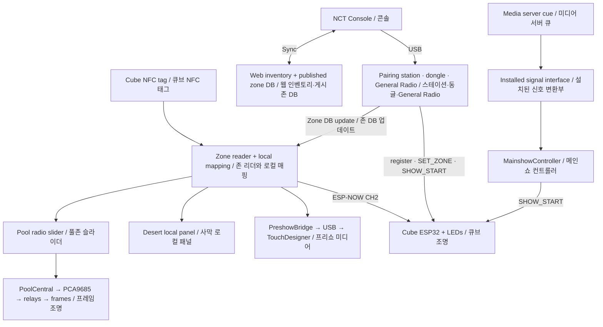

> *This document was written by Kimchi and Chips*

## What the visitor carries | 관람객이 사용하는 장치

A Neocore / NeoCube is a handheld light containing an ESP32, LEDs, a battery and an NFC tag. The NFC tag identifies the object to a nearby reader; the ESP32 receives wireless light commands. These are separate communication paths. A lamp can respond to a tag even when the cube's radio or battery has a problem.
네오코어 / 네오큐브는 ESP32, LED, 배터리, NFC 태그가 들어 있는 휴대용 조명입니다. NFC 태그는 가까운 리더에 물체의 신원을 알려주고, ESP32는 무선 조명 명령을 받습니다. 두 통신 경로는 별개입니다. 따라서 큐브의 무선 통신이나 배터리에 문제가 있어도 태그로 시설 조명이 반응할 수 있습니다.

## Visitor flow | 관람객 동선

1. **Receive a checked cube.** Idle light is dim white. Staff issue a charged, tested cube and explain where its tag surface is. 큐브 수령: 대기색은 어두운 흰색입니다. 직원은 충전 및 테스트를 마친 큐브를 지급하고 태그 면을 안내합니다.
2. **Preshow / butterfly:** hold the tag surface at the marked reader. Cube becomes red; the associated butterfly/media cue is sent to TouchDesigner. Four interactive points are supported. Remove the cube to release the point. 프리쇼 / 나비: 표시된 리더에 태그 면을 댑니다. 큐브가 빨간색으로 바뀌고 해당 나비·미디어 큐가 TouchDesigner로 전송됩니다. 인터랙티브 포인트 4개를 지원합니다. 큐브를 떼면 포인트가 해제됩니다.
3. **Desert:** find a marked member position and present the tag steadily. The local name panel lights and the registered cube becomes yellow. There are 23 intended member positions. 사막: 멤버 표시 위치를 찾아 태그를 안정적으로 댑니다. 해당 이름 패널이 켜지고 등록된 큐브가 노란색으로 바뀝니다. 기획상 멤버 위치는 23개입니다.
4. **Pool / forest / grass (풀존):** place the cube on the radio's tag point and move the slider. The cube becomes blue and a selected portrait frame lights. Six radio structures share 23 frame lights. Keep the cube at the tag point during the interaction. 풀존 / 숲존: 라디오 태그 위치에 큐브를 놓고 슬라이더를 움직입니다. 큐브가 파란색이 되고 선택된 초상화 프레임이 켜집니다. 라디오 구조물 6개가 프레임 조명 23개를 공유합니다. 체험 중 큐브를 태그 위치에 유지합니다.
5. **Mainshow entrance:** tag the entrance plate to make the cube mainshow-ready (yellow-green neon). At the media-server cue, ready cubes run their stored light timeline. A cube that missed entrance tagging may not start. 메인쇼 입구: 입구 플레이트에 태그하여 큐브를 메인쇼 준비 상태(황록색 네온)로 만듭니다. 미디어 서버의 큐에 따라 준비된 큐브가 내부 조명 타임라인을 실행합니다. 입구 태그를 놓친 큐브는 시작하지 않을 수 있습니다.
6. **Return / turnaround:** collect, count, inspect and recharge the cubes using the operator's approved charging procedure. A **Reset Plate** returns a tagged cube to idle (low white) to save battery while it waits. Separate faulty cubes. 반납 / 재운영 준비: 운영사가 정한 충전 절차에 따라 회수·수량 확인·점검·충전을 합니다. **Reset Plate**에 태그하면 큐브가 대기(약한 흰색)로 돌아가 대기 중 배터리를 절약합니다. 고장 큐브는 분리합니다.

**Visitor wording for Pool:** "Place your cube here and move the slider to explore the portraits." Do not promise exact alignment with the printed names until the mechanical limitation and label treatment are resolved.
풀존 안내 문구: "이곳에 큐브를 놓고 슬라이더를 움직이며 초상화를 찾아보세요." 기구 정밀도 및 이름 표시 처리 문제가 해결되기 전에는 인쇄된 이름과 정확히 일치한다고 안내하지 않습니다.

## System map | 시스템 구성

NFC is short-range identification. ESP-NOW carries the exhibition's radio messages on channel 2 without a Wi-Fi router. Internet access is used for shared inventory synchronization and publication, not for ordinary zone interaction after provisioning. The NCT Console is the single computer-side tool: it talks to boards over USB, and to cubes and zones only through a radio board (the pairing station, an ESP-NOW dongle or the General Radio).
NFC는 근거리 식별에 사용합니다. ESP-NOW는 Wi-Fi 공유기 없이 채널 2로 전시 무선 메시지를 전달합니다. 인터넷은 공유 인벤토리 동기화와 게시에 사용하며, 준비가 완료된 존의 일반 체험에는 필요하지 않습니다. NCT Console은 컴퓨터 쪽 단일 도구입니다. 보드와는 USB로, 큐브·존과는 무선 보드(등록 스테이션, ESP-NOW 동글 또는 General Radio)를 통해서만 통신합니다.

## Which board is which? | 보드 역할 구분

The console identifies a board when it is plugged in and shows its role in the device rail; the role decides which panel opens and which actions are allowed. Do not infer a role from the USB connector or the port name. 콘솔은 보드를 꽂을 때 식별하고 장치 레일에 역할을 표시합니다. 역할에 따라 열리는 패널과 허용되는 동작이 정해집니다. USB 커넥터 모양이나 포트 이름으로 역할을 추정하지 않습니다.

- **Cube:** visitor light. In the console: the Cube panel (Overview, Firmware, History, Console). 큐브: 관람객 조명. 콘솔에서는 Cube 패널(Overview, Firmware, History, Console).
- **Pairing station:** USB + PN532 registration reader. **Database dongle:** USB radio relay, no PN532. Both open the Pairing station panel (Pairing, Zone relay, Console). 등록 스테이션: USB와 PN532가 있는 등록 리더. DB 동글: USB 무선 중계기이며 PN532가 없습니다. 둘 다 Pairing station 패널(Pairing, Zone relay, Console)을 엽니다.
- **General Radio:** one spare ESP32-C3 that does every host radio job (relay, cube colours, show start, one pool lamp, one TouchDesigner cue). Its panel has Cubes & show, Zone relay, Pool lamp, Preshow cue, Pairing and Console tabs. General Radio: 모든 호스트 무선 작업(중계, 큐브 색, 쇼 시작, 풀 램프 1개, TouchDesigner 큐 1개)을 하는 예비 ESP32-C3. 패널에는 Cubes & show, Zone relay, Pool lamp, Preshow cue, Pairing, Console 탭이 있습니다.
- **Zone boards:** PreshowZone, TagPlateZone, DesertZone, PoolZone, Reset Plate. They store cube mappings. The Zone panel has Monitor and Firmware & database; a pool radio adds Calibration and Diagnostics, a preshow plate adds Cue test. 존 보드: PreshowZone, TagPlateZone, DesertZone, PoolZone, Reset Plate. 큐브 매핑을 저장합니다. Zone 패널에는 Monitor와 Firmware & database가 있으며 풀 라디오는 Calibration·Diagnostics, 프리쇼 플레이트는 Cue test가 추가됩니다.
- **Reset Plate:** a zone type whose firmware returns a tagged cube to idle mode (low white LED), used to park cubes and save battery. Two devices are flashed with it, both ESP32 SuperMini with an NFC reader and no external antenna. See {{page:07}}. Reset Plate: 태그한 큐브를 idle 모드(약한 흰색 LED)로 되돌리는 존 유형으로, 큐브를 잠시 둘 때 배터리 절약에 사용합니다. 현재 2대이며 모두 NFC 리더를 부착한 ESP32 SuperMini, 외부 안테나 없음. 자세한 내용은 07장을 참조하세요.
- **PreshowBridge, PoolCentral, MainshowController:** separate controller roles, with no zone cube-database slots. Each has its own read-mostly panel; they are not cube or zone flash targets. PreshowBridge, PoolCentral, MainshowController: 별도 컨트롤러이며 존 큐브 DB 슬롯이 없습니다. 각각 주로 읽기용 패널이 있으며 큐브·존 플래시 대상이 아닙니다.
- **Unidentified board:** a board that answered nothing useful. Its panel offers Probe again, Open console, and "make this a dongle / Mainshow controller / General Radio / zone" — deliberate choices, never automatic. 미식별 보드: 유용한 응답이 없는 보드. 패널에서 Probe again, Open console, "make this a dongle / Mainshow controller / General Radio / zone"을 선택할 수 있으며 자동으로 실행되지 않습니다.
- **Charging hardware and TouchDesigner content:** inherited systems. This handbook covers their interfaces with the implemented repairs, not an unverified charging design or the media project's internal programming. 충전 하드웨어와 TouchDesigner 콘텐츠: 기존 시스템입니다. 이 문서는 개선 시스템과의 연결 방식을 다루며, 검증되지 않은 충전 설계나 미디어 프로젝트 내부 프로그래밍을 규정하지 않습니다.

## Sources | 근거

Engineering Six PDF, physical pages 6–9, 13–14, 23–27: original journey and intended hardware; not as-built proof. Current behaviour: `zones/firmware/*`, `flashing_station/firmware/neocore_usb/neocore_usb.ino`, `console/devices.py`, `console/probe.py` (role identification without reset). Evidence class: code-inspected.
엔지니어링식스 PDF 실제 페이지 6–9, 13–14, 23–27: 원 동선과 계획 하드웨어이며 준공 상태 증빙은 아닙니다. 현재 동작은 위 소스 기준(코드 확인)입니다.

## Related guides | 관련 안내

{{page:00}}
{{page:02}}
{{page:03}}
