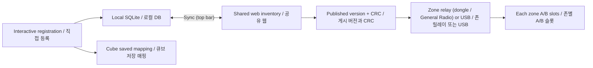

> *This document was written by Kimchi and Chips*

## The three copies to keep in step | 일치시켜야 할 세 가지 사본

1. **Cube NVS:** the cube's own saved registration. Updated by acknowledged registration, preserved by the supported cube flasher. Seen in the console on the Cube panel as what the cube reports over USB. 큐브 NVS: 큐브 자체에 저장된 등록 정보입니다. 등록 응답 절차로 갱신하며 지원 큐브 플래셔가 보존합니다. 콘솔에서는 Cube 패널에 큐브가 USB로 보고한 내용으로 표시됩니다.
2. **Computer / shared inventory:** the computer works in `pairing_station/data/devices.sqlite3`; Git JSON and the web exchange device records between computers. Seen in the console under **Inventory › Cubes** (every record, filters, search, exports) and **Inventory › Events** (audit history). 컴퓨터 / 공유 인벤토리: 컴퓨터는 위 SQLite 파일을 사용하고 Git JSON 및 웹은 컴퓨터 간 장비 기록을 교환합니다. 콘솔에서는 **Inventory › Cubes**(모든 레코드, 필터, 검색, 내보내기)와 **Inventory › Events**(감사 이력)에 표시됩니다.
3. **Each zone's lookup database:** a published snapshot mapping NFC UID to cube number/MAC. Seen under **Inventory › Zone database**: the published version, count, CRC and the records it contains, plus what every zone last reported holding (from USB reports and radio queries). 각 존의 조회 DB: NFC UID를 큐브 번호·MAC으로 연결하는 게시 스냅샷입니다. **Inventory › Zone database**에 게시 버전·개수·CRC와 포함 레코드, 그리고 각 존이 마지막으로 보고한 보유 버전(USB 보고·무선 조회)이 표시됩니다.

**Syncing computers does not transmit registration to a cube. Publishing does not update every reader. Updating a reader database does not install firmware.** The console keeps these visible: the top-bar Sync chip (`↑n ↓n`) counts records and the zone database; the Attention panel says when local mappings differ from the publication and when a zone is behind.
**컴퓨터 Sync는 큐브 등록 전송이 아닙니다. 게시만으로 모든 리더가 업데이트되지 않습니다. 리더 DB 업데이트는 펌웨어 설치가 아닙니다.** 콘솔은 이를 항상 표시합니다. 상단 Sync 칩(`↑n ↓n`)은 레코드와 존 DB를 세고, Attention 패널은 로컬 매핑이 게시본과 다를 때와 존이 뒤처졌을 때 알려 줍니다.

{{shot:C-4}}
Inventory › Cubes: every record, filter and search; the pinned USB cube is never hidden by a filter / Inventory › Cubes: 모든 레코드, 필터와 검색. USB로 고정된 큐브는 필터에 숨지 않음

## Field guide | 주요 필드

- **MAC:** unique physical radio identity. It remains the record key when numbers/tags change, and it is the device id in the console's device rail and routes. MAC: 물리 무선 장치의 고유 신원입니다. 번호·태그가 바뀌어도 기록 키로 유지하며 콘솔 장치 레일과 주소의 장치 id입니다.
- **cube_id:** mutable physical label number, or NULL if unassigned (**Needs number** pill). It is neither the MAC nor the original historical number. cube_id: 변경 가능한 실물 라벨 번호이며 미할당은 NULL(**Needs number** 칩)입니다. MAC이나 과거 원 번호와 다릅니다.
- **uid:** committed NFC association. **pending_uid:** proposed/retryable association (**Registering** / **Unconfirmed** pills); not registration success. uid: 확정된 NFC 연결. pending_uid: 제안·재시도 중인 연결(**Registering** / **Unconfirmed** 칩)이며 등록 성공이 아닙니다.
- **status / detail / updated_at / source:** registration bookkeeping, explanation, change time and provenance. The status pills are: Registered · ACK, Unconfirmed, Registering, Saved · not sent, Needs NFC tag, Needs number, Unregistered. Use them with the evidence, not as a substitute for a physical test. status / detail / updated_at / source: 등록 상태, 설명, 변경 시각, 출처입니다. 상태 칩은 Registered · ACK, Unconfirmed, Registering, Saved · not sent, Needs NFC tag, Needs number, Unregistered입니다. 실물 테스트 대신 사용하지 말고 증빙과 함께 읽습니다.
- **role:** auto, led or excluded. Excluded readers/controllers/dongles are blocked from normal cube operations and from cube firmware. Role is separate from tag ownership and is changed on the cube card. role: auto, led, excluded입니다. 제외된 리더·컨트롤러·동글은 일반 큐브 작업과 큐브 펌웨어에서 차단합니다. 역할과 태그 소유권은 별개이며 큐브 카드에서 변경합니다.
- **original_32:** historical number/tag reference, shown separately on the card. It must not overwrite current mappings or reserve cleared numbers. original_32: 과거 번호·태그 참조이며 카드에 별도로 표시됩니다. 현재 매핑을 덮어쓰거나 해제된 번호를 예약하지 않습니다.
- **reserved_numbers:** 2, 22, 39, 43 are excluded from automatic allocation even when their device identity is unknown. Manual entry remains possible. reserved_numbers: 실물 신원이 미확인이어도 2, 22, 39, 43은 자동 할당에서 제외됩니다. 수동 입력은 가능합니다.
- **events / sightings / flash_runs / zones:** audit history (Inventory › Events), last-seen evidence (uploaded by Sync for the web page), firmware receipts (Inventory › Flash runs) and the zone registry (Inventory › Zone database). Sightings do not change identity and do not enter the identity merge. events / sightings / flash_runs / zones: 감사 이력(Inventory › Events), 최근 관측(웹 페이지용으로 Sync가 업로드), 펌웨어 영수증(Inventory › Flash runs), 존 목록(Inventory › Zone database)입니다. 관측 정보는 신원을 변경하거나 신원 병합에 참여하지 않습니다.

## Worked example | 예시

Cube MAC A is numbered 44 and has committed tag U. A new scan of tag V is pending. The zone publication continues to use committed U until the accepted registration commits V. A pending-only cube without a committed UID is not published. An existing committed mapping can remain publishable even while a different UID is pending: publication reads committed fields, not a blanket "all pending rows excluded" rule. In the console, Inventory › Zone database lists exactly the records in the published version, so you can see whether A is in it.
MAC A 큐브의 번호가 44, 확정 태그가 U이고 새 태그 V가 pending이라면, V가 확정되기 전 존 게시에는 기존 U가 사용됩니다. 확정 UID 없이 pending만 있는 큐브는 게시되지 않습니다. 다른 UID가 pending이어도 기존 확정 매핑은 게시될 수 있습니다. 게시는 확정 필드를 읽으며 "pending 행 전체 제외" 규칙이 아닙니다. 콘솔의 Inventory › Zone database에는 게시 버전에 포함된 레코드가 정확히 나열되므로 A의 포함 여부를 확인할 수 있습니다.

Publication requires a committed UID, a number and a valid MAC, and excludes excluded roles. CRC identifies content integrity; version determines update ordering. Count alone cannot prove two databases are identical.
게시에는 확정 UID, 번호, 유효 MAC이 필요하며 excluded 역할은 제외합니다. CRC는 내용 무결성을, 버전은 업데이트 순서를 나타냅니다. 개수만으로 DB 동일성을 판단할 수 없습니다.

## Synchronization decisions | 동기화 판단

Synchronization resolves automatically and never asks a question. The newest device identity change wins the number/tags as a unit. Roles merge separately with excluded taking precedence over led, then auto. If two devices claim one number/tag, the newest claim retains it; the loser may need a number or a new registration. Decisions are audited as sync_resolved / sync_applied and the console raises an Attention card "A newer change elsewhere took this device's number or tag" for a local device that gave way. **Inventory › Web sync › Check** shows, before syncing, record by record what would upload, download and which rows both sides changed (**Decided**).
동기화는 자동으로 해결되며 질문하지 않습니다. 가장 최근 장비 신원 변경의 번호·태그를 묶어서 채택합니다. 역할은 별도로 병합하며 excluded, led, auto 순으로 우선합니다. 두 장비가 같은 번호·태그를 주장하면 최신 주장이 유지되고 다른 장비는 번호 또는 재등록이 필요할 수 있습니다. 판단은 sync_resolved / sync_applied로 기록하고, 양보한 로컬 장비에는 Attention 카드 "A newer change elsewhere took this device's number or tag"가 표시됩니다. **Inventory › Web sync › Check**는 동기화 전에 업로드·다운로드될 레코드와 양쪽이 모두 변경한 행(**Decided**)을 레코드별로 보여 줍니다.

Keep computer clocks correct. To correct a result, make a deliberate new number/tag assignment in the console and Sync again, then transmit/distribute as required. Deleting a JSON file is not a supported way to delete a device. Do not edit CSV as an import or directly rewrite live SQLite. **Unregister** on a cube card (press-and-hold) releases number and tags locally only; the cube's own firmware still holds the old mapping.
컴퓨터 시간을 정확히 유지합니다. 결과를 수정하려면 콘솔에서 명시적으로 번호·태그를 새로 설정한 뒤 다시 Sync하고 필요한 전송·배포를 수행합니다. JSON 파일 삭제는 장비 삭제 방법이 아닙니다. CSV를 입력 파일처럼 수정하거나 실시간 SQLite를 직접 덮어쓰지 않습니다. 큐브 카드의 **Unregister**(길게 누르기)는 로컬에서만 번호·태그를 해제하며 큐브 펌웨어에는 이전 매핑이 남습니다.

## Web access and offline behaviour | 웹 접근·오프라인 동작

[Web inventory](https://nct-inventory.auroravision.xyz) offers grid/table views, search, devices, computers, zone boards and sightings. It uses the team's shared password. The console asks once (top-bar Sync › sign in, or the Attention card "Web sync needs the inventory password") and stores it locally in `pairing_station/data/web_password`; do not copy it into this handbook, Git or screenshots. **Forget password** is under Inventory › Web sync.
웹 인벤토리는 격자·표·검색·장비·컴퓨터·존·관측 정보를 제공합니다. 팀 공유 비밀번호를 사용하며 콘솔은 한 번 입력받아(상단 Sync › sign in 또는 Attention 카드 "Web sync needs the inventory password") 위 로컬 파일에 저장합니다. 이 문서·Git·화면에 비밀번호를 넣지 않습니다. **Forget password**는 Inventory › Web sync에 있습니다.

Offline zones continue using their stored mappings. The console can distribute a previously pulled publication offline through its dongle. New shared publication requires the web allocator. The Sync chip shows **Offline** when the web is unreachable; nothing blocks. Read-only "last seen" is evidence of a past event, not continuous monitoring, battery telemetry or proof of NFC scanning.
오프라인 존은 저장된 매핑으로 동작합니다. 콘솔은 미리 받은 게시본을 동글로 오프라인 배포할 수 있습니다. 새 공유 게시에는 웹 버전 할당이 필요합니다. 웹에 연결할 수 없으면 Sync 칩에 **Offline**이 표시되며 아무것도 막히지 않습니다. "최근 관측"은 과거 사건의 증빙이지 상시 모니터링·배터리 정보·NFC 스캔 증명이 아닙니다.

## Sources | 근거

`pairing_station/database.py`, `inventory_sync.py`, `web_sync.py`, `sync_all.py`, `zone_publish.py`, `zone_registry.py`, `zones/tools/zonedb.py::records_from_rows` (unchanged, reused by the console); `console/state.py` (inventory, registry and sync sections), `console/jobs/sync.py` (`check_job`). Evidence class: code-inspected; the sync check and the convergence tests are simulation-verified. Current code takes precedence over older conflicting README passages.
위 현재 코드가 충돌하는 과거 README 설명보다 우선합니다. 근거 구분: 코드 확인. 동기화 확인과 수렴 테스트는 시뮬레이션 확인.

## Related guides | 관련 안내

{{page:00}}
{{page:06}}
{{page:12}}
