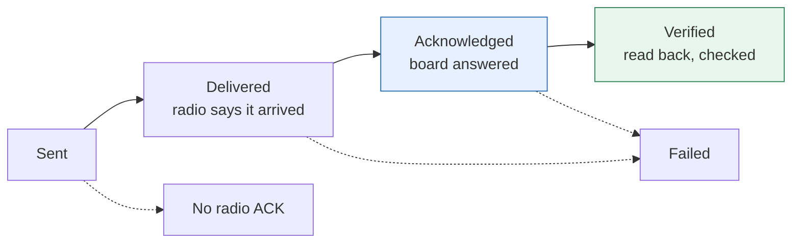

# Glossary & names

*This document was written by Kimchi and Chips*

## Summary

Every handover page uses one **canonical name** for each thing. This page lists those names with their Korean name, the
old names a reader may still meet on labels, in the old apps or in the code, and a one-line meaning. It also defines the
result status ladder and the evidence levels used on every page. Sections are alphabetical. Console controls, page names
and status labels stay in English and bold in both languages, so they match the screen.

## Facts

### People & places

| Term | 한국어 | Old names | Meaning |
|---|---|---|---|
| **Amberin** | 앰버린 | — | Project management for the exhibition; receives this handover |
| **Cube desk** | 큐브 담당 / 큐브 데스크 | — | The staff and table where cubes are registered, updated, charged and handed out |
| **Desert** | 사막존 | — | The zone with the member name panels; 23 member positions in the design |
| **Elliot** | Elliot | — | Kimchi and Chips; source of named field reports |
| **Engineering Six** | 엔지니어링식스 | — | Originally developed the exhibition's interactive systems; the receiving engineers |
| **Hojun** | Hojun | hojun (git author) | Named on-site reporter (Korean field report); author of commit `5996e10` (poolcentral-4.2.2) |
| **Kimchi and Chips** | 김치앤칩스 | — | Joined on 17 September 2026 to help resolve technical problems; wrote this handover |
| **Main show** (zone) | 메인쇼 | mainshow | The finale room. Visitors tap the **main show entrance** tag plate on the way in |
| **Pool / forest** | 풀존·숲존 | pool zone, forest | The zone with six pool radios (sliders) and 23 portrait frame lights |
| **Preshow** | 프리쇼 | butterfly zone | The butterfly zone; four interactive points linked to TouchDesigner |
| **Sangeun** | Sangeun | — | Named on-site reporter (report of 20 September) |
| **Zone** | 존 | — | An area of the exhibition: Preshow, Desert, Pool / forest, Main show. Not a board: the board is a **zone board** |

### Objects & boards

| Term | 한국어 | Old names | Meaning |
|---|---|---|---|
| **Cube** | 큐브 | device, LED cube, Neocore, NeoCube, neocube | The glowing object a visitor carries: ESP32, LEDs, battery, radio and an NFC tag |
| **Desert board** | 사막 보드 | DesertZone | Zone board at a desert position; lights its name panel and turns the cube yellow |
| **Firmware** | 펌웨어 | build, binary, sketch | The program running on a board |
| **Frame light** | 프레임 조명 | frame, portrait light, output | One of the 23 portrait lights in Pool / forest |
| **Installed pairing station** | 설치된 등록 스테이션 | station, pairing station | The original radio board with a tag reader, firmware nct-pairing-1.8-zones (frozen), MAC `3C:0F:02:AD:83:24`. An older kind of Workstation; the console marks its USB identity **Protected** |
| **Mainshow controller** | 메인쇼 컨트롤러 | M5 show starter, show trigger, MainshowController, M5 Core2 | The board that starts the main show on every ready cube when the media server signals it |
| **Media server** | 미디어 서버 | — | The media system that gives the main show cue; inherited, not part of this repair |
| **Pool central controller** | 풀 중앙 컨트롤러 | PoolCentral, central | Drives the 23 frame lights from the six pool radios |
| **Pool radio** | 풀 라디오 | pool slider, pool zone board, PoolZone | One of the six zone boards that read a tag and a slider in Pool / forest |
| **Preshow bridge** | 프리쇼 브리지 | media bridge, PreshowBridge, Preshow_MediaServer_SerialDAT (archived original) | Passes preshow events to TouchDesigner over USB as `PRESHOW,<n>,ON` / `PRESHOW,<n>,OFF` lines |
| **Preshow plate** | 프리쇼 플레이트 | PreshowZone, butterfly reader | Zone board at a preshow point (1–4) |
| **Reset plate** | 리셋 플레이트 | ResetZone | Zone board that returns a tapped cube to idle (dim white, `SET_ZONE 0`) to save battery |
| **Tag** | 태그 | NFC UID, card, sticker, uid | The NFC tag inside a cube that zone boards read. Needs no battery |
| **Tag plate** | 태그 플레이트 | TagPlateZone, Tag_Plate, preshow_enter, mainshow_enter | Zone board that sets the cube to the zone stored in it, e.g. the main show entrance (ready) |
| **TouchDesigner** | 터치디자이너 | TD, Serial DAT | The media software that plays the preshow effects; inherited |
| **Unidentified board** | 미식별 보드 | unknown board | A USB board that answered nothing useful. Nothing is written to it until the operator chooses |
| **Workstation** | 워크스테이션 | General Radio, dongle, ESP-NOW dongle, pairing station, station, relay | The small radio board plugged into the Mac by USB. Talks to cubes and zone boards over the air and has the tag reader for registration. The installed pairing station and the bench General Radio are older kinds of Workstation and still work |
| **Zone board** | 존 보드 | plate, reader, reader board, zone | A tag reader board in a zone: preshow plate, tag plate, desert board, pool radio or Reset plate. Holds a copy of the zone database |

### Data

| Term | 한국어 | Old names | Meaning |
|---|---|---|---|
| **Cube number** | 큐브 번호 | ID, cube_id, label number | The number on the cube's label. May be NULL (a cube may have none yet) |
| **Firmware check** | 펌웨어 확인 | verdict | **Version matches** (reported version equals the local build; not a binary check), **Update needed**, **Not verified** (no matching answer; not the same as current) |
| **Flash receipt** | 플래시 기록 | receipt, run record, `flash_runs` | The record a cube flash leaves on this computer: what was written and whether it was verified |
| **Idle** | 대기 | ZONE_IDLE, zone 0 | The cube's resting state: dim white. A Reset plate returns a cube to idle |
| **Inventory** | 인벤토리 | devices database, SQLite, records, CSV, `devices.sqlite3` | The console's list of every cube and board: number, tag, role. Kept on this computer (`pairing_station/data/devices.sqlite3`); CSV is only an export |
| **Known-good cube** | 정상 큐브 | test cube | A charged, registered cube known to work. Try it first to tell a cube fault from a board fault |
| **Main show** | 메인쇼 | mainshow, show image | The finale animation every cube plays together. Cubes on firmware v1.5.0 or later can take a new version over the air |
| **Mainshow ready** | 메인쇼 준비 | neon, mainshow-ready, `SET_ZONE 4`, ZONE_MAINSHOW | The yellow-green state a cube gets at the main show entrance. Only a ready cube starts the main show |
| **Original 32** | 최초 32개 | `original_32.json` | The first 32 cubes' historical number/tag list. Reference only; never overrides newer registrations and does not reserve a cleared number |
| **Pending tag** | 대기 중 태그 | `pending_uid` | A tag proposed for a cube that the cube has not acknowledged yet. Retry is safe |
| **Published** | 게시됨 | web version, publish | A zone database or main show version handed out by the web inventory. Versions only go up, and only the web allocates them |
| **Registration** | 등록 | pairing | Giving a cube its number and tag and saving both in the cube. Statuses: **Registered · ACK**, **Registering**, **Unconfirmed**, **Saved · not sent**, **Needs NFC tag**, **Needs number**, **Unregistered** |
| **Reserved numbers** | 예약 번호 | `reserved_numbers` | 2, 22, 39 and 43 are never suggested automatically. Manual entry is still allowed |
| **Saved mapping** | 저장된 매핑 | mapping, saved registration | The number and tag a cube keeps in its own NVS. **Send saved mapping** sends it again |
| **Sync** | 동기화 | web sync, push/pull | Exchanging the inventory and published zone databases with the web inventory. Newest change wins; Sync never asks the operator to choose |
| **Web inventory** | 웹 인벤토리 | Vercel, web copy, blob | The shared online copy (one private Vercel Blob document) that keeps several Macs in step. Needs the web password, stored only on each computer (`pairing_station/data/web_password`) |
| **Zone database** | 존 데이터베이스 | zone DB, zdb, mapping | The tag → cube-number list stored on every zone board. States: **Current**, **Out of date**, **Newer / differs**, **Updating**, **Nothing published** |

### Console

| Term | 한국어 | Old names | Meaning |
|---|---|---|---|
| **Attention panel** / **suggestion card** | Attention 패널 / 제안 카드 | advisor | The right-hand list of things the console thinks the operator should know. A card never blocks work; **Dismiss** hides it (this occurrence, this device, or never this rule) |
| **Auto-flash zones** (USB intake) | 존 자동 플래시(USB 인테이크) | Arm auto-flash, zone flasher, USB intake | This computer › Automatic intake › **Auto-flash zones**: flashes zone boards as they are plugged in by USB. Off at launch |
| **Automatic updates** | 자동 업데이트 | Auto-update all | Settings › Automatic updates: keeps zone databases (over the air and USB), the main show and web pulls current. On by default |
| **Device rail** | 장치 레일 | port list, port picker | The left-hand list of plugged-in boards, grouped: **This computer**, **Stations**, **Zones**, **Cubes (live)**, **Bench**, **Unidentified USB** |
| **EN / KR switch** | 언어 스위치 | — | Top-bar language switch (also Settings › Appearance). Buttons keep their English name in Korean mode ("EN: …") |
| **Flash page** | Flash 페이지 | Arm Auto, cube flasher | Flashes cubes as they are plugged in and brings their main show up to date over USB. Off at every launch |
| **Hold to confirm** | 길게 눌러 확인 | press-and-hold, confirmation token | Destructive buttons must be held down; the backend refuses them otherwise |
| **Log** (timeline dock) | Log(타임라인 도크) | timeline, recent logs | The bottom strip listing what happened, newest first |
| **Panel** / **tab** | 패널 / 탭 | window | The centre view for the selected board, with tabs such as **Monitor** or **Firmware & database** |
| **Pin** | 고정 | USB pin, lock | The cube last identified on USB stays selected until **Unpin** or another cube is identified |
| **Protected** | 보호됨 | — | The installed pairing station's USB identity: never probed or flashed |
| **Register page** | Register 페이지 | pairing app | Registers cubes as they are plugged in: number → tag scan → Sync. Off until switched on |
| **Result status** | 결과 상태 | truth ladder | Sent → Delivered → Acknowledged → Verified / Failed (see below) |
| **Show clock** | 쇼 타임코드 | SHOW_TIMECODE, timecode | The once-a-second signal that lets a late cube join a running show |
| **Show editor** | Show editor | — | Edits the main show as cues, publishes it and updates cubes |
| **Stop** | Stop | — | **■ Stop** (or Esc) stops every active operation |
| **Temporary control** | 임시 제어 | lease, override | The console borrows a board's output for a short time and hands it back automatically |
| **Zone relay** (tab) | Zone relay 탭 | Zone Database Manager | The Workstation panel tab listing zone boards in radio range with database version, state and signal, and updating them |

### Engineering terms

| Term | 한국어 | Old names | Meaning |
|---|---|---|---|
| **ACK** | 수신 확인 | — | Acknowledgment. A radio ACK means the frame arrived; an application ACK means the board answered |
| **Channel 2** | 채널 2 | — | The Wi-Fi channel every modern cube, zone board and Workstation uses for ESP-NOW |
| **Chunk** | 청크 | — | One piece of a zone database (≤ 12 records) or main show sent over the air |
| **CRC** | CRC | — | A checksum; a zone database is current only when version and CRC both match |
| **ESP32 / ESP32-C3** | ESP32 | — | The microcontroller inside every cube and board |
| **ESP-NOW** | ESP-NOW | — | The router-free, unencrypted radio link the exhibition uses |
| **hello** | hello | — | The Workstation's JSON self-description; the console reads its capability fields, not the firmware name |
| **I²C** | I²C | — | The two-wire bus to readers (PN532) and drivers (PCA9685) |
| **MAC** | MAC | — | A board's fixed hardware address; identifies a physical device |
| **Manifest** | 매니페스트 | — | The build record listing a build's binaries and hashes; ties a firmware binary to its source |
| **NVS** | NVS | — | The part of a board's flash memory that keeps settings (a cube's number, tag and main show). Flashing preserves it |
| **PCA9685** | PCA9685 | — | The 16-channel output driver on the pool central controller (two boards, 0x40 and 0x41) |
| **PN532** | PN532 | — | The NFC reader chip on zone boards and the Workstation |
| **SET_ZONE** | SET_ZONE | `MSG_SET_ZONE` = 6 | Cube radio command setting its colour: 0 idle, 1 preshow, 2 desert, 3 pool, 4 main show ready. 5 (Reset) is a plate kind only and is never sent to a cube |
| **SHOW_LIVE** | SHOW_LIVE | 0x55 | The Show editor's live preview broadcast (about every 60 ms, ~16 Hz; 600 ms lease) to cubes on v1.7.0 or later |
| **SHOW_START** | SHOW_START | `MSG_SHOW_START` = 8 | The cube radio command that starts the main show (a fresh show id, sent five times) |

### Old name → canonical name

| Old name | Use instead |
|---|---|
| advisor | Attention panel / suggestion card |
| Arm Auto (cube flasher) | Flash page |
| Arm auto-flash (zone flasher), USB intake | Auto-flash zones |
| card, sticker, NFC UID | Tag |
| central, PoolCentral | Pool central controller |
| code-inspected | Code-checked |
| cube_id, ID, label number | Cube number |
| device, LED cube, Neocore, NeoCube | Cube |
| devices database, SQLite, records | Inventory |
| dongle, ESP-NOW dongle, General Radio, relay | Workstation |
| dongle-verified | Bench-verified |
| lease, override | Temporary control |
| M5 show starter, show trigger, MainshowController | Mainshow controller |
| mainshow, show image | Main show |
| media bridge, PreshowBridge | Preshow bridge |
| pairing station, station | Workstation (the installed one: Installed pairing station) |
| plate, reader, reader board | Zone board |
| pool slider, pool zone board, PoolZone | Pool radio |
| press-and-hold, confirmation token | Hold to confirm |
| ResetZone | Reset plate |
| SHOW_TIMECODE, timecode | Show clock |
| TagPlateZone, Tag_Plate, preshow_enter, mainshow_enter | Tag plate |
| timeline | Log |
| truth ladder | Result status |
| Vercel, web copy, blob | Web inventory |
| web sync, push/pull | Sync |
| zone DB, zdb, mapping | Zone database |

### Result status

| Status | Meaning | Counts as success |
|---|---|---|
| **Sent** | The console sent it | No |
| **Delivered** | The radio says it arrived; proves nothing happened on the board | No |
| **Acknowledged** | The board answered | Yes |
| **Verified** | The result was read back and checked | Yes |
| **Failed** | The operation did not succeed (can follow Delivered or Acknowledged) | No |
| **No radio ACK** | The radio did not confirm delivery: the cube may be off, out of range or on another channel | No |

### Evidence levels

| Level | Meaning |
|---|---|
| **Bench-verified** | Exercised on a real board at the bench; the board is named |
| **Code-checked** | Implemented in the repository; nobody has run it on hardware for this document |
| **Field-reported** | Reported working on site by a named person (Elliot, Hojun, Sangeun) |
| **Simulation-verified** | Exercised by the console's automated tests or simulated boards |
| **To confirm** | Still needs checking on site, or a client decision |

Old words: "code-inspected" → **Code-checked**; "dongle-verified" → **Bench-verified**. How these levels are applied:
{{page:X02}} (Evidence methodology).

## Sources

- `console/docs/handover_v2/STYLE_GUIDE.md` (canonical names, evidence levels)
- `console/uitext.py` (status labels)
- `console/devices.py`, `console/web/lib/rail.js` (roles, rail groups)
- `console/web/components/TopBar.js` (EN / KR switch)
- `console/README.md`, `AGENTS.md`
- `zones/firmware/Workstation/README.md` (hello fields)
- `flashing_station/firmware/neocore_usb/neocore_usb.ino` (`MSG_SET_ZONE` = 6, `MSG_SHOW_START` = 8, zone values)
- `zones/firmware/libraries/NctZone/src/NctZoneProtocol.h` (`ZoneType`, `ZONE_RESET` = 5 plate-only)
- `zones/firmware/libraries/NctShow/src/NctShowProtocol.h` (`SHOW_LIVE` = 0x55)
- Old draft `console/docs/handover_v2/02-glossary.md`

*This document was written by Kimchi and Chips*
