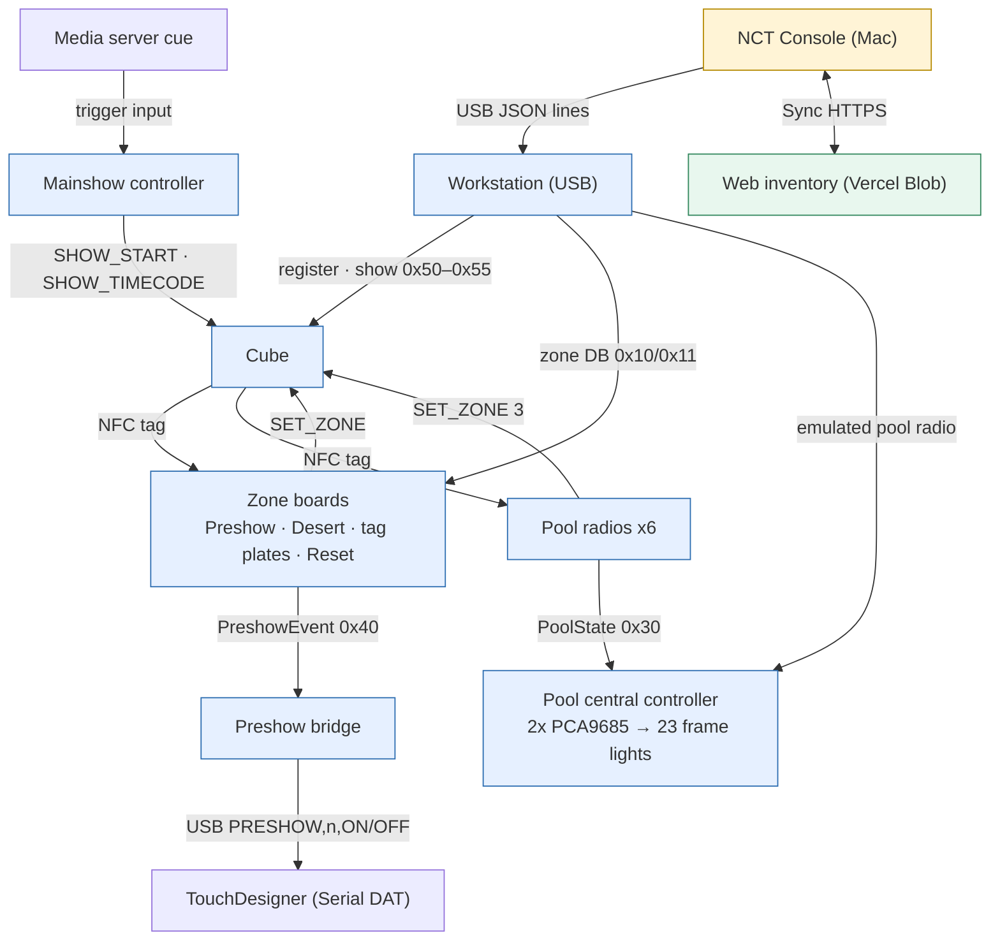
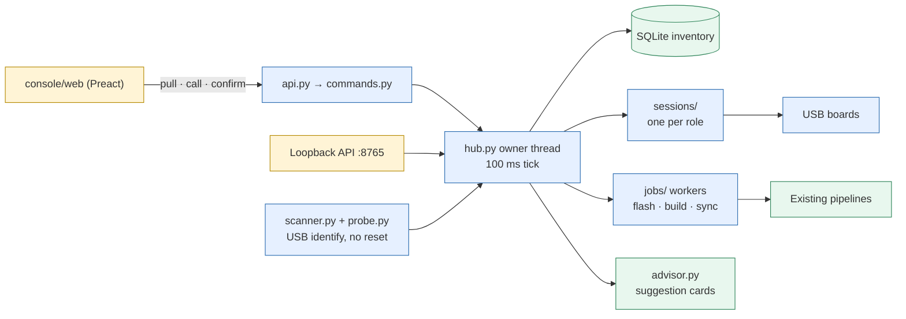

# System, boards & protocols

<span color="red">*This document was written by Kimchi and Chips*</span>

## Summary

The installation is a set of ESP32 boards (cubes, zone boards, a Workstation, the pool central controller, the preshow
bridge and the Mainshow controller) that talk over ESP-NOW on channel 2, plus one operator program, the NCT Console
0.1.0, on a Mac. This page records the repository of 23 September 2026 (KST): `main` at `6b26cdf`, which includes
`5996e10` (poolcentral-4.2.2); the console and firmware state described is that of `c955d9f`. It holds the board and version inventory, the five
radio protocols, the console architecture, zone storage, the pool output map, wiring, build and test commands, the
loopback API, open release discrepancies, what changed from v1 and how evidence is graded.

## Facts

### Handover identity

- Handover: version 2, Kimchi and Chips → Amberin / Engineering Six.
- Describes: repository of 23 September 2026 (KST), NCT Console `0.1.0` (`console/state.py` `CONSOLE_VERSION`), baseline commit `c955d9f`.
- Repository `main` (pushed to GitHub): `6b26cdf` (Elliot Woods, 23 Sept 18:52 KST, handover restructure and automatic firmware updates), on top of `5996e10` (hojun, 23 Sept 04:47 KST, "PoolCentral 4.2.2: re-measured frame map for three 8-channel relay modules"). `PoolCentral.ino` reads `poolcentral-4.2.2`.
- Kimchi and Chips on site from: Thursday 17 September 2026.
- Version 1 ({{v1-root}}): unchanged; describes the ten separate Tk apps, which still work and remain a fallback.
- Screenshots in the handbook: simulated (`console/app.py --simulate --scenario docs`); yellow outlines mark controls; numbers, versions and readings in them are examples, not site settings. 43 captures in `console/docs/shots/manifest.json` (git `c955d9f`, 23 Sept 04:59 KST).

### Current state (23 September 2026)

- Preshow, Desert, Pool lighting and main show triggering: reported working after the intervention (Field-reported).
- Cube firmware: six cubes (#17, #33, #39, #52, #58, #95) run **v1.7.0-USB.1**; the rest of the fleet runs **v1.4.1-USB.2** and plays the original built-in show. #17 was flashed earlier at the bench and got its show over USB at 04:39 KST; the other five were flashed on the Flash page at 04:47–04:49 KST (firmware verified, boot confirmed, registration kept, show v5 written and read back). Bench-verified, as recorded by the console (USB read-back; LEDs not recorded).
- Main show **v6** published from the console at 04:52 KST; all six v1.7.0 cubes reported v6 over the air by 04:59 KST. The next publish is numbered by the web.
- Published zone database: **v38** (133 records, CRC 3038566992); 27 zone boards in range held v37 at the bench check. v38 came from a simulated console run (see Known issues).
- USB intake race ("USB port is owned by another Neocore application"): fixed.
- Pool central controller **poolcentral-4.2.2** on site: relay modules replaced, frame map re-measured (outputs 1–24). Field-reported (Hojun).
- Workstation firmware `workstation-1.0.0`: built, not on any board. #134 (Mainshow controller) still on mainshow-1.2.0. #138 (`AC:27:6E:82:68:54`) runs general-radio-1.2.0.
- Open items (detail in {{page:X13}}): Pool slider label treatment, Desert reader alignment, battery endurance, one test cube that failed, media interface records, release checks, hardware checks of the console itself.

### Visitor journey and cube states

| Step | Where | Cube command | Cube colour | Notes |
|---|---|---|---|---|
| 1 Receive | Cube desk | — | dim white (idle) | Charged, tested cube; show the visitor the tag side |
| 2 Preshow | Four points (butterfly) | `SET_ZONE 1` | red | TouchDesigner gets that point's cue; removing the cube releases the point |
| 3 Desert | 23 member positions (design) | `SET_ZONE 2` | yellow | Tag held steadily; that member's name panel lights |
| 4 Pool / forest | Six pool radios, 23 frame lights | `SET_ZONE 3` | blue | Cube stays on the tag point while the slider moves; one frame lights |
| 5 Main show entrance | Tag plate | `SET_ZONE 4` | yellow-green (ready) | Only a ready cube starts the main show |
| 6 Main show | Finale room | `MSG_SHOW_START` (8) + show clock | show animation | Media server cue → Mainshow controller; a cube that missed the entrance may not start |
| 7 Return | Collection point | `SET_ZONE 0` (Reset plate) | dim white | Count, check, charge (operator's approved procedure); keep faulty cubes apart |

- The cube has two independent paths: the NFC tag (read by zone boards at very short range, no battery needed) and the radio (receives light commands). A zone can recognise a cube whose radio or battery has failed.
- Zone boards turn a tag into a cube number with the zone database.
- `ZoneType` values 0–4 go on the wire in `Packet.success` of `MSG_SET_ZONE`; `ZONE_RESET` = 5 is a plate kind only and is never sent to a cube (the cube firmware knows nothing above 4). A Reset plate sends `ZONE_IDLE`, which stops a running show, drops main show eligibility and shows idle.
- Approved Pool visitor wording: "Place your cube here and move the slider to explore the portraits." Do not promise the light matches the printed names exactly.
- Charging hardware and TouchDesigner content are inherited systems; only their connection to the repaired systems is covered.

### System map



- All board-to-board traffic except the tag read is ESP-NOW on channel 2: no router, no encryption.
- The internet is used only to Sync the inventory and to publish zone databases and the main show. Zones work offline once they hold the current database.
- The console talks to a board directly over USB; it reaches cubes and zone boards over the air only through a Workstation.

### Boards and versions

"Version in repo" is read from each sketch's `FIRMWARE_VERSION` / `FW_VERSION` on 23 September. "Installed / observed" is
what boards reported or the local inventory recorded that day, not a census. The console shows each connected board's
reported version next to the local build.

| Board | Role | Firmware source | Version in repo | Installed / observed | Evidence |
|---|---|---|---|---|---|
| NCT Console | Operator program | `console/` | 0.1.0 | Bench Mac | Simulation-verified; Bench-verified with #138 and cube desk use |
| Cube | Zone colours, number + tag in NVS, main show | `flashing_station/firmware/neocore_usb` (bundled build `flashing_station/build/manifest.json`) | v1.7.0-USB.1 | Six cubes v1.7.0-USB.1; rest v1.4.1-USB.2 | Bench-verified (flash receipts; LEDs not recorded) |
| Workstation | Tag reader, cube/zone/show relay, show start, emulated pool radio and preshow plate | `zones/firmware/Workstation` | workstation-1.0.0 | Not on any board | Simulation-verified; host tests; arduino-cli build 1,031,248 B |
| Installed pairing station (legacy) | Reader + registration relay + zone DB relay | `pairing_station/firmware/pairing_station` | nct-pairing-1.8-zones (frozen) | Installed, Protected, `3C:0F:02:AD:83:24` | Code-checked; no new flashes |
| General Radio (legacy) | Every radio job, no reader | sketch replaced by Workstation; not a flash target | — | general-radio-1.2.0 on ex-cube #138 `AC:27:6E:82:68:54` | Bench-verified |
| Preshow plate | Tag → red, event to bridge | `zones/firmware/PreshowZone` | preshow-3.4.0 | Preshow 1–4 answered on 3.4.0 | Bench-verified (zone query, 23 Sept) |
| Tag plate | Sets the stored zone (e.g. main show entrance) | `zones/firmware/TagPlateZone` | tagplate-2.4.0 | Not inventoried | Code-checked |
| Desert board | Tag → yellow, name panel | `zones/firmware/DesertZone` | desert-2.4.0 | Mixed desert-2.3.0 / 2.4.0 in range | Bench-verified (zone query) |
| Pool radio | Tag + slider → blue, `PoolState` | `zones/firmware/PoolZone` | pool-3.2.0 | Not in range at the bench | Code-checked |
| Reset plate | `SET_ZONE 0` | `zones/firmware/ResetZone` | reset-1.0.0 | Reset 1 (ex-Preshow 3 SuperMini `48:F6:EE:15:8F:20`); the 23 Sept registry lists two boards named "Reset 1" (zone DB v31, v32) | Code-checked |
| Pool central controller | ORs six radios, drives 23 frames | `zones/firmware/PoolCentral` | **poolcentral-4.2.2** | 4.2.2 | Field-reported (Hojun, 23 Sept) |
| Preshow bridge | `PreshowEvent` → `PRESHOW,n,ON/OFF` | `zones/firmware/PreshowBridge` | preshowbridge-1.0.0 | `AC:27:6E:83:21:C4` heard beaconing | Bench-verified (beacons only) |
| Mainshow controller | `SET_ZONE 4`, `SHOW_START`, show clock | `zones/firmware/MainshowController` | mainshow-1.3.0 | #134 on mainshow-1.2.0; 1.3.0 tested on #138, then #138 reflashed | Bench-verified (serial logs only) |
| Pool light test bridge | Emulates the six pool radios | `poolzone_test/` | — | Bench only | — |
| Range test board | ESP-NOW link survey | `rangetest/` | — | Bench only; LEDs dark since 21 Sept | — |
| Published zone database | — | web inventory | v38 (133 records, CRC 3038566992) | 27 zones in range held v37 | Bench-verified |
| Published main show | — | web inventory | v6 (23 Sept 04:52 KST) | Six v1.7.0 cubes report v6 | Bench-verified (cube reports; LEDs not recorded) |

### How the console presents each role

| Board | Device rail group | Panel / title | Extra tabs or buttons |
|---|---|---|---|
| Cube | **Cubes (live)** | "Neocore cube", Cube panel | — |
| Workstation (any kind) | **Stations** | Workstation panel, titled from the board: "Workstation", "Pairing station", "ESP-NOW dongle" or "General Radio"; tabs follow the hello capabilities | **Zone relay** |
| Preshow plate | **Zones** | Zone panel | **Cue test** |
| Tag plate, Desert board | **Zones** | Zone panel | — |
| Pool radio | **Zones** | Zone panel | **Calibration**, **Diagnostics** |
| Reset plate | **Zones** | Zone panel, profile **Reset plate** | — |
| Pool central controller | **Bench** | Pool central panel | — |
| Preshow bridge | **Bench** | "Preshow media bridge" | — |
| Mainshow controller | **Stations** | Mainshow controller panel | — |
| Pool light test bridge, range test | **Bench** | — | — |
| Unidentified | **Unidentified USB** | — | **Probe again**, **Make this board a…** (Workstation, Mainshow controller or Neocore cube). Zone boards are set up through the zone form ({{page:X09}}) |

- Roles come from identification, never from the cable or USB port name.
- `console/probe.py` sends only `?`, a JSON `hello` or `STATUS`; never a command that arms or changes a board.
- Per-port state: present → probing → idle → session / job / foreign / protected.
- The installed pairing station's USB identity is **Protected**: never probed or flashed.

> [!WARNING]
> Not every ESP32 is a cube. Never write cube firmware to a zone board, the Workstation, the pool central controller, the preshow bridge or the Mainshow controller. The console refuses these by role; do not work around it. Force-flashing zone firmware onto a cube overwrites its LED firmware and unregisters it.

Flash refusals (Code-checked):

| Writer | Refuses | Message | Override |
|---|---|---|---|
| Cube firmware, `cube.flash_firmware` (`console/commands.py`) | Any device whose role is not `cube`, `unknown` or none | "That board is a ‹role›; the cube flasher refuses it" | None. The Flash page intake also skips non-cubes and **Protected** ports ({{page:X03}}) |
| Zone firmware, `zone.flash` (`console/web/panels/ZonePanel.js`) | Detection kind `cube` (inventory row with a number or tag), `station` (installed pairing station `3C:0F:02:AD:83:24`, or role `excluded`) or `other` (flash image recognised as Workstation, General Radio, pool central, range test, preshow bridge or Mainshow controller) (`zones/flasher/zone_detect.py`) | "REFUSED: ‹label›. Force flashing a cube unregisters it." | **Force flash** (`zone.flash_force`, hold to confirm): "Overwrites whatever the board was. A cube loses its LED firmware and is unregistered." |
| Workstation / Mainshow controller firmware, `dongle.flash` (`console/jobs/dongle.py`, `zones/dbmanager/dongle.py::refusal`) | Installed pairing station; known zone boards; inventory cubes not marked excluded. A recorded Mainshow controller is refused only for non-mainshow firmware, and the console clears that check for Workstation firmware (a Workstation supersedes the controller), so in the console it never refuses a controller | e.g. "‹MAC› is a cube #‹n› in the inventory; refusing to overwrite cube firmware" | None. On success the MAC is recorded `excluded` ("recorded as excluded from cube service") and marked as controller or not |

Role changes: the cube panel's **Role** selector (`inventory.set_role`; **auto (cube)**, **LED · manually assigned**, **Reader / base station (excluded)**) moves a board into or out of cube service. Refused while a station operation runs: "Finish or stop the current station operation before changing a role" (selector tooltip "Stop the active operation first").

### Which Workstation does which job

The console recognises a station by its `hello` capability fields (`has_reader`, `relay_capable`, `show_capable`… in
`zones/dbmanager/dongle.py`), not its firmware name.

| Job | Station used |
|---|---|
| Registration | First connected station with a reader |
| Automatic zone database updates | Every relay-capable station, each for the zones its own radio heard in the last 20 s; one publishes at a time (`hub.zone_walk_allowed`) ({{page:X08}}) |
| Show updates | Any station reporting `show:1`; automatic updates use the relay that heard the out-of-date cubes, and idle relays take 10 s query turns |

With Settings › Automatic updates › `auto_firmware_usb` on (default), a legacy pairing station (`nct-pairing-*`) or General Radio (`general-radio-*`) plugged into the console over USB is upgraded to **workstation-1.0.0** once idle, and an older `workstation-*` or Mainshow controller is upgraded too. The installed station 3C:0F:02:AD:83:24 is never touched. Simulation-verified only; detail {{page:X09}}, {{page:X11}}.

| Station kind | Reader | Zone relay | Show / set_zone / pool / preshow |
|---|---|---|---|
| Installed pairing station (nct-pairing-1.8-zones) | Yes | Yes | No |
| General Radio (1.0.0–1.2.0) | No | Yes | Yes (show relay from 1.1.0; `SHOW_LIVE` relay 1.2.0) |
| Workstation (workstation-1.0.0) | Yes | Yes | Yes |

### Protocols on channel 2

Five protocols share ESP-NOW channel 2 and are not interchangeable.

| Protocol | Definition | Frame types | Boundary rules |
|---|---|---|---|
| Cube `Packet` | cube firmware, `live files` references, `NctZone/src/NctCubeProtocol.h` | Legacy **24-byte** unpacked C struct. `MSG_DISCOVER` 1, `MSG_DISCOVER_REPLY` 2, `MSG_REGISTER` 3, `MSG_REGISTER_ACK` 4, 5 reserved, `MSG_SET_ZONE` 6 (zone in `Packet.success`), `MSG_TAG_STATE` 7 (1 on plate, 0 removed), `MSG_SHOW_START` 8 | Alignment, padding and offsets are intentional; never pack without migrating both ends |
| Zone management | `NctZone/src/NctZoneProtocol.h` | `NZ` header; `DB_ANNOUNCE` 0x10, `DB_CHUNK` 0x11 (≤ 12 records), `ZONE_QUERY` 0x20, `ZONE_STATUS` 0x21, `ZONE_LOG` 0x22, `ZONE_IDENTIFY` 0x23, `ZONE_REBOOT` 0x24 (confirm `"BOOT"`), `ZONE_SET_CONFIG` 0x25 (PN532 RX gain, confirm `"SCFG"`), `ZONE_SETTINGS` 0x26 | Only these types are in `frameType()`. `ANNOUNCE_FORCE` honoured only when unicast |
| Pool light link | `NctPoolProtocol.h` | `NZ` header; `POOL_STATE` 0x30 (radio → central), `POOL_BEACON` 0x31 (central broadcast); legacy 15-byte packet (magic `0x4E435450`) still accepted | Absent from `frameType()`; reaches the sketch via `TagPlate::onFrame` (Wi-Fi task: hand over only). Radios and central are a matched set |
| Preshow media link | `NctPreshowProtocol.h` | `NZ` header; `PRESHOW_EVENT` 0x40 (plate → bridge), `PRESHOW_ACK` 0x41 (unicast), `PRESHOW_BEACON` 0x42; the bridge also claims every **2-byte** frame (pre-2026 packet) | Absent from `frameType()`. Plates and bridge update in either order; preshow-3.2.0+ sends the legacy packet until it hears a beacon (`MEDIA: mode=legacy` / `mode=modern`) |
| Main show link | `NctShow/src/NctShowProtocol.h` | `SHOW_ANNOUNCE` 0x50, `SHOW_CHUNK` 0x51, `SHOW_QUERY` 0x52, `SHOW_STATUS` 0x53, `SHOW_TIMECODE` 0x54 (~1/s while a show runs), `SHOW_LIVE` 0x55 (editor, broadcast about every 60 ms (~16 Hz), 600 ms lease, v1.7.0+) | Absent from `frameType()`. Cubes before v1.5.0 drop them. Versions web-allocated, only increase; FORCE unicast-only; a cube never commits a new show while one runs |

- `MSG_SHOW_START` is unchanged and remains the only thing a cube needs; a controller without timecode (mainshow-1.2.0, general-radio-1.0.0) works as before.
- Mainshow controller: sends `SHOW_START` with a fresh show id five times; from mainshow-1.3.0 also `SHOW_TIMECODE` once a second (length from `show_config`), so a cube on v1.5.0+ that missed the start can join.
- Pool: the central ORs the six radios with per-radio leases: a frame stays lit while any radio holds it.

**Host ↔ Workstation (USB, not radio).** JSON lines with `id` echoed. Host gate: everything except `ping`, `hello`,
`status`, `stop`, `led_test` and `nfc_*` needs `radio_ok` and a `hello` or `ping` within 5 s
(`Send hello/ping before operating`). Pool lamp and preshow cue are leased on that heartbeat for 1.5 s. The Workstation
is a strict superset of the pairing-station relay protocol plus `nfc_poll`, `nfc_status`, `nfc_recover`; the reader is
polled only while a host sends `nfc_poll enabled:true`. Full protocol: `zones/firmware/Workstation/README.md`.

Workstation (workstation-1.0.0, banner `NCT WORKSTATION`) detail:

| Item | Value |
|---|---|
| USB verbs | Union of the General Radio 1.2.0 verbs and the pairing station's reader verbs: `nfc_recover`, `nfc_poll` {`enabled`, `once`, `trace`}, `nfc_status` (reader verbs idle only) |
| Reader events | `tag`, `tag_state`, `nfc_error`, `nfc_init`, `nfc_bus`, `nfc_i2c` |
| `hello` additions | `nfc_ok`, `nfc_polling`, `nfc_firmware`, `nfc_i2c_status`, `tag_present`; `roles` [cube, zone, pool, preshow, nfc] |
| `?` text report | Adds a line `NFC: ok=… fw=… polling=… …` |
| Reader polling | Only while a host sends `nfc_poll enabled:true`, so the 80 ms read never slows a bare dongle or a show relay. Works without a PN532 (`nfc_ok:false`); the radio is unaffected |
| `nfc_i2c` trace | Failures only unless `nfc_poll trace:1`. The pairing station's always-on trace was about 9 kB/s and starved the zone/show relays (`Pn532Wire.h`) |
| Host helpers (`zones/dbmanager/dongle.py`) | `has_reader` (hello `nfc_ok`), `relay_capable` (hello `zones` = protocol), `rx_gain_capable`, `show_capable`, `show_relay` (hello `show:1`), `label`, `family` (by firmware prefix), `radio_roles` |
| RX gain over the air | nct-pairing-1.8-zones, general-radio-1.x or workstation. nct-pairing-1.6/1.7 relay zones but cannot set gain |
| Panel title (`dongle.label`) | Workstation / General Radio / Mainshow controller by family; otherwise Pairing station (reader) or ESP-NOW dongle |
| Panel tabs | **Pairing**, **Zone relay**, **Cubes & show**, **Pool lamp**, **Preshow cue**, **Console**; a tab is greyed out when the board lacks the capability |
| Links | Primary pairing link = first connected link with a reader (pill **carries pairing + zone relay**; others **pairing goes via the primary link**). The zone auto-walk uses it if it relays, otherwise the first relay. The show relay is any link reporting `show:1` |
| Unidentified board menu | **Make this board a…** offers three hold buttons: Workstation and Mainshow controller (`dongle.flash`) and Neocore cube (`cube.flash_firmware`) (`console/web/panels/others.js`) |
| CLI | `zones/tools/workstation.py`; `general_radio.py` is an alias |
| Metadata | Workstation MACs are recorded under the old key `general_radios` (`dongle.WORKSTATIONS_KEY`) |
| Simulation | `--simulate` adds `/dev/sim.workstation`, `02:AA:BB:CC:DD:F0` |
| Evidence | Real arduino-cli build 1,031,248 B (78 % of app0); Python suites and host simulations green. **Nothing flashed**: the bench dongle `AC:27:6E:82:68:54` (#138) still runs general-radio-1.2.0. Simulation-verified / compile only |

**Show format.** Four engines change together: `NctShowEngine.h`, `pairing_station/showfile.py`,
`console/web/lib/showengine.js`, `web/src/lib/show.ts`. `python pairing_station/showfile.py --header` regenerates
`DefaultShow.h` and the JS vectors; firmware tests fail if either is stale. Changing `shows/mainshow.json` changes the
compiled-in default (a cube firmware release), not the published show. Detail: {{page:X03}}, {{page:X07}}.

> [!WARNING]
> Don't print serial output, drive I²C or do long work inside the Wi-Fi receive callback: hand the frame over and process it in the main loop. On the Python side SQLite and sessions stay on the hub owner thread; workers report through queues. Preserve request IDs, fresh-tag gating and matching MAC/ID acknowledgement checks.

### Console architecture



| Module | Responsibility |
|---|---|
| `hub.py` | Owner thread: SQLite, every serial session, reused controllers (`pairing_station/controller.py`, `zone_registry.py`), job bookkeeping, the snapshot the page polls. Ticks every 100 ms like the old Tk `root.after` loop; nothing on it sleeps or reads serial |
| `scanner.py`, `probe.py`, `devices.py` | Off-thread USB enumeration; identification without reset; per-port state |
| `sessions/` | One port per role. One `workstation` role covers the legacy pairing station, legacy dongle, legacy General Radio and the Workstation; tabs follow hello capabilities. Temporary control (leases, `HOST PING`) renewed only while the page keeps touching it |
| `jobs/` | Flashes, builds, syncs on workers through existing pipelines (`flashing_station/backend.py`, `zones/flasher/zone_flash.py`, `zones/dbmanager/dongle.py`, `zones/calibration/firmware.py`, `pairing_station/sync_all.py`). A session's port is released before a job and re-probed after |
| `advisor.py` | Pure rules engine: `evaluate(sections, now, dismissed)` → suggestion cards whose buttons name commands |
| `commands.py` (+ `commands_extra.py`, `commands_show.py`) | Only entry point for actions. Hardware commands run on one click with a warning tooltip (`uitext.ACTIONS`); destructive commands need a confirmation token from hold to confirm (`confirm` then `call`), enforced in the backend |
| `api.py`, `window.py`, `httpbridge.py` | Page API (`pull`, `call`, `confirm`, `get_copy`, `get_lines`); hosted in pywebview or, as fallback, the default browser over loopback |
| `web/` | Vendored Preact and htm, no build step, no network. Colour tokens in `web/styles.css`; every command button carries `data-doc="<command>"` (used by the screenshot tool) |
| `regflow.py`, `flashflow.py`, `intake.py`, `showedit.py` | Register page, Flash page, USB intake (off at launch), Show editor |
| `autoupgrade.py` | Automatic firmware builds and USB upgrades (settings `auto_build`, `auto_firmware_usb`, both on by default). Ticked by the hub every 1 s on the owner thread; starts jobs only through the existing job modules (`jobs/build.py`, `jobs/zone.py`, `jobs/dongle.py`, `jobs/cube.py`); one automatic job at a time. Feeds the **Automatic updates** panel (`web/components/AutoUpdates.js`, top of the right sidebar) and the advisor ({{page:X11}}) |
| `simulate.py`, `simdocs.py`, `docscenes.py` | Fake boards for `--simulate` and the documentation bench. A simulated console refuses every non-loopback web server (`client()` in `console/jobs/sync.py`, raises `SimulatedWeb`) |

- Launch: `console/Launch.command` (Mac) or `console/Launch.bat` (Windows). While it runs it holds every old app's instance lock; old apps refuse to start on the same database and the console names the holder.
- Language: front-end strings via `t('English')` / `hint()` / `tk()` (`web/lib/i18n.js`), Korean in `web/lib/ko/*.js` keyed by English. Operator copy in `uitext.py`, Korean in `uitext_ko.py`. `web/tests/i18n.test.js` and `tests/test_uitext.py` fail on untranslated strings; rewording English in `uitext.py` fails until the Korean is revisited and `console/uitext_ko.py --stamp` runs. Python-generated text (cards, job stages, sync status, logs, errors), protocol tokens and product names stay English. Write new console text in plain English only: one session (nct-console-language-selector) does all Korean translation. The language choice is per browser (localStorage `nct.lang`, default English); `?lang=ko` / `?lang=en` applies to one page only. In Korean mode tooltips also show "EN: …".

### Zone storage and integrity

From `zones/firmware/*/partitions.csv` (use the maintained file, not this table, when flashing):

| Partition | Type / subtype | Offset | Size | Holds |
|---|---|---|---|---|
| `nvs` | data / nvs | 0x9000 | 0x5000 | Board settings (calibration, RX gain) |
| `otadata` | data / ota | 0xE000 | 0x2000 | OTA selector |
| `app0` | app / ota_0 | 0x10000 | 0x200000 | Firmware |
| `zcfg` | data / 0x40 | 0x210000 | 0x1000 | Zone identity (type, point, name) |
| `zdb_a` | data / 0x41 | 0x211000 | 0x8000 | Zone database slot A |
| `zdb_b` | data / 0x41 | 0x219000 | 0x8000 | Zone database slot B |
| `coredump` | data / coredump | 0x3F0000 | 0x10000 | Crash dump |

- Capacity: 1,819 records per slot; a full chunk carries 12 records.
- Update: write the inactive slot, read back, check CRC, only then write the final header; a power cut leaves the previous slot usable. At boot the highest valid version wins.
- Integrity-checked, not cryptographically signed.
- Versions are web-allocated; never revive per-computer counters.
- Mirrored validation, change each pair together: `inventory_sync.py` ↔ `web/src/lib/records.ts`; `zones/tools/zonedb.py` ↔ `web/src/lib/zonedb.ts`.

### Pool output mapping (poolcentral-4.2.2)

- Two PCA9685 boards: outputs 1–16 = board `0x40` channels 0–15; outputs 17–24 = board `0x41` channels 0–7.
- 23 September: 16-channel relay module replaced by three 8-channel modules; map re-measured (commit `5996e10`, Hojun). Relay 16 has no lamp; frame 14 is on relay 24 (`0x41` channel 7). 24 outputs for 23 frames; the table only has to be injective (`static_assert(poolMapIsInjective())`).
- All 24 outputs active-low: `POOL_ACTIVE_LOW_OUTPUTS = 0xFFFFFF`.

| Frame | 1 | 2 | 3 | 4 | 5 | 6 | 7 | 8 | 9 | 10 | 11 | 12 | 13 | 14 | 15 | 16 | 17 | 18 | 19 | 20 | 21 | 22 | 23 |
|---|---|---|---|---|---|---|---|---|---|---|---|---|---|---|---|---|---|---|---|---|---|---|---|
| Output (4.2.2) | 9 | 22 | 2 | 19 | 13 | 6 | 14 | 4 | 18 | 23 | 21 | 7 | 5 | 24 | 10 | 12 | 17 | 8 | 20 | 11 | 1 | 3 | 15 |
| Output (4.2.0, superseded) | 1 | 19 | 15 | 22 | 5 | 11 | 6 | 13 | 23 | 18 | 20 | 9 | 12 | 17 | 2 | 4 | 16 | 10 | 21 | 3 | 8 | 14 | 7 |

Inverse (4.2.2, output → frame, from the `PoolOutput.h` comment): 1→21, 2→3, 3→22, 4→8, 5→13, 6→6, 7→12, 8→18, 9→1,
10→15, 11→20, 12→16, 13→5, 14→7, 15→23, 16→none, 17→17, 18→9, 19→4, 20→19, 21→11, 22→2, 23→10, 24→14.

- `POOL_OUTPUT_FOR_MEMBER` in `zones/firmware/PoolCentral/PoolOutput.h`. The repository (`6b26cdf`) holds the 4.2.2 row. The 4.2.0 row (23 outputs, measured 21 September) is kept for history only.
- Evidence: Field-reported (Hojun, 23 September): every slider 1–23 lights its own lamp; `OUT DUMP` dark, `i2c_errors=0`, `mismatches=0`. Detail: {{page:X06}}, `zones/firmware/PoolCentral/RELAY_BOARD_FINDINGS.md`.

> [!WARNING]
> Never build PoolCentral from a revision before `5996e10`: it holds the old 4.2.0 table. After any relay-board or loom change re-measure with `poolzone_test/tests/frame_map.py`; the table is a measurement, not a convention. Driver readback confirms PCA9685 registers only, not relay contacts, lamp supply or light.

### Wiring

Source references; check the board model and installed harness before replacing anything.

| Board | MCU | Connections | Source |
|---|---|---|---|
| Workstation | XIAO ESP32-C3 (ex-cube) | PN532 SDA GPIO4 / SCL GPIO3 (polled only while a host asks); 8 WS2812 status LEDs on GPIO10 | `zones/firmware/Workstation/README.md` |
| Pairing station (legacy) | ESP32-C3 | PN532 SDA 4 / SCL 3; red PN532 powered from station 5 V/GND; reader and station power-cycle together | `pairing_station/` |
| Standard zone boards | ESP32-C3 SuperMini | PN532 SDA 4 / SCL 3 | zone sketches |
| Replacement preshow board | XIAO ESP32-C3 | Reader fallback D4/D5 = GPIO6/7 (preshow-3.4.0); zone header shows pins in use | `PreshowZone.ino` |
| Desert board | ESP32-C3 SuperMini | Local light panel MOSFET on GPIO1 | `DesertZone.ino` |
| Pool radio | ESP32-C3 SuperMini | 12 V LED strip MOSFET on GPIO5; VL53L4CD distance sensor shares reader bus SDA 4 / SCL 3 | `PoolZone.ino` |
| Pool central controller | ESP32-C3 (FlashFreq 40 MHz) | I²C SDA 8 / SCL 9 at 100 kHz; PCA9685 0x40 and 0x41; three 8-channel relay modules (target JD-VCC 5 V from a buck, VCC 3.3 V; To confirm on site) | `PoolCentral.ino`, `RELAY_BOARD_FINDINGS.md` |
| Mainshow controller | XIAO ESP32-C3 (ex-cube #134) | Trigger D1 = GPIO3, pulled to GND through the installed interface (never 5 V directly); BOOT GPIO9 also triggers; status LEDs D10 = GPIO10 | `MainshowController/README.md` |

### Build targets

`scripts/build_all_firmware.py --dry-run` lists 14 targets (no compile, no upload). FQBN profiles: `C3` =
`esp32:esp32:esp32c3:CDCOnBoot=cdc`; `C3_SLOW_FLASH` = `…,FlashFreq=40` (defined, unused); `SUPERMINI` =
`esp32:esp32:nologo_esp32c3_super_mini:CDCOnBoot=cdc,PartitionScheme=no_ota`; `XIAO` =
`esp32:esp32:XIAO_ESP32C3:CDCOnBoot=default,PartitionScheme=no_ota,FlashSize=4M`.

| Target | Output dir |
|---|---|
| Neocore USB | `flashing_station/build` |
| PreshowZone, TagPlateZone, DesertZone, PoolZone, ResetZone | `zones/build/<name>` |
| Pairing station (`C3`) | `pairing_station/build` |
| Pool radio test (`SUPERMINI`) | `poolzone_test/build` |
| Pool central (`C3`) | `zones/build/PoolCentral` |
| Preshow bridge, Mainshow controller, Workstation (`C3`) | `zones/build/<name>` |
| Registration console (`C3`) | `registration_console/build` |
| Range test (`XIAO`) | `rangetest/build` |

### Build and validation commands

Shared project Python, Arduino ESP32 core **3.3.11**, libraries per `docs/SETUP.md` §6. Rebuild manifests with the
tools (or **This computer › Firmware builds**); never hand-edit hashes. On Windows use
`pairing_station\.venv\Scripts\python.exe`.

| Command | Proves | Last result |
|---|---|---|
| `pairing_station/.venv/bin/python -m unittest discover -s console/tests -p 'test_*.py'` | Console logic with simulated boards | 247 tests OK, 1 skipped (evening of 23 Sept) |
| `node --test console/web/tests` | Front-end helpers, i18n, show engine vectors | 23 OK (same pass) |
| `… -m unittest discover -s pairing_station/tests -p 'test_*.py'` | Inventory, controller, sync | Green (23 Sept) |
| `… -s flashing_station/tests`, `-s zones/tests`, `-s zones/calibration`, `-s poolzone_test/tests` | Flashers, zone tools, calibration | Green (23 Sept) |
| `pairing_station/.venv/bin/python zones/tests/run_firmware_tests.py` | Host C++ firmware simulations (needs `c++`) | Green for the Workstation merge |
| `pairing_station/.venv/bin/python pairing_station/tests/run_firmware_test.py` | Pairing-station host simulation | — |
| `pairing_station/.venv/bin/python scripts/build_all_firmware.py --dry-run` | Lists 14 targets | 14 targets |
| `pairing_station/.venv/bin/python scripts/build_all_firmware.py` | Compiles all 14; nonzero exit on any failure; never uploads | Resolve PoolCentral recipe first |
| `pairing_station/.venv/bin/python console/app.py --simulate --scenario docs --browser` | Documentation bench, no hardware | — |
| `pairing_station/.venv/bin/python console/tools/docshots.py --list` | Screenshot scenarios (without `--list`: recapture) | 43 captures |

- Build speed (`pairing_station/hostos.py::arduino_build_args`, commit `6b26cdf`): every firmware build passes `--build-property tools.esptool_py.path=<venv>` so the ESP32 core uses the esptool in `pairing_station/.venv` when it reports exactly 5.3.1 (else the core's own tool). Cause of the old slowness: each build ran the core's bundled esptool three times, even with nothing to compile; it unpacks itself into a new temporary folder on every run and macOS scans that folder, about 10 s per run. Images are byte-identical.
- Measured on the bench Mac with real builds (nothing uploaded), before → after:

| Target | Cold | No change | One file edited |
|---|---|---|---|
| Cube | 67.9 → 27.4 s | 38.9 → 4.1 s | 43.8 → 7.9 s |
| Workstation | 70.1 → 36.0 s | 36.9 → 4.0 s | 41.4 → 8.6 s |
| DesertZone | 63.1 → 31.5 s | 34.1 → 4.0 s | 38.6 → 7.8 s |
| PoolZone, new build ID | ~68 → 8.6 s | — | — |

- PoolZone's build ID (`POOL_BUILD_ID`) now goes in through a generated `zones/build/PoolZone/pool_build_opt.h` (the core's `build.opt.path` hook, `zones/flasher/zone_build.py::build`), so a source change no longer wipes the whole build cache. The build fails if the binary lacks `h<source_hash>`.
- arduino-cli 1.5.1 never uses its shared compiled-core cache when `--build-path` is given, so each target's first (cold) build still compiles the core once. Builds are not byte-reproducible (the core embeds the compile date and time).
- PreshowZone and TagPlateZone manifests were stale on 23 September (sources changed 22 September after the last build); the console's automatic build rebuilds them.
- Fixed in `6b26cdf`: the **Build** buttons for the Workstation and the Mainshow controller in This computer › Firmware builds sent `which` instead of the `firmware` argument that `build.dongle` takes (`console/web/panels/others.js`).
- The console rebuilds out-of-date targets by itself (`auto_build`): cube, the five zone sketches, Workstation, Mainshow controller; one at a time; a failed build waits for a source change. Needs arduino-cli and core 3.3.11.
- CI: the same suites on every push, `.github/workflows/tests.yml`, `macos-latest` and `windows-latest`.
- Host simulations and simulated boards are not hardware evidence. Tk GUI tests need a desktop session.
- `hardware_check.py`, `e2e_check.py`, `i2c_soak.py` drive real outputs: read first, run only in a maintenance window.

### Local automation API

| Item | Value |
|---|---|
| Credential | `pairing_station/data/api.curl`, owner-only, recreated every launch; never print, copy or share |
| Address | `127.0.0.1:8765`; `--api-port N`; off in `--simulate` unless given; `0` disables |
| Endpoints | `GET /status`, `POST /execute` (Python on the hub owner thread), `GET /jobs/<id>` |
| `/execute` namespace | `app`, `controller`, `db`, `zones`, `hub`, `sessions`, `jobs`, `devices`, `store`; explicit imports |
| Rules | Read `/status` first; don't block or sleep in `/execute`; HTTP 202 → poll the job; never resubmit a mutation because it did not finish in the HTTP wait |

```sh
curl -sS --config pairing_station/data/api.curl http://127.0.0.1:8765/status
```

### What changed from v1

| v1 | v2 (NCT Console) |
|---|---|
| Ten separate apps: pairing, cube flasher, zone flasher, cube monitor, Zone Database Manager, Mainshow app, pool calibration, pool light test, preshow test, range test | One window (`Launch.command` / `Launch.bat`); holds the old apps' instance locks and names the holder |
| Choose a USB port by hand | Plug in; identified without reset, listed in the device rail by role |
| Pairing station, ESP-NOW dongle, General Radio were different tools | All open one **Workstation** panel; workstation-1.0.0 merges them into one board (not yet on any board) |
| Pop-up dialogs and warnings | **Suggestion cards** in the Attention panel; none blocks work |
| Confirmation dialogs | **Hold to confirm** on destructive buttons (broadcast to every cube, force flash, unregister); other hardware buttons one click + warning tooltip |
| "Sent" could look like success | Every result shows its result status; Delivered never shown as success |
| Arm Auto (cube flasher), Arm auto-flash (zone flasher), one-at-a-time registration | **Flash** page (off every launch), **Register** page (off until switched on), **Auto-flash zones** under This computer › Automatic intake (off at launch) |
| Zone DB updates started from the Zone Database Manager | **Settings › Automatic updates** keeps zone databases, main show and web pulls current; on by default |
| Main show fixed in cube firmware | **Show editor** edits, publishes and updates cubes without reflashing (cube v1.5.0+) |
| English only | **EN / KR** switch in the top bar |

### Evidence methodology

- Levels: **Code-checked**, **Simulation-verified**, **Bench-verified** (board named), **Field-reported** (Elliot, Hojun, Sangeun), **To confirm**. Definitions: {{page:X01}}.
- A successful compile is not a hardware test. A version response is not proof of NFC scanning. Radio delivery is not an application acknowledgment. A registration ACK is not independent verification of NVS persistence or LED behaviour.
- A matching reported version is not a binary hash check; a missing response means unverified, not current.
- Driver readback (PCA9685) is not proof of light.
- "Installed / observed" versions are what boards reported that day, not a census.
- Identification without reset: Bench-verified on General Radio #138 (then general-radio-1.1.0) and cube #17 (console test report, 23 September).
- Screenshots are simulated and are not evidence of hardware behaviour.

### Scope

- Covers the repairs, firmware and operator tools Kimchi and Chips built inside the exhibition Engineering Six originally developed. Based on source code, simulated console captures and named field reports.
- Not a new hardware acceptance certificate.
- The earlier repair report stays separate and unchanged.
- Does not extend the agreed Kimchi and Chips scope to ongoing cube assembly, testing, maintenance or running the exhibition.
- Original journey and intended hardware: Engineering Six PDF, physical pages 6–9, 13–14 and 23–27 (design intent, not proof of the as-built state).

## Procedures

1. Check versions: plug the board in, read its reported version in its panel next to the local build; compare with the Boards table.
2. Before building PoolCentral: `git pull` to `5996e10` or later; build with `esp32:esp32:esp32c3:CDCOnBoot=cdc,FlashFreq=40`; flash bootloader and application together.
3. After a relay or loom change on the pool: run `poolzone_test/tests/frame_map.py`, update `POOL_OUTPUT_FOR_MEMBER`, bump the version.
4. Before a release: run every suite in the commands table, then `build_all_firmware.py`; rebuild manifests with the tools.
5. Before distributing zone database v38 or later: check the web inventory for simulated MACs (`A4:CF:12:34:56:…`).
6. Automation: read `/status`; use `/execute` for short calls; poll `/jobs/<id>` on HTTP 202.

## Known issues / open questions

> [!DANGER]
> **PoolCentral flash speed.** The PoolCentral README specifies FQBN `esp32:esp32:esp32c3:CDCOnBoot=cdc,FlashFreq=40`: the installed board boot-looped at 80 MHz, and bootloader and application must be flashed as a pair at the same setting. `scripts/build_all_firmware.py` (at `6b26cdf`) builds PoolCentral with the generic `C3` profile; `C3_SLOW_FLASH` is defined but unused. Confirm which board is installed and reconcile the recipe before building or flashing PoolCentral from the aggregate build.

| Issue | Evidence |
|---|---|
| PoolCentral recipe mismatch (above); neither recipe tested for this document | Code-checked |
| Zone database v38 published ~03:48 KST 23 Sept by a simulated console that reached the real web inventory with fake records; guard now in `console/jobs/sync.py` `client()`. Clean-up decision open ({{page:X13}}) | Bench-verified (web contents); clean-up To confirm |
| Workstation firmware not on any board | Simulation-verified only |
| Automatic builds and USB firmware upgrades (`console/autoupgrade.py`) never run on hardware; the first real Workstation flash (bench General Radio AC:27:6E:82:68:54) is pending | Simulation-verified (`console/tests/test_autoupgrade.py`, `test_auto_update.py`) |
| Side effect of the `pool_build_opt.h` change: the pool calibration app (`zones/calibration/firmware.py`, which compares the board's reported build ID with the local PoolZone source hash) shows "Update available" for the pool radios until they are reflashed. Keep or change this: user decision pending | To confirm |
| #134 on mainshow-1.2.0 (no show clock) | Bench-verified |
| Tag plates and pool radios not inventoried at the bench | To confirm |
| Desert boards mixed 2.3.0 / 2.4.0 | Bench-verified |
| Pool relay coil voltage and PCA9685 supply (target JD-VCC 5 V from a buck, VCC 3.3 V) | To confirm |
| Pool slider label treatment and mechanical limit; don't promise light matches printed names | To confirm |
| Old draft said the guard is in `console/jobs/sync.client`; the code has it as function `client()` in `console/jobs/sync.py` | Code-checked |

## Sources

- `console/docs/handover_v2/00-root.md`, `01-how-it-works.md`, `15-engineering-reference.md` (old drafts)
- `console/state.py`, `console/app.py`, `console/hub.py`, `console/probe.py`, `console/devices.py`, `console/web/lib/rail.js`, `console/jobs/sync.py`, `console/README.md`
- `console/TEST_REPORT_2026-09-23.md` (bench pass, show bench checks, Workstation merge)
- `flashing_station/firmware/neocore_usb/neocore_usb.ino`, `flashing_station/build/manifest.json`
- `zones/firmware/*/*.ino` (`FIRMWARE_VERSION`), `zones/firmware/*/partitions.csv`, `zones/README.md`
- `zones/firmware/libraries/NctZone/src/NctZoneProtocol.h`, `NctCubeProtocol.h`, `NctPoolProtocol.h`, `NctPreshowProtocol.h`; `zones/firmware/libraries/NctShow/src/NctShowProtocol.h`
- `zones/firmware/Workstation/README.md`, `zones/firmware/MainshowController/README.md`
- `zones/firmware/PoolCentral/PoolOutput.h` (4.2.2, at `6b26cdf`), `RELAY_BOARD_FINDINGS.md`
- `scripts/build_all_firmware.py` (`--dry-run`), `docs/SETUP.md`, `AGENTS.md`, `.github/workflows/tests.yml`
- `console/autoupgrade.py`, `pairing_station/hostos.py` (`arduino_build_args`, `ESPTOOL_VERSION`), `zones/flasher/zone_build.py` (`pool_build_opt.h`), `zones/calibration/firmware.py`, `console/web/panels/others.js` (Firmware builds)
- Local inventory `flash_runs`, `show_cubes` and publication metadata (read-only, 23 September)
- Engineering Six PDF, physical pages 6–9, 13–14, 23–27
- Commits `c955d9f`, `5996e10`, `6b26cdf`

<span color="red">*This document was written by Kimchi and Chips*</span>
