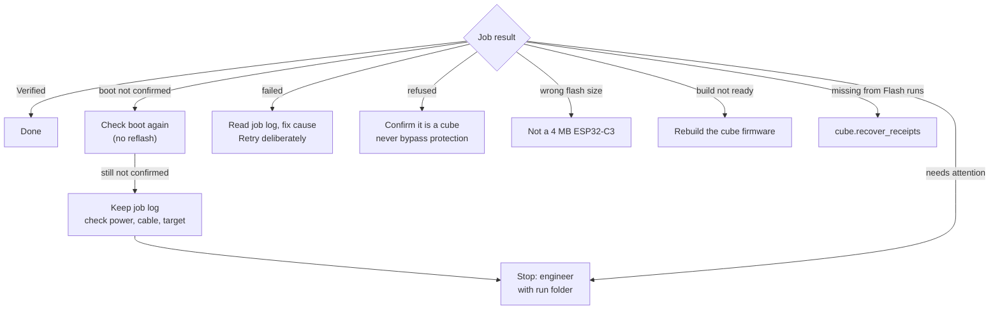

# Cubes: registration, firmware & main show — detail

*This document was written by Kimchi and Chips*

## Summary

A cube is identified by its MAC (the chip's fixed hardware address). Its **cube number** and **tag** can change. Registration links the three. The console sends that link to the cube over ESP-NOW and counts it as done only when the cube acknowledges. Zone boards learn the tag later, from the next published zone database. Firmware and the stored main show go onto a cube over USB, through the reused `flashing_station` pipeline, which never erases the whole chip and keeps the cube's number and tag. From v1.5.0, a newer published show can also reach the cube over the air. The operator steps are in {{page:H3}}.

## Facts

### Registration model

| Item | Value |
|---|---|
| Physical identity | MAC. Number (`cube_id`, may be NULL) and tag (`uid`) are mutable |
| Committed tag | `uid` |
| Proposed / retryable tag | `pending_uid`. Never reported as acknowledged |
| Success criterion | An `acknowledged` event for this MAC after the attempt started, with the row's `status='acknowledged'`, `uid` set and `cube_id` equal to the flow's number. Otherwise the flow fails with `The acknowledgment does not match the saved mapping` |
| Extra evidence (never required) | The cube's own USB line `REGISTERED Cube #N`, shown as chip **cube confirmed #N over USB** (tooltip "The cube printed REGISTERED over USB") |
| Registration ACK timeout | 15 s after the `register` command (`pairing_station/controller.py`) |
| Late replies | Dropped unless the event `id` matches the current request (request-ID matching). A `registered` event whose MAC or `cube_id` differs from the active cube is ignored |
| Scan gating | Fresh-tag gating: the reader must be clear (**CLEAR THE READER**) before **READY TO SCAN** is shown |
| `nfc_seen` events | Written only for local interactive scans. Discovery, USB identification, imported mappings and bulk transmission are not scans |
| Code path | Register page and manual path both call `Controller.repair(mac)` in `pairing_station/controller.py` (reused unchanged) |
| Scan hardware | Needs a board with a tag reader: a Workstation, or the installed legacy pairing station (nct-pairing-1.8-zones). A General Radio or relay-only board has `reader_ok=false`: it can discover cubes and send saved mappings, but it cannot scan |
| Simulation guard | `--simulate` refuses every non-loopback web server, so a simulated console never syncs with the real web inventory |

### Number allocation

| Rule | Detail |
|---|---|
| Automatic suggestion | `Database.suggested_number()`: the lowest integer ≥ 33 that is not used in `devices` and not in `reserved_numbers` |
| Reserved numbers | **2, 22, 39, 43** in table `reserved_numbers` ("Known existing physical module; exclude from automatic numbering"). Never suggested. Manual assignment is allowed (cube #39 exists and runs v1.7.0) |
| Valid range | 1 … 4294967295 (`Enter a whole number from 1 to 4294967295`) |
| Number taken by another device | Refused: `Number N already belongs to <MAC>. Rename that device to an unused number first.` |
| Excluded device | `Readers and base stations cannot have cube numbers` |
| Pending registration | Rename refused: `Finish or retry the pending registration before renaming` |
| Exhausted | Card **No free device numbers remain above 32** |
| Original-32 number | Shown separately on the card. Historical only. It does not reserve a cleared current number, and it is never restored automatically |
| Manual-number mode | `metadata.auto_number`. Cleared numbers are not repopulated on discovery |
| Sync switches automatic numbering off | Every web sync (`pairing_station/web_sync.py`, "Independent computers cannot safely allocate the next free number") and every Git inventory apply (`inventory_sync.py`) writes `auto_number=0`; nothing sets it back to 1. The live database holds `0`. With automatic sync on by default, every computer that has the web password is in this mode |
| Effect of `auto_number=0` | `Database.reserve()` gives a newly seen MAC (USB identification in `hub.identified`, radio discovery) **no number**: status `needs_number`, pill **Needs number**, detail "Choose Rename device to assign its label number", card **‹MAC› has no number** with **Assign #N** |
| Register page is not affected | `regflow.step_number` calls `suggested_number()` itself when the row has no number, so the Register page still assigns the lowest free number above 32 and shows **NEW NUMBER: write #N on the cube's label** (`number_new = 'assigned'`). The allocation is local: two computers registering at the same time before either syncs can pick the same number; the sync merge then keeps one claim and drops the other device to **Needs number** ({{page:X08}}). The flow's own Sync step (and automatic sync 5 s after the change) keeps that window short |
| **Pair new cubes (auto)** is affected | `controller.choose()` skips a discovered row whose number is NULL, so on a synced computer it pairs only cubes that already have a number and no tag; a brand-new cube waits in **Needs number**. Assign the number first (card, or **Rename**), or use the Register page |
| Rename effect | Keeps the tag. Status becomes `not_transmitted` (has a tag: "New number needs transmission.") or `awaiting_tag` ("Awaiting NFC registration."). A rename while the cube is out of range is saved only: reconnect, **Send saved mapping**, then **Sync** |

### Register page (`#/register`, ⌘3)

- Source: `console/regflow.py`, `console/web/panels/RegisterSection.js`.
- Switch: **Register cubes as they are plugged in** (setting `auto_register`). Saved on this computer in `metadata.console_settings`; **off** by default. Off text: "Off: plugging in a cube does nothing here. Switch on to start; a cube already plugged in is registered straight away." On text: "Plug in a cube over USB; it is taken through number, tag scan and sync."
- Title chip: **No pairing station** · **Station connecting** · **Station connected · NFC reader not ready** · **Station ready · NFC ok**.
- Steps: **USB** → **Number** → **NFC scan** → **Sync** (`STEPS = usb, number, nfc, sync`). Internal step values: `idle | number | nfc | sync | done | failed`.
- The flow runs on the owner thread, never blocks and never retries by itself.
- Zone update is not part of the flow. After **done** the page says: "Zones learn the tag once they hold the published database: automatic zone updates bring it to zones in range (Update all is the manual path)."

Number card:

| Case | Text |
|---|---|
| Number assigned now | **NEW NUMBER: write #N on the cube's label**, and a toast on any page: "New number #N assigned to <MAC>. Write it on the cube's label." |
| Cube already numbered | **This cube already had number #N** |
| Operator typed the label number | **Number from the label**; toast "Number #N (from the label) set for <MAC>" |
| Change field | **Label says** + **Set**. Only in step `nfc` (or failed at `nfc`), before the tag is scanned. Refused after the scan: `The tag was already scanned; wait for the result`. Otherwise: `The number can only be changed before the tag is scanned` |

Prompt line:

| State | Text |
|---|---|
| No cube | **Plug in a cube over USB** |
| Scan armed | **Cube #N is flashing: hold its NFC tag on the pairing station reader**, plus the Workstation banner |
| Sync | **Syncing…**, then `Syncing inventory and publishing the zone database…` |
| Done | **Cube #N registered and synced. Unplug it and plug in the next cube.** When the publish failed, it ends with **(Zone database not published: …)** and the tone is warn |
| Failed | The error in red (see below) |

Waiting messages (not errors; `regflow.step_nfc` / `step_sync`, in the order they are checked):

| Message | Condition | Operator action |
|---|---|---|
| **Plug the cube back in (it is powered over USB)** | The cube was unplugged before the scan was armed | Plug the same cube back in. The flow continues where it was |
| **Waiting for the Flash page to finish this cube** | `flashflow.holds(mac)`: the Flash page is on and is flashing this cube, or will take its port next | None. Registration continues by itself |
| **Connect the pairing station** | No station session | Plug in the Workstation |
| **Waiting for the pairing station to connect** | Session open, no hello yet | Wait |
| **The pairing link has no working NFC reader (plug in the pairing station)** | `reader_ok` false (for example a General Radio) | Use a board with a working reader |
| **The station is busy (<mode>); waiting for it to finish** | Controller mode set and not `preview` | Wait, or **■ Stop** on the Workstation panel |
| **Remove the tag from the reader** | Registered, and the controller is still active on this MAC | Lift the tag. Sync starts |
| **Sign in to sync (Sync button, top right)** | No web password stored | Sign in once ({{page:X08}}) |
| **Another sync is running; waiting for it to finish** | A sync job is running | Wait |

Failure texts (the flow stops, logs `Registration of #N (<MAC>) stopped: …` and records `failed`):

- `The cube is not in the device database`
- `This device is excluded as a reader / base station, not a cube`
- `The cube did not acknowledge; Retry sends the saved registration again`
- `<controller message>` or `The station paused the registration` (controller paused on this cube)
- `The registration was stopped before a tag was scanned`
- `The acknowledgment does not match the saved mapping`
- `Sync failed: <error>. Press Sync to try again`
- `Cancelled by the operator` (result `cancelled`)

Buttons:

| Button | Shown when | Effect |
|---|---|---|
| **Retry** (`register.retry`) | Step `failed`, and the failure was not at sync | Failed at `nfc`: if the controller is paused on this cube, `controller.retry()` resends the saved tag, or flashes the cube for a new scan. Otherwise the scan is re-armed on the next tick. Failed at `number`: same as Start again |
| **Sync again** | Step `failed` at `sync` | Runs a new sync job |
| **Start again for this cube** (`register.restart`) | A cube is known and the flow is not active (failed or done). Disabled while unplugged ("The cube is unplugged") | Stops the controller if it is working on this MAC, then restarts from the number step |
| **Cancel** | Flow active (number, nfc or sync) | Stops the controller job for this MAC. Records `cancelled` |

Other behaviour:

- A second cube identified mid-flow: the first cube is logged `Registration of #N (<MAC>) interrupted by <MAC2> on <port>; its saved mapping stays retryable` and recorded `interrupted`, then the flow starts on the new cube.
- The same cube re-probed (session reopened) keeps its place. If it was plugged back in mid-flow, the flow resumes.
- Switching the page off during number, nfc or sync cancels the cube in progress.
- Switching it on with a cube already pinned starts that cube at once.
- **This session** table (latest 20, one row per MAC): Number · MAC · New · Result (`registered`, `failed`, `cancelled`, `interrupted`) · Time · Detail.

### Manual path (cube card)

| Control | Where | Detail |
|---|---|---|
| **Register (scan a tag)** / **Replace tag (scan)** | Cube card | One-click hardware button. Tooltip: "Flashes this cube red/blue and waits for a fresh NFC scan at the station, then sends it its number and tag." Hazard: "A scanned tag that belongs to another device is transferred to this cube." Replace hazard: "A new scan replaces this cube's committed tag; a tag held by another device is transferred." |
| **Send saved mapping** (`pairing.transmit`) | Cube card, when a `uid` or `pending_uid` exists | Sends the saved number and tag without a scan. Needs a connected idle station and a saved number + tag |
| **Flash LEDs until Stop** (`pairing.flash`) | Cube card | Blinks the LEDs only. Not a firmware write |
| **Unpin** | Cube card | Removes the USB pin. Unplugging does not remove it; the next identified cube replaces it |
| **Discover** · **Identify (flash until Stop)** · **Flash 2 s** | Workstation panel | Find a cube without USB. LED blink only |
| **Pair new cubes (auto)** (`pairing.start_pair`) | Workstation panel › **Pairing** | Discovers unregistered cubes, flashes each in turn, waits for its tag, numbers it (lowest free above 32, never 2, 22, 39 or 43) only while `auto_number` is 1; after any sync a new cube is left **Needs number** and skipped (see Number allocation). Skips existing registrations. Controls: **Skip**, **Retry paused**, **■ Stop** |
| **NFC status** | Workstation panel › **Pairing** | Polls, last read time |
| **Recover NFC reader** (`station.nfc_recover`) | Workstation panel | I²C bus clear and PN532 re-initialisation. Refused while an operation runs |
| **Transmit original 32** (`pairing.transmit_originals`) | Inventory › Cubes | Sends each original-32 mapping to its cube. Refuses changed originals. Not a repair tool |

Register unavailable (tooltip reasons, `console/state.py::capabilities`, in this order):

1. `Connect the NFC station to register; cube USB identification alone is not enough`
2. `NFC reader is unavailable; check the station and reader connection`
3. `This device is excluded as a reader or base station`
4. `An operation is active; use Stop before registering` (not shown during the 1 s selection preview flash)

Other reasons: Send saved mapping `Needs a connected idle station and a saved number + tag` / `Station busy or not connected` / `Excluded device`. Flash LEDs `Station busy or not connected`. Rename `Finish or retry the pending registration before renaming` / `Stop the active operation first` / `Excluded device`.

Station banners (controller feedback titles):

| Banner | Meaning |
|---|---|
| **PREPARING TO REGISTER** | Switching from the selection preview to continuous flashing |
| **CLEAR THE READER · NEOCORE #N** | A tag is on the reader. Remove it |
| **READY TO SCAN · NEOCORE #N IS FLASHING** | Reader clear. Hold only this cube's tag until TAG DETECTED |
| **TAG DETECTED · REGISTERING NEOCORE #N** | Tag read, `register` sent, waiting up to 15 s for the ACK. Log shows the attempt, then *Delivered*, then the answer |
| **✓ NEOCORE #N REGISTERED** | ACK matched. Card pill **Registered · ACK**. "Remove the tag." |
| **NEOCORE #N NOT CONFIRMED** | Tag read, no ACK. Phase `paused`; the saved ID/UID is reused on Retry |
| **TAG NOT REGISTERED** | The scan was rejected (`str(exc)` + "Flashing stopped. Use Retry or Skip.") |
| **REGISTRATION NEEDS ATTENTION** | The station reported an error |
| **REGISTRATION STOPPED** / **REGISTRATION INTERRUPTED** | Stopped by the operator or by a lost link. Transmitted registrations are not undone |
| **NFC READER NOT RESPONDING** | PN532 status failed. Registration disabled |

Registration status pills (`console/uitext.py` STATUS):

| Pill | Status | Meaning |
|---|---|---|
| **Registered · ACK** | acknowledged | A matching application ACK arrived. Not proof of flash persistence or LED output |
| **Unconfirmed** | unconfirmed | Result uncertain. Retrying the same ID/UID is safe |
| **Registering** | pending | Waiting for the cube's ACK |
| **Saved · not sent** | not_transmitted | A trusted mapping this computer has not transmitted |
| **Needs NFC tag** | awaiting_tag | Numbered, waiting for a scan |
| **Needs number** | needs_number | Left out of the zone database |
| **Unregistered** | discovered | Answered discovery; nothing saved |

### NFC ownership transfer

- An interactive scan may take a tag from another device's committed or pending mapping. The transfer is atomic. Both devices get an audit event. The other device keeps its number and unrelated tags. The **Log** names the cube that lost the tag.
- If the new cube does not acknowledge, a retryable pending mapping is left.
- The old cube's own NVS is not erased remotely. Set it aside or re-register it, then **Sync** and update the zones.
- Bulk saved-mapping transmission never steals ownership.

### Edge cases

| Situation | Console behaviour | Action |
|---|---|---|
| **Register** greyed out | Tooltip reason (list above) | Fix the reason. For an active operation press **■ Stop** and wait until it has stopped |
| No tag read after READY TO SCAN | **NFC status** shows polls and last read. If the reader is down: card **Station NFC reader is not responding** | Present the right tag again, check reader position and power, compare with a known-good cube. A reader that "started" is not proof it reads tags ({{page:X11}}) |
| Registration not confirmed | Pill **Unconfirmed** / **Registering**; card **Registration not confirmed** (title may be **NEOCORE #N NOT CONFIRMED**) with **Retry the saved registration**, **Skip this cube** | Keep the cube powered. **Send saved mapping** resends without a scan; **Register** starts a new scan. The old saved registration stays until a new scan is accepted. A previous pending mapping never disables Register. Do not unregister cubes to unlock registration |
| Tag belongs to another cube | Atomic transfer (above) | Deal with the other cube, then Sync and update the zones |
| Wrong number | The number field renames the cube and keeps its tag | To take a number another cube has, move that cube to an unused number first |
| Original number differs | Shown separately | Do not restore automatically |
| Numbers 2, 22, 39, 43 | Never suggested | Type one by hand only for the cube that physically carries that label |
| Another cube plugged in mid-registration | `hub.identified()` stops the running controller operation before pinning, and logs `Stopped the active pairing operation before pinning <MAC> (identified on <port>)` | Check the pinned cube; start again deliberately. An interrupted registration never continues on another cube |
| Firmware differs / not verified | **Firmware** tab: **Version matches** / **Update needed** / **Not verified** | See Firmware below |
| Many unregistered cubes, no USB | **Pair new cubes (auto)** | **Skip**, **Retry paused**, **■ Stop** |
| Station link lost mid-operation | Re-handshake every 3 s | The interrupted operation is never replayed automatically |

> [!WARNING] **Two kinds of "flash".** **Identify (flash until Stop)**, **Flash 2 s** (Workstation panel) and **Flash LEDs until Stop** (cube card) only blink the LEDs. **Flash cube firmware** (cube **Firmware** tab) and the **Flash cubes** page write firmware.

> [!DANGER] The installed original pairing station `3C:0F:02:AD:83:24` is **Protected** (`flashing_station/core.py` `PROTECTED`): never probed, never flashed, and its port is never opened by the flasher. Excluded-role MACs are protected the same way. A replacement station must be identified and recorded ({{page:X09}}).

### USB identification of a cube

- The probe runs without a reset (`console/probe.py`): listen 0.4 s, then `?`, then `{"cmd":"hello"}`, then `STATUS`. It never sends anything that arms, sets or moves.
- It is a cube when the transcript contains `Cube MAC: <MAC>`. It also reads `FW:`, `ESP-NOW CHANNEL:`, `Cube READY`, `UNREGISTERED` and (v1.5.0+) `SHOW: v=<n> crc=<hex8> src=<nvs|…>`.
- On identification the console reserves the MAC in the inventory (`db.reserve(mac, source='usb')`), records a `usb` sighting, pins the cube and hands it to the Register page when that is on.
- Firmware verdict against `flashing_station/build/manifest.json`: **Version matches** ("Reported version equals the local build. Not a binary hash check."), **Update needed**, **Not verified** ("No matching answer to "?". Unverified is not the same as current.").
- Flasher candidate ports: USB VID `0x303a`, `0x10c4`, `0x1a86` or `0x0403`, and a serial number that is not protected.

### Firmware versions

Each version includes the previous one. Registration, zones, the 24-byte cube `Packet`, `SET_ZONE` and `MSG_SHOW_START` (= 8) are unchanged in all of them. Bootloader and partition table are identical from v1.4.1 to v1.7.0.

| Version | Adds | On site, 2026-09-23 |
|---|---|---|
| v1.4.x (inherited) | Original show firmware with a Wi-Fi update service | Replaced |
| **v1.4.1-USB.2** | Based on inherited v1.4.x. Wi-Fi update service and Wi-Fi credentials removed. Keeps channel 2 and the original show. Adds USB identity (`?` reply) and three short white flashes at start-up | The rest of the fleet |
| **v1.5.0-USB.1** | **Show as data.** Built-in show (`DefaultShow.h`, from `shows/mainshow.json`) matches v1.4.1 exactly. Receives a newer published show over ESP-NOW and keeps it in NVS namespace `show`. A damaged stored show falls back to the built-in one. Accepts only a higher version (FORCE is unicast-only), never while its show runs (committed when it ends). Joins a running show from `SHOW_TIMECODE` and corrects drift above 100 ms. Cubes before v1.5.0 drop every show frame (they accept only 24-byte frames) | — (#17 ran it on the bench) |
| **v1.6.0-USB.1** | **Fanning.** A fade, blink, pulse or cycle cue can be offset by the cube's registered number. A cube without a number has no offset. v1.5.0 refuses a fanned show and keeps its current one | — (#17 on the bench, held show v4) |
| **v1.7.0-USB.1** | **Live preview** (`SHOW_LIVE`, type 0x55). A registered cube that is not playing shows the preview colour for its number for a lease, then restores exactly what it showed. Ignores other numbers, unicast live frames, and live frames while a show runs | #17, #33, #39, #52, #58, #95. The console's bundled build |

Plays a newly published show: v1.4.1 no (keeps the original show) · v1.5.0 yes unless the show uses fanning · v1.6.0 and v1.7.0 yes.

Build target: XIAO ESP32-C3 (4 MB), FQBN `esp32:esp32:XIAO_ESP32C3:CDCOnBoot=default,PartitionScheme=no_ota,FlashSize=4M`, Arduino-ESP32 core 3.3.11, esptool 5.3.1. Builds are not byte-reproducible.

Segments of v1.7.0-USB.1 (`flashing_station/build/manifest.json`):

| Offset | File |
|---|---|
| `0x0` | `neocore_usb.ino.bootloader.bin` |
| `0x8000` | `neocore_usb.ino.partitions.bin` |
| `0xE000` | `boot_app0.bin` |
| `0x10000` | `neocore_usb.ino.bin` (969,584 B) |

`load_manifest()` refuses when the version or FQBN differs from `core.VERSION`, the source hash changed, a segment hash differs, or the `build_hash` does not match. Card: **Cube firmware build needs attention: ‹error›** with **Rebuild the cube firmware**. Never hand-edit hashes.

### NVS

- NVS partition: offset `0x9000`, length `0x5000`.
- Namespace `cube`: number and tag. Also radio calibration and other stored settings.
- Namespace `show` (v1.5.0+): `img`, `ver`, `crc`.
- `flashing_station/nvs.py`: NVS format-2 reader/writer. It refuses any partition it cannot parse completely (`NvsError`: any page, entry or data CRC mismatch, freeing/corrupt page states, unknown types).
- `nvs.build()` output is byte-identical to Espressif's `esp-idf-nvs-partition-gen` 0.3.0 (SHA-256 vectors in `flashing_station/tests/test_nvs.py`). Every local NVS backup under `flashing_station/data/runs` (342 when written) parses and round-trips; that test runs only where the private backups exist.
- The official generator is not used at runtime: it drops Wi-Fi station keys (`sta.pswd`).

### Firmware pipeline (`flashing_station/backend.py::Flasher.execute`)

Stage names, as shown on the job card and the Flash page:

1. **Check flashing tool**: `esptool version` must contain `5.3.1`.
2. **Identify**: `esptool flash-id` at 460800 baud. It must report a MAC and `Detected flash size: 4 MB`. A protected MAC is blocked. The USB key is re-checked before every esptool call (`USB identity changed; upload stopped`, `USB device disconnected; reconnect and retry manually`).
3. Auto mode only: if this MAC already completed this `build_hash`, the firmware is **skipped** ("This MAC already completed this firmware build"). If an earlier attempt on this MAC failed in this session: `Earlier attempt needs attention; select Manual Retry`.
4. **Back up registration**: read `0x8000`+`0x6000` → `registration-region.bin`, split into `partitions.bin` and `nvs.bin` (must be `0x5000`). Unknown partition layouts are refused.
5. **Write and verify**: `write-flash --flash-mode dio --flash-freq 80m --flash-size 4MB` with the four segments (never a full-chip erase).
6. **Check preserved registration**: read NVS → `nvs-after.bin`. It must equal `nvs.bin`, or: `Registration storage changed unexpectedly; backup retained`.
7. **Check show** / **Write show** (when a show is published; see below).
8. **Confirm boot**: within 12 s, the `?` reply must contain `FW: <version>`, `Cube MAC: <MAC>`, `ESP-NOW CHANNEL: 2` and `Cube READY` (and the `SHOW:` line if a show was written).

Results (`flash_runs.result` / `ui_result`):

| Result | Detail text |
|---|---|
| `success` | `Firmware verified · boot confirmed · registration preserved` |
| `skipped` | `This MAC already completed this firmware build`, or `Show only; firmware not touched` |
| `boot_unconfirmed` | `Firmware verified; boot not confirmed. Use Check boot, without reflashing.` / show-only: `Show written and read back, but the cube did not report it. Use Check boot.` |
| `failed` | The exception. Nothing was written |
| `attention` | Failure after a write started (firmware or show). With a show: `… · The show was written to NVS; the previous contents are kept in <run>/nvs-show-before.bin` |
| `save_failed` | `Hardware result saved locally; database save failed: …` (receipt exists) |

The show result is appended to the detail, for example `· show v5 written · read back · reported by the cube`.

Job-card levels (`console/jobs/cube.py`): success → Verified · boot_unconfirmed, attention → Delivered · skipped → Verified if the show was written, else Acknowledged · anything else → Failed. Flash results are stored apart from registration status and never change whether a cube counts as registered.

### Show stage (console only)

- Runs after the firmware step, and also when the firmware was skipped.
- **Check show**: parse the current NVS (`nvs.show_of`). A stored show that is valid and at or above the published version → `current` (equal) or `newer` (kept, warning). Firmware below v1.5.0 (`SHOW_FIRMWARE = (1,5,0)`) → `unsupported`. An unreadable NVS → `Cube storage could not be read completely (…); show not changed`.
- **Write show**: `nvs.with_show()` rebuilds the partition with every other value kept → `nvs-show.bin`. The pre-write NVS is copied to `nvs-show-before.bin`. The image is written at `0x9000` and read back to `nvs-show-after.bin`. It must be byte-identical (`Show storage read back differently from what was written`). `nvs.same_except_show()` must hold (`Registration storage changed while writing the show`). Then the cube is reset and must report `SHOW: v=<n> crc=<hex> src=nvs`.
- Show results (`flash_runs.show_result`): `current`, `written`, `newer`, `unsupported`. A failure once the NVS write starts is `attention`. `flash_runs` gained two columns for this stage, `show_result` (TEXT) and `show_version` (INTEGER), added by `flashing_station/core.py` on open.

Run folder `flashing_station/data/runs/<attempt-id>/`: frozen segment copies, `upload.log`, `registration-region.bin`, `partitions.bin`, `nvs.bin`, `nvs-after.bin`, `nvs-show-before.bin`, `nvs-show.bin`, `nvs-show-after.bin`, `receipt.json`. It holds private data. Never commit it.

### Flash page (`#/flash`, ⌘2)

- Source: `console/flashflow.py`, `console/web/panels/FlashSection.js`, `console/intake.py`, `console/sounds.py`.
- USB only: nothing on this page uses the radio. Intake (`intake.py::tick`) flashes a candidate port only after the console's probe has finished with it, and only if its role is `cube` or `unknown`/none, it is not **Protected**, and the inventory does not presume it is a zone, Workstation or Mainshow controller. Everything else is recorded `skipped · not a cube`. A silent board (`unknown`) is therefore taken: keep only cubes in reach.
- The Attention card **Cube #n runs v1.4.1-USB.2; the local build is v1.7.0-USB.1** is information, not an instruction to flash. A v1.4.1 cube plays the original show and works with every zone and controller; it cannot receive a newly published show.
- Switch **Flash cubes as they are plugged in** (`flash.enable`). Not saved: **off at every launch**. Off text: "Off: plugging in a cube does nothing here. It is off every time the console starts." On text: "Every cube on USB, now or plugged in later, gets the firmware (skipped if it already has this build) and the published show, once per plug-in." Hazard: "Writes firmware and NVS on every cube plugged in while it is on."
- Switching on refuses when the cube build has an error. It resets the session's attempted-port list and starts a session for the "needs attention" rule.
- Chips: **Firmware v…** or **Firmware build not ready** (banner **The cube firmware build is not ready**) · **Show vN** or **No published show**.
- Steps: **USB** → **Firmware** → **Show**. A cube that cannot answer `?` is still flashable: the port stands in for its MAC (**MAC not read yet**).
- Prompts: **Switch on, then plug in a cube over USB** / **Plug in a cube over USB** / **Cube #N: firmware… keep it plugged in** / **Cube #N: checking the show in its storage…** / **Cube #N is up to date. Unplug it and plug in the next cube.** / the error.
- Intake: `core.Scheduler` takes each candidate port key once per plug-in. A key is forgotten when its port has been gone for more than 2 s. So with USB adapters that have no unique serial number, leave the socket empty for at least 2 s between cubes. Auto-flash waits until the console has finished probing a new port (fix for the "USB port is owned by another Neocore application" race of 2026-09-23).
- A cube that already succeeded with this build is skipped by the page, even after a restart (the `flash_runs` record). The cube panel's **Flash cube firmware** allows a deliberate repeat.

Result lines:

| Firmware line | Show line |
|---|---|
| `<version> written and verified` | **Show vN written to NVS, read back, and reported by the cube** |
| `<version> already on this cube` | **Show vN was already on the cube** |
| | **The cube holds show vN, newer than the published one; kept** (warn) |
| | **Firmware too old to hold a show; the built-in show is kept** (warn) |
| | **No published show on this computer; the built-in show is kept** |

Toast on any page, for example: "Cube #34 (<MAC>): firmware v1.7.0-USB.1 written and verified, show v5 written and confirmed by the cube. Unplug it and plug in the next cube." On failure: "Flashing #N (<MAC>) stopped: <error>". **This session** table (latest 20): Number · MAC · Firmware (`written` / `already current`) · Show (result · vN) · Result (`flashed` / `failed`) · Time · Detail.

**Retry (rewrite the firmware)** (`flash.retry`): shown after a failure. It needs the same port key present (`Plug the cube back in first`). It runs as a manual flash: the firmware is written again even if current, then the show. Nothing retries by itself.

Register and Flash together: a new cube is flashed first. The Register page shows **Waiting for the Flash page to finish this cube**, then continues to the scan. This computer › **Automatic intake**: the old Auto-flash cubes button is now a link, **Flash cubes → Flash page** (**Flash cubes · ON (Flash page)** while on). **Auto-flash zones** is unchanged.

Sounds (Settings › Behaviour › "Audio cues for USB cube flashing", setting `audio`, default on, **Test sound**). They are the Tk cube flasher's tones (`flashing_station/audio.py`), played for the Flash page, **Flash cube firmware** and **Check boot**. Never in a simulation.

| Cue | When |
|---|---|
| connected (one note) | A new candidate USB port appeared while the Flash page is on |
| start (rising two notes) | A cube flash job started |
| tick | Each stage, and every 4 s while a flash runs |
| success (rising four-note chord) | `success`, or firmware skipped with the show written; a boot check that passed |
| tick (single) | Firmware skipped and nothing written |
| failure (falling three notes) | Anything else, including `boot_unconfirmed` and a failed boot check |

### Single cube from its panel

- Cube panel tabs: **Overview** (current number; the original-32 number is shown beside it; "unassigned" is not the original number), **Firmware**, **History**.
- **Firmware** tab: verdict and a **Main show** row (stored version, built-in show, or not reported).
- **Flash cube firmware** (`cube.flash_firmware`, manual). What: "Writes the bundled cube firmware, verifies it and checks the boot message, then brings the show in its storage up to the published one." Hazard: "Writes the app partition and reboots the cube. NVS (number and tag registration) is preserved; only the show in it is replaced when older." The console holds the port and shows a job card with stages.
- **Update show over USB** (`cube.update_show`, `show_only`). Writes only the show; firmware untouched. Needs firmware v1.5.0+ and a published show. Hazard: "Rewrites the cube's NVS partition and restarts the cube. The previous contents are kept in the run folder." Job title `Update the show in cube NVS to vN on <port>`.
- **Check boot (no reflash)** (`cube.check_boot`, Firmware and History tabs): "Opens the port, reads the boot banner and records the run; nothing is written." Outcome `Boot confirmed: version, MAC, channel 2 and READY all matched`, or `No matching boot response (unverified, not necessarily wrong)`.
- **History**: past flash runs for this MAC.
- Preconditions: finish any registration (Workstation idle), close any serial monitor on the port, keep the **Flash cubes** page off.
- The console refuses to close during an esptool write: `A flash write is in progress; wait for it to finish before closing`.
- After the job the cube is identified again and the Firmware tab should say **Version matches**. A newly flashed cube with no tag still needs registration and the zone databases.

### What is preserved and what is changed

| Part | Firmware flash | Show update over USB |
|---|---|---|
| Firmware (app) | Replaced | Unchanged |
| Number and tag (NVS `cube`) | Kept; NVS compared byte for byte before and after | Kept; everything outside `show` checked |
| Radio calibration, other NVS values | Kept | Kept |
| Stored main show (NVS `show`) | Replaced only if missing, older or damaged | Same |
| Bootloader, partition table, `boot_app0` | Written; identical v1.4.1–v1.7.0 | Unchanged |
| Unrelated old file-system areas | Not promised when moving to the current layout | Unchanged |

### Main show onto cubes

| Route | How | Needs | Guarantees |
|---|---|---|---|
| Over the air, automatic | Settings › Automatic updates › **Main show over the air** (`auto_show`, default on): the show registry walks through the Workstation that carries show frames | A Workstation (or General Radio general-radio-1.1.0+); cubes v1.5.0+ | Only cubes on an older show are updated. Never mid-show (a cube commits when its show ends) |
| Over the air, manual | Show editor (⌘6): **Query cubes** (SHOW_QUERY, answers within 2 s), **Update** (one cube), **Update selected** (a broadcast: every older cube in range stores it too), **Update all**, **Auto update** (walk-around; switch off when done) | Same | A cube accepts only a higher version |
| Over USB, many | **Flash cubes** page | A published show on this computer | Written, read back, reported from NVS |
| Over USB, one | **Update show over USB** on the cube panel | v1.5.0+ | Same |
| Web pull | **Pull a newer zone database and show from the web** (`auto_pull`, default on) pulls a newer published show while a show relay is connected (every 300 s) | Web password | — |

Show versions are allocated by the web and only increase; never allocate one locally. **Publish** does not touch cubes. `show_cubes` in the device database records what each cube reported. Changing `shows/mainshow.json` or the show format is a cube firmware release (`NctShowEngine.h`, `showfile.py`, `showengine.js`, `web/src/lib/show.ts` together; `python pairing_station/showfile.py --header` regenerates `DefaultShow.h`), not a show publish. Editor and protocol detail: {{page:X07}}.

Live mirroring (`show.live`, v1.7.0 cubes): broadcast only. The page sends about every 60 ms (about 16 per second). The hub drops calls closer than 40 ms. Default lease 600 ms (firmware maximum 2000 ms). Needs a Workstation or general-radio-1.2.0.

Version 1 of the handover described Engineering Six's path for a new animation: develop on one cube in the Arduino IDE, hand the code over for a verified build, reflash every cube over USB. That path is no longer needed for a new animation. It is still the path for a change to the built-in default or the format.

### Receipts and `cube.recover_receipts`

- Every run writes `receipt.json` atomically before the database update. It is a durable, independent record that allows database recovery without another hardware write.
- If the database save fails, the result is `save_failed` and the run is missing or wrong in Inventory › Flash runs.
- Console command `cube.recover_receipts` (`console/commands_extra.py`; no button): scans `flashing_station/data/runs/*/receipt.json`. It updates an existing `flash_runs` row only when its stored result differs from the receipt's and is not `success` (for example a run still marked `running` or `failed`). It never creates rows and is idempotent. Log: `Receipt recovery: N saved hardware result(s) imported[; M unreadable]`. It returns `{recovered, errors}`. The Tk flasher runs the same recovery at start-up (`Store.recover()`).

## Procedures

### Register page

1. Start the console (`console/Launch.command`; Windows `console/Launch.bat`). Plug in the Workstation. The device list shows **NFC scanning** or **NFC not responding**.
2. Register (⌘3). Check that the chip says **Station ready · NFC ok**. Switch on **Register cubes as they are plugged in**.
3. Plug in a cube. If it is new, write **NEW NUMBER** on the label. If it has a physical label, use **Label says** and **Set** before the scan.
4. At **READY TO SCAN**, hold only this cube's tag until **TAG DETECTED**. Wait for **REGISTERED**.
5. Lift the tag. Sync runs. Check for **Cube #N registered and synced…**. If it says **(Zone database not published: …)**, press **Sync** again before updating zones.
6. Let the automatic updates bring the zones up to date, or use **Update all out-of-date zones** ({{page:X09}}). Test at an updated reader and watch the light.

### Manual registration

1. Workstation panel › **Pairing**: connection, radio and reader all green.
2. Plug in the cube (it is pinned). Without USB: **Discover**, then **Identify (flash until Stop)**.
3. Accept the suggested number (Enter), or type the label number.
4. **Register (scan a tag)** / **Replace tag (scan)**. Clear the reader, wait for **READY TO SCAN**, scan.
5. Wait for **REGISTERED** and **Registered · ACK**. Remove the tag.
6. **Sync** (card **Local cube mappings differ from the published zone database** until you do). Update the zones. Test.
7. **Unpin**.
8. To prove persistence, power-cycle the cube and test again. An ACK is not proof of NVS persistence.

### Flash page

1. Clear the bench of other boards. Identified Workstations, zone boards and controllers are skipped, but a silent board would be taken.
2. Flash (⌘2). Check the chips. Switch on.
3. Plug in cubes one at a time. Wait for the toast or the chord. Unplug. With adapters that have no serial number, wait 2 s before the next cube.
4. On failure: read the error, fix it, **Retry (rewrite the firmware)**.
5. Switch off when done (it is off again at the next launch anyway).

### Single cube

1. Plug in the cube. Check **Overview** and **Firmware**.
2. **Flash cube firmware**, or **Update show over USB** for the show only.
3. Read the result. Unplug only after the job ends.

### Recovery

| Result | Card | Action |
|---|---|---|
| Boot not confirmed | **<job title>: written and verified, boot not confirmed** with **Check boot again**. Contents read back correctly; only the boot answer is missing | **Do not reflash.** **Check boot again** or **Check boot (no reflash)**. If it still fails, keep the log (job card › log) and check power, cable, target |
| Failed | **<job title>: failed**; the Flash page stops | Keep the receipt and backup. Read the log, fix the cause, **Retry** deliberately |
| Needs attention | **<job title>: needs attention** (rule `flash.attention` or `flash.readback_mismatch`), with the receipt path. A failure in the show step names `nvs-show-before.bin` | Stop. Do not retry. Hand the cube and the run folder to an engineer |
| Refused | **<job title>: refused** (for example a **Protected** board) | Check the board is a cube. Never bypass |
| Wrong flash size | **<job title>: wrong flash size** | Not the right hardware (needs a 4 MB XIAO ESP32-C3) |
| USB device changed | **<job title>: the USB device changed mid-way**, with **Probe again** | Nothing more was written. Reconnect the same board and retry |
| Build not ready | **Cube firmware build needs attention: ‹error›** with **Rebuild the cube firmware** (also This computer › Firmware builds) | Rebuild. Never edit checksums by hand |
| Missing from Inventory › Flash runs | — | Run `cube.recover_receipts` through the console API ({{page:X10}}) |

> [!DANGER] Never erase the whole chip to "clean" a cube. The console has no such command. An erase destroys the cube's number and tag (NVS).

## Known issues / open questions

- The Register page and the manual scan path have never been run with a real Workstation, cube and tag through the console. **Simulation-verified** (`console/tests/test_regflow.py`, 13 tests; `test_docscenes` shots 03-1…03-5, 03-A1…03-A3). **Bench-verified** 2026-09-23: cube #17 identified and pinned on the live console, and discover and identify worked through the bench General Radio (general-radio-1.1.0; 113 cubes answered discovery). No reader was attached.
- Registration ACK proves neither NVS persistence across a power cycle nor LED output. **Code-checked** rule; test by power-cycling when needed.
- Flash page and USB show stage on real cubes: **Bench-verified** as recorded by the console (`flash_runs`, `show_cubes`; LEDs not recorded). 04:39 KST #17 (`1C:DB:D4:F0:A8:30`): show-only update, show v5 written, read back, reported. 04:46: second pass, all current (skipped). 04:47–04:49: #52 `AC:27:6E:82:6B:28`, #95 `1C:DB:D4:F0:D1:DC`, #33 `AC:27:6E:80:03:68`, #58 `1C:DB:D4:F0:DE:28`, #39 `1C:DB:D4:EF:6D:60`: each v1.7.0-USB.1 verified, boot confirmed, registration preserved, show v5 written, read back and reported.
- Runs between those and at 04:50–04:51 failed with "USB port is owned by another Neocore application" before identifying a cube (nothing written). Fixed later that day (`intake.next_settled_cube`, `hub.apply_probe_results`): intake waits for the probe. The fix is **Simulation-verified** (unit tests, `console/tests/test_flashflow.py`); not re-tested on hardware.
- Show v6 was published at 04:52 KST and reported by all six v1.7.0 cubes by 04:59, over the air (no USB run after 04:51). **Bench-verified** from `show_cubes`. The next publish is numbered by the web.
- Show v5 also went to #17 over the radio before the USB runs (general-radio-1.2.0; NVS read back byte-identical to the published image), then #17 was restored to v4 and v5 written over USB. **Bench-verified** from serial and NVS read-back; LEDs not verified. v5 changed only the show's first cue; detail in {{page:X07}}.
- Underlying flasher: **Bench-verified**. The Tk flasher uploaded to test cube `AC:27:6E:82:A0:94` (firmware verified, NVS unchanged, boot confirmed). #17 was flashed to v1.5.0 and v1.6.0 with NVS preserved.
- Show firmware on #17: **Bench-verified by serial log only**. v1.5.0: old-style start, show-clock join, over-the-air update held until the show ended, stored show kept across a reset. v1.6.0: fanned show accepted. v1.7.0: live start and lease end, other numbers ignored, unicast live frame refused, running show ignores live.
- Simulation coverage: `console/tests/test_flashflow.py`, `test_receipts.py`, `flashing_station/tests/test_nvs.py`. Shots 04-F1, 04-F2 and 04-1…04-4 are scripted (no esptool ran).
- Audio cues have not been heard on hardware. **Code-checked**.
- `SHOW_LIVE` rate: the old chapter 05 and AGENTS.md said about 20 Hz (AGENTS.md since corrected). The code sends about every 60 ms (uitext says "about 16 times a second"). This page uses the code value.
- The old chapter 05 says Workstations, zone boards and controllers are "never taken" by the Flash page. The code skips boards identified (or presumed by the inventory) as such, but takes a board that answers nothing (role `unknown`). The flasher still refuses protected and excluded MACs. **Code-checked**.
- `cube.recover_receipts` has no button. **To confirm** whether one is wanted.
- The rest of the fleet (v1.4.1-USB.2) cannot receive a published show. Moving it means one USB pass with the Flash page. Partial rollout is safe. **To confirm** with the client whether and when to move the fleet.

## Sources

- `console/regflow.py`, `console/web/panels/RegisterSection.js`, `console/web/lib/register.js`
- `console/flashflow.py`, `console/web/panels/FlashSection.js`, `console/intake.py`, `console/sounds.py`
- `console/jobs/cube.py`, `console/commands_extra.py` (`cube.recover_receipts`)
- `console/hub.py` (`identified`, stop-before-pin, `shutdown`, settings defaults), `console/probe.py`, `console/state.py` (`capabilities`)
- `console/advisor.py` (`reg.*`, `station.nfc_down`, `zone.local_differs`, `cube.*`, `flash.*`, `build.stale`), `console/uitext.py` (STATUS, ACTIONS)
- `console/web/panels/CubePanel.js`, `WorkstationPanel.js`, `others.js` (Automatic intake), `sections.js` (Settings)
- `console/showedit.py` (live mirroring)
- `pairing_station/controller.py`, `pairing_station/database.py` (`suggested_number`, `validate_number`, `rename`, reservations, tag takeover)
- `flashing_station/backend.py`, `core.py`, `nvs.py`, `build/manifest.json`, `README.md`
- `console/README.md` › Register cubes, Flash cubes
- `console/TEST_REPORT_2026-09-23.md`
- Old drafts `04-register-cubes.md`, `05-cube-firmware-show.md`

*This document was written by Kimchi and Chips*
