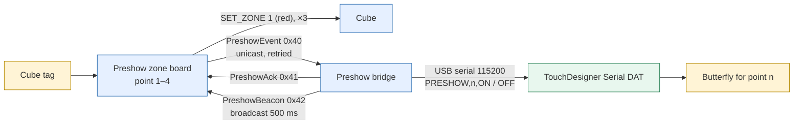

# Preshow & TouchDesigner — detail

*This document was written by Kimchi and Chips*

## Summary

Four preshow zone boards (points 1–4) read a cube's tag, turn a registered cube red and send an ON/OFF event over ESP-NOW to the Preshow bridge. The bridge acknowledges each event and writes one line per state change, `PRESHOW,<n>,ON|OFF`, to USB serial at 115200 baud, where a TouchDesigner Serial DAT plays the butterfly for that point. The link is beacon-latched unicast with an application acknowledgement; the pre-2026 2-byte packet is still spoken in both directions so the boards and the bridge update in either order. Operator steps are in {{page:H4}} and {{page:H5}}.

## Facts

### Signal path

### Behaviour

| Event | Zone board | Cube | Bridge / TouchDesigner |
|---|---|---|---|
| Registered cube placed (tag in the board's zone database) | Reads tag | `SET_ZONE 1` → red (RGB 20,0,0), sent 3 times (see {{page:X05}}, colour repeats) | `PRESHOW,<n>,ON` |
| Cube removed (no tag for 700 ms, `TAG_LEAVE_TIMEOUT`) | Sends OFF | No new colour | `PRESHOW,<n>,OFF` |
| Unknown tag | Read, but no cue: only registered cubes trigger media (`if (!cube) return;`) | No change | — |
| Two boards flashed with the same point | Cues fight over one TouchDesigner channel | — | Card **Two preshow plates are flashed as point N** (registry) or **The media bridge sees plates sharing a point id** (bridge `point_clashes`) |

- Points: 1–4 (`PRESHOW_POINT_COUNT = 4`). Each board is configured with one point (`zcfg` pointId). Two boards must never share a point.
- Zone kind: `ZONE_PRESHOW = 1`.

### Firmware and boards

| Item | Value |
|---|---|
| Zone board firmware (repository) | `preshow-3.4.0`, `zones/firmware/PreshowZone/PreshowZone.ino`, banner `NCT PRESHOW TAG PLATE` (tag plate core `NctTagPlate.h`) |
| Board types | ESP32-C3 SuperMini, PN532 I²C SDA GPIO4 / SCL GPIO3; replacement boards are ex-cube XIAO ESP32-C3 with the PN532 on D4/D5 = GPIO6/GPIO7. preshow-3.4.0 tries 4/3, then 6/7 (`altSdaPin = 6`); the `NFC:` line reports `pins=` |
| Reader gain | 48 dB (PN532 RFConfiguration CfgItem 0x0A, CIU_RFCfg 0x59 → 0x79; chip default 38 dB). Set at init since preshow-3.1.0; stored/settable over the air and reported since preshow-3.3.0 |
| Bridge firmware (repository) | `preshowbridge-1.0.0`, `zones/firmware/PreshowBridge/PreshowBridge.ino`, banner `NCT PRESHOW MEDIA BRIDGE` (the zone flasher refuses a board with this banner; do not change it) |
| Bridge FQBN | `esp32:esp32:esp32c3:CDCOnBoot=cdc` (board rebuilt with a different antenna and power supply; if it is not a plain ESP32-C3 change the FQBN here and in `scripts/build_all_firmware.py`) |
| Original bridge | `live files/Preshow_MediaServer_SerialDAT` (archived). Listener only, hard-coded 2-byte packet, no sequence, no ack, no retry. Its MAC `E8:3D:C1:94:6C:9C` is `PRESHOW_LEGACY_BRIDGE_MAC`, used only as the fallback unicast destination before any beacon is heard |
| Radio | ESP-NOW channel 2 |

The Preshow bridge is not a cube and not a zone board: no PN532, no `zcfg`/`zdb` partitions, not a zone-flasher target. Never flash cube or zone firmware onto it.

### Registry snapshot (device database `zones` table, last seen 23 Sep 2026 ≈04:59 KST)

| Name | MAC | Firmware | Zone DB | RX gain stored / applied |
|---|---|---|---|---|
| Preshow 1 | `AC:27:6E:82:27:E0` | preshow-3.4.0 | v38 | 48 / 48 |
| Preshow 2 | `1C:DB:D4:F0:D1:E8` | preshow-3.4.0 | v38 | 48 / 48 |
| Preshow 3 | `1C:DB:D4:F0:D0:B0` (ex-cube #136) | preshow-3.4.0 | v38 | 48 / 48 |
| Preshow 4 | `1C:DB:D4:F0:C3:E0` | preshow-3.4.0 | v38 | 48 / 48 |

- Stale rows (replaced boards, not heard since 22 Sep): Preshow 2 `1C:DB:D4:F0:A3:14` (preshow-3.4.0, v29); Preshow 4 `14:63:93:C0:EC:14` and `30:ED:A0:5B:14:08` (preshow-2.2.0, v28); Preshow Exit 1 `3C:0F:02:AF:28:1C` (tagplate-2.2.0, v4, last seen 19 Sep).

- The old Preshow 3 SuperMini `48:F6:EE:15:8F:20` (preshow-2.2.0) was reflashed as **Reset 1** on 22 Sep; treat it as the reset plate.
- Boards recorded as media bridges (ex-cubes, role `excluded`, still holding their cube numbers): #67 `1C:DB:D4:F1:DA:D0`, #72 `AC:27:6E:83:21:C4`. On 23 Sep the bench Workstation (general-radio-1.1.0) heard preshow beacons from `AC:27:6E:83:21:C4` every 5 s, bridge uptime ≈90 000 s. The bridge firmware installed on site was not inventoried.

### Radio link (`NctPreshowProtocol.h`)

| Frame | Type | Size | Direction | Content |
|---|---|---|---|---|
| `PreshowEvent` | 0x40 | 20 B | board → bridge, unicast | `bootId` (random per boot), `seq` (+1 per state change, not per frame), `pointId` 1–4, `state` 1/0, tag UID (informational) |
| `PreshowAck` | 0x41 | 12 B | bridge → board, unicast | echoes `bootId`, `seq`, `pointId`; flag `PRESHOW_ACK_APPLIED` (0x01) when the event changed the point |
| `PreshowBeacon` | 0x42 | 16 B | bridge → all, broadcast | `epoch` (changes on bridge boot), `uptimeS`, `pointMask` (points the bridge holds ON = what TouchDesigner was told), `version`, `channel` (telemetry only) |
| `PreshowLegacy` | — | 2 B | board → bridge | `{pointId, state}`, no header. Length 2 is claimed by this protocol alone |

Preshow frames carry the `NZ` header but are deliberately absent from `NctZoneProtocol.h::frameType()`; they reach the sketch through `TagPlate::onFrame` (Wi-Fi task, hand-over only). See {{page:X02}}.

Timings:

| Constant | Value | Meaning |
|---|---|---|
| `PRESHOW_BEACON_MS` | 500 ms | Bridge beacon period |
| `PRESHOW_BEACON_STALE_MS` | 3000 ms | No beacon this long → board sends broadcast only |
| `PRESHOW_BURST_COUNT` / `_GAP_MS` | 3 frames, 20 ms apart | Sent immediately on every change |
| `PRESHOW_RETRY_MS` | 120 ms | Retry cadence while unacknowledged |
| `PRESHOW_RETRY_WINDOW_MS` | 3000 ms | After this the board reports `MEDIA FAIL` once |
| `PRESHOW_STATE_REPEAT_MS` | 1000 ms | Current state re-asserted forever (self-heal after a bridge reboot/out of range) |
| `PRESHOW_BROADCAST_COPY_MS` | 1000 ms | One broadcast copy regardless of the unicast link |
| `PRESHOW_SENDER_STALE_MS` | 10 000 ms | A sender silent this long is let back in whatever its seq |
| Bridge sender slots | 8 (`PRESHOW_SENDER_COUNT`) | Four plates plus headroom for a replacement; keyed by sender MAC |

Rules:
- The board learns the bridge address from the beacon, so a bridge swap needs no reflash of the boards.
- The bridge acknowledges every well-formed event, duplicates included; the board retries until the ack carrying exactly its `bootId`+`seq`+`pointId` arrives.
- The bridge writes a serial line only when a point's state changes; retries and re-asserts are silent to TouchDesigner. A cue line the port would not accept is counted in `cue_drops` and retried, not treated as delivered.
- An ack means the bridge wrote the line to its serial port. It does not prove the butterfly played. A missed past cue is not replayed; after a link loss the latest state is restored.
- `WiFi.setSleep(false)` and a receive callback that only hands the frame over (the two faults that made the legacy pool controller drop frames).

### Modes (either-order rollout)

| Mode | When | Behaviour |
|---|---|---|
| `legacy` | preshow-3.2.0+ board that has never heard a beacon since power-on | Also sends the 2-byte packet (unicast to `E8:3D:C1:94:6C:9C` plus a broadcast copy). Serial `MEDIA LEGACY: point … (2-byte fallback, unacknowledged)`. Cannot be acknowledged; not a failure. Card **Preshow plate "‹zone›" is in legacy media mode** (info) |
| `modern` | First beacon heard | Serial `MEDIA: bridge found; 2-byte legacy fallback off`. Never resumes legacy during that power-on (`bridgeEverSeen` never resets), even across a bridge reboot |

- The bridge accepts the 2-byte packet (counted in `rx_legacy`), so a board missed during a rollout keeps working. A board's `?` report shows `MEDIA: mode=legacy` or `mode=modern`, plus `point`, `state`, `seq`, `acked`, `ack_ms`, `bridge_sees_me`, `bridge_seen_ms`.
- Serial lines on the board: `MEDIA -> POINT n ON|OFF seq=…`, `MEDIA ACK point n … after Nms`, `MEDIA FAIL: point n … unacknowledged after Nms`, `MEDIA SKIPPED: zone point not configured`.
- Card **Preshow plate "‹zone›" reported MEDIA FAIL** (warn): a bridge was heard but did not acknowledge within 3 s.

### Bridge serial console and STATUS fields

Port: 115200 baud. Nothing is printed unless a human types something (the boot banner is the only unsolicited non-cue output).

| Command | Effect |
|---|---|
| `?` or `STATUS` | One JSON `status` line, one `point` line per point, one `plate` line per known board (by MAC) |
| `TEST <1-4> ON\|OFF` | Drives a cue by hand (writes the line). The owning board's next re-assert (≤1 s) puts the point back |
| `help` | Lists the above |

| Field (`type:"status"`) | Meaning |
|---|---|
| `firmware`, `mac`, `uptime_ms`, `channel`, `radio_ready`, `epoch` | Identity and radio state |
| `desired_mask` / `emitted_mask` | Points wanted ON / points written to TouchDesigner. Differ only while a cue line is waiting to be written |
| `rx_packets`, `rx_legacy`, `rx_duplicates` | Frames received; legacy 2-byte frames; duplicates (normal: retries and re-asserts) |
| `rx_no_slot`, `rx_overruns`, `last_rx_ms` | More senders than slots; receive queue overruns; time since last frame |
| `acks`, `ack_errors` | Acks sent; ack send failures |
| `cues`, `cue_drops`, `log_drops` | Lines written; lines the port would not accept (retried); log lines dropped rather than block |
| `point_clashes` | Live plates sharing a point id |

`point` lines: `point`, `state`, `cues`, `changed_ms`. `plate` lines: `mac`, `point`, `state`, `seq`, `boot_id`, `legacy`, `seen_ms`.

### TouchDesigner contract

| Line | Meaning |
|---|---|
| `PRESHOW,<n>,ON` | Point n (1–4) has a cube |
| `PRESHOW,<n>,OFF` | The cube left point n |

- Byte-identical to the original bridge's output: the TouchDesigner project did not need changing.
- The TouchDesigner project is not in this repository. DAT names, the point → effect routing and TouchDesigner start-up must be recorded by the media team.
- Only one program can own the bridge's USB port. Plugged into the console computer, the console opens the **Preshow media bridge (TouchDesigner)** panel and holds the port (**Recent cues**, **TEST n ON** / **n OFF**, **Disconnect**).

### Cue test and temporary control

| Tool | Where | Mechanism | Release |
|---|---|---|---|
| **Cue override** + **POINT n ON** / **POINT n OFF** | Zone panel › **Cue test** tab of a preshow board on USB | Board serial `HOST ARM` / `HOST PING` / `HOST ON [1-4]` / `HOST OFF` / `HOST DISARM` / `HOST STATUS`. Console pings every 0.35 s (`sessions/preshow_plate.py`: `PING, STALE = 0.35, 1.5`) | Board drops the cue 1.5 s (`HOST_TIMEOUT_MS`) after the last ping; switching the override off releases it. A different point must be turned off first (`ERR HOST: point n is still ON; turn it off first`) |
| **Preshow cue** tab (**POINT n ON** / **POINT n · ON → off**) | Workstation panel | Workstation acts as a fifth plate with no reader (`preshow` verb; `preshow_ack` / `preshow_fail` after 3 s). One cue per sender: switching points is OFF then ON | 1.5 s host heartbeat lease (`preshow_watchdog` turns it OFF) |
| **TEST n ON** / **n OFF** | Preshow bridge panel (bridge on the console's USB) | Bridge `TEST <n> ON|OFF`; writes the line directly | The owning plate's next re-assert restores the real state |
| `zones/preshow_test/` | Separate app | Drives a plate's leased `HOST *` override by hand, for a plate with no reader | Same 1.5 s lease |

The **Cue** line reads *acknowledged yes* with the time in ms when the bridge acked. The console status bar lists every temporary control it holds.

> [!WARNING] Every tool above raises **real media cues** on site. Agree the test with the media team first, and switch **Cue override** off (or release the Workstation cue) when finished.

### Failing-stage table

Work down with a known-good registered cube; stop at the first unhealthy stage. Detail per stage: {{page:H5}}, {{page:X11}}.

| Stage | Check | Healthy | If not |
|---|---|---|---|
| 1. Tag read | Zone panel **Monitor** tab; NFC pill in the header | Each tap in Monitor history; NFC pill *scanning* | Reader, position, power; **Recover NFC reader**. Raising gain never fixes a missing zone database entry |
| 2. Cube found | Monitor lookup; Attention panel | Cube number shown; no unknown-tag card | Zone database behind / not published / not registered ({{page:X09}}, {{page:X08}}) |
| 3. Cube turns red | Look at the cube; Monitor delivery pill | Red within ≈1 s | Cube power, range, channel ({{page:X03}}) |
| 4. Board → bridge | **MEDIA** pills in the zone header | `MEDIA mode=modern`, **bridge sees me: yes**, no MEDIA FAIL card | Bridge power, antenna, range; query its `STATUS`. `legacy` = no beacon heard |
| 5. Bridge → USB line | Bridge panel **Recent cues**, or the DAT | One `PRESHOW,n,ON` per tap, one `OFF` per removal | Serial DAT port, 115200 baud; **Disconnect** in the console; close serial monitors; `cue_drops` |
| 6. Media effect | TouchDesigner (media team) | Butterfly for that point plays | Parser, point → effect mapping (media team) |

Cue stuck on: remove real tags; switch **Cue override** off; check ON/OFF state on the bridge (`emitted_mask`).

## Procedures

### Connect the bridge to TouchDesigner
1. Plug the bridge into the TouchDesigner computer by USB.
2. In the existing Serial DAT select the bridge's current port (a replaced board can appear as a new port).
3. Set 115200 baud.
4. Tap a cube on a point; expect exactly one line in the DAT.
5. If the bridge was on the console computer, press **Disconnect** in its panel first.

### Cue test without a cube (console)
1. Agree the test with the media team.
2. Plug the preshow board into the console; Zone panel › **Cue test**; switch **Cue override** on.
3. Press **POINT n ON**; expect **Cue** *acknowledged yes* (ms); ask the media team whether the effect played.
4. Press **POINT n OFF**.
5. Switch **Cue override** off; confirm the status bar lists no temporary control.

### Replace a preshow board or the bridge
1. Board: flash with the zone flasher / Zone panel › **Firmware & database**, profile preshow, a free point (the point of the board it replaces) ({{page:X09}}). Retire the old registry row.
2. Bridge: flash `PreshowBridge` (`scripts/build_all_firmware.py` builds it); no board reflash is needed. Re-select the port in TouchDesigner.
3. Check `?` on the board reports `mode=modern` and the bridge `STATUS` shows the plate with `legacy:false`.

## Known issues / open questions

- The versions installed on the bridge are not inventoried; the bench only heard beacons from `AC:27:6E:83:21:C4`. **To confirm.**
- Cue test through a real board and bridge has not been run. **To confirm** (Simulation-verified: shots 08-1, 08-2, simulated bridge).
- Battery life: small LiPo batteries did not work in the arrangement tried; USB batteries did. Battery life is not measured. **To confirm** ({{page:X13}}).
- Final media routing of each point (point → butterfly) needs a recorded acceptance check. An earlier (Sunday 20 Sep) note said only one point was in the media programme; do not treat it as a current limit. **To confirm** ({{page:X13}}).
- Stale registry rows (two old Preshow 4, one old Preshow 2, Preshow Exit 1) remain until someone retires them; the point-clash card only counts rows heard in the last hour. **Code-checked.**
- Repair history: on 22 Sep Elliot replaced the preshow boards with ESP32 boards with external antennas (ex-cube XIAOs), made the signalling robust (this protocol), updated TouchDesigner's device settings, raised the reader gain to 48 dB and repositioned the readers inside the wooden enclosure; he reported reliable reads through the wood and working butterfly cues. **Field-reported (Elliot).**
- Firmware behaviour: **Code-checked** (host tests `zones/tests/test_PreshowBridge.cpp`, `test_PreshowProtocol.cpp`, `test_PreshowZone.cpp`). Preshow 4 RX gain 48 dB set over the air through the General Radio was **Acknowledged** (23 Sep bench, SET_RESULT reply). Butterfly cues: **Field-reported (Elliot)**.

## Sources

- `zones/firmware/PreshowZone/PreshowZone.ino` (preshow-3.4.0)
- `zones/firmware/PreshowBridge/PreshowBridge.ino`, `zones/firmware/PreshowBridge/README.md` (preshowbridge-1.0.0)
- `zones/firmware/libraries/NctZone/src/NctPreshowProtocol.h`, `NctTagPlate.h`, `NctZoneProtocol.h`
- `zones/firmware/Workstation/README.md` (Preshow role)
- `zones/preshow_test/app.py`
- `console/sessions/preshow_plate.py`, `console/sessions/preshow_bridge.py`, `console/web/panels/ZonePanel.js` (Cue test, MEDIA pills), `console/web/panels/others.js` (bridge panel), `console/web/panels/WorkstationPanel.js` (Preshow cue), `console/advisor.py` (`preshow.legacy_mode`, `preshow.media_fail`, `preshow.point_clash`, `zone.nfc_down`)
- `zones/README.md` (RX gain column)
- `pairing_station/data/devices.sqlite3` tables `zones`, `devices`, `device_roles` (read 23 Sep 2026)
- `console/TEST_REPORT_2026-09-23.md` (General Radio rerun: zone query, RX gain, session snapshot)
- Commits `ed90640` (colour repeats, 48 dB gain), `a2591e6` (zone link and firmware updates)
- Elliot's report of 22 Sep 2026; old draft `07-preshow-touchdesigner.md`

*This document was written by Kimchi and Chips*
