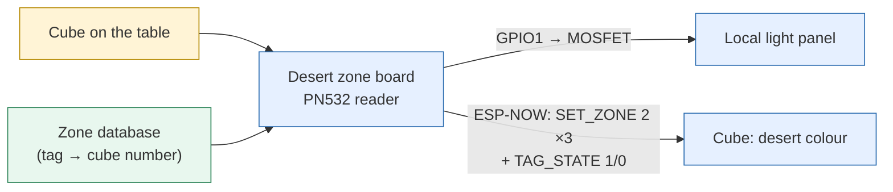

# Desert — detail

*This document was written by Kimchi and Chips*

## Summary

Each desert position has its own zone board under the table. A registered cube placed on it causes two independent effects: the board switches the **local light panel** on by wire (MOSFET on GPIO1), and it tells the **cube** over the air to show the desert colour. They fail for different reasons, so they are checked separately (Check A, Check B). The colour command is repeated because a cube can silently lose it. Operator steps are in {{page:H4}} and {{page:H5}}.

## Facts

### Signal path

### Behaviour

| Visitor does | Local light panel | Cube | Radio frames |
|---|---|---|---|
| Places a **registered** cube (tag in the board's zone database) | ON (`DESERT LIGHT ON`) | Desert colour within ≈1 s | `MSG_SET_ZONE 2` (sent 3 times, below), then `MSG_TAG_STATE 1` |
| Takes the cube away (no tag for 700 ms) | OFF (`DESERT LIGHT OFF`) | No new colour is sent; the cube keeps the desert colour | `MSG_TAG_STATE 0` (if the tag was a known cube) |
| Places an **unknown** tag | Stays off (`tagEnter` returns when there is no cube record) | No change | None |
| Cube moves to another board during the repeat window | — | The new board's colour | Remaining repeats are cancelled |

- Desert colour: RGB (20, 12, 0) in the cube firmware (`DESERT_R/G/B`). The old operator chapter calls it "yellow"; the Workstation README calls it "amber". Same colour.
- `MSG_TAG_STATE` = 7. The maintained cube firmware defines it but has no handler; the frame's only side effect is the one described under *Colour repeats*.
- Zone kind: `ZONE_DESERT = 2`. No OTA of firmware: only the zone database (cube table) and the reader gain update over ESP-NOW.

### Timings (`NctTagPlate.h`)

| Constant | Value | Meaning |
|---|---|---|
| `TAG_LEAVE_TIMEOUT` | 700 ms | Tag unseen this long = removal |
| `NFC_CHECK_INTERVAL` / `NFC_READ_TIMEOUT` | 30 ms / 80 ms | Reader poll cadence / per-read timeout |
| `NFC_HEALTH_INTERVAL` | 3000 ms | Live PN532 firmware query while no tag |
| `NFC_FAST_FAIL_MS` / `_LIMIT` | 20 ms / 10 | Ten reads in a row that return in under 20 ms = reader lost |
| `NFC_RETRY_INTERVAL` | 5000 ms | Reader re-initialisation attempts |
| `ZONE_REPEAT_MS` | 120 ms, 400 ms | Two unconditional repeats after the first `SET_ZONE` |
| `ZONE_RETRY_MS` | 600 ms | Further retries, only while the radio reports failure |
| `ZONE_REPEAT_WINDOW_MS` | 3000 ms | Nothing re-sent after this; then `Cube #N colour NOT ACKNOWLEDGED after N tries` and `EVT ZONE_GAVE_UP` |

Healthy radio: 3 frames per tap. Radio down: 7 frames spread over the window, then the report. Every repeat is byte-identical (`EVT ZONE_REPEAT cube=… value=… n=… ms=…`) and carries the tap's handle, so the zone log reports the whole effort.

### Colour repeat rationale

A `SET_ZONE` can be lost in two ways:
1. **On the radio.** ESP-NOW reports it in the send callback, so it is retried until the MAC layer acknowledges it.
2. **Inside the cube, after the radio accepted it.** The cube firmware (from `ForKimchi.ino`) keeps exactly one received packet (`pendingPacket`/`packetReady`) and consumes it in `loop()`, whose idle pass is `delay(2)`. Two frames inside one pass leave only the second. The desert board sends `MSG_TAG_STATE` straight behind the colour, so the colour could be silently replaced by a no-op while the wire reported success.

The cube never acknowledges `SET_ZONE` at application level and its firmware was not to be changed for this, so the only answer is to send the colour again unprompted. A tag leaving, or a hand-set colour, cancels the remaining repeats so a repeat never repaints a cube another board has since claimed. Opt-out: `TagPlateOptions::repeatZone`. The Workstation's `set_zone` (Workstation panel › **Cubes & show** › **Set … →**) uses the same three sends at +120 ms and +400 ms.

### GPIO and wiring

| Signal | Pin | Note |
|---|---|---|
| PN532 SDA / SCL | GPIO4 / GPIO3 | I²C; no alternative pin pair on desert (only preshow-3.4.0 has the GPIO6/7 fallback) |
| Light panel | GPIO1 → 1-channel MOSFET module | HIGH = panel ON. Set LOW in `setup()` before anything else |
| Board | ESP32-C3 SuperMini | ESP-NOW channel 2 |

The light panel's supply, the MOSFET module and its wiring are outside the console's view: the console cannot see the light.

### Firmware

| Version | Change |
|---|---|
| desert-2.2.0 | Before colour repeats; reader at chip default 38 dB |
| desert-2.3.0 | Colour repeats (120/400 ms, 600 ms retries, 3 s window); PN532 RX gain 48 dB at init (RFConfiguration CfgItem 0x0A, CIU_RFCfg 0x59 → 0x79); `rfcfg` console command (commit `ed90640`, Hojun, 21 Sep) |
| desert-2.4.0 (repository) | RX gain stored in `zcfg`, settable over the air (`ZONE_SET_CONFIG`) and reported; the console shows an RX gain pill (commit `a2591e6`) |

### Registry snapshot (device database `zones` table, 23 Sep 2026 ≈04:59 KST)

| State | Boards |
|---|---|
| Heard on 23 Sep, zone DB v38, desert-2.3.0 | Desert 1 ×4 (`30:ED:A0:5B:1D:3C`, `3C:0F:02:AF:2F:70`, `D4:05:92:E7:D4:2C`, `48:F6:EE:15:75:38`), Desert 2 (`30:ED:A0:5B:37:D0`), Desert 4 ×2 (`48:F6:EE:15:90:48`, `48:F6:EE:15:8F:38`), Desert 5 ×2, Desert 6, Desert 7 ×2, Desert 8 ×2, Desert 10 ×2, Desert 12, Desert 13 (`48:F6:EE:15:91:F4`), Desert 15 ×4 |
| Heard on 23 Sep, desert-2.4.0, RX gain 48/48 | Desert 2 `3C:0F:02:AF:61:C0` |
| Behind / not heard recently | Desert 1 `D4:05:92:E7:D8:80` (v31, 22 Sep); Desert 3 `30:ED:A0:5B:0F:8C` (2.2.0, v4, 19 Sep); Desert 4 `30:ED:A0:5B:6C:F4` (2.2.0, v14, 21 Sep); Desert 11 `3C:0F:02:AD:83:78` (2.2.0, v4, 18 Sep); Desert 13 `30:ED:A0:5B:2D:80` (2.2.0, v4, 18 Sep) |

On the 23 Sep bench pass desert boards answered at −78…−96 dBm (preshow boards −61…−71 dBm).

## Procedures

### Check A — tag and local light
1. Plug the desert board into the console by USB; its Zone panel opens. Open **Monitor**.
2. Place a known-good registered cube on the marked position.
3. Nothing in Monitor: the reader did not see the tag. Check reader position, power and the reader before the cube. Card **NFC reader on "…" is not responding** → **Ask the plate to recover the reader** (or **Recover NFC reader**).
4. Tag shown but unknown: follow the Attention card — board database behind (**Update database over USB** / **Update database over the air**), registration not published (**Sync & publish**), tag not registered (**Register at the station**) ({{page:X08}}, {{page:X09}}).
5. Cube found but the panel stays dark: local light circuit (supply, MOSFET output, wiring). Repairing the cube does not fix it.

### Check B — cube colour
1. With the panel working, the cube must change colour within ≈1 s.
2. Read the Monitor delivery pill. **No radio ACK** raises **Cube #… did not acknowledge plate "…"**: cube off, out of range or wrong channel. **Delivered** only means the cube's radio answered.
3. Swap: a second cube on the same position; the same cube on a second position.
4. One position fails with every cube → reader or mounting fault. One cube fails everywhere → cube desk, USB, Cube panel (registration, firmware) ({{page:X03}}).

### Maintenance boundaries

> [!WARNING] Stay inside these limits.
> - Replace a desert board from Zone panel › **Firmware & database**, profile **Desert** ({{page:X09}}).
> - Change the zone database or the reader gain over the air from the Workstation's **Zone relay** tab ({{page:X09}}).
> - After a gain change read the RX gain pill. Card **RX gain on "…" is stored but the reader did not accept it** = the new gain is not in use (the reader is absent, failing or disabled; it is re-applied when the reader recovers).
> - A higher gain cannot fix a reader mounted away from the cube position, and cannot fix a missing zone database entry.
> - Opening the table or moving a reader is carpentry: agree it with the installation team, then repeat Check A and Check B.

## Known issues / open questions

- Readers at the Jisung / Jimin positions were reported misaligned under the table and need carpentry. Check the physical labels before work; "Jimin" is kept as written in the report. **Field-reported (Hojun, via Elliot).**
- Sunday's report (20 Sep, Sangeun) counted seven failing tag-module sets; Hojun's later report counts eight replacement sets built and installed. Different moments: do not merge into one fault count. **Field-reported.**
- Hojun expects future faults to be mostly cube-related. Field guidance, not proof. **Field-reported (Hojun).**
- Repair record: reader gain raised so tags read through the table; the timing case where a cube could miss its colour command fixed (colour repeats, desert-2.3.0); eight replacement tag-module sets installed; zone reported working. **Field-reported (Hojun, supplied by Elliot).**
- Most installed boards run desert-2.3.0 and so do not report RX gain (shown `—`); only Desert 2 `3C:0F:02:AF:61:C0` runs desert-2.4.0. Updating the rest needs a USB flash at each position. **Code-checked** (registry).
- Registry names and point ids disagree: several boards share a name (Desert 1 ×5, Desert 15 ×4) and Desert 7 `3C:0F:02:AF:23:64`, Desert 10–15 are all configured as point 8. Which rows are live positions, spares or retired boards is not recorded. **To confirm.**
- Firmware behaviour **Code-checked** (`zones/tests/test_DesertZone.cpp`). Monitor and the Attention cards for these checks **Simulation-verified** (advisor tests). No desert board was connected on USB while this was written.

## Sources

- `zones/firmware/DesertZone/DesertZone.ino` (desert-2.4.0)
- `zones/firmware/libraries/NctZone/src/NctTagPlate.h`, `NctZoneProtocol.h`
- `flashing_station/firmware/neocore_usb/neocore_usb.ino` (colours, message types)
- `zones/firmware/Workstation/README.md` (`set_zone`, zone colour names)
- `zones/README.md` (RX gain column and **Set RX gain…**)
- `console/advisor.py` (`zone.nfc_down`, `cube.nack_offline`, `tag.*`, RX gain not applied)
- `pairing_station/data/devices.sqlite3` table `zones` (read 23 Sep 2026)
- `console/TEST_REPORT_2026-09-23.md` (bench zone query)
- Commits `ed90640`, `a2591e6`
- Engineering Six PDF pages 15–18; Sangeun's report of 20 Sep; Hojun's later report, supplied by Elliot; old draft `08-desert.md`

*This document was written by Kimchi and Chips*
