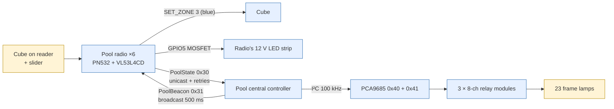

# Pool / forest — detail

*This document was written by Kimchi and Chips*

## Summary

Six pool radios each read one slider (VL53L4CD distance sensor) while a visitor holds a cube on the radio's reader. Each radio sends the chosen member (frame 1–23) to the Pool central controller, which ORs all radios and switches the member's frame lamp through two PCA9685 drivers and three 8-channel relay modules (outputs 1–24, one unused). The radios and the central are a matched set. Pool central controller **poolcentral-4.2.2** (commit `5996e10`, Hojun) carries the frame map re-measured after the relay modules were replaced; the repository (`main` at `6b26cdf`) holds 4.2.2. Operator steps are in {{page:H4}} and {{page:H5}}.

## Facts

### Signal path

### Behaviour

| Visitor does | Frame lamps | Radio strip | Cube |
|---|---|---|---|
| Holds any tag on a radio (registered or not) | — | ON (GPIO5 HIGH while the interaction is active) | Registered cube: `SET_ZONE 3`, blue (RGB 0,2,20). Unknown tag: no colour (as in the original installation) |
| Moves the slider to a member position | That member's frame lights | ON | — |
| Removes the cube (700 ms) or no valid position | Frame off after the lease / release hold | OFF | — |
| Two radios choose frames | Both light; a frame stays on while **any** radio holds it (OR, any-wins) | — | — |
| No cube on any radio | All relays de-energised | OFF | — |

A radio only outputs a member when: interaction active (tag present or host override) **and** no unsaved calibration draft **and** the slider reading is live **and** the calibration is valid **and** a position is confirmed (`outputMember()`).

### Pool radios

| Item | Value |
|---|---|
| Firmware (repository) | `pool-3.2.0`, `zones/firmware/PoolZone/PoolZone.ino`, banner `NCT POOL RADIO` |
| Board | ESP32-C3 SuperMini; PN532 and VL53L4CD share I²C SDA GPIO4 / SCL GPIO3; 12 V LED strip MOSFET on GPIO5 |
| Zone kind | `ZONE_POOL = 3`; radio id = `zcfg` pointId, 1–6 |
| Filter | Median prefilter → One Euro filter → enter/exit windows with hysteresis and timing (`SliderTuning.h`, `SliderCalibration.h`, `OneEuroFilter.h`) |
| NVS | namespace `pool-slider`: `ticks-v1` (calibration), `tune-v1` (tuning, 32-byte blob). Written only by explicit `CAL SAVE` / `TUNE SAVE`; nothing writes on boot, and the firmware updater verifies the NVS partition is unchanged across an update |
| Legacy seed | With no saved calibration but valid legacy endpoints in `zcfg` params (cal1, cal23), an unsaved linear 23-tick calibration is seeded |

Version history: pool-2.7.0 released a member on a single disagreeing sample and a single invalid reading (relay flicker); pool-2.8.0 added hysteresis, release debounce, dropout tolerance, median prefilter and the `TUNE`/`RAW` commands; pool-3.0.0 the acknowledged radio link with PoolCentral (commit `24370f4`); pool-3.1.0 colour repeats and 48 dB reader gain (`ed90640`); pool-3.2.0 stored/reported RX gain (`a2591e6`).

Registry snapshot (device database `zones`, 23 Sep 2026 ≈04:59 KST): all six radios on **pool-3.0.0**, zone DB v38.

| Name | MAC | Radio id |
|---|---|---|
| Pool Radio 1 | `3C:0F:02:9F:D4:E4` | 1 |
| Pool Radio 2 | `30:ED:A0:5B:11:10` | 2 |
| Pool Radio 3 | `30:ED:A0:58:CE:74` | 3 |
| Pool Radio 3 | `30:ED:A0:5B:37:A0` | 3 |
| Pool Radio 4 | `30:ED:A0:5B:0C:B4` | 4 |
| Pool Radio 4 | `30:ED:A0:5B:1D:D8` | 4 |

**The id clash:** six radios report ids 1, 2, 3, 3, 4, 4 (central `id_clashes=4`); ids 5 and 6 are unused. Harmless for lighting because the central keys slots by MAC, but logs and the console are ambiguous and the console raises **Two pool radios share radio id N** / **Pool central sees live radios sharing an id**.

Tuning parameters (`TUNE SET <key> <value>`; defaults keep pool-2.7.0's filter and timing except the defect fixes):

| Key | Field | Default | Range |
|---|---|---|---|
| `mincutoff` | One Euro cutoff at rest | 0.8 Hz | 0.05–20 |
| `beta` | One Euro speed coefficient | 0.03 Hz per mm/s | 0–5 |
| `dcutoff` | Derivative cutoff | 1.0 Hz | 0.05–20 |
| `enter` | Window to enter a member (fraction of local tick spacing) | 0.33 | 0.05–0.5 |
| `exit` | Wider window to keep one (hysteresis) | 0.45 | `enter`–0.9 |
| `confirm` | Stability to enter | 50 ms | 0–1000 |
| `release` | Persistent disagreement to leave | 120 ms | 0–1000 |
| `dropout` | Invalid readings tolerated before release | 400 ms | 50–1000 |
| `budget` | VL53L4CD timing budget | 20 ms | 10–200 |
| `interval` | Inter-measurement period (0 = continuous) | 0 | 0 or > budget, ≤1000 |
| `median` | Median window, odd | 3 | 1–9 |

Other radio serial commands: `TUNE GET|SAVE|LOAD|DEFAULTS`, `RAW ON|OFF` (stream every sample), `CAL GET|SAVE|LOAD`, `CAL SET <1-23> <mm>`, `CAL ANCHORS <mask>` (bit 0 and bit 22 required), `HOST ARM|PING|DISARM|STATUS`, `dist` (toggle distance stream). Report line `POOL: radio=… cal1=… cal23=… laser=ok|MISSING member=… tune=saved|defaults`.

### Pool radio → central link (`NctPoolProtocol.h`)

| Constant | Value |
|---|---|
| `POOL_STATE` / `POOL_BEACON` | 0x30 radio → central / 0x31 central → radios (broadcast) |
| `POOL_BEACON_MS` / `_STALE_MS` | 500 ms / 3000 ms (no beacon → broadcast only) |
| Lease (`leaseMs` in every PoolState) | default 800 ms (legacy `RADIO_TIMEOUT_MS`), clamped 600–2000 ms |
| Heartbeat | 150 ms while active (worst 250 ms); 500 ms idle, forever |
| Burst on change | 3 frames, 20 ms apart |
| Release re-asserted | 1000 ms (`POOL_RELEASE_REPEAT_MS`) |
| Broadcast copy | every 450 ms, always |
| Legacy packet | 15 bytes, magic `0x4E435450`; accepted by the central, logged `(LEGACY)`, never displaces a current-protocol radio whose lease is good |

The radio latches the beacon's source as a pinned peer and unicasts back (MAC-layer ack and hardware retries). A changed beacon `epoch` (central reboot) triggers an immediate re-burst. Idle heartbeats never stop, so `RADIO TIMEOUT` in the central log is a genuine fault. Pool frames carry the `NZ` header but are absent from `frameType()` ({{page:X02}}).

### Pool central controller

| Item | Value |
|---|---|
| Firmware | **poolcentral-4.2.2** installed and in the repository (commit `5996e10`, Hojun, 23 Sep 04:47 KST; `main` at `6b26cdf`). Superseded: poolcentral-4.2.0 (`bf869f8`). The board ran poolcentral-4.1.0, which is in no commit, before 4.2.2 (backup `poolzone_test/build/backup-central-d40592e7d0c4-poolcentral-4.1.0.bin`, gitignored, sha256 `8e95a6c0...a7083a`) |
| Board | ESP32-C3, FQBN `esp32:esp32:esp32c3:CDCOnBoot=cdc,FlashFreq=40` (not the SuperMini profile). Not a zone board: no PN532, no `zcfg`/`zdb`, not a zone-flasher target |
| I²C | SDA GPIO8, SCL GPIO9, 100 kHz, 25 ms transaction timeout |
| Drivers | PCA9685 `0x40` = outputs 1–16 (channels 0–15); `0x41` = outputs 17–24 (channels 0–7). Full-on / full-off only, no PWM. `validMode`: MODE1 & 0x7F = 0x20, MODE2 = 0x04 (OUTDRV totem pole) |
| Relays | Three 8-channel modules (handsontec MDU1064 type), one relay per output. Output n drives relay n except outputs 7/8 are crossed (7 → relay 8, 8 → relay 7); the table absorbs it. Relay 16 has no lamp; frame 14 is on relay 24 |
| Polarity | **Active low** on all 24 outputs (`POOL_ACTIVE_LOW_OUTPUTS = 0xFFFFFF`): lamp ON = channel LOW (`FULL_OFF`) = relay energised; lamp OFF = channel HIGH (`FULL_ON`). Lamps sit on the energised contact (COM–NO) since the 21 Sep rewire. Polarity is expressed per output (once observed differing per board; fixed in wiring) and only in `encodeOutput()`; logs and telemetry are always in lamp terms |
| Arbitration | Pure OR. Slot per sender MAC, `POOL_SLOT_COUNT` = 8 (six sliders plus room for a replacement alongside the one it replaces). Newcomer with all slots live → refused, `rx_no_slot`. Sequence + `bootId` filtering; a rebooted radio or one silent longer than any lease is let back in |
| Release hold | `POOL_RELEASE_HOLD_MS` = 400 ms after the last holder lets go (lighting is instant; only release is damped). 0 = strict OR (`PoolArbiter.h`) |
| Output integrity | Every write read back before it counts as applied; failed writes stay pending and retry. Board offline only after 3 consecutive failures (`I2C_FAILURES_BEFORE_OFFLINE`). MODE1/MODE2 checked every 500 ms; one register audited every 20 ms; only currently leased members restored after a driver reset. Stuck bus cleared with the NXP nine-clock sequence, open drain |

Frame → output map (`POOL_OUTPUT_FOR_MEMBER`, 4.2.2, measured 23 Sep by moving a slider through each index):

| Frame | 1 | 2 | 3 | 4 | 5 | 6 | 7 | 8 | 9 | 10 | 11 | 12 | 13 | 14 | 15 | 16 | 17 | 18 | 19 | 20 | 21 | 22 | 23 |
|---|---|---|---|---|---|---|---|---|---|---|---|---|---|---|---|---|---|---|---|---|---|---|---|
| Output | 9 | 22 | 2 | 19 | 13 | 6 | 14 | 4 | 18 | 23 | 21 | 7 | 5 | 24 | 10 | 12 | 17 | 8 | 20 | 11 | 1 | 3 | 15 |

Output 16 has no lamp and stays dark (cleared by the `ALL_LED` write in `initializeBoard()`, never written again). A compile-time check requires the 23 frames to map to 23 distinct outputs in 1..24. There are no host tests for the table; the measurement comment in `PoolOutput.h` is the record, and `poolzone_test/tests/frame_map.py` derives a corrected table from new readings (composing with the current table, so it cannot be applied backwards). Everything outside `verifyMember()` and `boardMask()` uses frame numbers; `boardMask()` is not a contiguous range.

Boot window: a PCA9685 powers up with every channel `FULL_OFF` = LOW = relay energised, so from the moment the drivers have power the hardware asks for every lamp on (and 23 coils pulling in at once sags the supply). `setup()` darkens and verifies every channel before Wi-Fi/ESP-NOW and retries what is unproven. Boot line `POOL CENTRAL <version> MAC=… channel=2 outputs=dark|UNVERIFIED`; `UNVERIFIED` = a driver did not answer and its lamps may be on. The window between the relay boards receiving power and the firmware running cannot be closed in software; a hardware fix would be driving `OE` from a pin that idles the relays off, or pull-ups holding the coils de-energised.

Flash speed: the board `48:F6:EE:15:8E:E0` boot-looped at the default 80 MHz (`esp_image: Checksum failed`, calculated checksum differing on every boot while the stored one stayed `0x78`; flash contents byte-identical and valid under `esptool image-info`). At 40 MHz the same build runs. The speed is in the bootloader header, so bootloader and app must be flashed as a pair at the same setting. `scripts/build_all_firmware.py` defines `C3_SLOW_FLASH` (`FlashFreq=40`) but builds the Pool central target with the default `C3` recipe.

USB console (115200 baud):

| Command | Effect |
|---|---|
| `STATUS` | One `type:"status"` line plus one `type:"radio"` line per known sender (both `device:"PoolCentral"`; select on `type`) |
| `OUT DUMP` | Reads every frame's registers back; reports electrical level and lamp state, flags disagreements. Read-only, safe any time |
| `OUT ARM` / `OUT <1-23\|ALL> ON\|OFF` / `OUT DISARM` | Direct lamp control. Arming turns all lamps off and takes them from the radios. Self-leasing: any command renews; returns to the radios 2 minutes after the last command |
| `RECOVER` | Clear and restart the I²C bus, reapply live selections |
| `TEST_SLEEP 64` / `TEST_SLEEP 65` | Fault injection: puts driver 0x40 / 0x41 to sleep to exercise recovery. Interrupts live lights |

Status fields: `channel`, `epoch`, `radio_mask` (claimed-id space; radios read it back as `central_sees_me`), `rx_packets`, `rx_legacy`, `rx_rejected`, `rx_no_slot`, `rx_overruns`, `id_clashes`, `slots_used`, `desired`/`verified`/`known` bitmasks, `i2c_errors`, `mismatches`, `recoveries`, `log_drops`, line levels, board state. Per radio: `mac`, `id`, `member`, `seq`, `lease_ms`, `legacy`, `seen_ms`. Read `rx_rejected` and per-slot `seq` gaps first when diagnosing instability. Telemetry once a second; log lines are dropped rather than block light control.

### Central diagnostics (console **Pool central controller** panel)

| Field | Healthy | If not |
|---|---|---|
| **Radios** | Six radios, each with a small **Seen** time | Missing radio: its power, then its **Diagnostics** tab (**Central sees me**) |
| **Id clashes** | 0 | Two radios share an id: **Assign radio id** |
| **Legacy** | 0 | A radio runs pre-2026 firmware (card **Pool radio id N sends the legacy packet**): update the set together |
| **I²C errors** / **Mismatches** | 0, or not growing | **Recover I²C** (lamps blink briefly) |
| **Desired** vs **Verified** | Equal | Driver did not take the write: **Recover I²C**, then call an engineer |
| **Boards** | Both online | Driver board offline: power and cable to the drivers |
| Boot line `outputs=` | `dark` | `UNVERIFIED`: a driver did not answer, lamps may be on; call an engineer |

"Verified" means the driver holds the right register setting. It is not proof that a lamp is lit (it does not see `OE`, the 12 V supply or the lamp).

Console cards: **Pool radio "‹zone›" is not seen by the central controller**, **Pool central lost radio ‹n›** (`RADIO TIMEOUT`), **Pool radio "‹zone›" has no saved calibration**, **Pool radio "‹zone›": distance sensor not found** (`[ERROR] VL53L4CD` at boot), **Pool radio "‹zone›" runs firmware without tuning support** (before pool-2.8.0; action **Update pool radio firmware**), **Pool lamp N is held but no pool central is heard**.

### Relay-board findings (22–23 Sep, `RELAY_BOARD_FINDINGS.md`)

- Symptom: with the ESP32 on separate power and the PCA9685s holding dark, cycling only the 12 V left the old **16-channel** module with every relay energised, while the 8-channel module stayed off.
- Firmware not at fault: `OUT DUMP` showed all 23 frames `regs=00100000 level=HIGH lamp=OFF`; `STATUS` held `known=0x7FFFFF verified=0x000000 i2c_errors=0 mismatches=0 recoveries=0`; 180 s capture with no `I2C MODE MISMATCH`.
- The board then ran poolcentral-4.1.0 (not in git; boot log `MAC=D4:05:92:E7:D0:C4`).
- Both module types are active LOW with an optocoupler between the board's reference rail (via 1 kΩ) and IN: a relay is off only while IN is close to that reference (a voltage difference, not a logic threshold). The 8-channel module (handsontec MDU1064) has a separate `VCC` opto reference with a VCC/JD-VCC jumper; its document says tie `VCC` to the 3.3 V supply for 3.3 V signalling. The 16-channel module derives opto and collector from one onboard 5 V net (`LM2576` buck from 12 V, `ULN2083` sinking 12 V coils) with no split, so the reference cannot be lowered to 3.3 V.
- Coils overdriven: relays `SRD-05VDC-SL-C` (5 V nominal, 70 Ω, 71.4 mA, ≈0.36 W, max 120 % = 6.0 V) had `JD-VCC` at **12 V** = 171 mA, 2.06 W per coil, 5.7× rated power.
- Decision: replace the 16-channel module with two more 8-channel modules (3 × 8 = 24, 23 used). Target wiring: `JD-VCC` 5 V from a 12 V → 5 V buck sized for 23 coils at once (1.64 A → 3 A); `VCC` 3.3 V from the PCA9685 rail; common GND.
- Outcome (23 Sep): three 8-channel modules fitted, all relays start de-energised, frame table re-measured (4.2.2), every slider position 1–23 lights its own lamp; `OUT DUMP` all dark, `i2c_errors=0`, `mismatches=0`.
- Open in the note: PCA9685 `VDD` never measured (assumed 3.3 V); the 16-channel board's `VCC` never measured; dropping `VCC` to 3.3 V lowers the opto output supply — test one board first, `R1` may need 1 kΩ → ≈220 Ω if relays become sluggish.

### Temporary-control tools and hazards

| Tool | Where | Mechanism | Release | Hazard |
|---|---|---|---|---|
| **Override output without a cube** | Pool radio › **Calibration** | `HOST ARM` + `HOST PING` every 0.35 s (`sessions/pool_radio.py`) | Radio drops it 1.5 s (`OVERRIDE_TIMEOUT_MS`) after the last ping; closing the panel releases; a reconnect never re-arms (a late ping cannot re-arm an expired lease) | Slider drives the **real** frames with no cube. A cube left on the radio still keeps the interaction going |
| Direct output | Pool central panel, raw console at the bottom | `OUT ARM`, `OUT <1-23\|ALL> ON\|OFF`, `OUT DISARM` | Back to the radios 2 min after the last command | Arming turns all lamps off and takes them from the radios. `OUT DUMP` is read-only and always safe |
| **Pool light test** (member buttons, **Sequential test**, **ALL OFF (Esc)**) | Separate PoolRadioTest bridge board, own panel (`poolzone_test/`) | Emulates **all six** radio ids, including release packets; up to six members at once; speaks only the current protocol | **ALL OFF (Esc)** releases all six slots | Power off the real pool radios first: they would compete. No brightness, colour or all-23-on in the protocol |
| **Pool lamp** | Workstation panel | `pool` verb: one emulated radio (`radio_id` 1–6, default 1, cosmetic at the central); **one lamp at a time per dongle** | Released when the console stops talking to the Workstation (1.5 s host lease, `pool_watchdog`) | Holds a member alongside the real radios |
| Fault injection | Central raw console | `TEST_SLEEP 64\|65` | Automatic recovery | Interrupts live lights |

The console status bar lists every temporary control it holds.

### Calibration internals

- 23 ticks (members), each a distance in mm, stored as `float mm[23]` plus an `anchors` bitmask (the control points); valid only if bits 0 and 22 (ticks 1 and 23) are set, every tick is 10–1000 mm, and ticks are monotonic with ≥1 mm spacing (either direction).
- Selection: nearest tick within `enter` × the local spacing to its neighbour on the reading's side; the held member keeps a wider `exit` window, tested first.
- **Capture** copies the live reading into that row's **Set to** field (console only). **Set to** accepts a typed value.
- **Send control points** sends one `CAL SET <i> <mm>` per edited row. The radio sets `calibrationEditing` (draft): while the draft is unsaved `outputMember()` returns 0, so the radio lights **no frame**.
- **Apply & save to flash** = `CAL SAVE` then `CAL GET`; success reads **saved=true**; `ERR CAL SAVE: incomplete, non-monotonic or flash failure` otherwise.
- **Reload saved** = `CAL LOAD` then `CAL GET`: discards the draft (`ERR no saved calibration` if none).
- Commands are queued one in flight with a 2 s timeout.

### Guided recording

| Parameter | Default | Note |
|---|---|---|
| **Stride (ticks)** | 4 | Ticks 1, 5, 9, 13, 17, 21 plus 23; both ends always included |
| **Hold (s)** | 5 | Countdown starts only after **Reached this position** (a fixed countdown would record a half-finished move) |

- The radio streams every sample (`RAW ON`) during the recording.
- Analysis (`zones/calibration/recording.py`): per-step median and noise from the hold window only; warnings "Slider was still moving during the hold; re-record this step." and low valid-sample ratio (< 80 %); outlier rate; operator move speed. Proposal = `recommend` + `fit_budget`, with a simulated before/after using a host mirror of the firmware pipeline.
- Actions: **Apply live** (until restart), **Apply & save** (tuning to flash), **Apply & save + measured points** (also sends `CAL SET` for every measured tick 10–1000 mm, then `CAL SAVE`). **Abort recording** at any time.
- Recording saved on the console computer under `console/data/recordings/`.
- Tuning needs pool-2.8.0+.

### Matched-set rule

Pool radios and the Pool central controller are a matched set: reflash them together, **central first** (its legacy shim keeps un-updated radios working while they are done one by one). The shim is insurance, not a supported configuration. The PoolRadioTest bridge will not drive a legacy central.

## Procedures

### Calibrate a slider
1. Record the current **mm** column (saving replaces the stored calibration).
2. Plug the pool radio in by USB; Zone panel › **Calibration**. Leave **Override output without a cube** off unless the frames must follow the slider.
3. Uncalibrated radio: tick 1 → **Capture** on row 1; tick 23 → **Capture** on row 23.
4. Capture or type further ticks where spacing is uneven.
5. **Send control points** (frames stay dark while the draft exists).
6. **Apply & save to flash**; wait for **saved=true**. Or **Reload saved** to discard.
7. With a cube and a second person watching the frames, move through several positions both ways. Unplug, reconnect, check the values persist. If one position reads differently each time (the live reading does not move smoothly with the slider), record a mechanical fault instead of recalibrating. If the wrong frame lights for a name, re-check the ends, then compare with **Desired** on the central panel. If **saved=true** does not appear, press again and read the **Log** for the radio's error.

> [!WARNING] Never leave a radio with an unsaved calibration draft during opening hours: its frames stay dark. Save or press **Reload saved** before leaving.

### Guided recording
1. Record current tuning and control points.
2. **Diagnostics** tab; set **Stride (ticks)** and **Hold (s)**; **Start guided recording**.
3. For each prompted tick: move the slider, press **Reached this position**, hold still through the countdown.
4. Review the proposal (current vs proposed, before/after estimate, warnings).
5. **Apply live**, **Apply & save** or **Apply & save + measured points**.

### Radio id and firmware
1. Pool radio › **Firmware & database**: **Flash pool firmware**, **Update database over USB**, **Assign radio id** (1–6; the list shows ids other radios use). Assigning writes the identity sector over USB and reboots; calibration is kept.
2. Give each of the six radios its own id and label.
3. Update the set together, central first ({{page:X09}}).

### Pool central: after any relay board or loom change
1. Re-measure the map: `pairing_station/.venv/bin/python poolzone_test/tests/frame_map.py <central port>`.
2. Update the comment and `POOL_OUTPUT_FOR_MEMBER` in `PoolOutput.h`; bump the version.
3. Back up the board's flash first; build and flash bootloader and app together at `FlashFreq=40`.
4. Power-cycle the 12 V once more; confirm all three modules stay de-energised and `OUT DUMP` reports all dark.

## Known issues / open questions

- **Physical limit.** The slider mechanism and sensor cannot reliably return to the printed member positions; calibration cannot add precision. Covering the printed names with white PVC tape is only a proposal needing Amberin / Lotte approval; not applied. **Field-reported.**
- Relay power: whether `JD-VCC` now runs at 5 V from a buck (target wiring) or still at 12 V (coil overdrive 5.7×) is not recorded. **To confirm** ({{page:X13}}).
- Radio id clash 1, 2, 3, 3, 4, 4 (ids 5, 6 unused) is unresolved. **Code-checked** (registry, central telemetry in the findings note).
- Installed radios run pool-3.0.0, repository pool-3.2.0 (adds colour repeats, 48 dB gain, RX gain reporting). **Code-checked** (registry).
- Central version: the repository (`6b26cdf`) holds poolcentral-4.2.2 and its frame map; do not rebuild from a revision before `5996e10` (4.2.0 table). **Code-checked.**
- Central identity contradiction: the PoolCentral README's flash-speed note names the installed board `48:F6:EE:15:8E:E0` (also the "USB receiver" in `poolzone_test/E2E_RESULTS.md`), while the relay findings' boot log from the installation reads `MAC=D4:05:92:E7:D0:C4` (backup file named `d40592e7d0c4`). Which board is installed, and whether it needs 40 MHz, is **To confirm**.
- Build recipe: `build_all_firmware.py` builds the central at the default flash speed although the README requires 40 MHz with bootloader and app flashed together. Settle before rebuilding ({{page:X10}}). **Code-checked.**
- Contradiction with the old operator chapter: it said "the radio fills in the ticks between" control points. In the code the radio stores exactly the 23 values it is sent; ticks not sent keep their previous values. Linear interpolation exists only in the console's guided-recording tools (`recording.interpolate_ticks`) and in the legacy-endpoint seed. **Code-checked.**
- The boot window (all lamps requested on before firmware runs) can only be closed in hardware. **Code-checked.**
- Repair history: Kimchi and Chips replaced the radio and central firmware, repaired the radio link (pool-3.0.0 + PoolCentral), added calibration and filtering, and corrected the output → frame map; the repair report also records relay replacement, COM–NO rewiring, terminal cleanup and board mounting. On 23 Sep Hojun replaced the 16-channel relay module with three 8-channel modules and re-measured the map (poolcentral-4.2.2); every slider position 1–23 lit its own lamp. **Field-reported (Hojun).**
- Evidence: firmware behaviour **Code-checked** (`zones/tests/test_PoolCentral.cpp` incl. a six-radio 20 %-loss simulation, `test_PoolZone.cpp`). Temporary control, calibration and tuning round trips and guided recording **Simulation-verified** (shots 10-1…10-4, `console/tests/test_pool_recording.py`). Calibration on a real radio through the console **To confirm**. Mechanical repeatability and long-running operation are physical checks ({{page:X13}}).

## Sources

- `zones/firmware/PoolZone/PoolZone.ino` (pool-3.2.0), `SliderCalibration.h`, `SliderTuning.h`, `OneEuroFilter.h`
- `zones/firmware/PoolCentral/PoolCentral.ino`, `README.md`, `PoolArbiter.h`, `PoolOutput.h` (4.2.2), `RELAY_BOARD_FINDINGS.md` (commit `5996e10`)
- `zones/firmware/libraries/NctZone/src/NctPoolProtocol.h`
- `zones/firmware/Workstation/README.md` (Pool role)
- `zones/calibration/recording.py`
- `poolzone_test/README.md`, `poolzone_test/tests/frame_map.py`, `poolzone_test/E2E_RESULTS.md`
- `console/sessions/pool_radio.py`, `console/sessions/pool_central.py`, `console/commands.py`, `console/commands_extra.py` (`pool.record_*`), `console/web/panels/ZonePanel.js`, `console/web/panels/others.js`, `console/advisor.py` (`pool.*`)
- `scripts/build_all_firmware.py`
- `pairing_station/data/devices.sqlite3` table `zones` (read 23 Sep 2026)
- Commits `24370f4`, `bf869f8`, `ed90640`, `a2591e6`, `5996e10`
- Repair report and supplied field notes; old draft `09-pool-forest.md`

*This document was written by Kimchi and Chips*
