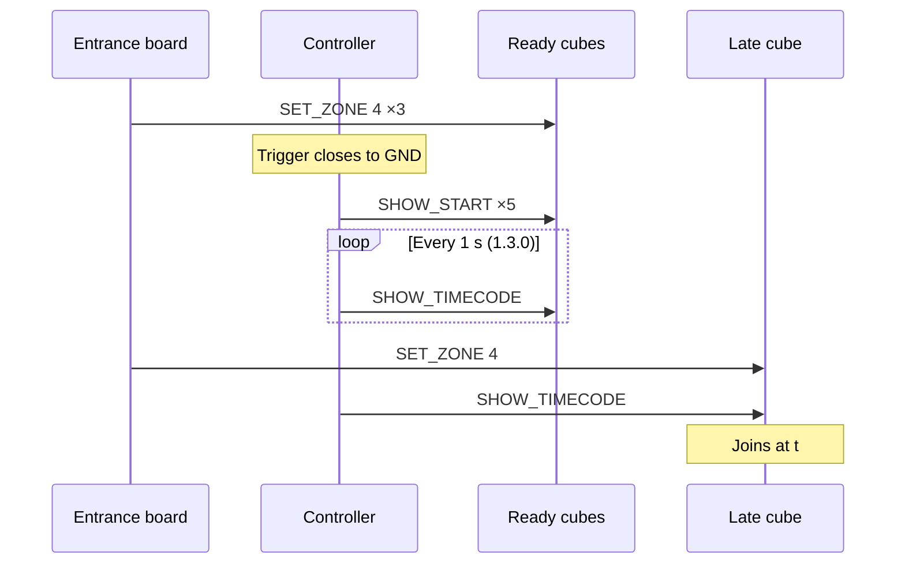

# Main show & media interface — detail

*This document was written by Kimchi and Chips*

## Summary

A visitor taps the cube on a main show entrance zone board, which sends `SET_ZONE 4` and makes the cube **mainshow-ready** (neon, yellow-green). At show time the media server's signal closes the Mainshow controller's trigger input to GND through an installed interface; the controller broadcasts `MSG_SHOW_START` (8) five times with a fresh showId, and every ready cube plays the main show (≈4:58) from its own memory. From mainshow-1.3.0 the controller also sends a once-a-second **show clock** (`SHOW_TIMECODE`) so a late ready cube on v1.5.0+ can join; the installed controller #134 runs mainshow-1.2.0 and does not. The show animation is data, edited in the console's **Show editor**, published as web-allocated versions and sent to cubes over the air. Handbook steps: {{page:H3}} (Show editor), {{page:H4}} (one-cube test and trigger) and {{page:H5}}.

## Facts

### Sequence

Diagram key: the media server's 5 V show cue goes through the installed signal interface, which closes the controller's GPIO3 (D1) to GND. `SHOW_START` is `MSG_SHOW_START` (8) with a fresh showId, sent 5 times 30 ms apart. Ready cubes play ≈4:58, then leave ready mode. The 1 s `SHOW_TIMECODE` loop (showId, t) exists only from mainshow-1.3.0; a late cube joins at t only on cube v1.5.0+.

### Cube side (`flashing_station/firmware/neocore_usb/neocore_usb.ino`)

| Item | Value |
|---|---|
| Ready | `MSG_SET_ZONE` (6) with `ZONE_MAINSHOW` (4): neon, RGB (18, 20, 1) (`MAINSHOW_R/G/B`, compiled into the firmware). The ready colour is not part of the show image: publishing a show never changes it |
| Start | `MSG_SHOW_START` (8), showId in `Packet.cubeID`. Ignored unless `currentZone == ZONE_MAINSHOW` (serial `SHOW_START IGNORED / ZONE=n`; console card **‹cube› ignored a show start**). A repeated showId is ignored (`SHOW_START DUPLICATE - IGNORED`) |
| Old number | The M5 Core2 starter (`live files/ShowStarter_M5Stack_Core2`) broadcast 7; cube v1.4.x moved start to 8 and 7 became `MSG_TAG_STATE`, so cubes ignored the old starter |
| End | At the end of the show the cube turns off and leaves mainshow-ready; the next show needs a new entrance tap |
| Stop | Any `SET_ZONE` stops a running show (`showRunning = false`); **Stop → idle** sends `SET_ZONE 0` (idle, RGB 3,3,3) |
| Show clock | `onShowTimecode`: a running cube with the same showId snaps its clock when drift > `DRIFT_LIMIT_MS` (100 ms, serial `TIMECODE RESYNC / DRIFT MS = n`); a ready cube not playing starts at t (`MAIN SHOW JOIN BY TIMECODE / ID = … / T = …`); a cube not ready ignores it. Timecodes with showId 0 or t ≥ show length are ignored |
| Versions | Show as data from v1.5.0; fanning from v1.6.0; `SHOW_LIVE` (live preview) from v1.7.0. Cubes before v1.5.0 accept only 24-byte frames and drop every show frame, but still start on `MSG_SHOW_START` |
| Sync model | The start only lines up the start of each cube's own animation. Cubes do not follow the media server's timecode (the show clock comes from the Mainshow controller, not the media server) |
| Feedback | Cubes send nothing back about playing. Only their LEDs show it |

Fleet (23 Sep 2026): six cubes (#17, #33, #39, #52, #58, #95) on **v1.7.0-USB.1** holding show **v6**; the rest on **v1.4.1-USB.2** (compiled-in timeline, no show updates, no late join). See {{page:X03}}.

### Mainshow controller

| Item | Value |
|---|---|
| Installed board | Ex-cube **#134**, XIAO ESP32-C3, `1C:DB:D4:F0:CF:4C`, role `excluded`, recorded in metadata `mainshow_controllers`. Runs **mainshow-1.2.0** |
| Repository firmware | **mainshow-1.3.0**, `zones/firmware/MainshowController/MainshowController.ino`, banner `NCT MAINSHOW CONTROLLER` (the zone flasher refuses it; do not change it) |
| 1.3.0 adds | `SHOW_TIMECODE` once a second (`TIMECODE_INTERVAL_MS` 1000) to the start's target (broadcast for BOOT, trigger input and broadcast starts; the one cube for a unicast start), first one straight after the burst; `show_config` (length, version, crc; stored in NVS; default 298 000 ms); `show_stop` (ends the timecode only); hello fields `timecode:true`, `timecode_ms`, `show_elapsed_ms`, `show_version`, `show_crc` |
| Start burst | Fresh random showId; 5 sends (`SHOW_REPEATS`), 30 ms apart (`SHOW_REPEAT_GAP_MS`), as the Core2 did; 100 ms wait for each MAC-layer result |
| Radio | ESP-NOW channel 2. Not a zone board: no PN532, no `zcfg`/`zdb` |
| Computer | Not needed. No heartbeat requirement: triggers with nothing attached |
| Build | `esp32:esp32:esp32c3:CDCOnBoot=cdc` via `scripts/build_all_firmware.py` → `zones/build/MainshowController`. Host test `zones/tests/test_MainshowController.cpp` |

Bench check of 1.3.0 (23 Sep): flashed temporarily on spare #138 (`AC:27:6E:82:68:54`) against cube #17 on v1.6.0, reading the cube's serial log. Normal start: cube started and ignored the repeats; no resync over the next 4 s. Fallback: a start while the cube was idle was ignored; made ready 2.4 s later the cube joined from the timecode at T = 3132 ms. #138 was restored (now general-radio-1.2.0) and is not the controller. LEDs were not watched.

### Trigger timing

| Constant | Value | Behaviour |
|---|---|---|
| `DEBOUNCE_MS` | 50 ms | Fires on closing (press), never on opening |
| `TRIGGER_REARM_MS` | 1000 ms | Input must be open ≥1 s before a closure counts as a new trigger, also after power-up (an input held at power-on does not fire). A held input fires once. Dropouts < 50 ms are invisible; 50 ms–1 s are reported `ignored` with `open_ms` |
| `LOCKOUT_MS` | 3000 ms | Shared by all sources (BOOT, trigger input, USB); a trigger inside it is refused and reported `locked` with `retry_ms` (the Core2's `SHOW_LOCK_MS`) |

The show wiring may hold the trigger input closed for the whole show (about 10 minutes).

### Electrical and trigger contract

| Item | Contract |
|---|---|
| Trigger input | XIAO pin **D1 = GPIO3**, internal pull-up; **pull to GND** to trigger (contact closure or open-collector) |
| 5 V from the media system | **Never** wire 5 V straight to GPIO3. An adapter is fitted on site |
| BOOT button | GPIO9; starts the show on all ready cubes (broadcast) with no computer attached. A strapping pin |
| Status LEDs | The ex-cube's eight WS2812 on XIAO D10 = GPIO10 |
| Pin choice | GPIO1 (used by the desert board) is not broken out on the XIAO; D1 is not a strapping pin; D10 avoided for the trigger because an ex-cube may still have its LED data line on it |
| GND | Ground. D1 is the XIAO silkscreen label; GPIO numbers are the chip's |

> [!DANGER] The field report says the media system gives a 5 V signal. That is **not** permission to connect 5 V to GPIO3 (a 3.3 V input). The installed adapter circuit, its polarity and the connector pinout are not in the repository; Engineering Six and the media team must record them before anyone replaces the controller.

> [!WARNING] Do not hold BOOT while powering the controller up: that starts the ROM bootloader instead of the show firmware.

### Indicators

| Indicator | Means | Does not mean |
|---|---|---|
| Controller LEDs faint red (12/255), scrolling one pixel per 180 ms | Waiting for a start | — |
| Controller LEDs strong green (100, the cube's cap), one pixel per 60 ms | A start (any source, including a unicast from the console) within the show length: 298 s unless `show_config` set another; `show_stop` ends it early | That any cube is playing (cubes send nothing back). With the trigger held longer than the show, the LEDs turn red again at 4:58 while the input is still held |
| `led_test` on | Red, green, blue, white (1 s each), then each pixel alone in white, repeating | — |
| Console **Show clock** | Where a cube should be in its timeline (expected time) | Feedback from any cube |
| **Delivered** after ① / ② on one cube | The cube's radio acknowledged the frame | That it changed colour or started. A broadcast is never acknowledged |
| Console **locked** with a time | A trigger inside the 3 s lockout was refused | A fault |
| A start in the controller log (`source` `button` or `pin`) | The controller fired | That the media server sent it |

Only **Acknowledged** and **Verified** count as success; none of these indicators is either.

### USB protocol (115200 baud, one JSON object per line)

| Request | Reply |
|---|---|
| `{"cmd":"hello","id":"…"}` | `hello`: `firmware`, `mac`, `channel`, `radio_ok`, `button_pin`, `trigger_pin`, `lockout_ms`, `rearm_ms`, `last_show_id`, `shows`, `led_pin`, `led_test`, `show_running`, `show_length_ms` (+ 1.3.0 fields above) |
| `{"cmd":"show_config","id":"…","length_ms":N,"version":V,"crc":C}` | `show_config` echo (1.3.0; NVS) |
| `{"cmd":"show_stop","id":"…"}` | `show_stop` with `was_running`, `show_id` (1.3.0; timecode only) |
| `{"cmd":"ping","id":"…"}` | `pong` |
| `{"cmd":"set_zone","id":"…","mac":"AA:BB:…","zone":0-4}` | `zone_sent`, `status`: `delivered` \| `unconfirmed` \| `rejected` \| `no_result` |
| `{"cmd":"show_start","id":"…","target":"broadcast"\|"AA:BB:…"}` | `show_start`: `source`, `show_id`, `target`, `sent`, `repeats`; unicast only `delivered` (out of `repeats`) |
| `{"cmd":"led_test","on":1\|0}` | Bench LED cycle on/off |

Unsolicited: `show_start` with `id:""` and `source` `button` or `pin`; `locked` (`retry_ms`); `ignored` (`open_ms`, `rearm_ms`); `error` (`detail`). Plain `?` prints the text report (`NCT MAINSHOW CONTROLLER`, `FW:`, `MAC:`, `CHANNEL:`, `READY`).

### Console Show section (⌘5)

- Uses the Mainshow controller if one is connected, otherwise a connected Workstation (or General Radio).
- **Cube #** field; check that the inventory row shown is the cube in hand.
- **① Mainshow ready**: `SET_ZONE 4` to that cube (neon; delivered).
- **② Trigger mainshow**: one click; fresh showId ×5 unicast to that cube; only a ready cube starts.
- **② Trigger all ready cubes**: hold to confirm; broadcast, never acknowledged, cannot be undone.
- **Stop → idle**: `SET_ZONE 0` to the selected cube only. Not an emergency stop.
- **Show clock**: expected position; controller status shows "by the BOOT button" / "by the trigger input" / "from this app".
- Controller panel (**Mainshow controller**): pills **controller ready** / **wrong firmware** / **not answering**, channel; firmware, shows started, last show id, lockout/rearm; **LED test on/off**; **Rewrite controller firmware** (first-time full backup).
- Card **Mainshow controller problem** (not the controller / no reply / wrong channel) with **Write the Mainshow controller firmware**.

### Workstation as show host

- Verbs `set_zone` (one cube, or spelled-out `"broadcast"`; zone 0–4; first frame then repeats at +120 and +400 ms, `zone_sent{…repeats:3}`, `zone_repeat`) and `show_start` (fresh showId ×5 at 30 ms; `locked` inside a 3 s lockout).
- A Workstation, or general-radio-1.1.0+, that starts a show also sends `SHOW_TIMECODE` once a second, bounded by `show_config` (RAM only; the console sends it on connect). `show_stop` ends the timecode only.
- Workstation panel › **Cubes & show**: **Set … →** zone of one cube (three sends), of all cubes (hold to confirm); start the show on one cube or on all ready cubes (hold to confirm).
- LEDs: strong green while a show it triggered should be running (298 s).
- Not the Mainshow controller: no trigger input; its BOOT button does nothing; acts only on console commands. The console allows converting a recorded Mainshow controller into a Workstation (`console/jobs/dongle.py::flash_job` clears the controller check for the `workstation` target; the automatic USB upgrade does the same for an unprotected legacy station). Only the old Zone Database Manager's dongle flasher (`zones/dbmanager`) refuses it.
- The Workstation firmware (workstation-1.0.0) is built but on no board yet; the bench relay #138 runs general-radio-1.2.0 ({{page:X02}}).

### Show editor (⌘6, `#/showedit`)

| Area | Detail |
|---|---|
| Header | Chips "saved on this computer" / "unsaved edits" and "same as published vN" / "differs from published vN" / "not published yet"; cue count, length, image bytes and CRC ("(the compiled-in default)" when it matches). Buttons **↺ Revert to vN** (or **Revert to default** when nothing is published), **Publish**, **Pull**. Edits autosave on this computer |
| Transport | Icon buttons: stop and return to 0:00, previous cue start, play/pause, next cue start; a large timecode readout with the show length and the current cue; speed 0.25× / 0.5× / 1× / 2×; **Loop** (off: stop at the end / the selected cue / the whole show); a go-to field (m:ss.mmm, Enter) |
| Timeline | Overview strip on top: drag its window's edges to zoom, drag the window to scroll, double-click it to fit the whole show; Ctrl/⌘ + wheel over the timeline zooms around the pointer (no zoom slider). Ruler and a colour band of 16 rows (the previewed cubes first, one row per cube): click or drag either to scrub. Cue lane: click a block to select it, drag it to move it, drag its left edge to move only its start (10 ms steps); double-click (or the add button) adds a cue at the playhead, copying the cue it splits |
| Keys (not while typing) | Space play/pause; ←/→ ±0.1 s (⇧ ±1 s); Home = 0:00; End = last ms; Delete/Backspace removes the selected cue; ⌘Z / Ctrl+Z undo; ⇧⌘Z / Ctrl+Y redo. Previous cue start pressed again within 0.25 s goes to the one before |
| Cue types | `off`, `solid`, `fade` (from → to over fade time, holds second), `blink` (period, on time), `pulse` (up time, down time), `cycle` (crossfades colours in a loop, step time), `random` (random walk of brightness, level min/max, step durations, start level; each cube differs) |
| Fanning (cube v1.6.0+) | Only `fade`, `blink`, `pulse`, `cycle`. Modes: sequential (offset = ((cube − 1) mod groups) × step ms) or scatter (fixed random offset in 0–spread ms from `(cube × 2654435761) >> 16`). Cue offset by the registered cube number |
| Limits | 1–128 cues; first cue starts at 0:00.000; strictly increasing starts; length 1 ms–1 h. `showfile.validate` is the authority ("The cubes would refuse this show") |
| Preview | Renders exactly what a cube plays (C++/Python/JS engines cross-checked by vectors). **Preview cubes**: cube numbers/ranges (quick sets One / 1-8 / 1-24). **＋ Plugged-in**: while on, every cube plugged in over USB joins the selection and stays after unplugging (needs a number in the inventory); unit test and simulation only |
| Live send | **Send to real cubes ‹numbers›**: broadcasts `SHOW_LIVE` (0x55) every 60 ms with a 600 ms lease (firmware max 2000 ms, ≤48 entries) through a Workstation or general-radio-1.2.0+. v1.7.0 cubes show the colour for the lease, then restore; a cube playing the real show ignores it; unicast live frames are refused. Live mode never changes the cube's stored zone; `SET_ZONE`, `REGISTER`, `SHOW_START` or a timecode join ends it at once (serial `LIVE END / NEW COMMAND`). **Stop sending**: each cube falls back when its last colour lapses (0.6 s) |
| Reference video | Drag a file onto the top-right player; plays in step with the timeline (play, pause, scrub, rate, loop) from this computer; never uploaded |
| Revert | **Revert to vN** (undoable) replaces the working copy with the published show (or **Revert to default** when nothing is published); **Revert to published** (hold) discards this computer's edits |
| Import/export | **Import JSON…**, **Export JSON** (`shows/mainshow.json` format); **Pull** fetches the published show |
| Publish | **Publish**: the web inventory allocates the next version (only increases; the console passes the highest version any cube has reported, from `show_cubes`, so the web numbers above it). Cubes are not touched. Never allocate locally |
| Cubes card | Buttons in order: **Query cubes** (broadcast `SHOW_QUERY`; v1.5.0+ cubes in range answer within 2 s: firmware, show version, state, seen); **Update all to vN** (broadcasts until every cube heard recently confirms); **Auto update on** / **Auto update off** (default on, Settings › Automatic updates: walk-around, cubes in range on an older show are updated); **Update selected (n)** (other older cubes in range take it too); **Stop sending** (only while sending); **Send length to controller** (`show_config`, mainshow-1.3.0+). Needs a Workstation or general-radio-1.1.0+; publishing works without one |
| Update rules | A cube accepts only a higher version (FORCE is unicast-only); never commits during a running show (commits at show end, "waits for show end"); 200-byte chunks; staging times out after 60 s. Frames 0x50–0x54 (announce/chunk/query/status/timecode), `NctShowProtocol.h` |
| USB route | The Flash page can write the published show into NVS namespace `show` over USB ({{page:X03}}) |

Show state (23 Sep 2026): **v6** published from the console at 04:52 KST; by 04:59 all six v1.7.0-USB.1 cubes reported v6, received over the air (**Bench-verified**, as recorded by the console in `show_cubes`; LEDs not recorded). Show versions, checked against the device database (`metadata.show_source`, `show_crc`) and `showfile.pack`: **v5** (the first real web publish) = the default show with one change, the first cue "Neon hold (entrance)" (solid, the first 31 s after the start) from (18,20,1) to (20,20,1), CRC 1213966328. **v6** is byte-identical to the compiled-in default again (516 B, CRC 3716106196), so v6 reverted that change. The `SET_ZONE 4` ready colour (18,20,1) is firmware and was never changed by either publish; "entrance neon" in the bench notes means that first cue. The default show (`shows/mainshow.json`): 298 000 ms, 21 cues; the second cue, "Off: main video starts", is at 31 s. The next publish is numbered by the web.

### Entrance zone board

Registry: **Mainshow 1**, `48:F6:EE:15:8C:74`, zone kind 4, `tagplate-2.4.0`, zone DB v32, last heard 23 Sep 00:23 KST (behind the published v38 at that time). Sends `SET_ZONE 4` with the tag plate colour repeats ({{page:X05}}).

## Procedures

### One-cube maintenance test
1. Plug in the Mainshow controller (or a Workstation). Open **Show** (⌘5).
2. Enter **Cube #**; confirm the inventory row is the cube in hand.
3. **① Mainshow ready** → cube neon, result **Delivered**.
4. **② Trigger mainshow** → cube starts the animation.
5. Watch **Show clock**; **Stop → idle** to end it on that cube.
6. **② Trigger all ready cubes** only for a whole-show test agreed with the media team.

### Change the show
1. **Show editor** (⌘6); check the chips (working copy vs published).
2. Edit cues; preview with Space and **Preview cubes**; optionally **Send to real cubes** (v1.7.0).
3. **Publish**.
4. **Cubes** › **Query cubes**, then **Update all to vN** (or leave **Auto update** on); cubes on a show commit at its end.
5. **Send length to controller** if the length changed and the controller is mainshow-1.3.0+.

### Replace or update the controller
1. Spare board: plug it in; **Unidentified USB board** › **Make this board a…** › hold **Mainshow controller**.
2. Existing controller: **Rewrite controller firmware** on its panel, or **Write the Mainshow controller firmware** on the **Mainshow controller problem** card. (Old app: `zones/mainshow/app.py` › **Flash controller firmware…**.)
3. The pipeline (`zones/dbmanager/dongle.py`) refuses cubes, zone boards and the pairing station, takes a first-time full backup, preserves NVS, ends with a watchdog reset and records the board in `mainshow_controllers`.
4. Never flash zone or cube firmware onto it.
5. Before wiring a replacement to the media trigger, obtain the recorded adapter circuit, polarity and pinout (see DANGER above). Check `hello`: `channel` 2, `trigger_pin` 3, `button_pin` 9.
6. Updating #134 to mainshow-1.3.0 is optional (adds the show clock).

## Known issues / open questions

- #134 runs mainshow-1.2.0: no show clock, so a cube that misses the start does not join late, even on v1.7.0. **Code-checked** (inventory, TEST_REPORT).
- Only six cubes can receive shows or join late; the rest play the compiled-in original. **Bench-verified** (console records).
- The signal interface (adapter) circuit, polarity and connector pinout are not recorded. **To confirm** (Engineering Six, media team).
- Repair history: the M5 show starter sent command 7, which cubes ignored; the dedicated controller (ex-cube #134) sends 8 and keeps the cubes' existing animation. After installation and adaptation of the media team's 5 V signal the show started correctly on site; one of ten tested cubes failed and reflashing/re-registering it was suggested (its identity was not recorded). The sample is not a failure rate or final acceptance. **Field-reported (Elliot, 22 Sep).**
- Show v5 over the radio (23 Sept, before the USB runs): sent through general-radio-1.2.0 (#138) to #17; #17's NVS read back matched the published image byte for byte. #17 was then restored to v4 and v5 written over USB; the cube reported v5 from NVS. **Bench-verified** from serial and NVS read-back; LEDs not verified.
- general-radio-1.2.0 ignored a `{"cmd":"hello"}` sent without an `id` straight after the no-reset open. Send `hello` with an `id`. **Bench-verified** (#138, one observation).
- Nobody has watched v6 play across the room. **To confirm** ({{page:X13}}).
- Entrance board Mainshow 1 held zone DB v32 when last heard. **To confirm** it is current.
- ① / ② / show clock in the console **Simulation-verified** with a fake controller (shots 11-1…11-4); Show editor UI **Simulation-verified** (shots 11-5, 11-6; headless Chrome + simulator; a real Finder drag into the pywebview window and audio not tested). Show clock and wireless show updates **Bench-verified** on #17 with #138 on mainshow-1.3.0 (serial logs only). The real show path through the console was not run for this document.

## Sources

- `zones/firmware/MainshowController/MainshowController.ino`, `README.md` (mainshow-1.3.0)
- `zones/firmware/libraries/NctShow/src/NctShowProtocol.h`, `NctShowEngine.h`
- `flashing_station/firmware/neocore_usb/neocore_usb.ino`
- `zones/firmware/Workstation/README.md`
- `console/web/panels/ShowSection.js`, `ShowEditor.js`, `others.js`, `console/web/lib/showengine.js`, `console/web/lib/showtimeline.js`, `console/web/app.js` (⌘1–7 handler), `console/web/components/TopBar.js` (page order)
- `console/showedit.py`, `console/advisor.py` (`mainshow.*`, `cube.show_start_ignored`), `console/uitext.py`
- `pairing_station/show_registry.py`, `pairing_station/show_publish.py`, `pairing_station/showfile.py`
- `zones/mainshow/app.py`, `zones/dbmanager/dongle.py`
- `pairing_station/data/devices.sqlite3` (`metadata.mainshow_controllers`, `device_roles`, `zones`, `show_cubes`)
- `console/TEST_REPORT_2026-09-23.md` (show system bench checks)
- Elliot's report; existing "Repair by Kimchi and Chips" page; old draft `10-mainshow-media-interface.md`

*This document was written by Kimchi and Chips*
