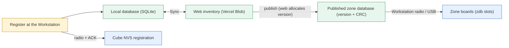

# Inventory, database & sync

*This document was written by Kimchi and Chips*

## Summary

The inventory (MAC → cube number, tag, role) lives in two copies that exchange records: the local SQLite database on each computer and the web inventory. (The Git inventory, `inventory/devices/*.json`, was retired on 23 Sept, commits `5bc1b07` and `63d82dc`.) Two more copies sit on hardware (the cube's NVS registration and each zone board's zone database) and change only by deliberate actions. Sync is a conflict-free three-way merge that never asks a question; publishing a zone database takes a web-allocated version, and a separate distribution step (over the air or USB) puts it on the zone boards. Operator steps: {{page:H3}} (register) and {{page:H4}} (zone databases).

## Facts

### The copies

| Copy | Where | Written by | Seen in the console |
|---|---|---|---|
| Local database | `pairing_station/data/devices.sqlite3` on each Mac (SQLite) | The console and the older apps; the authority on that Mac | **Inventory › Cubes**, **Inventory › Events** |
| Web inventory | One private Vercel Blob JSON document behind `web/` (https://nct-inventory.auroravision.xyz), conditional writes | **Sync** in the console top bar; `inventory_web/` app; `scripts/web_sync.py` | Sync chip, **Inventory › Web sync** |
| Cube saved registration | The cube's NVS | An acknowledged registration or **Send saved mapping** over the radio; preserved by the cube flasher | Cube panel (what the cube reports over USB) |
| Zone database on each board | Each zone board's `zdb` slots | Publish, then the Workstation over the air or USB | **Inventory › Zone database** (what each board last reported) |

- NVS: the ESP32 flash settings area that survives a firmware update. MAC: the fixed radio address; identifies the physical device.
- Web sync keeps its baseline in SQLite metadata `web_inventory_baseline_v1`.
- Retired Git inventory (23 Sept, `5bc1b07` "get rid of git inventory", `63d82dc`): `inventory/devices/*.json`, `scripts/sync_inventory.py`, `inventory_sync.sync()` and its baseline key `git_inventory_baseline_v1` were removed; `/inventory/` is now in `.gitignore` (an old checkout may leave the folder behind; it is no longer read) and the `-merge` rule for it left `.gitattributes`. The web inventory is the only shared copy; `inventory_sync.py` keeps the record validation, merge and guarded apply that web sync uses. An old `git_inventory_baseline_v1` value in a database is simply unused.
- Only one app per computer syncs at a time: lock file `devices.sync.lock` beside the database (`pairing_station/web_sync.py::sync_lock`).
- Neither sync carries: local audit events (`nfc_seen` etc.), flash history, zone state, extra metadata, tokens, binary backups, number reservations. A new Mac may show a known mapping as "not yet scanned here". Back up the SQLite file separately ({{page:X10}}).
- The four reserved numbers (2, 22, 39, 43) are seeded by code whenever the database opens.

### What each action moves

| Action | Moves | Does not |
|---|---|---|
| **Sync** (top bar, or automatic sync) | Device records both ways with the web; publishes a new zone database if committed mappings changed; pulls a newer publication; uploads sightings | Send anything to a cube or zone board |
| Publish (part of Sync) | A new zone database version, allocated by the web | Put it on any zone board |
| Zone update (over the air / USB) | The published database onto zone boards | Change firmware or board identity |
| Registration / **Send saved mapping** | Number and tag to one cube over the radio | Publish or update zone boards |

Console indicators for each separate step: Sync chip (`↑n ↓n`); Attention card "Local cube mappings differ from the published zone database"; each zone's state in **Zone relay**.

### Field guide

| Field | Meaning | Rules |
|---|---|---|
| `mac` | Radio address; the record key | Never changes when number or tag changes. It is the device id in the console rail and links |
| `cube_id` | Cube number on the label | May be NULL (pill **Needs number**). Not the MAC, not the original historical number |
| `uid` | Committed tag | Set when the cube acknowledges a registration, or received through sync |
| `pending_uid` | Proposed tag, not acknowledged | Pills **Registering** / **Unconfirmed**. Not success. Safe to retry |
| `status`, `detail`, `updated_at`, `source` | State, explanation, change time, origin | `updated_at` decides sync conflicts: keep computer clocks correct |
| `role` | `auto`, `led` or `excluded` | `excluded` blocks cube work and cube firmware (readers, controllers, Workstations). Changed on the device card |
| original 32 | Historical number and tag of the first 32 cubes (`original_32.json`) | Shown separately. Never overwrites a current mapping or reserves a cleared number |
| reserved numbers | 2, 22, 39, 43 | Never allocated automatically; manual entry allowed. Default suggestion: lowest free number above 32 |
| events · sightings · flash runs · zones | Audit history · last-seen evidence · firmware receipts · zone registry | **Inventory › Events**; web page (uploaded by Sync); **Inventory › Flash runs**; **Inventory › Zone database**. Sightings never change identity and never enter the merge |

Registration status pills: **Registered · ACK**, **Unconfirmed**, **Registering**, **Saved · not sent**, **Needs NFC tag**, **Needs number**, **Unregistered**. They are evidence summaries, not a physical test.

### What goes into a published zone database

| Rule | Source |
|---|---|
| A record needs a committed `uid` and a `cube_id` (rows without either are skipped) | `zones/tools/zonedb.py::records_from_rows` |
| `uid` 1–7 bytes; `cube_id` 1…0xFFFFFFFF; MAC 6 bytes, unicast, non-zero. An invalid value **raises** (the publish fails); it is not skipped | same |
| A duplicate UID raises; records are sorted by UID length then bytes (firmware order) | same |
| Capacity: 1819 records per slot (slot 0x8000 bytes, 24-byte header+CRC, 18-byte records) | `zonedb.SLOT_CAPACITY` |
| Role `excluded` is left out | `pairing_station/zone_publish.py::records_from_inventory` |
| Pending-only cube left out; an existing committed tag stays in while a new one is pending | same (only `uid` is read) |
| Version orders publications (web-allocated, only rises); CRC checks content | `zone_publish.py`, `zone_registry.classify` |

CRC: check number computed from the content. Same record count does not mean same content; only version + CRC identifies a publication.

Worked example (cube MAC A, number 44, committed tag U; new scan of tag V):

| Moment | Inventory | Published zone database |
|---|---|---|
| Before the scan | 44, `uid` U | 44 ↔ U |
| V scanned, not acknowledged | 44, `uid` U, `pending_uid` V | still 44 ↔ U |
| Cube acknowledges V, then Sync | 44, `uid` V | next version: 44 ↔ V |
| Zone boards updated | — | boards recognise V |

**Inventory › Zone database** lists exactly the records of the published version.

### Sync decision rules

Three-way merge: this computer, the web, the baseline. Pure (`inventory_sync.merge_records`), always resolves, never asks, same answer on every computer.

| Situation | Result |
|---|---|
| Only one side changed a device | That change is kept (a number/tag/role change on one side beats a bookkeeping-only change on the other) |
| Both sides changed number or tags differently | Newest `updated_at` wins number, tags and their status as a unit; ties break on content identically everywhere |
| Both changed bookkeeping only (same number and tags) | Newer status kept |
| Roles differ | Cautious role wins: `excluded` > `led` > `auto` (merged separately) |
| Record missing on one side, or role-only | Nothing deleted; record restored (a deleted JSON file is restored from SQLite) |
| Two devices claim one tag | Non-excluded device first, then newest `updated_at`, then the one holding it as committed `uid`, then content. Loser loses the tag; its cube firmware is **not** cleared |
| Two devices claim one number | Non-excluded first, then committed tag, then pending tag, then newest. Loser drops to **Needs number** |
| Saved mapping retransmitted (`pending_uid` = `uid`) | Not a change; never takes a tag |
| Record not understood (invalid) | Left alone on both sides, with a note |
| First sync of a fresh database | Shared records replace untouched original seeds |
| Local database changed after planning | Write refused (`LocalChanged`); merge planned again. `inventory_sync.apply` writes only planned MACs |

- A loser keeps its own `updated_at` (`inventory_sync.reconcile`), so a repair never outranks a later human edit. Detail texts: "Sync: tag … now belongs to … (newer registration); this device's firmware was not cleared" / "Sync: number … is also used by …, which keeps it; assign this device's physical label number".
- The web server refuses a push that would create a duplicate number or tag (`web/src/lib/records.ts` mirrors `inventory_sync.validate`); the Mac merges again by itself.
- Audit: each decision is a `sync_resolved` event; each record written by sync is `sync_applied`.
- Attention card when a local device gave way: "A newer change elsewhere took this device's number or tag", actions **Assign a number** / **Register a tag at the station**.
- **Inventory › Web sync › Check** shows the plan before writing: per record, upload, download, and rows both sides changed (**Decided**).
- Downloads wait while another app holds the database; card "… downloaded change(s) are waiting to be applied", action **Apply now**.

### Web access and offline

- URL: https://nct-inventory.auroravision.xyz (grid/table, search, computers, zone boards, sightings).
- One shared team password. Server reads it from the Vercel env var `INVENTORY_PASSWORD`.
- Console asks once (top-bar Sync › sign in, or card "Web sync needs the inventory password"); stored in `pairing_station/data/web_password` (gitignored, 0600 on macOS; folder ACL on Windows). A rejected password is cleared. **Forget password**: **Inventory › Web sync**.

> [!DANGER] Never put the web password in a document, Git, source or a screenshot.

| Web unreachable | Behaviour |
|---|---|
| Sync chip | **Offline**; nothing blocked |
| Zone boards | Keep using the database they hold |
| Distributing a publication | Works offline with a publication pulled earlier |
| New publication | Needs the web (the web allocates the version) |

"Last seen" on the web page is evidence of a past event, not continuous monitoring, battery information or proof of NFC scanning.

### Zone database distribution

Why a zone board says "unknown tag": each board holds its own zone database copy. Registration changes only the inventory. A new cube reaches a board only after (1) a publish and (2) distribution to that board. Until then the board gives no zone colour; cube, tag and reader are fine. A board accepts only a version higher than the one it holds.

| Item | Value | Source |
|---|---|---|
| "In range" | status frame within 20 s, source radio | `ZoneRegistry.IN_RANGE` |
| Query interval | 30 s; 3 s with **auto-refresh (3 s)** or walk-around | `QUERY_INTERVAL`, `AUTO_QUERY_INTERVAL` |
| Manual **Update all** gives up after | 180 s | `PUBLISH_TIMEOUT` |
| Walk-around per attempt / retry after failure | 45 s / 30 s | `WALK_TIMEOUT`, `WALK_BACKOFF` |
| Board drops a half transfer after | 60 s without chunks | `NctZoneLink.h` `STAGING_TIMEOUT_MS = 60000` |
| RX gain confirm window | 10 s | `SET_TIMEOUT` |
| Transfer | unicast announce, broadcast chunks (≤ 12 records per chunk), ESP-NOW channel 2 | `zone_registry.py`, `zonedb.MAX_PER_CHUNK` |
| Resume | re-sending the same version continues a half-finished transfer | ch. 06 draft |

Zone states (`zone_registry.classify`):

| State | Condition | Action |
|---|---|---|
| **Current** | `db_version` and `db_crc` equal the publication | none |
| **Updating** | staging the published version (`staging_total` set) | stay in range |
| **Out of date** (`behind`) | `db_version` lower than published | **Update all**, walk-around, or USB |
| **Newer / differs** (`ahead`) | higher version, or same version with other content (legacy per-computer counter) | **Sync** on the red card; never force an older version. Only a new publication fixes it: the next publish is numbered above it |
| **Nothing published** (`unpublished`) | no publication | **Sync & publish** |

Zone relay UI (Workstation panel, rail group **Stations** › **Zone relay**): **Query zones**, **auto-refresh (3 s)**, **Show out of range**, **Update all out-of-date zones (n)** (one-click hardware button, tooltip), **auto-update all (walk the space)** (= Settings switch "Zone databases over the air"; the suffix "· another relay is walking" is still in the code, but since every relay-capable link walks it only shows on a link that does not relay), **Stop**. Columns: name, type, point, firmware, database version, state, signal. Per-board page (card "Over the air"): **Update database over the air**, **Set RX gain**, **Identify (10 s)**, **Request tap log**, **Reboot** (misses tags for a few seconds). Log success line: "Database v… confirmed on n zone(s)".

Attention cards: "Local cube mappings differ from the published zone database" → **Sync & publish**; "The inventory synced but the zone database was not published" → **Sync again**; "The web has a newer zone database v…" → **Sync (pulls the database)**; "Zone … holds v…, above this computer's v…" (red); "Zone … did not confirm database v…" (retry closer, or USB: {{page:X09}}).

RX gain vs signal:

| Column | Measures | Values |
|---|---|---|
| **RX gain** | PN532 reader sensitivity for a tag on the plate | 18, 23, 33, 38, 43, 48 dB (`zonedb.RX_GAINS`); firmware default 48 |
| **Signal** | How well the Workstation hears the board's radio (RSSI) | ▂▄▆ at ≥ −67 dBm; ▂▄· at ≥ −80 dBm; ▂·· below (`console/web/lib/format.js::signalBars`) |

- **Set RX gain** over the air: board keeps identity and calibration, saves, applies without restart. Console waits ("Waiting for … to confirm RX gain … dB"); no answer in 10 s = unconfirmed. "—" = old firmware or no report yet. Same setting on the zone's **Firmware & database** tab over USB.
- All preshow readers were reported set to 48 dB. Higher gain helps a weak tag but can add noise; position still matters. Neither number proves the visitor effect.
- API note: `zones.set_rx_gain` takes argument `db` (not `rx_gain`); snapshot rows carry `rssi` but `bars`/`signal` are null (the glyph is computed in the page).

Which radio walks (from commit `6b26cdf`): every relay-capable Workstation link. `hub.apply_auto_modes()` (every 1 s) switches walk-around on for each `WorkstationSession` with `relay_capable` while `auto_zone_db_radio` is on, and off otherwise. Each registry walks only its own candidates (`ZoneRegistry.walk_candidates`): zones behind the publication, in range, not backing off, and heard by **this** radio in the last 20 s (`IN_RANGE`), because the zone store is shared between radios. `hub.zone_walk_allowed(session)` lets a radio start a walk only while no other radio on this computer is publishing, so two radios never broadcast chunks over each other. A zone only a second Workstation can reach is therefore still updated. The old rule (only the primary link walked, `hub.relay_session()`) is gone; `relay_session()` still picks the link for manual relay commands.

A walk that cannot publish ("Cached zone database is inconsistent; pull it again from the web") does not fail the tick: it logs "Auto update all could not start: ‹error›" once per distinct error, shows the error as the registry message, and backs every candidate off for 30 s (`WALK_BACKOFF`).

Main show relay (`console/showedit.py::choose_relay`): the relay is kept while a publication or request is in flight. Otherwise, with cubes behind and several show relays, the console uses the relay whose radio heard most of the out-of-date cubes in the last 20 s. With nothing to send, the relays take turns querying, 10 s each (`RELAY_TURN`); the new relay queries at once, so every radio learns which cubes it reaches.

Relay firmware capabilities (`zones/dbmanager/dongle.py`): **workstation-1.0.0** (current), **nct-pairing-1.8-zones** (installed pairing station), **general-radio-1.x**: signal + RX gain. nct-pairing 1.7: signal, no RX gain. 1.6: neither. Card "Relay firmware … is older than …" offers **Write the Workstation firmware**, never for the protected station 3C:0F:02:AD:83:24.

### Automatic updates

Settings › Automatic updates. All on by default (the five database switches below, plus `auto_build` and `auto_firmware_usb` for firmware, {{page:X11}}); persisted in metadata `console_settings`. Saved settings from before a key existed load that key as on (defaults in `console/hub.py`, then the saved keys).

| Switch (label) | Key | Behaviour |
|---|---|---|
| Zone databases over the air | `auto_zone_db_radio` | Full label: "Zone databases over the air: every zone relay walks the zone database to the out-of-date zones its radio hears, one radio at a time". Walk-around on every relay-capable link, each for the zones its own radio heard in the last 20 s, one publishing at a time (`hub.zone_walk_allowed`); newly plugged relays pick it up within a second |
| Zone databases over USB | `auto_zone_db_usb` | `Intake.database_step()`: database-only update (`jobs/zone.update_db_job`) for a configured zone board on USB that is behind; once per board and publication; independent of Auto-flash zones |
| Main show over the air | `auto_show` | Show registry walk-around (Show editor › Auto update) through the relay that heard the out-of-date cubes; idle relays take 10 s query turns; never mid-show ({{page:X03}}) |
| Pull a newer zone database and show from the web | `auto_pull` | Needs the password. Pulls a newer zone database when a status check reports one (each version once per run); newer show every 5 min (300 s) while a show relay is connected and `auto_show` is also on. Logs only a new pull ("Pulled show vN") or each distinct error once ("Automatic show pull: …"); "No show published on the web yet" and "already here" are silent |
| Sync the inventory with the web by itself… | `auto_sync` | Full label: "Sync the inventory with the web by itself: local changes upload a few seconds later, web changes download, new cube mappings publish (needs the web password)". See below |

A **Newer / differs** board is never overwritten automatically. The zone walk is **not** held while a main show runs (`hub.zone_walk_allowed` checks only that no other radio is publishing); only the show updater holds. `--simulate` writes to fake zones and never reaches the web (`hub.auto_web` is off, so no automatic sync, status check or pull runs). The docs bench (`console/simdocs.py`, used by `docshots`) switches all five off, so screenshots show them unticked; the real defaults are on.

### Automatic inventory sync (`auto_sync`)

Nobody needs to press **Sync** any more; the button (and the Sync chip) still syncs at once.

| Item | Value |
|---|---|
| Trigger: local change | `hub.watch_local_changes`, every 2 s: a hash of the `devices` and `device_roles` tables. A change schedules a sync 5 s after the last change (`SYNC_DEBOUNCE`) |
| Trigger: web status | The 60 s status check (`jobs/sync.py::needs_sync`) finds inventory to upload or download, or mappings to publish |
| Trigger: waiting downloads | Downloads deferred while the console was busy are synced once the console is idle |
| What runs | The same full sync as the button (`sync_all.sync`): upload, download, then publish the zone database if the mappings changed. Merge rules and wire format unchanged. Job title "Automatic sync of inventory and zone database" |
| Spacing | At least 15 s between automatic syncs (`SYNC_MIN_GAP`); never while a sync runs |
| Offline or error | Back off 60 s, doubling up to 10 min (`SYNC_BACKOFF = (60, 600)`) |
| Sync lock held by another app | Retry after 15 s |
| Interrupted after the upload | Retry once, straight away |
| Password rejected | The stored password is forgotten; automatic sync stops until the operator signs in again |
| Zone publish error | Counts as a failure for the back-off |
| Needs | The web password on this computer. Pulling a newer web zone database is still `auto_pull`'s job |
| Not covered | `--simulate` never syncs by itself; the old Tk apps still sync by hand |

Top-bar Sync chip while `auto_sync` is on (`console/state.py::describe_auto`; clicking it syncs at once): **✓ Synced** · **⟳ Sync in 5 s** (countdown after a local change) · **Sync · retry in 2 min** (after a failure) · **Sync · offline** · **⟳ Sync · sign in**. **Inventory › Web sync** has an **Automatic** row ("on · a local change syncs within seconds; the web is checked every minute" / "off (Settings › Automatic updates)"). The Jobs list hides automatic syncs that succeed and shows failures. Attention cards `sync.publish_pending` (**Cube mappings changed but the zone database was not published**) and `sync.waiting` (**N downloaded change(s) are waiting to be applied**) are hidden while automatic sync is on and has no error; the **Web sync problem** card then says "It retries by itself; Sync now to try at once."

Side effect (also true of a manual **Sync** and of `scripts/web_sync.py sync`): each sync writes metadata `auto_number=0`, so this computer no longer picks new numbers locally. With the web password stored, new numbers come from the web instead (next section).

### Cube numbers from the web (`hub.claim_numbers`, commit 6b26cdf)

| Item | Value |
|---|---|
| When the console claims | `hub.web_numbering()`: a stored web password and not `--simulate` (`hub.auto_web`). No separate setting |
| Which cubes | Every 2 s: rows with no number, status `needs_number`, detail `NEW_UNNUMBERED` (a brand-new cube seen by USB identification, radio discovery or pairing) and role not `excluded`; plus any MAC the Register page's Number step asked for (`hub.request_number`). One `number.claim` job at a time (a quiet job) |
| Endpoint | `POST /api/inventory/claim {dataset, mac, exclude[], min: 33, client}` → `{number, existing}` (`pairing_station/web_client.py::claim_number`, `console/jobs/sync.py::claim_job`) |
| Server rule | `web/src/lib/numbers.ts::claim`: the lowest free number ≥ 33 that no other MAC holds or has claimed and that is not in `exclude`. Idempotent: the same MAC gets the same number back. Claims live in their own blob document (`numbers/<dataset>.json`, compare-and-swap); the inventory document is not written by the claim |
| `exclude` | Every number in the local database plus the reserved numbers 2, 22, 39 and 43 |
| Result | `hub.numbers_claimed` renames the cube (`db.rename(..., fresh_scan=True)`), logs "New number #N for ‹MAC› (handed out by the web)"; automatic sync uploads the record. A number taken locally meanwhile is not applied and is excluded next time |
| Failure (offline, or a web without `/api/inventory/claim` answering 404) | Cubes stay at **Needs number** (never a local guess); retry after 60 s. The Register page shows "The web could not hand out a number (‹error›); retrying. Or assign one by hand." Renaming by hand still works |
| Register page Number step | With web numbering: "Getting a new number from the web…" until the claim lands. Without a web password: `suggested_number()` locally (lowest free above 32), **NEW NUMBER: write #N on the cube's label** |
| Old Tk apps | Never claim |
| Effect | Two computers numbering new cubes at once no longer pick the same number. **Pair new cubes (auto)** pairs a new cube once it has its number |

Detail of the local rules: {{page:X03}} › Number allocation.

### Workstation replacement

- Plug a spare ESP32-C3 in: **Unidentified board** → card **Make this board a…** → hold **Workstation** (`dongle.flash`, `firmware: workstation`). Other targets on that card: Mainshow controller, Neocore cube.
- Job: build if needed, full flash backup the first time per board, write, keep NVS, verify, reconnect; then role `excluded`, any zone row for that MAC removed (event `zone_forgotten`; also when a board first reports Workstation `roles`: log "‹MAC› is now a Workstation; removed its old zone record") and MAC recorded as a Workstation (`hub.record_workstation`). Outcome text: "… written to <MAC>; recorded as excluded from cube service".
- Refusals (`dongle.refusal`): installed pairing station 3C:0F:02:AD:83:24; a known zone board; a cube in the inventory whose role is not `excluded` (set the old cube's role to **excluded** on its card first). Deliberate override: **Override inventory protection…** on the same panel, then hold **Force write** (`dongle.flash_force`; a refused **Workstation** hold opens that dialog by itself). It overwrites the board's old role: a zone leaves the show, a cube loses its LED firmware. Code-checked only ({{page:X02}}).
- A Workstation works without its PN532; fit it (SDA GPIO4 / SCL GPIO3) only to register cubes with it.

## Procedures

### Update all by hand

1. Finish registration/flashing; no job running. Plug in the Workstation (opened without reset; a program holding the port is named). An installed pairing station or bench General Radio also works.
2. Top bar **Sync** (enter the web password once if asked); with automatic sync on, wait for **✓ Synced**. Check **Inventory › Zone database**: version, record count, CRC. Clear the cards listed above.
3. Workstation panel › **Zone relay** › **Query zones** or **auto-refresh (3 s)**. Tick **Show out of range** and compare with the real board list; an unseen board is not proven current.
4. **Update all out-of-date zones (n)**, or one board: its page › **Update database over the air**. Stay near. Done when the row reads **Current** and the log says "Database v… confirmed on n zone(s)".
5. Far boards: carry Mac + Workstation with **auto-update all (walk the space)** ticked.
6. **Stop** ends a manual run. Record boards still behind. Test a changed cube at real readers, including any that failed before.

> [!WARNING] "delivered" lines in the Log mean only that the radio packet arrived. A board is updated only when it reports the new version **and** CRC and its row reads **Current**.

> [!WARNING] If the Workstation's USB drops, the run stops. Re-read the Zone relay table after reconnecting; send the same version again to resume.

### Correct a sync result

1. Make a new, deliberate number or tag assignment in the console.
2. **Sync**.
3. Send it to the cube (**Send saved mapping** / register) and update the zones as needed.

> [!WARNING] Do not delete a JSON file (it is restored), edit the CSV export as an import, or rewrite the live SQLite file.

> [!WARNING] **Unregister** (hold to confirm) releases number and tags in the inventory only; the cube's firmware keeps the old mapping.

## Known issues / open questions

| Issue | Evidence |
|---|---|
| Zone database **v38** was published by a simulated console run (about 03:48 KST, 23 Sept) that uploaded fake records (MACs `A4:CF:12:34:56:…`) to the real web inventory. Check the web inventory, remove the fake records, publish a clean version before distributing. Guard added: a simulated console refuses non-loopback web servers (`console/jobs/sync.py` client, `SimulatedWeb`). Tracked in {{page:X13}} | Code-checked (`console/TEST_REPORT_2026-09-23.md`) |
| 19 known zone boards out of bench range held older databases (v4–v32) on 23 Sept; the 27 in range were all current at v37 | Bench-verified (zone query, General Radio general-radio-1.1.0, AC:27:6E:82:68:54) |
| A laptop running old sync code reverted cube unregistrations (#134, #138) twice; re-applied 23 Sept 01:05 (web revision 16). Every computer must run current code before syncing | Field-reported (Elliot's bench computer) |
| Zone database update over the air never run on installed boards | Simulation-verified only |
| Automatic updates never run against installed zone boards, the dongle or the web pull | Simulation-verified (`console/tests/test_auto_update.py`) |
| Every relay walking, one publishing at a time, per-radio candidates, the inconsistent-cache back-off and the show relay choice (`6b26cdf`) never run with two real Workstations | Simulation-verified (`console/tests/test_auto_update.py`: `test_every_relay_walks_and_one_publishes_at_a_time`, `test_a_zone_is_walked_only_by_a_radio_that_heard_it`, `test_a_walk_that_cannot_publish_does_not_break_the_tick`) |
| Automatic inventory sync (`auto_sync`, committed in 6b26cdf) has never run against the real web inventory | Simulation-verified (`console/tests/test_auto_update.py` AutoSyncTests) |
| New cube numbers come from the web (`/api/inventory/claim`) on any computer with the web password; without it, a synced computer (`auto_number=0`) leaves new cubes at **Needs number** outside the Register page | Code-checked (`console/hub.py::claim_numbers`, `console/regflow.py::step_number`, `pairing_station/web_client.py::claim_number`, `web/src/app/api/inventory/claim/route.ts`); Simulation-verified by the console tests. **To confirm:** that the deployed web inventory serves `/api/inventory/claim` (until it does, new cubes stay at **Needs number**) |
| Workstation firmware not flashed on any board | Code-checked; build only |
| **Contradiction:** the ch. 06 draft said the console refuses the Mainshow controller when writing a Workstation. `console/jobs/dongle.py::flash_job` clears the controllers set for `workstation` ("a Workstation is a superset… converting either is allowed"), so the console **does** allow converting #134. Only `mainshow`-target and the Zone Database Manager path refuse it | Code-checked |
| Merge rules, Web sync check, convergence | Code-checked (`inventory_sync.py`); Simulation-verified (`console/tests/test_sync_check.py`, `pairing_station/tests/test_sync_convergence.py`) |
| Live console read the real published database v37 (133 records, CRC 3738672143, published 2026-09-22 16:42 UTC) | Bench-verified, read only |
| Query zones (27 in range), Identify + Request tap log on Preshow 4 (1C:DB:D4:F0:C3:E0; log returned, blink not watched), Set RX gain 48 dB acknowledged (no change) | Bench-verified, 23 Sept, general-radio-1.1.0 |

## Sources

- `pairing_station/database.py`, `inventory_sync.py` (`merge_records`, `_merge_device`, `_merge_role`, `reconcile`, `apply`, `validate`), `web_sync.py`, `sync_all.py`, `web_client.py`, `zone_publish.py`, `zone_registry.py` (`walk_candidates`, `tick`, `WALK_BACKOFF`); `console/showedit.py` (`choose_relay`, `RELAY_TURN`)
- `zones/tools/zonedb.py`, `zones/dbmanager/dongle.py`, `zones/firmware/libraries/NctZone/src/NctZoneProtocol.h`, `NctZoneLink.h`
- `scripts/web_sync.py`, `web/src/lib/records.ts`; commits `5bc1b07`, `63d82dc` (Git inventory retired)
- `console/hub.py` (`station_session`, `relay_session`, `apply_auto_modes`, `zone_walk_allowed`, `auto_sync`, `watch_local_changes`, `auto_sync_finished`, `auto_error`), `console/jobs/sync.py` (`needs_sync`, `sync_job auto=`), `console/state.py` (`describe_auto`), `console/simdocs.py`, `console/web/components/Attention.js`, `console/web/panels/InventorySection.js`, `console/intake.py`, `console/advisor.py` (`sync.*`, `zone.*`, `dongle.old`, `tag.*`), `console/state.py`, `console/jobs/sync.py` (`check_job`), `console/jobs/dongle.py`, `console/commands.py`, `console/uitext.py`, `console/web/panels/WorkstationPanel.js`, `sections.js`, `others.js`, `console/web/lib/format.js`
- `console/README.md` (Automatic updates), `docs/SETUP.md` §4, `console/TEST_REPORT_2026-09-23.md`
- Old drafts `06-zone-databases.md`, `12-inventory-database-sync.md`

*This document was written by Kimchi and Chips*
