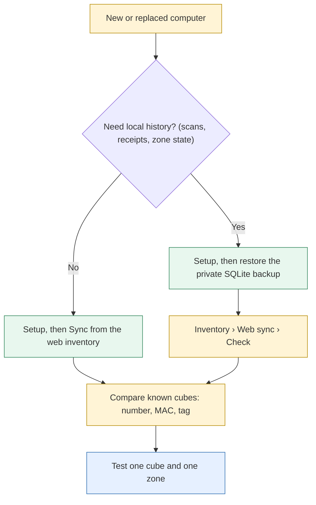

# Computer set-up, backups & recovery

<span color="red">*This document was written by Kimchi and Chips*</span>

## Summary

How to set up a Mac or Windows computer to run the NCT Console, what a full backup contains beyond the shared inventory, and how to restore or move to another machine. Commands match `docs/SETUP.md`, which stays the full reference. Setup installs software only; it never flashes a board.

## Facts

### Source and release

- Repository: https://github.com/elliotwoods/jinhee-sos
- 23 Sept commits: `de08bb0` (NCT Console, show system), `d43eaa4` (handover docs, Korean UI, Flash page), `c955d9f` (Workstation), `5996e10` (PoolCentral 4.2.2, Hojun), `6b26cdf` (handover restructure, automatic firmware updates), then `9261547`/`f498c6a` (Windows handoff: setup builds firmware, Workstation reader view), `c353997` (forced Workstation flash override), `5bc1b07`/`63d82dc` (Git inventory retired), `2739586` (flash the cube when its tag is read) and the docs commits `c42fbf7`, `6471a94`. `main` was at `6471a94` on 24 Sept, pushed to GitHub; `PoolCentral.ino` reads `poolcentral-4.2.2`.
- No release has been tagged.

> [!WARNING] Engineering Six should agree one source revision and its matching verified builds before deployment and record that commit id in the sign-off ({{page:X13}}).

### Environments

| Item | Mac | Windows |
|---|---|---|
| Status | Bench-tested | Code-checked + Simulation-verified (CI `windows-latest`, `.github/workflows/tests.yml`); never used with hardware |
| Python | 3.14 with Tk (setup accepts 3.11+) | 3.14 from python.org, *tcl/tk and IDLE* + *py launcher* |
| Shared interpreter | `pairing_station/.venv/bin/python` | `pairing_station\.venv\Scripts\python.exe` |
| Setup | `./Setup.command` or `python3.14 scripts/setup.py` | `Setup.bat` or `py -3 scripts\setup.py` |
| Console window | pywebview (native) | WebView2 runtime (ships with Edge; pywebview + pythonnet) |
| Browser fallback | When `import webview` fails | When `import webview` fails or `hostos.webview2_available()` finds no WebView2 runtime |
| Ports | `/dev/cu.usbmodem…` | `COM3`-style; always exclusive (close Arduino Serial Monitor) |
| Secrets (`web_password`, `api.curl`) | owner-only 0600 | folder ACL only: keep the checkout in your own user profile |
| Linux | uses POSIX branches; not verified; needs `dialout`; no launchers, no audio | — |

- All host differences: `pairing_station/hostos.py`; Windows branches tested through a fake `msvcrt` in `pairing_station/tests/test_hostos.py`.
- Setup (`scripts/setup.py`) first checks the interpreter: Python **3.11 or newer** ("Python 3.11 or newer is required.") and a working Tk (else it exits with an install hint: Homebrew `python-tk`, Ubuntu `python3-tk`, Windows *Tcl/Tk* in the installer).
- Setup then: creates `pairing_station/.venv`; installs `flashing_station/requirements.txt` (pinned pyserial 3.5, esptool 5.3.1) and `console/requirements.txt` (`pywebview==6.2.1`; `pythonnet==3.1.0` on Windows); validates the bundled cube manifest/binary hashes ("Firmware ready: …"); runs `scripts/web_sync.py sync` only when the web password is already stored on this computer (otherwise it prints a hint and carries on; a failed sync is a warning, never a setup failure). Then, unless `--no-firmware`, it installs Arduino CLI when neither it nor Arduino IDE 2 is found (winget on Windows, Homebrew on macOS), ESP32 core 3.3.11 and the pinned libraries, and runs `scripts/build_all_firmware.py --stale`; a toolchain or build failure is a warning (bundled cube flashing needs none of it). Needs internet. Nothing is uploaded to a board. The whole firmware step has not been run end to end on a fresh machine (Code-checked; CLI lookup unit-tested in `pairing_station/tests/test_hostos.py`).
- The web inventory is the only shared copy of the device records (the Git inventory `inventory/devices/` and `scripts/sync_inventory.py` were retired on 23 Sept, commits `5bc1b07`, `63d82dc`). It needs `pairing_station/data/web_password`, which is not in Git: enter the shared password once per computer when the console asks; the first sync then downloads the inventory.
- Firmware builds: bundled verified cube firmware needs no Arduino software. Building changed firmware (zone boards, Workstation, Mainshow controller) needs Arduino CLI with ESP32 core **3.3.11** and pinned libraries (`docs/SETUP.md` §6). **This computer › Firmware builds** shows build state and **Rebuild**; card **Firmware builds are unavailable** when the tools are missing.

### Browser fallback

`console/app.py` opens the console in the default browser (loopback `httpbridge`) instead of a native window when `--browser` is passed or `native_available()` is False. It shows no error message: it only prints `NCT Console: <url>` to the terminal. `native_available()` is False when `import webview` fails, or on Windows when `hostos.webview2_available()` (`pairing_station/hostos.py`) finds no WebView2 runtime in the registry. The usual cause is starting `console/app.py` with the system Python instead of `pairing_station/.venv` (which has pywebview). The launchers always use the venv: `console/Launch.command` runs `../pairing_station/.venv/bin/python app.py`, `Launch.bat` runs `..\pairing_station\.venv\Scripts\python.exe app.py`.

### Launchers

Each app folder has `Launch.command` (Mac) and `Launch.bat` (Windows). From a terminal: `pairing_station/.venv/bin/python <folder>/app.py`.

| Tool | Folder | Use |
|---|---|---|
| **NCT Console** | `console/` | Every operator task |
| Setup | repository root (`Setup.command` / `Setup.bat`) | Create or refresh the Python environment |
| Pairing app (fallback) | `pairing_station/` | Registration without the console (`app.py --connect`) |
| Cube flasher (fallback) | `flashing_station/` | Cube firmware without the console (`--simulate` available) |
| Inventory Web Sync (fallback) | `inventory_web/` | Web inventory sync |
| Zone flasher (fallback) | `zones/flasher/` | Zone board set-up |
| Zone Database Manager (fallback) | `zones/dbmanager/` | Zone databases over the air |
| Pool calibration (fallback) | `zones/calibration/` | Pool slider calibration |
| Mainshow app (fallback) | `zones/mainshow/` | Mainshow controller |
| Maintenance tests | `zones/preshow_test/`, `poolzone_test/`, `rangetest/` | Preshow cue, pool lights, radio range |

### Console options (`console/app.py`)

| Option | Effect |
|---|---|
| `--simulate` | Fake boards on a temporary copy of the inventory; refuses non-loopback web servers |
| `--scenario default\|docs\|empty` | With `--simulate`: which fake boards |
| `--browser` | Open in the default browser instead of a native window |
| `--no-open` | With `--browser`: print the URL instead of opening it |
| `--database PATH` | Another device database |
| `--api-port N` | Loopback Python API; default 8765; off in `--simulate` unless given; 0 disables |
| `--debug` | Developer tools in the native window |

### Instance locks

- The console holds every old app's lock while running; lock files beside the database: `devices.console.lock`, `devices.lock` (Pairing station app), `devices.flasher.lock` (Cube USB flasher), `devices.zonedb.lock` (Zone Database Manager), `devices.mainshow.lock` (Mainshow controller app) (`console/locks.py`).
- Each side refuses to start while the other is open and names it. Old pairing app refusal text: "This database is already open in another pairing window."

> [!WARNING] Never bypass a port or instance lock: close the other program ({{page:X11}}).

### Shared inventory versus full backup

**Sync** copies device records (MAC, cube number, tags, role) between computers. It is not a backup.

| What | Where | How often |
|---|---|---|
| Web inventory (device records) | Online, shared by every console | Automatic sync (on by default: seconds after a local change, and when the 60 s web check finds changes) or **Sync** |
| Published zone database and main show | Online, versions allocated by the web | Each publish (**Sync** / **Publish**) |
| Full local inventory (`pairing_station/data/devices.sqlite3`) | Private backup location, never Git | Recommended: after each registration session and before any bulk change |
| Cube flash receipts, logs, NVS backups (`flashing_station/data/`) | Same private backup | With the inventory backup |
| Zone identities, backups, flashing evidence (`zones/flasher/data/`) | Same private backup | With the inventory backup |
| Pool calibration recordings (`console/data/recordings/`) and calibration backups | Same private backup (calibration itself is also in each pool radio's NVS) | After calibration work |
| `pairing_station/data/` scan/audit DB and historical station backup | Same private backup | With the inventory backup |
| Source revision and build manifests | Git commit id, recorded in the sign-off | Each release |

> [!DANGER] Never copy or share `pairing_station/data/web_password` or `pairing_station/data/api.curl`; both are recreated per computer. Never commit the SQLite database, its `-wal` file or flash backups.

## Procedures

### Set up a Mac

```bash
brew install git python@3.14 python-tk@3.14
xcode-select --install          # only for host firmware tests; skip if installed
git clone https://github.com/elliotwoods/jinhee-sos.git
cd jinhee-sos                   # then check out the agreed revision
python3.14 -m tkinter           # a small window must open; close it
./Setup.command                 # or: python3.14 scripts/setup.py
./console/Launch.command
```

1. If `python3.14 -m tkinter` fails, fix the Homebrew Python/Tk first (`pip install tkinter` is not the fix; make sure `python3.14` is the Homebrew interpreter).
2. Optional environment check:
   `pairing_station/.venv/bin/python -c 'import sys, tkinter, serial, esptool; print(sys.executable); print("Tk", tkinter.TkVersion, "pyserial", serial.VERSION, "esptool", esptool.__version__)'`
   `pairing_station/.venv/bin/python -m serial.tools.list_ports -v`
3. Sign in to the web inventory once when **Web sync needs the inventory password** appears.
4. Plug in the Workstation; read the Attention panel; follow `docs/SETUP.md` §5 (hardware bring-up) before any registration or flash.
5. Missing/modified firmware file reported by setup: restore verified files from Git or rebuild. Never edit a hash.

### Set up a Windows PC

1. Install Python 3.14 (python.org; *tcl/tk and IDLE*, *py launcher*) and Git for Windows. `py -3 -m tkinter` must open a window.
2. Clone to a short path, e.g. `C:\nct\jinhee-sos`; `git config --global core.longpaths true` (and enable Windows long paths to build firmware). Do not convert line endings (`.gitattributes` forces LF; hashes depend on it).
3. Double-click `Setup.bat`.
4. Start `console\Launch.bat` (the launcher keeps a console window open for start-up errors).
5. Close Arduino Serial Monitor before plugging in boards; never choose a port by hand.
6. Native ESP32-C3 USB needs no driver on Windows 10/11; CP210x/CH340 boards need the vendor driver. Arduino: IDE 2's bundled `arduino-cli.exe`, else `arduino-cli` on PATH; core in `%LOCALAPPDATA%\Arduino15`. Host simulations need `g++`/`clang++` or `CXX`.
7. Before operational use, run the Windows bring-up checklist, `docs/SETUP.md` §2b.

> [!WARNING] Never copy a `.venv` between computers; recreate it with Setup.

### The console opens in a browser instead of its own window

1. Close it. Start it again with `console/Launch.command` (Mac) or `console\Launch.bat` (Windows), never `python console/app.py` with the system Python.
2. Still a browser: check pywebview in the venv: `pairing_station/.venv/bin/python -c "import webview"` (Windows: `pairing_station\.venv\Scripts\python.exe -c "import webview"`). An error means Setup did not finish: run `Setup.command` / `Setup.bat` again.
3. Windows, import works: install the Microsoft Edge WebView2 runtime.
4. The browser page works (same console, same database); it is a fallback, not a fault in the data.

### "SSL: certificate verify failed" during setup

1. python.org's macOS Python has no certificate store until `/Applications/Python 3.x/Install Certificates.command` is run. Run it, then Setup again.
2. Otherwise suspect a proxy or antivirus that intercepts TLS.
3. Record which step failed (pip install, the web sync, or the Arduino toolchain download).

### Make a full backup

1. Finish the current operation; close the console and any old app.
2. Copy `pairing_station/data/devices.sqlite3` and the folders in the table above to the protected backup location.
3. If the console must keep running, use SQLite's backup API instead (`docs/SETUP.md` §4 "Preserve complete local SQLite state"); a plain copy of a live database can miss data in its `-wal` file:

```sh
pairing_station/.venv/bin/python - <<'PY'
from pathlib import Path
import sqlite3
source = Path('pairing_station/data/devices.sqlite3')
target = Path('inventory-private-backup.sqlite3')
if not source.exists() or target.exists():
    raise SystemExit('Source missing or backup filename already exists')
with sqlite3.connect(source) as src, sqlite3.connect(target) as dst:
    src.backup(dst)
    print(dst.execute('PRAGMA integrity_check').fetchone()[0])
PY
```

4. Name the backup with date and computer. Move it privately; do not commit it.

### Restore or move to another computer



1. Close the console on both computers. Back up the destination's database first.
2. Run Setup on the destination.
3. Choose: **Sync** only (device records), or restore the private SQLite backup (local history, receipts, zone state). Restore only with every destination app closed.
4. Open the console; compare several known cubes in **Inventory › Cubes** (number, MAC, tag, pending state, role).
5. Run **Inventory › Web sync › Check** before relying on **Sync** (a restored older database meets newer shared records; the plan shows what moves and what the merge decides). Make deliberate corrections, then **Sync**.
6. In a maintenance window, test one cube through registration and a zone lookup, and one representative firmware update.
7. Finish with **Auto-flash zones** and the **Flash cubes** page off and every temporary control released (status bar empty). Record the destination per `docs/SETUP.md` §10 (Python/Tk/dependency versions, sync vs restore, sample mappings, integrity check, tests run, USB roles/MACs, limitations).

> [!WARNING] Don't copy `.venv`, lock files or `api.curl` between computers. A port name from the old computer (`/dev/cu.usbmodem101`, `COM3`) means nothing on the new one.

## Known issues / open questions

| Issue | Evidence |
|---|---|
| Windows never run with hardware: WebView2 window, browser fallback, serial, esptool, audio untested | Code-checked, Simulation-verified (CI) |
| Instance-lock refusal: old app refused while the console ran (23 Sept); reverse direction by test only | Bench-verified (one direction); Simulation-verified (`console/tests/test_locks.py`) |
| Release revision not agreed or tagged (`main` at `6471a94` on 24 Sept) | Code-checked (`git log`, 24 Sept) |
| The console falls back to a browser with no error message (pywebview missing, or no WebView2 on Windows); seen on a new computer | Code-checked (`console/app.py::native_available`); user report of a new computer opening in a browser |
| "SSL: certificate verify failed" during setup on another computer; the step (pip, or the since-retired `scripts/sync_inventory.py`) and the cause are not confirmed. Likely python.org macOS Python without `Install Certificates.command`, else TLS interception | User report only; To confirm |

## Sources

- `docs/SETUP.md` §1–§6, §9, §10; `scripts/setup.py`, `Setup.command`, `Setup.bat`, `console/Launch.command`, `console/Launch.bat`
- `console/app.py` (options, `native_available`), `console/locks.py`, `console/window.py`, `console/httpbridge.py`, `console/requirements.txt`
- `pairing_station/hostos.py`, `pairing_station/web_client.py`, `pairing_station/web_sync.py`
- `git log` / `git status`, 23 Sept
- Old draft `14-computer-setup-backups.md`

<span color="red">*This document was written by Kimchi and Chips*</span>
