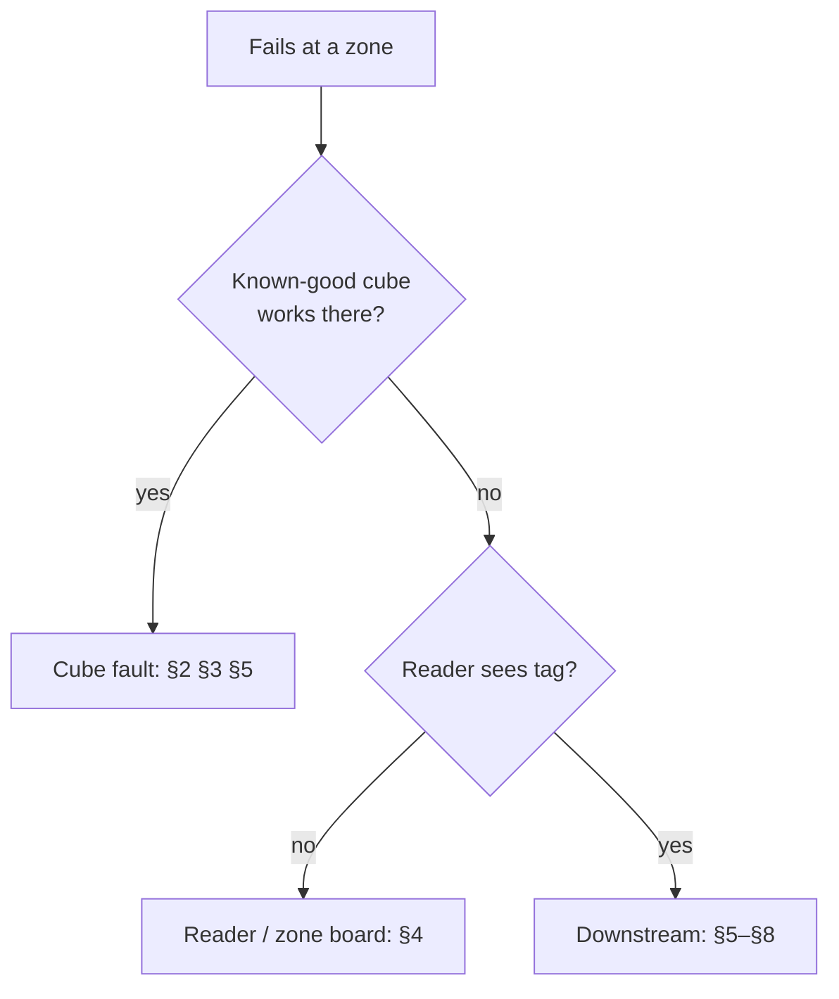

# Console controls, Attention cards & troubleshooting catalogue

*This document was written by Kimchi and Chips*

## Summary

This page is the reference behind the daily routine and troubleshooting in {{page:H2}} and {{page:H5}}. It lists the console settings and their defaults, the technical items of the opening and closing checklists, the shift-log fields, every Attention card the console can raise (exact title, meaning, buttons), and the full symptom catalogue. It also covers instance locks and USB identification rules. Card titles are generated in Python and are always English, also when the console is set to Korean.

## Facts

### Console layout and shortcuts

- Top-bar pages, in this order: ⌘1 **Devices** · ⌘2 **Flash** · ⌘3 **Register** · ⌘4 **Inventory & database** · ⌘5 **Show** · ⌘6 **Show editor** · ⌘7 **Bench** (Ctrl on Windows). Order in `console/web/components/TopBar.js` (`SECTIONS`), keys in `console/web/app.js`; each page button's tooltip gives its key.
- Other keys (Settings › Keyboard): **Esc** closes a tooltip, else stops every active operation; **/** search; **j**/**k** move the rail selection; **?** the key list.
- Top-bar **Sync** chip. Manual: `⟳ Sync`, `⟳ Syncing…`. With automatic sync on: **✓ Synced** · **⟳ Sync in 5 s** · **Sync · retry in 2 min** · **Sync · offline** · **⟳ Sync · sign in**. Clicking the chip syncs at once ({{page:X08}}).
- Top-bar **EN | KR** switch at the far right (also Settings › Appearance › "Language · 언어"). Stored per browser in localStorage `nct.lang`; default English; switching needs no reload. `?lang=ko` or `?lang=en` after the route applies a language to that page only (used for Korean screenshots). In Korean, tooltips also give the English name ("EN: <label>"). Text generated in Python (cards, job stages, sync status, logs, errors), protocol tokens and product names stay English.
- Status bar (bottom): link (**Connected** / **Connecting…** / **Backend not responding**), **Mode: Simulation** (simulated runs only), **Zone DB** `vN` (+ `· unpublished mappings`), **Cubes** `total · N registered`, **Station** (`none` / `not connected` / `no NFC` / `ready` or the current mode), **Jobs** (`idle` / `N running`).
- **Log** dock (bottom strip): exact error texts. Copy them into the shift log.
- **Attention** panel (right): suggestion cards, sorted by severity (bad, warn, info), then cards with buttons first, then newest.

### Settings (saved on this computer in `metadata.console_settings`)

| Setting (screen text) | Key | Default | Notes |
|---|---|---|---|
| Appearance › Theme · Language · 언어 | not in `console_settings` | dark · English | Per browser (localStorage), not per computer |
| Behaviour › Open a live session automatically for every identified board | `auto_sessions` | on | |
| Behaviour › Preview the selected cube with a 1 s flash (pairing station) | `preview_flash` | on | |
| Behaviour › Audio cues for USB cube flashing (**Test sound**) | `audio` | on | Never plays in a simulation |
| Automatic updates › **Zone databases over the air** | `auto_zone_db_radio` | on | One link walks the zone database: the link with an NFC reader if it relays, else the first relay-capable Workstation. Every other relay stops walking, so two radios never broadcast chunks over each other. Re-applied every 1 s |
| Automatic updates › **Zone databases over USB** | `auto_zone_db_usb` | on | Database-only update for any configured zone board on USB that is behind. Once per board and publication. Firmware and identity untouched. Independent of the armed intake |
| Automatic updates › **Main show over the air** | `auto_show` | on | Cubes in range on an older show are updated through a Workstation (or General Radio 1.1.0+). Never mid-show. Cubes v1.5.0+ only |
| Automatic updates › **Pull a newer zone database and show from the web** | `auto_pull` | on | Needs the web password. Zone pull: each web version is tried once per run. Show pull: every 300 s while a show relay is connected, and only if `auto_show` is also on. Logs only a new pull or each distinct error once; "No show published on the web yet" is silent |
| Automatic updates › **Sync the inventory with the web by itself…** | `auto_sync` | on | Uploads 5 s after the last local change, syncs when the 60 s web check finds changes, at least 15 s apart; backs off 60 s doubling to 10 min after a failure; a rejected password is forgotten and automatic sync stops until sign-in. Same full sync as the button. Never in `--simulate`. Detail {{page:X08}} |
| Register › **Register cubes as they are plugged in** | `auto_register` | off | Saved |
| Flash › **Flash cubes as they are plugged in** | not saved | off at every launch | {{page:X03}} |
| This computer › Automatic intake › **Auto-flash zones** | not saved | off at every launch | Hazard: "Identified zone boards are updated in place; legacy sketches take the zone and point below. Cubes and stations are skipped." |

Saved settings from before a key existed load it as on. The docs bench (`simdocs`) switches all five automatic updates off, so screenshots show them unticked. The automatic updates only touch zones and cubes that are behind. A zone that was off is updated soon after it answers again. They are safe to leave on during opening hours. Theme is per browser.

### Temporary controls (leases)

| Control | Where | Lease |
|---|---|---|
| **Override output without a cube** | Pool radio panel | The console pings the radio every 0.35 s; the lease lapses 1.5 s after it stops |
| **Cue override** | Preshow zone board › **Cue test** tab | Leased 1.5 s; kept alive while on |
| **Pool lamp** (Hold pool lamp) | Workstation panel tab | Held while the page holds it; card if no pool central is heard |
| **Preshow cue** (Raise preshow cue) | Workstation panel tab | Held while the page holds it; card if no bridge is heard |

### Daily checklist, technical items

Before opening:
- Open the console once. Plug in the Workstation. Read the Attention panel first.
- Count charged, tested cubes. Set spares aside. Separate damaged cubes and write down their label numbers.
- Preshow: USB power banks, cables, antennas, reader mounting. Use the established USB battery arrangement (a small LiPo trial failed).
- Media system: preshow bridge serial port at 115200 baud; close any other serial monitor. If the bridge is plugged into the console Mac it appears as **Preshow media bridge**: press **Disconnect** on its panel so TouchDesigner can open the port.

Zone tests with a known-good cube:

| Zone | Check | Pass when | Detail |
|---|---|---|---|
| Media system | Start it; bridge port 115200 | TouchDesigner receives the port | {{page:X04}} |
| Preshow | Tag each of the 4 points | Tag read, cube red, the right butterfly cue, released when the cube is removed | {{page:X04}} |
| Desert | Tag all 23 member positions | Local lamp lights **and** the cube turns yellow. Check the reported Jisung / Jimin reader alignment against the site labels | {{page:X05}} |
| Pool | Tag all 6 pool radios, move each slider | Cube blue, the matching frame lights | {{page:X06}} |
| Pool shared frame | Two radios select one frame; remove one cube | The other radio's frame stays lit | {{page:X06}} |
| Main show | With the media team: tag the entrance, run a scheduled cue | Real cubes play. Controller green LEDs or a running **Show clock** are not enough | {{page:X07}} |

If registrations changed:
- **Sync** (uploads, downloads, publishes the zone database).
- Automatic updates, or Workstation panel › **Zone relay** › **Query zones**, then **Update all out-of-date zones**.
- Compare every physical reader with the **Zone relay** table. A zone out of range or off is not updated.

Leave the console safe:
- **Flash cubes** off and **Auto-flash zones** off (both off at every launch).
- Every temporary control handed back (table above).
- Settings › Automatic updates as agreed.

During opening: swap a failing visitor cube for a charged spare and diagnose away from the audience. Plug the cube in over USB: the Cube panel shows number, tag, registration status and reported firmware. Do not re-register a batch or broadcast a show to diagnose one cube.

Closing:
1. Stop intake. Agree the final media cue with the media team before powering down controls.
2. Collect and count cubes: ready, charging, needs repair. Tag waiting cubes on a **Reset plate** (`SET_ZONE 0`, dim white idle, saves battery).
3. Disarm: **Flash cubes** off, **Auto-flash zones** off, temporary controls handed back. Automatic updates may stay on.
4. Wait for running jobs. The console refuses to close during an esptool write: `A flash write is in progress; wait for it to finish before closing`.
5. **Sync** the day's deliberate inventory changes. Note zones still out of date (Inventory › Zone database lists what each zone last reported).
6. Close the console before copying a private backup ({{page:X10}}).
7. Charge with the operator-approved procedure.

Success state: Attention empty or information cards only · **Zone relay** every zone **Current** · no temporary control held · every zone test passed.

### First response and symptom index

| Symptom | First check | Catalogue |
|---|---|---|
| Several things fail, no starting point | Isolate with a known-good cube | §1 |
| One cube fails at several good readers | That cube: charge, tag, registration, firmware (plug it in over USB) | §2 §3 §5, {{page:X03}} |
| Several good cubes fail at one reader | That reader: position, power, reader, zone database; its **Monitor** tab on USB | §2 §4, {{page:X09}} |
| Reader reads the tag, effect missing | Path after the reader: radio, controller, media, lighting | §5–§8 |
| Newly registered cube "unknown" at a zone | Has the Sync chip reached **✓ Synced** (or was **Sync** pressed); does the zone hold the new published database? | §2 |
| Registration fails / "cannot connect to the ESP32" | Radio link, cube power, reader | §3 |
| **Register** greyed out | Hover: tooltip reason | {{page:X03}} |
| Firmware differs from the local build | Information only; the cube works with every zone | {{page:X03}} |
| Main show does not start on some cubes | Were they tagged at the entrance (mainshow-ready)? | §7 |
| Preshow cue does not reach TouchDesigner | Bridge serial port; no other program holding it | §6 |
| Pool lamps wrong, flickering, dark | Pool radio or pool central | §8 |
| Flash stops with a warning | Boot not confirmed, refused, wrong board | §9 |
| USB board not identified | Port held elsewhere, board silent | §10 |
| Console will not start | Another NCT app open on this database | §11 |
| **Sync** fails, or a cube lost its number after Sync | Password, network, newer change elsewhere | §12 |
| Hot, damaged, unstable power | Stop; duty technician | §13 |

### Shift-log fields

Date / time · Operator · Cubes usable / spare / faulty (counts) · Affected cube (label number and MAC, from its Cube panel) · Zone / point · Observed symptom · Known-good comparison (did a known-good cube work there?) · Action · Result (Verified / Acknowledged / Delivered / Failed) · Published zone database version (top-bar Sync chip or Inventory › Zone database) · Zones still out of date · Attention cards left open · Next owner.

New troubleshooting case record: date and time · zone and point · cube number · symptom · exact console card title · known-good comparison · cause · fix · evidence level · who confirmed it.

### Attention cards: mechanics

- Source: `console/advisor.py`. Pure rules over state sections, no I/O. Each card: id `<rule>:<scope>[:<key>]`, severity `bad | warn | info`, title, know / why / check texts, evidence, actions.
- Tiers: 0 environment, 1 links, 2 database, 3 device events, 4 outcomes.
- Windows: unknown tag 15 min · NACK 10 min · show start ignored 5 min · port / radio timeout 2 min · job result 30 min · cube flags 30 min.
- Superseding (same scope unless noted): `tag.known_zone_behind` hides `zone.db_behind` · `tag.known_unpublished` hides `zone.local_differs` (all scopes) · `zone.partitions_missing` hides `zone.config_invalid`, `zone.error`, `zone.db_behind`, `zone.db_ahead` · `zone.nfc_down` hides `zone.error`, `zone.nfc_fast_fail` · `station.disconnected` hides `station.nfc_down`, `station.wrong_channel`, `station.no_zone_support` · `station.wrong_channel` hides `station.no_zone_support` · `zone.unpublished` hides `zone.local_differs`, `zone.db_behind`, `zone.db_ahead`, `sync.publish_pending` (all scopes) · `zone.cache_inconsistent` hides `zone.local_differs`, `sync.publish_pending` (all scopes) · `tools.esptool` hides `build.stale` (all scopes).
- Button stripping: with the esptool check failing, flash commands are removed ("Fix the flashing tool first (see the flashing-tool card)."). Without a connected relay-capable station, over-the-air commands are removed ("Over-the-air actions need a connected station or dongle with zone support."). While a job runs on the card's device, all buttons are removed ("A job is running on this device; actions return when it finishes.").
- Dismissal: by id, by `rule@scope`, or `rule@*`. Saved every 30 s in `metadata.console_dismissed`.
- Hardware buttons run on one click with a warning tooltip. Destructive ones (Force flash) need **Hold to confirm**.

### Attention cards: catalogue

‹zone› = zone name, ‹port› = serial port, ‹job› = job title, `#n` = cube number.

Tier 0: environment

| Card title | Sev. | Meaning | Buttons |
|---|---|---|---|
| **Flashing tool is not working** | bad | esptool did not answer as 5.3.1. Every cube, zone and dongle flash refuses | **Check the flashing tool again**, **Open the setup guide** (Setup.command, `docs/SETUP.md` §2) |
| **Firmware builds are unavailable** | warn | arduino-cli not found, or ESP32 core 3.3.11 missing. Flashing existing verified builds still works | **Open the setup guide** (§6) |
| **Cube firmware build needs attention: ‹error›** | warn | Manifest, binaries and source disagree; the cube flasher refuses | **Rebuild the cube firmware** |
| **‹Sketch› firmware: ‹error›** | info | A zone build is stale | **Build ‹Sketch›** |
| **Workstation firmware build is missing/stale** · **Mainshow controller firmware build is missing/stale** | info | Flashing a dongle or controller builds it first (minutes) | **Build the Workstation firmware** / **Build the Mainshow controller firmware** |
| **Another app is open on this database: ‹apps›** | info | An old app's instance lock is held by another process. Web downloads wait | none |
| **‹port› is owned by another application** | warn | The port refused to open. Likely holder named (old app, or a tool without a lock: zone flasher, calibration, bench test, serial monitor) | **Probe the port again** |

Tier 1: links

| Card title | Sev. | Meaning | Buttons |
|---|---|---|---|
| **Pairing station is plugged in but not connected** | bad | A Workstation-role board is on USB but no session is open. Nothing is resent automatically | **Connect the station** |
| **Station link is not connected** | bad | Session open, no hello. The console re-handshakes every 3 s and never replays an interrupted operation. If silent: unplug and replug; look for a reboot loop | **Reconnect the station** |
| **Station is on channel N; cubes and zones use 2** | bad | Channel is compiled in | **Write the Workstation firmware** (not offered for `3C:0F:02:AD:83:24`) |
| **Station firmware has no zone support** | warn | No zone relay (needs workstation-1.0.0 or nct-pairing-1.8-zones). Zone updates, queries, RX gain over the air unavailable | **Write the Workstation firmware**, or **Open the zones guide** for the protected station |
| **Relay firmware ‹fw› is older than ‹current›** | warn | An older nct-pairing (1.7 adds signal strength, 1.8 RX gain) or an older workstation build. A legacy General Radio is left alone | **Write the Workstation firmware** (not for the protected station) |
| **Station NFC reader is not responding** | bad | Registration disabled; discovery, saved-mapping transmission and LED tests still work. I²C status 2 = address NACK (wiring, I²C mode switch, power). Status 5 = bus timeout (a line held low: power-cycle reader and station together). Check SDA 4 / SCL 3, I²C mode, VCC from station 5 V. Not raised for a reader-less dongle | **Try a bus clear and re-init** (only when no operation runs), **Read the reader status**, **Open the I²C notes** |
| **‹label›: its radio driver stopped answering** | bad | The Workstation reported `fatal`: three sends in a row got no result from the Wi-Fi driver. It refuses every radio operation until power-cycled; its leases release what it held. Unplug and replug (a watchdog reset is not enough) | **Probe again after replugging** |
| **Pool lamp N is held but no pool central is heard** | warn | Broadcasting a member with no PoolCentral beacon latched. Central off, out of range or other channel | **Release the lamp** |
| **Preshow cue N is held but no media bridge is heard** | warn | No PreshowBridge beacon heard, so the cue also goes out as the pre-2026 2-byte packet, which nothing acknowledges | **Turn the cue off** |
| **Mainshow controller problem** | bad | Text names the problem (not the Mainshow controller, no reply, wrong channel, radio). Mainshow ready / trigger need the controller firmware on channel 2 | **Write the Mainshow controller firmware** (only on an identified spare) |
| **Web sync needs the inventory password** | info | No password stored | **Enter the password** |
| **The web rejected the stored password** | warn | 401. Nothing syncs | **Enter the password again** |
| **Web inventory unreachable; working locally** | info | Flashing and zone updates use the last pulled zone database | **Check again** |
| **Web sync problem** | warn | The web could not answer usefully. Next step: "It retries by itself; Sync now to try at once." with automatic sync on, else "Click Sync to try again." | **Sync now** |
| **Another app is syncing right now** | info | Busy | none (wait and retry) |
| **Sync was interrupted while uploading** | warn | Nothing is lost; the next Sync checks what the web received | **Sync now** |
| **Cube mappings changed but the zone database was not published** | warn | N inventory changes not in the published image; new registrations stay unknown at every plate. Hidden while automatic sync is on and has no error | **Sync & publish** |
| **The web has a newer zone database vN** | warn | Flashing from the older local copy would put an outdated database on a zone | **Sync (pulls the database)** |
| **N downloaded change(s) are waiting to be applied** | info | Waiting for an old app or an operation to be idle | **Apply now** |
| **A newer change elsewhere took this device's number or tag** | warn | Sync resolved a conflict against this computer (newest `updated_at` wins); a cube without number or tag leaves the zone database | **Assign a number** (if it has none), **Register a tag at the station** (if no tag and the station is connected) |
| **The inventory synced but the zone database was not published** | warn | Publish step failed | **Sync again** |

Tier 2: database

| Card title | Sev. | Meaning | Buttons |
|---|---|---|---|
| **Cached zone database is inconsistent** | bad | Nothing can be flashed or distributed | **Pull the zone database** |
| **No zone database has been published yet** | bad | No plate knows any cube | **Sync & publish** |
| **Local cube mappings differ from the published zone database** | warn | A cube registered here stays unknown at every plate until a new version is published | **Sync & publish** |
| **Zone "‹zone›" holds database vN; published is vM** | warn | Zone in range or on USB is behind (Zone relay row **Out of date**) | **Update database over USB** (on USB), **Update database over the air** (in range) or **Query zones over the air** |
| **Zone "‹zone›" holds vN, above this computer's vM (or the same version with different content)** | bad | Another computer published, or a legacy per-computer counter. Never roll a zone back | **Sync** |
| **Zone "‹zone›" is receiving vN** | info | Chunks staged k/n. A partial update is discarded after 60 s without chunks | none |
| **N known zone(s) out of range hold an older database** | info | None answered in the last 20 s | **Turn on Auto-update all** |
| **Zone "‹zone›" did not confirm database vN** | warn | Announce and chunks sent (radio "delivered" only); the zone never reported vN with the published CRC | zone update buttons |

Tier 3: device events (zone board on USB: Monitor-tab history)

| Card title | Sev. | Meaning | Buttons |
|---|---|---|---|
| **Unknown tag on "‹zone›" is cube #n — the plate's database is behind** | warn | Tag is in the published database; the plate holds an older one. After the update a tap prints `FOUND Cube #n` | **Update database over USB**, **Update database over the air** |
| **Unknown tag on "‹zone›" is cube #n — not yet in the published database** | warn | Registration only on this computer | **Sync & publish** |
| **Unknown tag on "‹zone›" is a pending registration for cube #n** | warn | The cube never acknowledged; not committed, in no zone database | **Retry the paused registration** (if paused), **Send the saved mapping to cube #n** |
| **Unknown tag on "‹zone›" belongs to a device without a number** | warn | Unnumbered records are left out of the zone database | **Assign a number** |
| **Unknown tag on "‹zone›" is not in this computer's inventory** | info | Registered elsewhere or never. A plate tap is not a station scan | **Sync first (another computer may know it)**, **Start registration at the pairing station** |
| **Plate "‹zone›" holds the published database yet did not match cube #n's tag** | info | Same version and CRC, still unknown. Possible 4- vs 7-byte UID difference or a stale read | **List the plate's database** (`db`) |
| **Plate "‹zone›" addresses cube #n at an old MAC** | warn | The tag moved to another cube; the plate's database predates the move | **Sync & publish** + zone update buttons |
| **Cube #n did not acknowledge the plate — it may not hold its ID** | warn | Status not_transmitted / unconfirmed / awaiting_tag, or the cube printed UNREGISTERED; it ignores SET_ZONE addressed to it | **Send the saved mapping to cube #n** |
| **Cube #n did not acknowledge plate "‹zone›"** | warn | SET_ZONE without ESP-NOW ACK: off, out of range or not on channel 2 | **Discover cubes**, **Flash cube #n to locate it** |
| **Board on ‹port› runs zone firmware without zone partitions** | bad | "PARTITIONS MISSING": identity and database cannot be stored | **Flash firmware + identity + database** |
| **Zone board on ‹port› has no valid identity** | bad | `?` reports `ZONE: unconfigured`; sends no SET_ZONE | **Flash identity (and database)** |
| **NFC reader on "‹zone›" is not responding** | bad | `NFC: ok=0`; plate radio still works. Pins 4/3 (XIAO replacement plates D4/D5 = GPIO 6/7), 5 V, I²C mode. Power-cycle reader and board together. SCL held low was traced to the reader/cable side (`pairing_station/VALIDATION.md`) | **Ask the plate to recover the reader**, **Read the reader status**, **Open the I²C notes** |
| **NFC reader on "‹zone›" answers but scan commands fail** | warn | Tags may be missed | **Recover the reader** |
| **Zone "‹zone›" reports: ‹error text›** | bad/warn | See zone error codes below | per code |
| **Preshow plate "‹zone›" is in legacy media mode** | info | No bridge beacon heard; plate also sends the 2-byte packet. Cues cannot be acknowledged (MEDIA LEGACY, not MEDIA FAIL) | **Read about the preshow link** |
| **Preshow plate "‹zone›" reported MEDIA FAIL** | warn | A bridge was heard but did not acknowledge a cue within 3 s | none |
| **RX gain on "‹zone›" is stored but the reader did not accept it** | warn | `RXGAIN: stored=… applied=?`; the reader runs at its last accepted gain; re-applied on recovery | none |
| **Pool radio "‹zone›" is not seen by the central controller** | warn | `central_sees_me=false`. Radios and central are a matched set | none |
| **Pool radio "‹zone›" has no saved calibration** | warn | No control points at ticks 1 and 23 | none (Calibration tab) |
| **Pool radio "‹zone›" runs firmware without tuning support** | info | Before pool-2.8.0 | **Update pool radio firmware** |
| **Pool radio "‹zone›": distance sensor not found** | bad | `[ERROR] VL53L4CD` at boot; sensor on SDA 4 / SCL 3 shared with the PN532 | none |
| **Two pool radios share radio id N** | bad | Lamps flicker | **Assign radio id K to ‹name› (on USB)** (identity sector only; calibration kept) |
| **Pool central sees live radios sharing an id** | bad | `id_clashes` | none |
| **Pool radio id N sends the legacy packet** | warn | Pre-2026 firmware accepted by the shim (insurance only) | none |
| **Pool central lost radio ‹label›** | warn | `RADIO TIMEOUT`: heartbeats stopped (power, range, crash) | **Query zones** |
| **Two preshow plates are flashed as point N** · **The media bridge sees plates sharing a point id** | bad | Cues fight over one TouchDesigner channel | none (reflash one) |
| **Cube #n runs ‹fw›; the local build is ‹fw›** | warn | Information: the cube still works with every zone and controller | **Flash cube firmware** |
| **Cube #n firmware version not verified** | info | No matching `FW:` + `Cube MAC:` + `Cube READY` | **Check boot** |
| **Cube #n says it is UNREGISTERED** | warn | Cube NVS holds no ID; ignores zone commands | **Send the saved mapping** or **Register at the station** |
| **Cube #n: ESP-NOW failed to start** | bad | `ESP-NOW INIT ERROR`; never answers | **Flash cube firmware** |
| **Cube #n is on ESP-NOW channel N, not 2** | bad | Compiled in | **Flash cube firmware** |
| **Cube #n ignored a show start** | warn | `SHOW_START IGNORED / ZONE=z`: not mainshow-ready (4) | **Make Cube #n mainshow-ready (SET_ZONE 4)** |
| **Registration not confirmed** (or **NEOCORE #N NOT CONFIRMED**) | warn | Tag read, no ACK; saved ID/UID reused on retry. Also when the controller is paused | **Retry the saved registration**, **Skip this cube** |
| **Tag not registered** | warn | The scan was rejected. A scan during REGISTER DEVICE takes over a tag atomically; the old cube keeps its number | **Retry**, **Skip** |
| **Registration needs attention** | warn | Station error | **Retry** |
| **Registration stopped** / **Registration interrupted** | info | Transmitted registrations are not undone | none |
| **N registration(s) unconfirmed** | info | Saved ID/UID with uncertain result; retrying is safe | **Retry N unconfirmed registration(s)** |
| **N device(s) in the inventory have no number** | info | None on USB or answering now | none |
| **‹MAC› has no number** | info | Live device without a number | **Assign #N** |
| **No free device numbers remain above 32** | bad | Automatic numbering impossible | none |
| **Board on ‹port› is not answering on serial** | info | Booting, legacy sketch or bare board | **Identify through the bootloader (reboots)**, **Ask again on serial** |
| **Board on ‹port› is refused by the zone flasher** | bad (protected) / warn | A known cube, the station or a foreign controller. Force-flashing a registered cube unregisters it (number and tag released) | **Force flash as a zone (overwrites it)** (hold; never for the protected station) |
| **Zone identity on ‹port› is missing or ambiguous** | warn | Auto-flash cannot choose a profile | **Flash with a chosen identity** |
| **‹legacy label› on ‹port›** | info | Legacy zone sketch, no identity or database | **Flash with the suggested profile** |

Tier 4: outcomes (job results within 30 min)

| Card title | Sev. | Meaning | Buttons |
|---|---|---|---|
| **‹job›: written and verified, boot not confirmed** | warn | Read back correctly; only the boot answer did not match. Do not reflash | **Check boot again** (cube) / **Read the zone report** (zone) |
| **‹job›: needs attention** | bad | Written, then did not verify (`attention`, read-back mismatch, "changed unexpectedly"). State uncertain; includes the receipt path | none |
| **‹job›: the USB device changed mid-way** | info | Nothing (more) was written | **Probe again** |
| **‹job›: refused** | bad (protected) / warn | Pipelines never overwrite a known cube, the station or a foreign controller by accident | **Force flash (unregisters the cube)** only for a zone job on a known cube |
| **‹job›: wrong flash size** | bad | Not a 4 MB ESP32-C3 | none |
| **‹job›: failed** | warn | Read the job log; retry after fixing the cause | none |
| **Waiting for "‹zone›" to confirm RX gain N dB** | info | Success is only the next ZONE_SETTINGS report (10 s). No answer: zone older than desert-2.4.0 / tagplate-2.4.0 / pool-3.2.0 / preshow-3.3.0, or dongle before 1.8 | none |

Zone error codes (`Zone "‹zone›" reports: …`):

| Code | Text | Severity | Buttons |
|---|---|---|---|
| 1 | zone config invalid | bad | **Flash identity/parameters** (USB) |
| 2 | database empty | bad | zone update buttons |
| 3 | NFC reader not found | (handled by the NFC card) | — |
| 4 | radio init failed | bad | **Reboot over the air**, **Reflash firmware** (USB) |
| 5 | update: out of memory | warn | **Reboot over the air** |
| 6 | update: CRC mismatch | warn | zone update buttons |
| 7 | update: invalid data | warn | zone update buttons |
| 8 | update: flash commit failed | bad | **Write the database over USB** |
| 9 | update: timed out | warn | zone update buttons |
| 10 | zone parameters missing/invalid | warn | **Flash identity/parameters** |
| 11 | sensor not found | bad | none |

The code persists until the next successful operation.

### Result status

Sent → **Delivered** (radio acknowledgement only; "Delivered ≠ acknowledged by the application") → **Acknowledged** (the board answered) → **Verified** (read back independently). Only Acknowledged and Verified count as success. **No radio ACK** means the radio did not confirm delivery (off, out of range, other channel). Radio dots: **Heard** (discovery reply within 10 s) / **Not heard** ("A grey dot does not mean the cube is off"). Never judge battery from a radio dot or an inventory status.

### Zone database pills

**Current** (version and CRC match) · **Out of date** · **Newer / differs** (only a new publication fixes it) · **Updating** (partial discarded after 60 s) · **Nothing published**. Zone database versions are allocated by the web and only increase; never roll a zone back.

### Instance locks

- The console takes every lock at start (`console/locks.py`, `hostos.lock_file`) on the database path with suffixes `.console.lock`, `.lock` (Pairing station app), `.flasher.lock` (Cube USB flasher), `.zonedb.lock` (Zone Database Manager), `.mainshow.lock` (Mainshow controller app). It holds them while it runs.
- Console refused at start: `<App> is already open on this database; close it before starting the NCT Console` (for example `The Pairing station app is already open …`, `Another NCT Console window is already open …`).
- Old apps refused while the console runs: Pairing station `This database is already open in another pairing window.` · Zone Database Manager `The Zone Database Manager is already open for this database.` · Mainshow Controller `The Mainshow Controller is already open for this database.` · Cube flasher: dialog "Neocore Flash Station" with the OS lock error.
- Fix: close one, start the other. Never delete lock files while an app runs.
- Every 5 s the console probes only the locks it does not hold. Its own locks are skipped.

### USB identification rules

- A port name (`/dev/cu.usbmodem…`, `COM3`) is not an identity. Boards are identified by what they report.
- Probe without reset, one port at a time, only for free ports (no session, no job, not the protected station, not held elsewhere): listen 0.4 s (PoolCentral / RangeTest status) → `?` (cube, zone plate, Mainshow controller, PreshowBridge; a JSON station answers `{"event":"error","detail":"Invalid JSON"}`) → `{"cmd":"hello"}` (Workstation, legacy pairing station, General Radio, Mainshow controller) → `STATUS` (pool test bridge, PoolCentral, RangeTest, PreshowBridge). Nothing that arms, sets or moves is sent.
- Roles: `cube`, `zone`, `workstation`, `mainshow`, `poolcentral`, `preshowbridge`, `pooltest`, `rangetest`, `unknown`. Every JSON-hello board except the Mainshow controller is the `workstation` role; its capabilities come from the hello fields.
- USB pills: **USB** (enumerated) · **Identifying…** · **Live** (console holds the port) · **Busy** (job) · **Held elsewhere** · **Protected** (`3C:0F:02:AD:83:24`: never probed or flashed) · **Identified** (no session).
- A native ESP32 USB serial descriptor exposes the chip MAC. That identifies the chip, not LED firmware. Firmware needs a matching `Cube MAC:`, `FW:` and ready answer. A missing answer means unverified.
- A newly identified cube stops the active station operation before it takes the pin. Pins survive unplugging; **Unpin** or a newly identified cube replaces the pin. Filters never hide the pin.
- A board that answers nothing is **Unidentified board**. Never write cube firmware to it because it looks like a cube.

## Procedures

### Troubleshooting catalogue

Start with §1. Each entry: symptom · checks in order · fix · evidence.

**§1 Isolate: one cube or one board?**
- Swap in a charged known-good cube. Test the failing cube at the desk.
- One cube fails at several good zones → that cube (charge, tag, registration, firmware).
- Several good cubes fail at one zone → that zone board (position, power, reader, zone database).
- Tag read but effect missing → path after the reader (cube radio, preshow bridge, pool central, media).
- Plug the zone board in by USB: **Monitor** tab shows each tap (tag, lookup `FOUND Cube #n` / **unknown tag**, radio result `delivered` / `pending` / `not acknowledged`, reader health). Plug the cube in: Cube panel.
- Record time, zone and point, cube number, symptom and the known-good result before changing anything.

**§2 Cube unknown at a zone ("NFC unknown")**
- Symptom: recently registered cube does nothing; plate reports unknown tag; console shows it registered; reset/release at that plate also fails.
- Cause: each plate holds its own zone database. Registration changes only the local inventory. Needs **Sync** (publish) and then delivery to the plate.
- Checks: (1) known-good cube works here, else §4. (2) Sync chip clear, else **Sync**. (3) Zone **Current** in **Zone relay**, else **Update database over USB** / **Update database over the air** / **Update all out-of-date zones**. (4) Tap again: `FOUND Cube #n`, else record the card and go to §5.
- Cards: the five **Unknown tag on "‹zone›" …** cards and **Zone "‹zone›" holds database vN; published is vM** (catalogue above).
- The zone board on USB and the Workstation can be connected together: update and retest in one pass. With automatic updates on, a plate that was off updates soon after it returns.
- Site case 22 September: plate held v31, the tag was only in v32; publish + zone update fixed it. A separate occasional report of register → flash → tag still failing is a different symptom; record it separately.
- Evidence: **Field-reported** 22 September (reporter not named). Cards **Code-checked**, **Simulation-verified** (shot C-2).

**§3 Registration fails / "cannot communicate with the ESP32"**
- Needs: the Workstation link, its reader, and a radio answer from the cube.
- Cards: **Pairing station is plugged in but not connected** / **Station link is not connected** → **Connect the station** / **Reconnect the station**, replug if silent. **Station NFC reader is not responding** → **Try a bus clear and re-init**; if it recurs, power-cycle reader and Workstation together. Banner **TAG NOT REGISTERED** / card **Tag not registered** → **Retry** or **Skip**. **Registration not confirmed** (or **NEOCORE #N NOT CONFIRMED**), Log **No radio ACK** → check cube power and distance, **Retry the saved registration**. **N registration(s) unconfirmed** → **Retry N unconfirmed registration(s)**.
- Checks: (1) cube charged and on. (2) Workstation antenna fully seated (reseat). (3) cube answers **Discover**, else press the cube's reset. (4) retry once (**Retry the saved registration** or **Send saved mapping**). (5) still failing on the same cube: stop, set it aside as hardware/antenna fault, record the exact **Log** text.
- Register page: a failure never retries by itself (**Retry** / **Start again for this cube**). Plugging in another cube interrupts the first, which keeps its saved mapping.
- Site case 22 September: weak radio link (antenna or a device needing restart), not the inventory. Reseat antenna, reset, repeat: worked. Exact wording not recorded.
- Evidence: **Field-reported** 22 September. Cards **Code-checked**; Register page **Simulation-verified** only.

**§4 A zone reads no tags at all**
- Symptom: nothing works at one plate, including a known-good cube; Monitor shows no taps.
- Cards: **NFC reader on "‹zone›" is not responding**, **… answers but scan commands fail**, **RX gain on "‹zone›" is stored but the reader did not accept it**.
- Checks: (1) power (preshow battery charged). (2) tag area meets the reader; enclosure spacing unchanged. (3) zone header `pins=` and NFC health: standard boards SDA 4 / SCL 3; replacement XIAO preshow boards D4/D5 = GPIO 6/7 (from preshow-3.4.0 the firmware tries 4/3, then 6/7; `NFC:` line ends `pins=<sda>/<scl>`). (4) recovery button fails: power-cycle reader and board together (the PN532 stays powered across a board reset and can hold the bus). (5) still nothing: duty technician ({{page:X09}}).
- Higher RX gain cannot fix a missing record: read but "unknown" is §2.
- Evidence: **Code-checked** (cards); PN532 bench lessons in `pairing_station/I2C_DEBUG.md`.

**§5 Tag read, cube does not change colour**
- Symptom: Monitor shows `FOUND Cube #n`; the zone's own light may respond; the cube stays the same. The tag and the cube radio are separate.
- Cards: **Cube #n did not acknowledge plate "‹zone›"** (off, out of range, not channel 2 → **Discover cubes**, **Flash cube #n to locate it**) · **Cube #n did not acknowledge the plate — it may not hold its ID** (→ **Send the saved mapping to cube #n**) · **Plate "‹zone›" addresses cube #n at an old MAC** (→ **Sync & publish**, update the zone) · **Cube #n says it is UNREGISTERED** (cube on USB → send the saved mapping, wait for the ACK) · **Cube #n is on ESP-NOW channel N, not 2** / **Cube #n: ESP-NOW failed to start** (→ **Flash cube firmware**, {{page:X03}}).
- Evidence: **Code-checked**.

**§6 Preshow: cube red, no butterfly**
- Path: tag → preshow plate → preshow bridge (radio) → USB serial 115200 → TouchDesigner Serial DAT → cue.
- No tag read: §4 / §2. Plate → bridge: zone header **MEDIA** pills (mode, bridge, acks), card **Preshow plate "‹zone›" reported MEDIA FAIL** → bridge power, antenna, range; query its status. Legacy mode: **Preshow plate "‹zone›" is in legacy media mode** (expected while no bridge beacon is heard; cues cannot be acknowledged). Point clash: **Two preshow plates are flashed as point N** → reflash one with a free point ({{page:X09}}). Bridge → TouchDesigner: bridge writes `PRESHOW,n,ON` but nothing plays → media team checks port, 115200 baud, parser, point → effect mapping. Port held by the console: **Disconnect** on its panel; close serial monitors. Cue stuck on: remove real tags, **Cue override** off on **Cue test**, check ON/OFF.
- **Cue test** raises real media cues: tell the media team first, switch **Cue override** off after.
- A bridge acknowledgement proves the bridge processed the cue on its serial side, not that the butterfly rendered. When the link returns, the latest state is restored; a missed butterfly event is not replayed.
- Evidence: **Code-checked**; cue path **Simulation-verified** (shots 08-1, 08-2); **Field-reported** through the enclosure by Elliot, 22 September. Detail: {{page:X04}}.

**§7 Main show does not start, or only some cubes play**
- A cube plays only if mainshow-ready (yellow-green, "neon", `SET_ZONE 4`, set at the entrance plate) when the Mainshow controller sends the start.
- Indicators: controller LEDs faint red slow scroll = waiting. Strong green fast scroll = a start was sent within the show length (298 s unless a published show sets another); not proof any cube plays (cubes send nothing back). Console **Show clock** = where a cube should be, not LED feedback. **Delivered** after ① / ② on one cube = the cube radio received it, not a colour change (a broadcast is never acknowledged). **locked** with a time = a trigger inside the 3 s lockout was refused (not a fault). A start in the controller log (BOOT or trigger input) = the controller fired, not that the media server sent it.
- Checks: (1) cubes were yellow-green before the cue (else entrance plate, tag a known-good cube; white → §2). (2) card **Cube #n ignored a show start** → **① Mainshow ready** then trigger again. (3) card **Mainshow controller problem** → identity and power; **Write the Mainshow controller firmware** only on an identified spare. (4) trigger input rearmed: open ≥ 1 s since the last trigger and outside the 3 s lockout → media team checks signal timing and the interface. (5) only some fail → test each alone in the **Show** section, ① then ②; battery, firmware, registration, radio reach.
- **② Trigger all ready cubes** (tooltip label "Trigger the main show on all ready cubes") is a hold-to-confirm broadcast, never acknowledged, cannot be undone. **Stop → idle** (`SET_ZONE 0`) affects only the selected cube; it is not an emergency stop.
- Never wire the media system's 5 V signal directly to the controller's trigger input: it expects a pull to ground through the installed interface ({{page:X07}}).
- A late cube joins only with a controller sending the show clock (mainshow-1.3.0, once a second) and cube v1.5.0+. #134 runs mainshow-1.2.0 (no clock), so today a cube that misses the start does not join.
- Evidence: **Code-checked**; ① / ② / clock **Simulation-verified**; **Field-reported** by Elliot 22 September: triggering works, 1 of 10 tested cubes failed (identity not recorded, {{page:X13}}). Detail: {{page:X07}}.

**§8 Pool frame lamps wrong, flickering or dark**
- Cards: **Pool radio "‹zone›" is not seen by the central controller** (central off, out of range or version mismatch; reflash radios and central together) · **Two pool radios share radio id N** / **Pool central sees live radios sharing an id** (distinct ids 1–6) · **Pool central lost radio ‹n›** (that radio's power) · **Pool radio "‹zone›" has no saved calibration** (**Calibration** tab) · **Pool radio "‹zone›": distance sensor not found** (technician) · **Pool lamp N is held but no pool central is heard** (release the lamp).
- Removing one cube must not switch off a frame another slider still selects. If it does, record radios and frame and escalate.
- Evidence: **Code-checked**; calibration **Simulation-verified**. Pool central 4.2.2 field state: {{page:X06}}.

**§9 A flash stops with a warning**
- **‹job›: written and verified, boot not confirmed** → do not reflash; wait, **Check boot**.
- **‹job›: needs attention** → inspect board and receipt before any retry; a backup exists when one was made.
- **‹job›: refused** → check the board's role. Force flash is never a fix; only for deliberately repurposing that exact board ({{page:X09}}).
- **‹job›: the USB device changed mid-way** → nothing more written; reconnect the same board, retry.
- **‹job›: wrong flash size** → use a 4 MB ESP32-C3.
- Cube detail {{page:X03}}; zone boards {{page:X09}}.

**§10 USB board not identified**
- **‹port› is owned by another application** → close that program (old app, Arduino Serial Monitor, TouchDesigner), **Probe the port again**. Never bypass a port lock.
- **Board on ‹port› is not answering on serial** → wait a few seconds; **Ask again on serial**, or **Identify through the bootloader (reboots)** from the **Unidentified board** panel.
- **Zone board on ‹port› has no valid identity** → **Flash identity (and database)** with its zone profile ({{page:X09}}).

**§11 Console or an old app refuses to start**
- Intentional: they share one inventory. See Instance locks above. Close one, start the other.
- Evidence: **Simulation-verified** (`console/tests/test_locks.py`); **Bench-verified** one direction on 23 September (old pairing app refused while the console ran, exit code 1, its Tk dialog).

**§12 Sync problems**
- With automatic sync on, read the Sync chip first: **Sync · retry in …** (it retries by itself; click to try now), **Sync · offline**, **⟳ Sync · sign in** (enter the password). Successful automatic syncs are not listed in Jobs; failures are. **N downloaded change(s) are waiting to be applied** is hidden while automatic sync works; it applies them when the console is idle.
- Cards: **Web sync needs the inventory password** / **The web rejected the stored password** (enter the shared password once; ask the team) · **Web inventory unreachable; working locally** (**Check again**) · **Cube mappings changed but the zone database was not published** (**Sync & publish**) · **The web has a newer zone database vN** (**Sync (pulls the database)**) · **N downloaded change(s) are waiting to be applied** (close the other app, **Apply now**) · **A newer change elsewhere took this device's number or tag** (assign the label number or re-register, then Sync) · **Sync was interrupted while uploading** (**Sync now**; nothing lost).
- Sync never asks for a decision: newest change wins, and the console reports what this computer gave up. Detail: {{page:X08}}.

**§13 Hot, damaged, smelling, unstable power**
- Stop using it; duty technician under venue procedure. A software reset does not repair an electrical fault.

> [!DANGER] Hot, damaged or electrically unstable equipment: stop using it and hand it over under the venue procedure. No console action fixes it.

> [!WARNING] Do not re-register a whole batch, or broadcast a show, to diagnose one cube.

## Known issues / open questions

- The checklist, its frequency and the division of duties are handover recommendations, not completed site tests. **To confirm** with Engineering Six, who must adopt it into the venue's opening procedure and name a duty technician.
- Battery endurance is unmeasured. Neither the planned capacities in the Engineering Six PDF nor this handover establish a tested runtime. Measure it and set a swap interval. **To confirm**.
- Automatic inventory sync (`auto_sync`, uncommitted on 23 Sept): **Simulation-verified** only (`console/tests/test_auto_update.py` AutoSyncTests). Never run against the real web inventory.
- EN | KR switch: **Simulation-verified** (simulator, headless Chrome, unit tests `console/web/tests/i18n.test.js`, `console/tests/test_uitext.py`).
- Automatic updates: **Simulation-verified** (`console/tests/test_auto_update.py`, 6 tests: persistence across restart, one walking relay with General Radio fallback, the show switch, one USB update for a behind zone, the USB switch, pull gating). Never run against real zones, the Workstation or the web pull.
- The old chapter 03 says "the status bar shows what is still held". `console/web/components/StatusBar.js` shows link, mode, Zone DB, cubes, station and jobs; no held-lease item was found. Check each panel's toggle instead. **Code-checked** (contradiction noted).
- The old chapter 11 quotes "Another app is open on this database: …" as a start-up refusal. It is the Attention card `apps.legacy_open`. The console's start-up refusal is `<App> is already open on this database; close it before starting the NCT Console`. Because the console holds all four old-app locks and skips its own in the 5 s probe, the card cannot normally fire while the console runs. It did fire wrongly in the first dongle pass on 23 September, before the probe skipped the console's own locks. **Code-checked**.
- Button labels that differ from the old chapter 11: Force flash is **Force flash as a zone (overwrites it)** (port card) or **Force flash (unregisters the cube)** (job card). **Sync was interrupted while uploading** offers **Sync now**. **Cube mappings changed …** offers **Sync & publish**. **Code-checked**.
- **Station NFC reader is not responding** is not raised for a reader-less dongle (General Radio). **Try a bus clear and re-init** is offered only when no station operation runs. **Code-checked**.
- The reverse lock direction (console refused while an old app runs) is unit-tested only.
- Console cards in general: **Code-checked**. The Korean card titles remain English by design.

## Sources

- `console/advisor.py` (every card title, severity and button)
- `console/uitext.py` (STATUS pills, ACTIONS tooltips), `console/uitext_ko.py`
- `console/hub.py` (settings defaults, `apply_auto_modes`, auto pulls, `auto_sync`, lock probe, `shutdown`, `identified`), `console/state.py` (`describe_auto`), `console/jobs/sync.py`
- `console/web/components/TopBar.js` (page order, EN | KR switch), `console/web/app.js` (⌘1–7), `console/web/lib/i18n.js` (`nct.lang`, `?lang=`)
- `console/web/panels/sections.js` (Settings), `others.js` (Automatic intake), `ZonePanel.js` (Monitor, leases), `WorkstationPanel.js`, `ShowSection.js`
- `console/web/components/StatusBar.js`, `TopBar.js`, `console/web/app.js` (shortcuts)
- `console/locks.py`, `console/app.py`, `console/window.py`, `console/probe.py`, `console/intake.py`, `console/regflow.py`
- `pairing_station/app.py:341`, `zones/dbmanager/app.py:891`, `zones/mainshow/app.py:609`, `flashing_station/app.py`
- `pairing_station/controller.py`, `pairing_station/I2C_DEBUG.md`, `pairing_station/VALIDATION.md`
- `zones/firmware/MainshowController/README.md`, `zones/firmware/PreshowZone`, `zones/firmware/PreshowBridge`, `docs/SETUP.md` §9
- `console/README.md` (Automatic updates), `console/TEST_REPORT_2026-09-23.md`
- Field reports: Elliot and Hojun (supplied request), Sangeun (20 September), documentation requests of 22 September, Elliot 22 September
- Old drafts `03-daily-operation.md`, `11-troubleshooting.md`

*This document was written by Kimchi and Chips*
