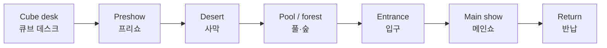
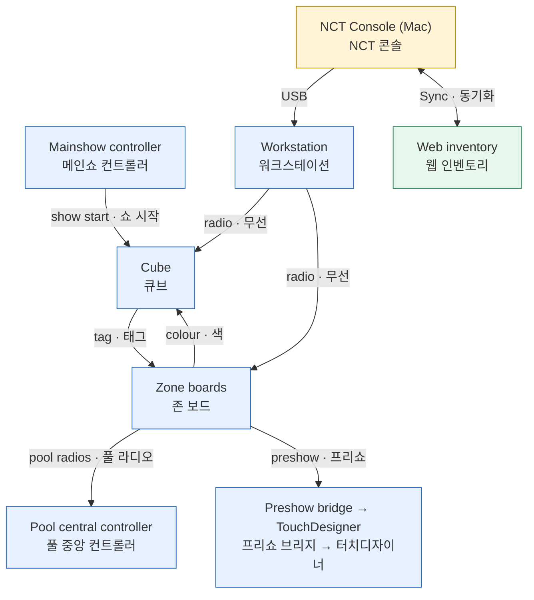

*This document was written by Kimchi and Chips*

> [!INFO] **Who:** everyone · **When:** before your first shift, or when you need the big picture · **You need:** nothing
> **누가:** 모두 · **언제:** 첫 근무 전, 또는 전체 구조를 알아야 할 때 · **준비물:** 없음

This page explains what a visitor does, which board does what, and how the NCT Console fits in.
<kr>이 페이지는 관람객이 하는 일, 각 보드의 역할, NCT Console의 위치를 설명합니다.</kr>

## What the visitor carries | 관람객이 들고 다니는 것

Each visitor carries a **cube**: a handheld light with LEDs, a battery, a small radio computer and an NFC **tag** inside.
<kr>관람객은 각자 **큐브**를 들고 다닙니다. 큐브는 LED, 배터리, 작은 무선 컴퓨터, NFC **태그**가 들어 있는 휴대용 조명입니다.</kr>

The cube has two separate paths. The tag tells a nearby reader which cube it is. The radio receives light commands. The tag needs no battery, so a zone can still recognise a cube with a flat battery.
<kr>큐브에는 서로 다른 두 경로가 있습니다. 태그는 가까운 리더에 어떤 큐브인지 알려 줍니다. 무선은 조명 명령을 받습니다. 태그는 배터리가 필요 없으므로 배터리가 떨어진 큐브도 존이 알아볼 수 있습니다.</kr>

Every cube has a **cube number** on its label. The **zone boards** use the **zone database** to turn a tag into that number.
<kr>모든 큐브의 라벨에는 **큐브 번호**가 있습니다. **존 보드**는 **존 데이터베이스**로 태그를 그 번호로 바꿉니다.</kr>

## The visitor journey | 관람객 동선

1. **Receive a cube.** Staff hand out a charged cube. Its idle light is dim white. <kr>**큐브 받기.** 직원이 충전된 큐브를 나눠 줍니다. 대기 조명은 약한 흰색입니다.</kr>
2. **Preshow (butterfly).** The visitor holds the tag to one of four readers. The cube turns red and TouchDesigner plays that point's butterfly cue. <kr>**프리쇼(나비).** 관람객이 리더 4개 중 하나에 태그를 댑니다. 큐브가 빨간색이 되고 TouchDesigner가 해당 포인트의 나비 큐를 재생합니다.</kr>
3. **Desert.** The visitor holds the tag still at a member position. That member's name panel lights and the cube turns yellow. <kr>**사막.** 관람객이 멤버 위치에 태그를 가만히 댑니다. 해당 멤버의 이름 패널이 켜지고 큐브가 노란색이 됩니다.</kr>
4. **Pool / forest.** The visitor places the cube on a **pool radio** and moves the slider. The cube turns blue and a portrait frame lights. Six pool radios share 23 frame lights. <kr>**풀·숲.** 관람객이 **풀 라디오**에 큐브를 놓고 슬라이더를 움직입니다. 큐브가 파란색이 되고 초상화 프레임이 켜집니다. 풀 라디오 6대가 프레임 조명 23개를 함께 씁니다.</kr>
5. **Main show entrance.** The visitor taps the entrance plate. The cube turns yellow-green: it is ready. <kr>**메인쇼 입구.** 관람객이 입구 플레이트에 태그합니다. 큐브가 황록색이 되며 준비 상태가 됩니다.</kr>
6. **Main show.** At the media server's cue, the **Mainshow controller** starts the show. Every ready cube plays the same animation. <kr>**메인쇼.** 미디어 서버의 큐에 맞춰 **메인쇼 컨트롤러**가 쇼를 시작합니다. 준비된 모든 큐브가 같은 애니메이션을 재생합니다.</kr>
7. **Return.** Staff collect and charge the cubes. A tap on a **Reset plate** returns a cube to idle and saves battery. <kr>**반납.** 직원이 큐브를 회수해 충전합니다. **리셋 플레이트**에 태그하면 큐브가 대기 상태로 돌아가 배터리를 아낍니다.</kr>

> [!WARNING] **Pool wording for visitors:** "Place your cube here and move the slider to explore the portraits." Do not promise that the light matches the printed names exactly. The slider mechanism cannot do that.
> **풀존 관람객 안내 문구:** "이곳에 큐브를 놓고 슬라이더를 움직이며 초상화를 찾아보세요." 조명이 인쇄된 이름과 정확히 맞는다고 약속하지 마십시오. 슬라이더 기구로는 그렇게 할 수 없습니다.

More detail: {{page:H4}}
<kr>자세한 내용: {{page:H4}}</kr>

## The system map | 시스템 구성도

| Board · 보드 | What it does · 하는 일 |
|---|---|
| **Zone boards** · 존 보드 | Tag readers in the zones: preshow plates, tag plates, desert boards, pool radios, Reset plates. They set the cube's colour · 존의 태그 리더. 큐브 색을 정함 |
| **Pool central controller** · 풀 중앙 컨트롤러 | Lights the 23 portrait frames that the six pool radios ask for · 풀 라디오 6대가 요청한 초상화 프레임 23개를 켬 |
| **Preshow bridge** · 프리쇼 브리지 | Passes preshow events to TouchDesigner by USB · 프리쇼 이벤트를 USB로 TouchDesigner에 전달 |
| **Mainshow controller** · 메인쇼 컨트롤러 | Takes the media server's cue and starts the main show on every ready cube · 미디어 서버 큐를 받아 준비된 모든 큐브에서 메인쇼 시작 |
| **Workstation** · 워크스테이션 | The small radio board on the Mac's USB. It reads tags for registration and reaches cubes and zone boards over the air · Mac USB에 꽂는 작은 무선 보드. 등록용 태그를 읽고 큐브·존 보드와 무선으로 통신 |

Boards talk over the exhibition's own radio link. It needs no Wi-Fi router. The internet is used only to **sync** the inventory and to publish zone databases and the main show.
<kr>보드들은 전시 전용 무선으로 통신합니다. Wi-Fi 공유기가 필요 없습니다. 인터넷은 인벤토리 **동기화**와 존 데이터베이스·메인쇼 게시에만 씁니다.</kr>

> [!WARNING] Not every board is a cube. Never write cube firmware to a zone board, the Workstation or a controller. The console refuses this by role; do not work around it.
> 모든 보드가 큐브는 아닙니다. 존 보드, 워크스테이션, 컨트롤러에 큐브 펌웨어를 쓰지 마십시오. 콘솔은 역할에 따라 이를 거부합니다. 우회하지 마십시오.

More detail: {{page:X02}}
<kr>자세한 내용: {{page:X02}}</kr>

## The console at a glance | 콘솔 한눈에 보기

The NCT Console is one window on the Mac. It replaces ten separate operator apps. Plug a board in by USB: the console identifies it without restarting it and lists it by role.
<kr>NCT Console은 Mac의 하나의 창입니다. 열 개의 개별 운영 앱을 대체합니다. 보드를 USB로 꽂으면 콘솔이 재시작 없이 식별하고 역할별로 표시합니다.</kr>

{{shot:C-1}}
The console: device rail (left), the selected device's panel (centre), Attention panel (right), Log dock (bottom) / 콘솔: 장치 레일(왼쪽), 선택한 장치의 패널(가운데), Attention 패널(오른쪽), Log 도크(아래)

The **Attention panel** shows **suggestion cards**. Each card says what the console noticed and what to check. A card never blocks your work.
<kr>**Attention 패널**에는 **제안 카드**가 표시됩니다. 각 카드는 콘솔이 알아챈 내용과 확인할 점을 알려 줍니다. 카드는 작업을 막지 않습니다.</kr>

Every result shows its **result status**: Sent → Delivered → Acknowledged → Verified, or Failed. Only Acknowledged and Verified count as success. Delivered only means the radio got it there.
<kr>모든 결과에는 **결과 상태**가 표시됩니다: Sent → Delivered → Acknowledged → Verified, 또는 Failed. Acknowledged와 Verified만 성공입니다. Delivered는 무선으로 도착했다는 뜻일 뿐입니다.</kr>

Risky buttons (for example a broadcast to every cube) need **hold to confirm**: press and hold the button. A single click does nothing.
<kr>위험한 버튼(예: 모든 큐브에 방송)은 **길게 눌러 확인**해야 합니다. 버튼을 길게 누릅니다. 한 번 클릭으로는 실행되지 않습니다.</kr>

**Language.** Use the **EN | KR** switch at the right of the top bar (also Settings › Appearance). The console remembers the choice on this computer; a console opened in a web browser keeps its own. In Korean mode, buttons also show their English name, so the button names in this handbook match the screen. Suggestion cards, logs and error messages stay in English.
<kr>**언어.** 상단 바 오른쪽의 **EN | KR** 스위치(또는 Settings › Appearance)를 사용합니다. 선택은 이 컴퓨터의 콘솔에 저장됩니다. 웹 브라우저로 연 콘솔은 따로 저장합니다. 한국어 모드에서도 버튼에 영어 이름이 함께 표시되므로 이 핸드북의 버튼 이름과 화면이 일치합니다. 제안 카드, 로그, 오류 메시지는 영어로 유지됩니다.</kr>

More detail: {{page:H2}} · {{page:X11}}
<kr>자세한 내용: {{page:H2}} · {{page:X11}}</kr>

## The 12 most important names | 가장 중요한 이름 12개

Use these names; the screen and every page use them too.
<kr>아래 이름을 사용합니다. 화면과 모든 페이지도 같은 이름을 씁니다.</kr>

| Name | 이름 | Meaning · 뜻 |
|---|---|---|
| **NCT Console** | NCT 콘솔 | The one operator program on the Mac · Mac의 단일 운영 프로그램 |
| **Cube** | 큐브 | The glowing object a visitor carries · 관람객이 들고 다니는 빛나는 물체 |
| **Cube number** | 큐브 번호 | The number on the cube's label · 큐브 라벨의 번호 |
| **Tag** | 태그 | The NFC tag inside a cube · 큐브 안의 NFC 태그 |
| **Workstation** | 워크스테이션 | The radio board on the Mac's USB; older kinds: pairing station, General Radio · Mac USB의 무선 보드. 이전 종류: 등록 스테이션, General Radio |
| **Zone board** | 존 보드 | A tag reader board in a zone · 존의 태그 리더 보드 |
| **Zone database** | 존 데이터베이스 | The tag → cube-number list on every zone board · 모든 존 보드에 저장된 태그 → 큐브 번호 목록 |
| **Inventory** | 인벤토리 | The console's list of every cube · 콘솔의 전체 큐브 목록 |
| **Sync** | 동기화 | Exchanging the inventory with the shared web copy · 인벤토리를 공유 웹 사본과 주고받기 |
| **Main show** | 메인쇼 | The finale animation every cube plays together · 모든 큐브가 함께 재생하는 마지막 애니메이션 |
| **Mainshow controller** | 메인쇼 컨트롤러 | The board that starts the main show · 메인쇼를 시작하는 보드 |
| **Result status** | 결과 상태 | Sent → Delivered → Acknowledged → Verified / Failed |

The full glossary, with every old name, is {{page:X01}}.
<kr>이전 이름을 모두 포함한 전체 용어집은 {{page:X01}}입니다.</kr>

*This document was written by Kimchi and Chips*
