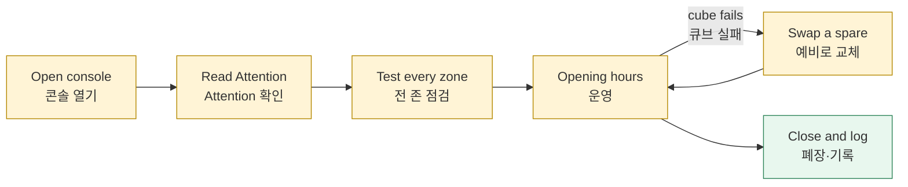

*This document was written by Kimchi and Chips*

> [!INFO] **Who:** the duty technician and floor operators · **When:** every opening day · **You need:** the console computer, the Workstation, one known-good registered cube, charged spare cubes
> **누가:** 당일 담당 기술자와 현장 운영자 · **언제:** 매 운영일 · **준비물:** 콘솔 컴퓨터, 워크스테이션, 정상 등록 큐브 1개, 충전된 예비 큐브

This is the day's routine: check before opening, watch during opening, close safely. It is a proposed procedure (**To confirm** with Engineering Six, who should name a duty technician).
<kr>하루의 기본 절차입니다. 개장 전 점검, 운영 중 관찰, 안전한 폐장. 제안 절차이며(**To confirm**, 엔지니어링식스), 엔지니어링식스가 당일 담당 기술자를 지정해야 합니다.</kr>

## The day | 하루 흐름

## Before opening | 개장 전

- [ ] Open the NCT Console and plug in the Workstation. Read the **Automatic updates** panel and the **Attention** panel (top right) first. <kr>NCT 콘솔을 열고 워크스테이션을 꽂습니다. 먼저 **Automatic updates** 패널과 **Attention** 패널(오른쪽 위)을 읽습니다.</kr>
- [ ] Count charged, tested cubes. Set spares aside. Separate faulty cubes and note their numbers. <kr>충전·점검된 큐브를 셉니다. 예비 큐브를 따로 둡니다. 불량 큐브는 분리하고 번호를 기록합니다.</kr>
- [ ] Check the preshow power banks, cables and reader mounting. <kr>프리쇼 보조배터리, 케이블, 리더 고정을 확인합니다.</kr>
- [ ] Start the media system. If the preshow bridge is on the console computer, press **Disconnect** on its panel so TouchDesigner can use the port. <kr>미디어 시스템을 시작합니다. 프리쇼 브리지가 콘솔 컴퓨터에 꽂혀 있으면 브리지 패널의 **Disconnect**를 눌러 TouchDesigner가 포트를 쓰게 합니다.</kr>
- [ ] Test every zone with a known-good cube (table below). <kr>정상 큐브로 모든 존을 점검합니다(아래 표).</kr>
- [ ] If registrations changed: check the Sync chip shows **✓ Synced** (it syncs by itself; click it to sync now), then check every zone shows **Current** in the Workstation panel › **Zone relay**. <kr>등록이 바뀌었으면 Sync 칩이 **✓ Synced**인지 확인하고(자동으로 동기화됨, 누르면 바로 동기화), 워크스테이션 패널 › **Zone relay**에서 모든 존이 **Current**인지 확인합니다.</kr>
- [ ] **Flash cubes** page off, **Auto-flash zones** off, no temporary control left on (check each override switch you used). <kr>**Flash cubes** 페이지 끄기, **Auto-flash zones** 끄기, 남은 임시 제어 없음(사용한 오버라이드 스위치마다 확인).</kr>

| Zone · 존 | Test · 점검 | Pass when · 통과 기준 |
|---|---|---|
| Preshow · 프리쇼 | Tag each of the 4 points | Cube red, the right butterfly cue · 큐브 빨강, 올바른 나비 큐 |
| Desert · 사막 | Tag all 23 positions | Local lamp **and** cube yellow · 로컬 조명**과** 큐브 노랑 |
| Pool · 풀존 | Tag all 6 pool radios, move each slider | Cube blue, the matching frame lights · 큐브 파랑, 맞는 프레임 점등 |
| Main show · 메인쇼 | With the media team: tag the entrance, run a cue | The real cubes play the show · 실제 큐브가 쇼 재생 |

<kr>표의 점검 동작: 프리쇼 4개 포인트를 모두 태그, 사막 23개 위치를 모두 태그, 풀 라디오 6대를 태그하고 슬라이더를 움직임, 메인쇼는 미디어팀과 입구 태그 후 큐 실행.</kr>

For the main show, watch the cubes themselves. Green lights on the controller, or a running **Show clock** in the console, are not enough.
<kr>메인쇼는 큐브 자체를 봅니다. 컨트롤러의 초록 LED나 콘솔의 **Show clock** 진행만으로는 충분하지 않습니다.</kr>

More detail: {{page:H4}}
<kr>자세한 내용: {{page:H4}}</kr>

## During opening | 운영 중

Keep the console open. Glance at the **Attention** panel from time to time. Each card says what is wrong and offers a button that fixes it.
<kr>콘솔을 열어 둡니다. 가끔 **Attention** 패널을 봅니다. 카드마다 문제와 해결 버튼이 있습니다.</kr>

Leave Settings › **Automatic updates** on (the default). The console then brings zone databases and the main show up to date by itself. It only touches zones and cubes that are behind, and never sends a show while a show is running. It also builds firmware and upgrades out-of-date boards plugged in by USB, but never a board you are using. (Simulation-verified)
<kr>Settings › **Automatic updates**는 켜 둡니다(기본값). 콘솔이 존 데이터베이스와 메인쇼를 스스로 최신으로 맞춥니다. 뒤처진 존과 큐브만 건드리고, 쇼 재생 중에는 쇼를 보내지 않습니다. 또한 펌웨어를 빌드하고 USB로 꽂은 오래된 보드를 업그레이드하지만, 사용 중인 보드는 건드리지 않습니다. (Simulation-verified)</kr>

The **Automatic updates** panel (top right) shows **✓ Everything up to date** when nothing is waiting. Pool radios, the pool central controller and the preshow bridge are only listed (**by hand**): the console never flashes them.
<kr>**Automatic updates** 패널(오른쪽 위)은 기다리는 것이 없으면 **✓ Everything up to date**를 표시합니다. 풀 라디오, 풀 중앙 컨트롤러, 프리쇼 브리지는 목록에만 나옵니다(**by hand**). 콘솔은 이 보드들을 플래시하지 않습니다.</kr>

> [!WARNING] Do not unplug a board whose row shows **upgrading**. Wait until the row disappears or turns **failed**.
> 행에 **upgrading**이 표시된 보드는 뽑지 않습니다. 행이 사라지거나 **failed**가 될 때까지 기다립니다.

> [!WARNING] **Plugging a board into this computer is enough to upgrade it.** About 20 s after an out-of-date board is plugged in, the console reflashes it without a click: an older cube gets the current firmware and show (only while Register and Flash are off), the Mainshow controller gets the current controller firmware, and a pairing station or General Radio becomes a Workstation. To keep a board as it is, press **Skip** on its row before it starts, or switch off the USB upgrade setting in Settings › **Automatic updates**. (Simulation-verified)
> **이 컴퓨터에 보드를 꽂기만 해도 업그레이드됩니다.** 오래된 보드를 꽂고 약 20초 뒤 콘솔이 클릭 없이 다시 플래시합니다: 오래된 큐브는 현재 펌웨어와 쇼를 받고(Register와 Flash가 꺼져 있을 때만), 메인쇼 컨트롤러는 현재 컨트롤러 펌웨어를 받으며, 등록 스테이션이나 General Radio는 워크스테이션이 됩니다. 보드를 그대로 두려면 시작 전에 해당 행의 **Skip**을 누르거나 Settings › **Automatic updates**에서 USB 업그레이드 설정을 끕니다. (Simulation-verified)

When a visitor's cube fails, give them a charged spare. Diagnose the failed cube away from the audience: plug it into the console by USB and read its Cube panel.
<kr>관람객 큐브가 실패하면 충전된 예비 큐브를 줍니다. 실패한 큐브는 관람 구역 밖에서 진단합니다. USB로 콘솔에 꽂고 Cube 패널을 읽습니다.</kr>

> [!WARNING] Do not re-register a batch of cubes, or broadcast a show, to diagnose one cube.
> 큐브 하나를 진단하려고 여러 큐브를 재등록하거나 쇼를 브로드캐스트하지 않습니다.

> [!DANGER] Hot, damaged or unstable-power equipment: stop using it and hand it to the duty technician. A software reset does not fix an electrical fault.
> 발열·파손·전원 불안정 장비는 사용을 중단하고 담당 기술자에게 넘깁니다. 소프트웨어 리셋은 전기 고장을 고치지 못합니다.

## First response | 초기 대응

| Symptom · 증상 | First check · 첫 점검 | Go to · 이동 |
|---|---|---|
| One cube fails at several good readers · 한 큐브가 여러 리더에서 실패 | That cube: charge, tag, registration, firmware (USB) · 그 큐브 | {{page:H5}} symptom index (swap test) · 증상 목록 |
| Several good cubes fail at one reader · 여러 큐브가 한 리더에서 실패 | That reader: position, power, zone database · 그 리더 | {{page:H5}} §3 A reader reads nothing · 3절 |
| New cube "unknown" at a zone · 새 큐브를 존이 모름 | Sync chip **✓ Synced**? Zone **Current**? · Sync 칩 **✓ Synced** 여부, 존 **Current** 여부 | {{page:H5}} §1 A cube is not recognised at a zone · 1절 |
| **Register** greyed out · **Register** 비활성 | Hover it: the tooltip gives the reason · 툴팁의 이유 | {{page:H3}} B (tooltip) · B절 |
| Main show missing on some cubes · 일부 큐브 메인쇼 없음 | Tagged at the entrance? · 입구 태그 여부 | {{page:H5}} §6 The main show does not start · 6절 |
| No preshow cue in TouchDesigner · 프리쇼 큐 없음 | Bridge port, no other program holding it · 브리지 포트 점유 | {{page:H5}} §5 Preshow: the cue does not reach TouchDesigner · 5절 |
| Console will not start · 콘솔 실행 안 됨 | Another NCT app already open · 다른 NCT 앱 실행 중 | {{page:H5}} §8 The console will not start · 8절 |

A firmware-difference card in Attention is information only. The cube still works with every zone.
<kr>Attention의 펌웨어 차이 카드는 정보일 뿐입니다. 큐브는 모든 존과 계속 동작합니다.</kr>

More detail: {{page:H5}}
<kr>자세한 내용: {{page:H5}}</kr>

## Closing | 폐장

- [ ] Stop visitor intake. Agree the last media cue with the media team. <kr>관람객 입장을 마감합니다. 마지막 미디어 큐를 미디어팀과 협의합니다.</kr>
- [ ] Collect and count cubes: ready, charging, needs repair. Tag waiting cubes on the **Reset plate** (dim white idle, saves battery). <kr>큐브를 회수해 셉니다: 사용 가능, 충전 중, 수리 필요. 대기 큐브는 **Reset plate**에 태그합니다(약한 흰색 대기, 배터리 절약).</kr>
- [ ] **Flash cubes** off, **Auto-flash zones** off, temporary controls handed back. Automatic updates may stay on. <kr>**Flash cubes** 끄기, **Auto-flash zones** 끄기, 임시 제어 반환. 자동 업데이트는 켜 두어도 됩니다.</kr>
- [ ] Let running jobs finish. The console will not close during a flash write. <kr>진행 중인 작업이 끝나기를 기다립니다. 플래시 쓰기 중에는 콘솔이 종료되지 않습니다.</kr>
- [ ] Check the Sync chip shows **✓ Synced**. Note any zone still out of date. <kr>Sync 칩이 **✓ Synced**인지 확인합니다. 아직 뒤처진 존을 기록합니다.</kr>
- [ ] Close the console, then make the backup ({{page:X10}}). Charge cubes by the approved procedure. <kr>콘솔을 닫은 뒤 백업합니다({{page:X10}}). 승인된 절차로 큐브를 충전합니다.</kr>

> [!WARNING] Do not judge battery level from a radio dot or the inventory. Measure real endurance on site and set a swap interval from it. No tested runtime exists yet (To confirm).
> 무선 표시 점이나 인벤토리로 배터리 잔량을 판단하지 않습니다. 현장에서 실제 지속 시간을 재고 교체 주기를 정합니다. 검증된 사용 시간은 아직 없습니다(To confirm).

## Shift log | 교대 기록

| Field · 항목 | Write · 기록 |
|---|---|
| Date, time, operator · 일시, 운영자 | |
| Cubes usable / spare / faulty · 큐브 사용 가능 / 예비 / 불량 | |
| Cube number and zone / point · 큐브 번호와 존 / 포인트 | |
| Symptom · 증상 | |
| Known-good cube worked there? · 정상 큐브는 동작했는가 | |
| Action and result (Verified / Acknowledged / Delivered / Failed) · 조치와 결과 | |
| Zones still out of date, cards left open · 뒤처진 존, 남은 카드 | |
| Next owner · 후속 담당자 | |

## What success looks like | 정상 상태

| You see · 화면 | It means · 의미 | If not · 아니면 |
|---|---|---|
| Attention empty, or information cards only · Attention 비었거나 정보 카드만 | No known problem · 알려진 문제 없음 | Read each card, use its button · 카드 버튼 사용 |
| Every zone **Current** in **Zone relay** · 모든 존 **Current** | Zones hold the published database · 존이 게시 데이터베이스 보유 | **Update all out-of-date zones**; {{page:H4}} |
| Every override switch you used is off · 사용한 오버라이드 스위치 모두 꺼짐 | No temporary control left on · 남은 임시 제어 없음 | Switch it off on its panel · 패널에서 끄기 |
| Every zone test passed · 모든 존 점검 통과 | Ready to open · 개장 준비 완료 | First response table · 초기 대응 표 |

More detail: {{page:X11}}
<kr>자세한 내용: {{page:X11}}</kr>

*This document was written by Kimchi and Chips*
