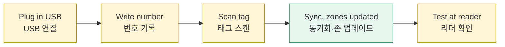

*This document was written by Kimchi and Chips*

> [!INFO] **Who:** cube desk · **When:** a new cube arrives, a cube needs a new tag or number, or cubes need new firmware or the main show · **You need:** the console, a Workstation with a working tag reader, the cubes, a USB data cable, a pen for labels
> **누가:** 큐브 담당 · **언제:** 새 큐브가 들어왔을 때, 큐브에 새 태그나 번호가 필요할 때, 큐브에 새 펌웨어나 메인쇼가 필요할 때 · **준비물:** 콘솔, 태그 리더가 작동하는 워크스테이션, 큐브, USB 데이터 케이블, 라벨용 펜

Registering a cube links three things: the cube, the **cube number** on its label, and its **tag**. Flashing puts the **firmware** (the cube's program) and the **main show** onto the cube over USB. Both keep the cube's number and tag.
<kr>큐브 등록은 세 가지를 연결합니다: 큐브, 라벨의 **큐브 번호**, **태그**. 플래시는 USB로 **펌웨어**(큐브 프로그램)와 **메인쇼**를 큐브에 넣습니다. 두 작업 모두 큐브의 번호와 태그를 유지합니다.</kr>

## A. Register cubes (Register page) | A. 큐브 등록 (Register 페이지)

This is the normal way. Switch the page on, then plug cubes in one after another.
<kr>기본 방법입니다. 페이지를 켜고 큐브를 하나씩 꽂습니다.</kr>

The page leads you through the steps and waits for the cube to answer. The automatic updates (on by default) update the zones.
<kr>페이지가 단계를 안내하고 큐브의 응답을 기다립니다. 존 업데이트는 자동 업데이트(기본 켜짐)가 합니다.</kr>

1. Plug in the Workstation. Open **Register** (⌘3). The chip under the title must say **Station ready · NFC ok**. Switch on **Register cubes as they are plugged in**. <kr>워크스테이션을 꽂습니다. **Register**(⌘3)를 엽니다. 제목 아래 칩이 **Station ready · NFC ok**여야 합니다. **Register cubes as they are plugged in**을 켭니다.</kr>

2. Plug in a cube. A new cube gets the lowest free number above 32 (never 2, 22, 39 or 43). The page shows **NEW NUMBER: write #N on the cube's label**. Write it on the label now. If the cube already has a label, type that number in **Label says** and press **Set** before the scan. <kr>큐브를 꽂습니다. 새 큐브는 32보다 큰 가장 낮은 빈 번호를 받습니다(2, 22, 39, 43 제외). 페이지에 **NEW NUMBER: write #N on the cube's label**이 표시됩니다. 지금 라벨에 적습니다. 이미 라벨이 있으면 스캔 전에 **Label says**에 그 번호를 입력하고 **Set**을 누릅니다.</kr>

{{shot:03-A2}}
A new cube: write the new number on its label, then scan its tag / 새 큐브: 새 번호를 라벨에 적고 태그 스캔

3. The cube flashes. Clear the reader. Wait for **READY TO SCAN**, then hold this cube's tag on the reader until **TAG DETECTED**. The step ends only when the cube answers. <kr>큐브가 깜박입니다. 리더 위를 비웁니다. **READY TO SCAN**을 기다린 뒤 **TAG DETECTED**가 나올 때까지 이 큐브의 태그를 댑니다. 큐브가 응답해야 단계가 끝납니다.</kr>
4. Lift the tag. The console runs **Sync** and publishes the zone database. The page says **Cube #N registered and synced. Unplug it and plug in the next cube.** <kr>태그를 뗍니다. 콘솔이 **Sync**를 실행하고 존 데이터베이스를 게시합니다. **Cube #N registered and synced. Unplug it and plug in the next cube.**가 표시됩니다.</kr>

{{shot:03-A3}}
Registered and synced: unplug it and plug in the next cube / 등록 및 동기화 완료: 분리하고 다음 큐브 연결

5. If the message ends with **(Zone database not published: …)**, click the Sync chip in the top bar. <kr>메시지 끝에 **(Zone database not published: …)**가 붙으면 상단의 Sync 칩을 누릅니다.</kr>
6. Test the cube at an updated reader and watch its light. <kr>업데이트된 리더에서 큐브를 태그하고 불빛을 확인합니다.</kr>

A waiting message is not an error: it says what the page needs. A failure never retries by itself. Use **Retry**, **Sync again**, **Start again for this cube** or **Cancel**.
<kr>대기 메시지는 오류가 아니며 페이지에 필요한 것을 알려 줍니다. 실패는 자동으로 재시도하지 않습니다. **Retry**, **Sync again**, **Start again for this cube**, **Cancel**을 사용합니다.</kr>

Only the Register page gives a new cube a number. Elsewhere (the page off, or **Pair new cubes (auto)**) a new cube shows **Needs number**: register it here, or assign its label number first.
<kr>새 큐브에 번호를 주는 곳은 Register 페이지뿐입니다. 다른 경로(페이지 꺼짐, **Pair new cubes (auto)**)에서는 새 큐브가 **Needs number**로 표시됩니다. 여기서 등록하거나 먼저 라벨 번호를 지정합니다.</kr>

> [!WARNING] Zones learn a new tag only after they receive the new zone database. Until then a zone reports the cube as unknown, even though the console says "registered".
> 존은 새 존 데이터베이스를 받은 뒤에야 새 태그를 압니다. 그 전까지는 콘솔에 "등록됨"이 표시되어도 존은 큐브를 알 수 없음(unknown)으로 표시합니다.

Evidence: Simulation-verified. The scan path has not yet run with a real cube, Workstation and tag.
<kr>근거: Simulation-verified. 실제 큐브, 워크스테이션, 태그로 스캔 경로를 실행한 적은 아직 없습니다.</kr>

More detail: {{page:X03}}
<kr>자세한 내용: {{page:X03}}</kr>

## B. Register one cube by hand (cube card) | B. 큐브 한 대 수동 등록 (큐브 카드)

Use this to re-register one cube, for a cube you cannot plug in, or when the Register page is waiting on something you must fix by hand.
<kr>큐브 한 대를 다시 등록할 때, USB로 꽂을 수 없는 큐브, 또는 Register 페이지가 직접 해결할 문제로 멈춰 있을 때 사용합니다.</kr>

1. On the Workstation panel's **Pairing** tab, check connection, radio and tag reader are all green. <kr>워크스테이션 패널의 **Pairing** 탭에서 연결, 무선, 태그 리더가 모두 초록인지 확인합니다.</kr>
2. Plug the cube in by USB. Its card opens and stays **pinned** (selected), even after you unplug it. No USB? Press **Discover** on the Workstation panel, then **Identify (flash until Stop)** and find the blinking cube. <kr>큐브를 USB로 꽂습니다. 카드가 열리고 USB를 빼도 **고정(pin)**된 상태로 남습니다. USB가 없으면 워크스테이션 패널에서 **Discover**, 이어서 **Identify (flash until Stop)**를 누르고 깜박이는 큐브를 찾습니다.</kr>

{{shot:03-1}}
Cube card after USB identification: the pinned cube, its number and tag / USB 식별 후 큐브 카드: 고정된 큐브, 번호와 태그

3. A cube without a number shows a number field, filled in with a suggestion. Press Enter to accept, or type the label's number. <kr>번호가 없는 큐브 카드에는 제안 번호가 들어 있는 번호 칸이 있습니다. Enter로 수락하거나 라벨 번호를 입력합니다.</kr>
4. Press **Register (scan a tag)** (**Replace tag (scan)** if it already has one). The cube flashes. <kr>**Register (scan a tag)**를 누릅니다(이미 태그가 있으면 **Replace tag (scan)**). 큐브가 깜박입니다.</kr>
5. Clear the reader. Wait for **READY TO SCAN**, then hold only this cube's tag on the reader. <kr>리더를 비웁니다. **READY TO SCAN**을 기다린 뒤 이 큐브의 태그만 댑니다.</kr>

6. **TAG DETECTED · REGISTERING** means still in progress. Wait for the **REGISTERED** banner and the green **Registered · ACK** on the card. <kr>**TAG DETECTED · REGISTERING**은 아직 진행 중입니다. **REGISTERED** 배너와 카드의 초록 **Registered · ACK**를 기다립니다.</kr>

{{shot:03-5}}
REGISTERED: the cube answered; the row shows the committed tag / REGISTERED: 큐브가 응답함, 행에 확정된 태그 표시

7. Check the Sync chip in the top bar shows **✓ Synced** (click it to sync now). Let the automatic updates reach the zones, then test at a reader. <kr>상단의 Sync 칩이 **✓ Synced**인지 확인합니다(누르면 바로 동기화). 자동 업데이트가 존에 전달한 뒤 리더에서 확인합니다.</kr>
8. Press **Unpin** when finished. <kr>끝나면 **Unpin**을 누릅니다.</kr>

**Register** greyed out? Hover it: the tooltip gives the reason. If a tag already belonged to another cube, the scan moves it to this cube; the other cube keeps its number but loses its tag.
<kr>**Register**가 비활성이면 마우스를 올립니다. 툴팁에 이유가 표시됩니다. 태그가 다른 큐브의 것이었다면 스캔이 태그를 이 큐브로 옮깁니다. 다른 큐브는 번호는 유지하고 태그를 잃습니다.</kr>

> [!WARNING] *Delivered* only means the radio message arrived. Only **Registered · ACK** means the cube answered. To prove the cube kept it, switch the cube off and on and test again.
> *Delivered*는 무선 메시지가 도착했다는 뜻일 뿐입니다. **Registered · ACK**만 큐브가 응답했다는 뜻입니다. 큐브가 등록을 유지하는지 확인하려면 전원을 껐다 켜고 다시 확인합니다.

More detail: {{page:X03}}, cards: {{page:X11}}
<kr>자세한 내용: {{page:X03}}, 카드: {{page:X11}}</kr>

## C. Flash cubes (Flash page) | C. 큐브 플래시 (Flash 페이지)

The Flash page brings each cube's firmware **and** main show up to date over USB, one cube after another. Today six cubes run **v1.7.0-USB.1** with main show **v6**; the rest run **v1.4.1-USB.2** (Bench-verified).
<kr>Flash 페이지는 USB로 큐브마다 펌웨어**와** 메인쇼를 차례로 최신으로 만듭니다. 현재 큐브 6개가 **v1.7.0-USB.1**과 메인쇼 **v6**을 가지고 있고, 나머지는 **v1.4.1-USB.2**입니다(Bench-verified).</kr>

> [!TIP] A v1.4.1 cube still works with every zone and plays the original show. It cannot play a newly published show. The Attention message about it is information, not an order to flash.
> v1.4.1 큐브도 모든 존과 동작하고 원래 쇼를 재생합니다. 새로 게시한 쇼는 재생하지 못합니다. 이에 대한 Attention 메시지는 정보이지 플래시하라는 지시가 아닙니다.

1. Clear the bench: unplug every board that is not a cube. Open **Flash cubes** (⌘2). Check the chips **Firmware v…** and **Show vN**. Switch on **Flash cubes as they are plugged in**. It is off every time the console starts. <kr>작업대를 정리해 큐브가 아닌 보드는 모두 뽑습니다. **Flash cubes**(⌘2)를 엽니다. **Firmware v…**와 **Show vN** 칩을 확인합니다. **Flash cubes as they are plugged in**을 켭니다. 콘솔을 시작할 때마다 꺼져 있습니다.</kr>

2. Plug in a cube. The steps run: **USB** → **Firmware** → **Show**. Keep the cable and power steady. A cube that already has this build skips the firmware step. <kr>큐브를 꽂습니다. **USB** → **Firmware** → **Show** 순서로 진행됩니다. 케이블과 전원을 그대로 둡니다. 이미 이 빌드인 큐브는 펌웨어 단계를 건너뜁니다.</kr>
3. Wait for the rising four-note chord and the pop-up "… written and verified, show vN written and confirmed by the cube". Unplug it and plug in the next cube. <kr>올라가는 네 음 화음과 "… written and verified, show vN written and confirmed by the cube" 알림을 기다립니다. 분리하고 다음 큐브를 꽂습니다.</kr>

{{shot:04-F2}}
Firmware written and verified, show written and confirmed / 펌웨어 쓰기·검증, 쇼 쓰기·확인 완료

4. On failure the page stops (falling three notes). Read the reason, fix it, then press **Retry (rewrite the firmware)**. <kr>실패하면 페이지가 멈춥니다(내려가는 세 음). 이유를 읽고 해결한 뒤 **Retry (rewrite the firmware)**를 누릅니다.</kr>
5. Switch the page off when done. <kr>끝나면 페이지를 끕니다.</kr>

With the Register page also on, each new cube is flashed first, then registered.
<kr>Register 페이지도 켜 두면 새 큐브를 먼저 플래시한 뒤 등록합니다.</kr>

**Automatic upgrade.** While Register and Flash are both off, a plugged-in cube with older firmware is upgraded by itself (firmware plus the published show, the same steps as this page). Its row in the **Automatic updates** panel shows **Starts in N s** first; press **Skip** to leave it alone. With Register or Flash on, those pages decide. (Simulation-verified)
<kr>**자동 업그레이드.** Register와 Flash가 모두 꺼져 있으면, 꽂은 큐브의 펌웨어가 오래된 경우 스스로 업그레이드합니다(펌웨어와 게시된 쇼, 이 페이지와 같은 단계). **Automatic updates** 패널의 행에 먼저 **Starts in N s**가 표시됩니다. 건드리지 않으려면 **Skip**을 누릅니다. Register나 Flash가 켜져 있으면 그 페이지가 처리합니다. (Simulation-verified)</kr>

> [!WARNING] The page skips a board it identifies as a Workstation, zone board or controller. A board that answers nothing is **flashed** as a cube. While the page is on, plug in cubes only.
> 페이지는 워크스테이션, 존 보드, 컨트롤러로 식별된 보드는 건너뜁니다. 아무 응답이 없는 보드는 큐브로 **플래시됩니다**. 페이지가 켜져 있는 동안에는 큐브만 꽂습니다.

> [!DANGER] Never use **Force flash as a zone (overwrites it)** or **Force flash (unregisters the cube)** as a fix, and never erase the whole chip. If a card says **needs attention**, stop and call an engineer. If it says **boot not confirmed**, press **Check boot again**; do not reflash. Never flash an **Unidentified board** or a **Protected** one.
> 문제 해결 수단으로 **Force flash as a zone (overwrites it)**나 **Force flash (unregisters the cube)**를 쓰거나 칩 전체를 지우지 않습니다. 카드에 **needs attention**이 표시되면 멈추고 엔지니어를 부릅니다. **boot not confirmed**이면 다시 플래시하지 말고 **Check boot again**을 누릅니다. **Unidentified board**나 **Protected** 보드는 절대 플래시하지 않습니다.

More detail: {{page:X03}}
<kr>자세한 내용: {{page:X03}}</kr>

## D. Update one cube from its panel | D. 큐브 패널에서 한 대 업데이트

Use this for a first test cube or a single cube. Finish any registration first, and keep the **Flash cubes** page off.
<kr>첫 시험 큐브나 한 대만 할 때 사용합니다. 먼저 등록을 끝내고 **Flash cubes** 페이지는 꺼 둡니다.</kr>

1. Plug in the cube. On its **Firmware** tab read **Version matches**, **Update needed** or **Not verified**, and the **Main show** row. <kr>큐브를 꽂습니다. **Firmware** 탭에서 **Version matches**, **Update needed**, **Not verified**와 **Main show** 행을 확인합니다.</kr>

{{shot:04-1}}
Cube › Firmware: the reported version differs from the local build / Cube › Firmware: 보고된 버전이 로컬 빌드와 다름

2. Press **Flash cube firmware**. It keeps the number and tag, and replaces the show only if it is older. For the show alone, press **Update show over USB** (firmware v1.5.0 or later). <kr>**Flash cube firmware**를 누릅니다. 번호와 태그는 유지하고 쇼는 오래된 경우에만 교체합니다. 쇼만 바꾸려면 **Update show over USB**를 누릅니다(펌웨어 v1.5.0 이상).</kr>
3. Wait for **Verified**. Unplug only after the job finishes. <kr>**Verified**를 기다립니다. 작업이 끝난 뒤에만 분리합니다.</kr>

{{shot:04-3}}
Verified: the cube rebooted and reported the new version / 검증 완료: 큐브가 재부팅 후 새 버전을 보고함

4. Test the cube's real lights and a zone. <kr>큐브의 실제 불빛과 존 동작을 확인합니다.</kr>

More detail: {{page:X03}}
<kr>자세한 내용: {{page:X03}}</kr>

## What success looks like | 정상 상태

| You see · 화면 | It means · 의미 | If not · 아니면 |
|---|---|---|
| **Station ready · NFC ok** | Workstation and tag reader ready · 워크스테이션과 리더 준비 | {{page:H5}} |
| **REGISTERED**, green **Registered · ACK** | The cube answered (Acknowledged) · 큐브 응답 | **Retry the saved registration**; {{page:H5}} |
| **Cube #N registered and synced** | Registered and zone database published · 등록·게시 완료 | **Sync again** |
| Every zone **Current** in **Zone relay** · 모든 존 **Current** | Zones know the new tag · 존이 새 태그를 앎 | **Update all out-of-date zones**; {{page:H4}} |
| Four-note chord, "… show vN written and confirmed" · 네 음 화음 | Firmware and show current · 펌웨어·쇼 최신 | {{page:H5}} |
| **Verified**, then **Version matches** | Firmware checked, number and tag kept · 펌웨어 확인, 번호·태그 유지 | **Check boot again** |
| The cube lights correctly at a reader · 리더에서 정상 점등 | End-to-end proof · 최종 확인 | {{page:H5}} |

**Version matches** compares the reported version with the local build. It does not check the program bytes.
<kr>**Version matches**는 보고된 버전과 로컬 빌드를 비교할 뿐, 프로그램 바이트를 검사하지 않습니다.</kr>

More detail: {{page:X03}}, cards: {{page:X11}}
<kr>자세한 내용: {{page:X03}}, 카드: {{page:X11}}</kr>

*This document was written by Kimchi and Chips*
