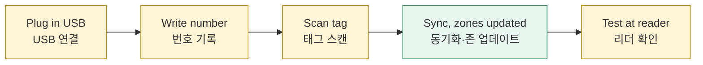
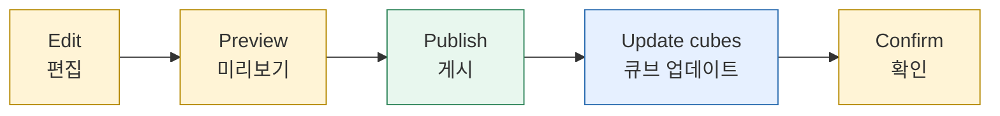

*This document was written by Kimchi and Chips*

This page covers the three things you do to cubes. **A. Flash** puts the **firmware** (the cube's program) and the **main show** onto a cube over USB. **B. Register** links a cube, the **cube number** on its label and its **tag**. **C. Show design** changes the finale animation and sends it to the cubes. Flashing and registering both keep the cube's number and tag. Each part starts with a simple way and then gives the advanced, by-hand way.
<kr>이 페이지는 큐브에 하는 세 가지 작업을 다룹니다. **A. 플래시**는 USB로 큐브에 **펌웨어**(큐브 프로그램)와 **메인쇼**를 넣습니다. **B. 등록**은 큐브, 라벨의 **큐브 번호**, **태그**를 연결합니다. **C. 쇼 디자인**은 피날레 애니메이션을 바꾸고 큐브에 보냅니다. 플래시와 등록 모두 큐브의 번호와 태그를 유지합니다. 각 부분은 간단한 방법으로 시작하고, 이어서 고급(수동) 방법을 설명합니다.</kr>

## A. Flash cubes | A. 큐브 플래시

The **Flash cubes** page brings each cube's firmware **and** main show up to date over USB, one cube after another. Today six cubes (#17, #33, #39, #52, #58, #95) run **v1.7.0-USB.1** and hold main show **v6**. The rest run **v1.4.1-USB.2** (Bench-verified, as recorded by the console; LEDs not recorded).
<kr>**Flash cubes** 페이지는 USB로 큐브마다 펌웨어**와** 메인쇼를 차례로 최신으로 만듭니다. 현재 큐브 6개(#17, #33, #39, #52, #58, #95)가 **v1.7.0-USB.1**이고 메인쇼 **v6**을 가지고 있습니다. 나머지는 **v1.4.1-USB.2**입니다(Bench-verified, 콘솔 기록 기준, LED 미기록).</kr>

> [!TIP] A v1.4.1 cube still works with every zone and plays the original built-in show. It cannot play a newly published show. The Attention message about it is information, not an order to flash.
> v1.4.1 큐브도 모든 존과 동작하고 내장된 원래 쇼를 재생합니다. 새로 게시한 쇼는 재생하지 못합니다. 이에 대한 Attention 메시지는 정보이지 플래시하라는 지시가 아닙니다.

### Simple: the Flash page | 간단: Flash 페이지

1. Clear the bench: unplug every board that is not a cube. Open **Flash cubes** (⌘2). Check the chips **Firmware v…** and **Show vN**. Switch on **Flash cubes as they are plugged in**. The switch is off every time the console starts. <kr>작업대를 정리해 큐브가 아닌 보드는 모두 뽑습니다. **Flash cubes**(⌘2)를 엽니다. **Firmware v…**와 **Show vN** 칩을 확인합니다. **Flash cubes as they are plugged in**을 켭니다. 이 스위치는 콘솔을 시작할 때마다 꺼져 있습니다.</kr>
2. Plug in one cube. The steps run in order: **USB** → **Firmware** → **Show**. Keep the cable and power steady. A cube that already has this build skips the firmware step. <kr>큐브 하나를 꽂습니다. **USB** → **Firmware** → **Show** 순서로 진행됩니다. 케이블과 전원을 그대로 둡니다. 이미 이 빌드인 큐브는 펌웨어 단계를 건너뜁니다.</kr>
3. Wait for the rising four-note chord and the message "… written and verified, show vN written and confirmed by the cube". Unplug the cube and plug in the next one. <kr>올라가는 네 음 화음과 "… written and verified, show vN written and confirmed by the cube" 메시지를 기다립니다. 큐브를 분리하고 다음 큐브를 꽂습니다.</kr>

{{shot:04-F2}}
Firmware written and verified, show written and confirmed / 펌웨어 쓰기·검증, 쇼 쓰기·확인 완료

4. If a step fails, the page stops and plays three falling notes. Read the reason, fix it, then press **Retry (rewrite the firmware)**. <kr>단계가 실패하면 페이지가 멈추고 내려가는 세 음이 울립니다. 이유를 읽고 해결한 뒤 **Retry (rewrite the firmware)**를 누릅니다.</kr>
5. Switch the page off when you finish. <kr>끝나면 페이지를 끕니다.</kr>

The Show step writes the published show only when it is newer than the cube's. Other results you may read: "Show vN was already on the cube", "The cube holds show vN, newer than the published one; kept", "Firmware too old to hold a show; the built-in show is kept", "No published show on this computer; the built-in show is kept".
<kr>Show 단계는 게시된 쇼가 큐브의 쇼보다 새로울 때만 씁니다. 그 밖의 결과: "Show vN was already on the cube", "The cube holds show vN, newer than the published one; kept", "Firmware too old to hold a show; the built-in show is kept", "No published show on this computer; the built-in show is kept".</kr>

With the Register page also on, each new cube is flashed first and then registered.
<kr>Register 페이지도 켜 두면 새 큐브를 먼저 플래시한 뒤 등록합니다.</kr>

When both Register and Flash are off, a plugged-in cube with older firmware is also upgraded by itself, with the same steps. See "What the console does by itself" in {{page:H4}}.
<kr>Register와 Flash가 모두 꺼져 있을 때도, 꽂은 큐브의 펌웨어가 오래되었으면 같은 단계로 스스로 업그레이드됩니다. {{page:H4}}의 "콘솔이 스스로 하는 일"을 봅니다.</kr>

Evidence: the Flash page is Bench-verified on six cubes (23 September: firmware verified, boot confirmed, registration kept, show written and read back).
<kr>근거: Flash 페이지는 큐브 6개로 Bench-verified(9월 23일: 펌웨어 검증, 부팅 확인, 등록 유지, 쇼 쓰기·읽기 확인).</kr>

> [!WARNING] The page skips a board it identifies as a Workstation, zone board or controller. A board that answers nothing is **flashed** as a cube. While the page is on, plug in cubes only.
> 페이지는 워크스테이션, 존 보드, 컨트롤러로 식별된 보드는 건너뜁니다. 아무 응답이 없는 보드는 큐브로 **플래시됩니다**. 페이지가 켜져 있는 동안에는 큐브만 꽂습니다.

### Advanced: one cube from its panel | 고급: 큐브 패널에서 한 대씩

Use this for a first test cube or a single cube. Finish any registration first, and keep the **Flash cubes** page off.
<kr>첫 시험 큐브나 한 대만 할 때 사용합니다. 먼저 등록을 끝내고 **Flash cubes** 페이지는 꺼 둡니다.</kr>

1. Plug in the cube. On its **Firmware** tab, read **Version matches**, **Update needed** or **Not verified**, and the **Main show** row ("vN from NVS", "the built-in show", or "not reported" for a cube before v1.5.0). <kr>큐브를 꽂습니다. **Firmware** 탭에서 **Version matches**, **Update needed**, **Not verified**와 **Main show** 행("vN from NVS", "the built-in show", v1.5.0 이전 큐브는 "not reported")을 확인합니다.</kr>

{{shot:04-1}}
Cube › Firmware: the reported version differs from the local build / Cube › Firmware: 보고된 버전이 로컬 빌드와 다름

2. Choose one button: <kr>버튼 하나를 고릅니다.</kr>
   - **Flash cube firmware**: writes and verifies the firmware, checks the boot message, then brings the show up to the published one. Number and tag are kept. <kr>**Flash cube firmware**: 펌웨어를 쓰고 검증하고 부팅 메시지를 확인한 뒤 쇼를 게시본으로 올립니다. 번호와 태그는 유지됩니다.</kr>
   - **Update show over USB**: writes only the published show, reads it back, restarts the cube and checks that it reports the show. Firmware untouched. Needs v1.5.0 or later and a published show. <kr>**Update show over USB**: 게시된 쇼만 쓰고, 다시 읽고, 큐브를 재시작해 쇼를 보고하는지 확인합니다. 펌웨어는 그대로입니다. v1.5.0 이상과 게시된 쇼가 필요합니다.</kr>
   - **Check boot (no reflash)**: only repeats the boot-message check, without writing anything. Use it after "boot not confirmed". <kr>**Check boot (no reflash)**: 아무것도 쓰지 않고 부팅 메시지 확인만 다시 합니다. "boot not confirmed" 뒤에 사용합니다.</kr>
3. Wait for **Verified**. Unplug only after the job finishes. <kr>**Verified**를 기다립니다. 작업이 끝난 뒤에만 분리합니다.</kr>

{{shot:04-3}}
Verified: the cube rebooted and reported the new version / 검증 완료: 큐브가 재부팅 후 새 버전을 보고함

4. Test the cube's real lights and one zone. <kr>큐브의 실제 불빛과 존 하나를 확인합니다.</kr>

**Retry and Skip.** On the Flash page, **Retry (rewrite the firmware)** flashes the failed cube again, even if its firmware is current. In the **Automatic updates** panel, an automatic upgrade first shows **Starts in N s**: press **Skip** to leave that cube alone.
<kr>**Retry와 Skip.** Flash 페이지의 **Retry (rewrite the firmware)**는 실패한 큐브를 펌웨어가 최신이어도 다시 플래시합니다. **Automatic updates** 패널에서 자동 업그레이드는 먼저 **Starts in N s**를 표시합니다. 그 큐브를 건드리지 않으려면 **Skip**을 누릅니다.</kr>

**What is refused.** The console never probes or flashes a **Protected** board (the installed pairing station). The Flash page skips a board it identifies as a Workstation, zone board or controller. Never flash an **Unidentified board** as a cube.
<kr>**거부되는 것.** 콘솔은 **Protected** 보드(설치된 페어링 스테이션)를 조회하거나 플래시하지 않습니다. Flash 페이지는 워크스테이션, 존 보드, 컨트롤러로 식별된 보드를 건너뜁니다. **Unidentified board**를 큐브로 플래시하지 않습니다.</kr>

> [!DANGER] Never use **Force flash as a zone (overwrites it)** or **Force flash (unregisters the cube)** as a fix, and never erase the whole chip. If a card says **needs attention**, stop and call an engineer. If it says **boot not confirmed**, press **Check boot again**; do not reflash.
> 문제 해결 수단으로 **Force flash as a zone (overwrites it)**나 **Force flash (unregisters the cube)**를 쓰거나 칩 전체를 지우지 않습니다. 카드에 **needs attention**이 표시되면 멈추고 엔지니어를 부릅니다. **boot not confirmed**이면 다시 플래시하지 말고 **Check boot again**을 누릅니다.

A cube that does not start after a flash, or that lost its number: see {{page:H5}} and the recovery steps in {{page:X03}}.
<kr>플래시 후 시작하지 않거나 번호를 잃은 큐브: {{page:H5}}와 {{page:X03}}의 복구 절차를 봅니다.</kr>

More detail: {{page:X03}}
<kr>자세한 내용: {{page:X03}}</kr>

## B. Register cubes | B. 큐브 등록

Registering tells a cube its number and its tag. You need a Workstation (or the installed pairing station) with a working tag reader, the cube, a USB data cable and a pen for the label.
<kr>등록은 큐브에 번호와 태그를 알려 줍니다. 태그 리더가 작동하는 워크스테이션(또는 설치된 페어링 스테이션), 큐브, USB 데이터 케이블, 라벨용 펜이 필요합니다.</kr>

### Simple: the Register page | 간단: Register 페이지

The page leads you through USB → Number → NFC scan → Sync, and waits for the cube to answer at each step. The automatic updates (on by default) then bring the zones up to date.
<kr>페이지가 USB → 번호 → NFC 스캔 → 동기화를 안내하고, 단계마다 큐브의 응답을 기다립니다. 그다음 자동 업데이트(기본 켜짐)가 존을 최신으로 만듭니다.</kr>

1. Plug in the Workstation. Open **Register** (⌘3). The chip under the title must say **Station ready · NFC ok**. Switch on **Register cubes as they are plugged in** (off by default). <kr>워크스테이션을 꽂습니다. **Register**(⌘3)를 엽니다. 제목 아래 칩이 **Station ready · NFC ok**여야 합니다. **Register cubes as they are plugged in**을 켭니다(기본 꺼짐).</kr>
2. Plug in a cube. A new cube gets a new number, handed out by the web inventory (the page shows "Getting a new number from the web…" for a moment). The page then shows **NEW NUMBER: write #N on the cube's label**: write it on the label now. If the cube already has a label, type that number in **Label says** and press **Set** before the scan. <kr>큐브를 꽂습니다. 새 큐브는 웹 인벤토리가 나눠 주는 새 번호를 받습니다(잠시 "Getting a new number from the web…"가 표시됨). **NEW NUMBER: write #N on the cube's label**이 표시되면 지금 라벨에 적습니다. 이미 라벨이 있으면 스캔 전에 **Label says**에 그 번호를 입력하고 **Set**을 누릅니다.</kr>

{{shot:03-A2}}
A new cube: write the new number on its label, then scan its tag / 새 큐브: 새 번호를 라벨에 적고 태그 스캔

3. The cube flashes. Clear the reader. Wait for **READY TO SCAN**, then hold this cube's tag on the reader until **TAG DETECTED**. The step ends only when the cube answers. <kr>큐브가 깜박입니다. 리더 위를 비웁니다. **READY TO SCAN**을 기다린 뒤 **TAG DETECTED**가 나올 때까지 이 큐브의 태그를 댑니다. 큐브가 응답해야 단계가 끝납니다.</kr>
4. Lift the tag. The console runs **Sync** and publishes the zone database. The page says **Cube #N registered and synced. Unplug it and plug in the next cube.** <kr>태그를 뗍니다. 콘솔이 **Sync**를 실행하고 존 데이터베이스를 게시합니다. **Cube #N registered and synced. Unplug it and plug in the next cube.**가 표시됩니다.</kr>

{{shot:03-A3}}
Registered and synced: unplug it and plug in the next cube / 등록 및 동기화 완료: 분리하고 다음 큐브 연결

5. If the message ends with **(Zone database not published: …)**, click the Sync chip in the top bar. <kr>메시지 끝에 **(Zone database not published: …)**가 붙으면 상단의 Sync 칩을 누릅니다.</kr>
6. Test the cube at an updated reader and watch its light. <kr>업데이트된 리더에서 큐브를 태그하고 불빛을 확인합니다.</kr>

A waiting message is not an error: it says what the page needs. A failure never retries by itself. Use **Retry**, **Sync again**, **Start again for this cube** or **Cancel**.
<kr>대기 메시지는 오류가 아니며 페이지에 필요한 것을 알려 줍니다. 실패는 자동으로 재시도하지 않습니다. **Retry**, **Sync again**, **Start again for this cube**, **Cancel**을 사용합니다.</kr>

> [!WARNING] Zones learn a new tag only after they receive the new zone database. Until then a zone reports the cube as unknown, even though the console says "registered".
> 존은 새 존 데이터베이스를 받은 뒤에야 새 태그를 압니다. 그 전까지는 콘솔에 "등록됨"이 표시되어도 존은 큐브를 알 수 없음(unknown)으로 표시합니다.

Evidence: Simulation-verified. The scan path has not yet run with a real cube, Workstation and tag.
<kr>근거: Simulation-verified. 실제 큐브, 워크스테이션, 태그로 스캔 경로를 실행한 적은 아직 없습니다.</kr>

### Advanced: by hand from the cube card | 고급: 큐브 카드에서 수동으로

Use this to re-register one cube, for a cube you cannot plug in, or when the Register page waits on something you must fix by hand.
<kr>큐브 한 대를 다시 등록할 때, USB로 꽂을 수 없는 큐브, 또는 Register 페이지가 직접 해결할 문제로 멈춰 있을 때 사용합니다.</kr>

1. On the Workstation panel's **Pairing** tab, check that connection, radio and tag reader are all green. <kr>워크스테이션 패널의 **Pairing** 탭에서 연결, 무선, 태그 리더가 모두 초록인지 확인합니다.</kr>
2. Plug the cube in by USB. Its card opens and stays **pinned** (selected), even after you unplug it. No USB? Press **Discover** on the Workstation panel, then **Identify (flash until Stop)** and find the blinking cube. <kr>큐브를 USB로 꽂습니다. 카드가 열리고 USB를 빼도 **고정(pin)**된 상태로 남습니다. USB가 없으면 워크스테이션 패널에서 **Discover**, 이어서 **Identify (flash until Stop)**를 누르고 깜박이는 큐브를 찾습니다.</kr>

{{shot:03-1}}
Cube card after USB identification: the pinned cube, its number and tag / USB 식별 후 큐브 카드: 고정된 큐브, 번호와 태그

3. A cube without a number shows a number field with a suggestion. Press Enter to accept, or type the label's number. <kr>번호가 없는 큐브 카드에는 제안 번호가 들어 있는 번호 칸이 있습니다. Enter로 수락하거나 라벨 번호를 입력합니다.</kr>
4. Press **Register (scan a tag)** (**Replace tag (scan)** if it already has one). The cube flashes. Clear the reader, wait for **READY TO SCAN**, then hold only this cube's tag on the reader. <kr>**Register (scan a tag)**를 누릅니다(이미 태그가 있으면 **Replace tag (scan)**). 큐브가 깜박입니다. 리더를 비우고 **READY TO SCAN**을 기다린 뒤 이 큐브의 태그만 댑니다.</kr>
5. **TAG DETECTED · REGISTERING** means still in progress. Wait for the **REGISTERED** banner and the green **Registered · ACK** on the card. <kr>**TAG DETECTED · REGISTERING**은 아직 진행 중입니다. **REGISTERED** 배너와 카드의 초록 **Registered · ACK**를 기다립니다.</kr>

{{shot:03-5}}
REGISTERED: the cube answered; the row shows the committed tag / REGISTERED: 큐브가 응답함, 행에 확정된 태그 표시

6. Check the Sync chip in the top bar shows **✓ Synced** (click it to sync now). Let the automatic updates reach the zones, then test at a reader. Press **Unpin** when finished. <kr>상단의 Sync 칩이 **✓ Synced**인지 확인합니다(누르면 바로 동기화). 자동 업데이트가 존에 전달한 뒤 리더에서 확인합니다. 끝나면 **Unpin**을 누릅니다.</kr>

**Renumbering.** Type the new number in the card's **Change number** field and press Enter. The tag is kept. If the cube is out of range, the new number is only saved: bring the cube in range, press **Send saved mapping**, then **Sync**.
<kr>**번호 변경.** 카드의 **Change number** 칸에 새 번호를 입력하고 Enter를 누릅니다. 태그는 유지됩니다. 큐브가 범위 밖이면 새 번호는 저장만 됩니다. 큐브를 범위 안으로 가져와 **Send saved mapping**을 누른 뒤 **Sync**를 합니다.</kr>

**Send saved mapping** sends the cube its saved number and tag over the air, without a new scan. Use it after a renumber, or when a registration is not confirmed.
<kr>**Send saved mapping**은 새 스캔 없이 저장된 번호와 태그를 무선으로 큐브에 보냅니다. 번호 변경 후나 등록이 확인되지 않았을 때 사용합니다.</kr>

**Pair new cubes (auto)** (Workstation panel › **Pairing**) finds unregistered cubes over the air, blinks each in turn and waits for its tag. It pairs a new cube once the web has given it a number. Controls: **Skip**, **Retry paused**, **■ Stop**.
<kr>**Pair new cubes (auto)**(워크스테이션 패널 › **Pairing**)는 등록되지 않은 큐브를 무선으로 찾아 차례로 깜박이게 하고 태그를 기다립니다. 새 큐브는 웹이 번호를 준 뒤에 등록합니다. 제어: **Skip**, **Retry paused**, **■ Stop**.</kr>

Edge cases, in short: <kr>예외 상황 요약:</kr>
- **Register** greyed out? Hover it: the tooltip gives the reason. <kr>**Register**가 비활성이면 마우스를 올립니다. 툴팁에 이유가 나옵니다.</kr>
- A tag that belonged to another cube moves to this cube. The other cube keeps its number but loses its tag. <kr>다른 큐브의 태그를 스캔하면 태그가 이 큐브로 옮겨집니다. 다른 큐브는 번호는 유지하고 태그를 잃습니다.</kr>
- A registration that was not confirmed stays saved. **Register** still works, and the old mapping stays until a new scan is accepted. <kr>확인되지 않은 등록은 저장된 채로 남습니다. **Register**는 계속 쓸 수 있고, 새 스캔이 수락될 때까지 이전 매핑이 유지됩니다.</kr>

**Numbering.** New numbers are handed out by the web inventory, so two computers never give out the same number. The web gives the lowest free number above 32, never 2, 22, 39 or 43; a number you type by hand may be lower. If the web cannot be reached, a new cube shows **Needs number** and the console tries again every minute; you can also type its label number by hand. A computer that has never signed in to the web picks the number itself. (Code-checked; the web side is still **To confirm**.)
<kr>**번호 규칙.** 새 번호는 웹 인벤토리가 나눠 주므로 두 컴퓨터가 같은 번호를 주는 일이 없습니다. 웹은 32보다 큰 가장 낮은 빈 번호를 주며 2, 22, 39, 43은 쓰지 않습니다. 직접 입력하는 번호는 더 낮아도 됩니다. 웹에 연결할 수 없으면 새 큐브는 **Needs number**로 표시되고 콘솔이 1분마다 다시 시도합니다. 라벨 번호를 직접 입력해도 됩니다. 웹에 로그인한 적이 없는 컴퓨터는 스스로 번호를 정합니다. (Code-checked, 웹 쪽은 **To confirm**)</kr>

> [!WARNING] *Delivered* only means the radio message arrived. Only **Registered · ACK** means the cube answered. To prove the cube kept it, switch the cube off and on and test again.
> *Delivered*는 무선 메시지가 도착했다는 뜻일 뿐입니다. **Registered · ACK**만 큐브가 응답했다는 뜻입니다. 큐브가 등록을 유지하는지 확인하려면 전원을 껐다 켜고 다시 확인합니다.

More detail: {{page:X03}}, cards: {{page:X11}}
<kr>자세한 내용: {{page:X03}}, 카드: {{page:X11}}</kr>

### B3. Check that a cube is registered, using the Workstation reader | B3. 워크스테이션 리더로 큐브 등록 확인

Place a cube's tag on the Workstation's reader and the cube flashes blue/red for 2 s. That proves the tag belongs to a cube in the inventory and the radio reaches that cube. Use it to check a batch of cubes quickly, without a zone.
<kr>큐브의 태그를 워크스테이션 리더에 올리면 큐브가 2초 동안 파랑/빨강으로 깜박입니다. 태그가 인벤토리의 큐브 것이고 무선이 그 큐브에 닿는다는 증거입니다. 존 없이 여러 큐브를 빠르게 확인할 때 사용합니다.</kr>

1. Open the Workstation panel. The **On the reader** card must be there and show no NFC warning (the card appears only on a board with a reader). <kr>워크스테이션 패널을 엽니다. **On the reader** 카드가 있고 NFC 경고가 없어야 합니다(리더가 있는 보드에만 카드가 나타남).</kr>
2. Turn on **Flash the cube when its tag is read**, the switch at the top of the card. <kr>카드 맨 위의 스위치 **Flash the cube when its tag is read**를 켭니다.</kr>
3. Place a cube's tag on the reader. The card shows the cube's number, and the cube flashes blue/red for 2 s. "Last automatic flash" shows the number, the result and the time. <kr>큐브의 태그를 리더에 올립니다. 카드에 큐브 번호가 나오고 큐브가 2초 동안 파랑/빨강으로 깜박입니다. "Last automatic flash"에 번호, 결과, 시각이 표시됩니다.</kr>
4. Check the cubes one by one. Lift each tag off the reader before you place the next. <kr>큐브를 한 대씩 확인합니다. 다음 태그를 올리기 전에 앞의 태그를 리더에서 뗍니다.</kr>
5. Turn the switch off when you are done. <kr>끝나면 스위치를 끕니다.</kr>

| Result · 결과 | What it means · 의미 | What to do · 조치 |
|---|---|---|
| The cube flashes (**flashed**) · 큐브가 깜박임 | Registered, and the radio reaches it · 등록됨, 무선 도달 | Nothing · 없음 |
| **Unknown tag** / **not flashed: unknown tag** | No cube owns this tag · 이 태그의 큐브 없음 | Register the cube (B) · 큐브 등록(B) |
| A number shows, nothing flashes · 번호는 나오나 깜박임 없음 | The cube is off, out of range, or the inventory has the wrong cube for this tag · 큐브 꺼짐, 범위 밖, 또는 태그에 다른 큐브가 기록됨 | Check it is on and near; press **Discover**; **Send saved mapping** · 전원·거리 확인, **Discover**, **Send saved mapping** |
| **flashed (pending tag)** | The registration was never acknowledged · 등록이 확인되지 않음 | **Send saved mapping** again · **Send saved mapping** 다시 |
| **not flashed: the board was busy** | Another operation was running · 다른 작업 진행 중 | Stop it, then place the tag again · 작업을 멈추고 태그를 다시 올림 |

The switch only blinks the cube's LEDs: it writes no firmware and nothing to the database. It is off every time the console starts. Each placement flashes once: lift the tag and place it again to repeat. Nothing is sent while the board is busy with pairing, registration or another flash.
<kr>이 스위치는 큐브 LED를 깜박이게만 합니다. 펌웨어를 쓰지 않고 데이터베이스에도 아무것도 기록하지 않습니다. 콘솔을 시작할 때마다 꺼져 있습니다. 한 번 올릴 때 한 번만 깜박이므로, 다시 하려면 태그를 뗐다가 다시 올립니다. 보드가 페어링, 등록, 다른 깜박임으로 바쁜 동안에는 아무것도 보내지 않습니다.</kr>

Evidence: Simulation-verified. More detail: {{page:X03}}, {{page:X11}}
<kr>근거: Simulation-verified. 자세한 내용: {{page:X03}}, {{page:X11}}</kr>

## C. Show design | C. 쇼 디자인

The **Show editor** changes the main show: the finale animation every cube plays from its own memory. You edit a working copy, preview it, publish it as a new version, then send it to the cubes. Only cubes on firmware v1.5.0 or later can receive a new show; older cubes keep the built-in original.
<kr>**Show editor**는 메인쇼, 즉 모든 큐브가 자기 메모리에서 재생하는 피날레 애니메이션을 바꿉니다. 작업본을 편집하고, 미리 보고, 새 버전으로 게시한 뒤, 큐브에 보냅니다. 펌웨어 v1.5.0 이상 큐브만 새 쇼를 받을 수 있고, 이전 큐브는 내장된 원래 쇼를 유지합니다.</kr>

| Cube firmware · 큐브 펌웨어 | What it can do · 가능한 것 |
|---|---|
| v1.4.1-USB.2 | Plays the built-in show only; still starts on the trigger · 내장 쇼만 재생, 트리거로 시작은 됨 |
| v1.5.0 | Receives a published show; joins a running show late · 게시된 쇼 수신, 진행 중인 쇼에 늦게 합류 |
| v1.6.0 | Fanning (per-cube offsets) · 팬닝(큐브별 시간차) |
| v1.7.0 | Follows the live preview · 실시간 미리보기 따라감 |

### C1. Start a session | C1. 세션 시작

Open **Show editor** in the top bar (⌘6, Ctrl+6 on Windows). Editing, previewing on screen and publishing need no hardware; publishing needs the web password.
<kr>상단 바에서 **Show editor**를 엽니다(⌘6, Windows는 Ctrl+6). 편집, 화면 미리보기, 게시에는 하드웨어가 필요 없습니다. 게시에는 웹 비밀번호가 필요합니다.</kr>

The **working copy** lives on this computer only. It saves itself 1.2 s after your last change. The first time, it starts from the published show (or, if none, from the built-in default).
<kr>**작업본**은 이 컴퓨터에만 있습니다. 마지막 변경 1.2초 뒤 자동 저장됩니다. 처음에는 게시된 쇼(없으면 내장 기본 쇼)에서 시작합니다.</kr>

Read the two chips under the title: **unsaved edits** or **saved on this computer**, and **same as published vN**, **differs from published vN** or **not published yet**. The header buttons are **↺ Revert to vN** (one click; Undo brings your edits back), **Publish** and **Pull** (fetch the published show from the web).
<kr>제목 아래 칩 두 개를 읽습니다. **unsaved edits** 또는 **saved on this computer**, 그리고 **same as published vN**, **differs from published vN**, **not published yet**. 머리글 버튼은 **↺ Revert to vN**(한 번 클릭, Undo로 편집 복구), **Publish**, **Pull**(웹에서 게시된 쇼 가져오기)입니다.</kr>

The **Working copy** card has **Revert to published** and **Start from the default** (both hold to confirm; they discard this computer's edits), **Export JSON** and **Import JSON…**.
<kr>**Working copy** 카드에는 **Revert to published**와 **Start from the default**(둘 다 길게 눌러 확인, 이 컴퓨터의 편집을 버림), **Export JSON**, **Import JSON…**이 있습니다.</kr>

A red banner **The cubes would refuse this show** gives the reason and disables **Publish**. Limits: 1–128 cues, length 1 ms to 1 hour, levels 0–100, at most 3 colours per cue.
<kr>빨간 배너 **The cubes would refuse this show**는 이유를 보여 주고 **Publish**를 비활성화합니다. 제한: 큐 1–128개, 길이 1 ms–1시간, 밝기 0–100, 큐당 색 최대 3개.</kr>

### C2. Preview on real cubes | C2. 실제 큐브에서 미리보기

The **Preview** card shows one LED ring per previewed cube, exactly as the cube will draw it. Type the numbers in **Preview cubes** (for example `1-8, 12`) or use **One**, **1-8**, **1-24**. **＋ Plugged-in** adds each cube you plug in by USB (it needs a number in the inventory).
<kr>**Preview** 카드는 미리보기 큐브마다 LED 링 하나를 큐브가 그릴 모습 그대로 보여 줍니다. **Preview cubes**에 번호를 입력하거나(예: `1-8, 12`) **One**, **1-8**, **1-24**를 씁니다. **＋ Plugged-in**은 USB로 꽂는 큐브를 추가합니다(인벤토리 번호가 필요).</kr>

Press **Send to real cubes {numbers}**. Registered cubes on v1.7.0 or later with those numbers follow the playhead while you play, scrub or pause. The page shows **● Live on {numbers}**. Press **■ Stop sending** to end it; each cube returns to its previous state 0.6 s after the last colour.
<kr>**Send to real cubes {numbers}**를 누릅니다. 해당 번호의 등록된 v1.7.0 이상 큐브가 재생, 탐색, 일시정지 동안 재생 위치를 따라갑니다. 페이지에 **● Live on {numbers}**가 표시됩니다. **■ Stop sending**으로 끝냅니다. 각 큐브는 마지막 색을 받은 0.6초 뒤 이전 상태로 돌아갑니다.</kr>

{{shot:11-5}}
Show editor: transport, timeline, the previewed cubes and Send to real cubes / Show editor: 트랜스포트, 타임라인, 미리보기 큐브, Send to real cubes

A cube playing the real show ignores the preview. Registering, making it mainshow-ready or starting the show ends live mode at once, and live mode never changes the cube's stored zone. Mirroring pauses while a show update is being sent or the controller reports a running show.
<kr>실제 쇼를 재생 중인 큐브는 미리보기를 무시합니다. 등록, 메인쇼 준비, 쇼 시작은 실시간 모드를 즉시 끝내며, 실시간 모드는 큐브에 저장된 존을 바꾸지 않습니다. 쇼 업데이트를 보내는 중이거나 컨트롤러가 쇼 진행을 보고하면 미러링이 멈춥니다.</kr>

The live preview needs a Workstation, or a General Radio on general-radio-1.2.0 or later. Otherwise the page says "… cannot relay live colours: flash the Workstation firmware (or general-radio-1.2.0+)".
<kr>실시간 미리보기에는 워크스테이션 또는 general-radio-1.2.0 이상의 General Radio가 필요합니다. 없으면 "… cannot relay live colours: flash the Workstation firmware (or general-radio-1.2.0+)"가 표시됩니다.</kr>

Evidence: Bench-verified by serial log on #17 (v1.7.0-USB.1), including mirroring from the console; nobody watched the LEDs.
<kr>근거: #17(v1.7.0-USB.1)에서 콘솔 미러링을 포함해 시리얼 로그로 Bench-verified. LED는 육안 확인하지 않았습니다.</kr>

### C3. Edit | C3. 편집

A show is a list of cues. Each cue has a start time and a type, and lasts until the next cue starts; the last cue lasts until the show's **Length**. The first cue is always at 0:00 and cannot be deleted.
<kr>쇼는 큐의 목록입니다. 큐마다 시작 시간과 종류가 있고 다음 큐가 시작할 때까지 이어집니다. 마지막 큐는 쇼의 **Length**까지 이어집니다. 첫 큐는 항상 0:00이며 지울 수 없습니다.</kr>

| Cue type · 큐 종류 | What the cube does · 큐브 동작 |
|---|---|
| `off` | LEDs off · LED 꺼짐 |
| `solid` | One steady colour · 한 가지 색 유지 |
| `fade` | **From** to **To** over the **Fade time**, then holds To · 페이드 후 To 유지 |
| `blink` | **On** colour for the **On time** of each **Period**, else **Off** · 주기마다 깜박임 |
| `pulse` | **From** up to **To** (**Up time**) and back (**Down time**) · 올라갔다 내려옴 |
| `cycle` | Crossfades through 1–3 colours, one per **Step time** (**+ colour / − colour**) · 1–3색 순환 |
| `random` | Random brightness walk (**Level min/max**, **Shortest/Longest step**, **Start level**); every cube differs · 큐브마다 다른 무작위 밝기 |

Colours are R/G/B levels 0–100 (100 is full brightness), or use the colour picker. Changing a cue's type remembers the old settings for the session.
<kr>색은 R/G/B 0–100(100이 최대 밝기)이며 색 선택기도 쓸 수 있습니다. 큐 종류를 바꿔도 이전 설정은 세션 동안 기억됩니다.</kr>

**Fanning** (fade, blink, pulse and cycle) shifts the cue for each cube by its registered number. **Fan**: **none** (every cube together), **sequential** (**Step** ms per cube, repeating every **Group of** cubes) or **scatter** (a fixed random offset up to **Spread** ms). A cube with no number gets no offset. Fanning needs v1.6.0: an older cube refuses the whole show and keeps its current one.
<kr>**팬닝**(fade, blink, pulse, cycle)은 등록된 번호에 따라 큐브마다 큐를 늦춥니다. **Fan**: **none**(모두 동시), **sequential**(큐브당 **Step** ms, **Group of** 개마다 반복), **scatter**(**Spread** ms 이내의 고정 무작위 지연). 번호 없는 큐브는 지연이 없습니다. 팬닝에는 v1.6.0이 필요합니다. 이전 큐브는 쇼 전체를 거부하고 현재 쇼를 유지합니다.</kr>

**Timeline.** Click a cue block to select it and edit it in the **Cue** panel. Drag a block to move it; drag its left edge to move only its start (10 ms steps). Double-click the lane to add a cue. Click or drag the ruler or the colour band to scrub. Zoom with the overview strip's edges or Ctrl/⌘ + wheel; double-click the strip to fit.
<kr>**타임라인.** 큐 블록을 클릭해 선택하고 **Cue** 패널에서 편집합니다. 블록을 끌면 이동하고, 왼쪽 끝을 끌면 시작 시간만 바뀝니다(10 ms 단위). 레인을 더블클릭하면 큐가 추가됩니다. 눈금자나 색 띠를 클릭하거나 끌어 탐색합니다. 개요 띠의 양 끝이나 Ctrl/⌘ + 휠로 확대하고, 띠를 더블클릭하면 전체 보기입니다.</kr>

| Control · 조작 | Keys and buttons · 키·버튼 |
|---|---|
| Play / pause · 재생/일시정지 | Space |
| Move playhead · 재생 위치 이동 | ← / → ±0.1 s, ⇧ ±1 s; Home / End |
| Delete selected cue · 선택 큐 삭제 | Delete / Backspace |
| Undo / Redo (100 steps) · 실행 취소/다시 실행 | ⌘Z / ⇧⌘Z (Ctrl+Z / Ctrl+Y) |
| Speed · 속도 | **0.25× / 0.5× / 1× / 2×** |
| Loop · 반복 | off, the selected cue, the whole show · 끔, 선택 큐, 전체 쇼 |
| Go to a time · 시간 이동 | m:ss field, Enter · m:ss 입력 후 Enter |

Keys are ignored while you type in a field. The transport also has Stop (back to 0:00), previous/next cue, add a cue at the playhead, and Fit.
<kr>입력 칸에서 타이핑 중에는 키가 무시됩니다. 트랜스포트에는 정지(0:00으로), 이전/다음 큐, 재생 위치에 큐 추가, 전체 보기도 있습니다.</kr>

**Length** is set in **Show › Length** (m:ss.mmm). At the end the cube turns off and leaves mainshow-ready.
<kr>**길이**는 **Show › Length**(m:ss.mmm)에서 정합니다. 끝나면 큐브가 꺼지고 메인쇼 준비 상태에서 벗어납니다.</kr>

**Reference video.** Drag a video onto the player or use **Choose file…**. It plays in step with the timeline and is never uploaded. **Offset** (ms, remembered per file), **Mute**, **Larger**, **Replace…**, ✕.
<kr>**참조 영상.** 영상을 플레이어에 끌어 놓거나 **Choose file…**을 씁니다. 타임라인과 함께 재생되며 업로드되지 않습니다. **Offset**(ms, 파일별 기억), **Mute**, **Larger**, **Replace…**, ✕.</kr>

### C4. Publish | C4. 게시

Press **Publish**. The web gives the show its next version number, which only ever goes up; the console never numbers a version itself. The result line says "Show vN published", or "Unchanged: show vN is already published" if nothing changed.
<kr>**Publish**를 누릅니다. 웹이 쇼에 다음 버전 번호를 주며, 번호는 올라가기만 합니다. 콘솔은 버전 번호를 스스로 정하지 않습니다. 결과는 "Show vN published", 바뀐 것이 없으면 "Unchanged: show vN is already published"입니다.</kr>

Publish does **not** touch the cubes. Without the web password you see "Enter the web inventory password first (Sync › sign in)". Once pulled, the published show is kept on this computer, so updating cubes also works offline.
<kr>Publish는 큐브를 건드리지 **않습니다**. 웹 비밀번호가 없으면 "Enter the web inventory password first (Sync › sign in)"가 표시됩니다. 한 번 가져온 게시 쇼는 이 컴퓨터에 보관되므로 오프라인에서도 큐브를 업데이트할 수 있습니다.</kr>

### C5. Update cubes | C5. 큐브 업데이트

**Over the air (Cubes card).** This needs a Workstation, or a General Radio on general-radio-1.1.0 or later, on USB. Without one the card shows **No show relay connected**; publishing still works.
<kr>**무선(Cubes 카드).** USB로 연결된 워크스테이션 또는 general-radio-1.1.0 이상의 General Radio가 필요합니다. 없으면 카드에 **No show relay connected**가 표시되며, 게시는 여전히 됩니다.</kr>

1. Press **Query cubes**. Every v1.5.0+ cube in range answers within 2 s. <kr>**Query cubes**를 누릅니다. 범위 안의 v1.5.0 이상 큐브가 2초 안에 응답합니다.</kr>
2. Press **Update all to vN**. The console keeps sending until every cube heard in the last 15 minutes confirms (up to 180 s); cubes that come into range join in. For some cubes only, tick them and press **Update selected (n)**, or press **Update** on a behind row. **Stop sending** ends a send. <kr>**Update all to vN**을 누릅니다. 최근 15분 안에 들린 모든 큐브가 확인할 때까지(최대 180초) 계속 보냅니다. 범위에 들어오는 큐브도 함께 받습니다. 일부만 하려면 체크하고 **Update selected (n)**, 또는 behind 행의 **Update**를 누릅니다. **Stop sending**으로 전송을 멈춥니다.</kr>

{{shot:11-6}}
Cubes: Query cubes, then Update all to the published version / Cubes: Query cubes 후 게시 버전으로 Update all

3. Read the **State** column: <kr>**State** 열을 읽습니다.</kr>

| State · 상태 | Meaning · 의미 |
|---|---|
| `current` | Has the published version · 게시 버전 보유 |
| `updating` | Receiving it · 수신 중 |
| `pending` | Received; takes it when its show ends · 수신 완료, 쇼 종료 후 적용 |
| `behind` | Holds an older version · 이전 버전 |
| `ahead` | Holds a newer version than published · 게시본보다 새 버전 |
| `unpublished` | Nothing is published yet · 게시된 쇼 없음 |

**Auto update on** is walk-around mode: any cube in range on an older show is updated (a cube that timed out is retried after 30 s). The same setting is **Settings › Automatic updates** › main show over the air, which is on by default; switch the button off when you are done walking.
<kr>**Auto update on**은 걸어 다니며 쓰는 모드입니다. 범위 안의 이전 쇼 큐브가 업데이트됩니다(시간 초과 큐브는 30초 뒤 재시도). 같은 설정이 **Settings › Automatic updates**의 메인쇼 무선 항목이며 기본으로 켜져 있습니다. 걸어 다니기가 끝나면 버튼을 끕니다.</kr>

Rules: a cube accepts only a higher version, and never takes a new show while its show runs. While the Mainshow controller reports a running show, the console holds every send (banner **A show is running**).
<kr>규칙: 큐브는 더 높은 버전만 받고, 쇼 재생 중에는 새 쇼를 받지 않습니다. 메인쇼 컨트롤러가 쇼 진행을 보고하는 동안 콘솔은 모든 전송을 보류합니다(배너 **A show is running**).</kr>

**Over USB.** The Flash page (section A) writes the published show into every cube it flashes. For one cube, press **Update show over USB** on its **Firmware** tab (v1.5.0 or later). Both read the show back and check that the cube reports it.
<kr>**USB.** Flash 페이지(A절)는 플래시하는 큐브마다 게시된 쇼를 씁니다. 한 대만 하려면 **Firmware** 탭의 **Update show over USB**를 누릅니다(v1.5.0 이상). 둘 다 쇼를 다시 읽고 큐브가 보고하는지 확인합니다.</kr>

A v1.4.1-USB.2 cube cannot receive a show by either path: flash it to current firmware first (section A).
<kr>v1.4.1-USB.2 큐브는 어느 방법으로도 쇼를 받을 수 없습니다. 먼저 최신 펌웨어로 플래시합니다(A절).</kr>

### C6. Mainshow controller: length and test trigger | C6. 메인쇼 컨트롤러: 길이와 시험 트리거

Press **Send length to controller** on the Cubes card. It sends the published show's length to a mainshow-1.3.0+ controller or a Workstation, so the **show clock** (the once-a-second signal that lets a late cube join) stops at the right time. It is also sent automatically after a publish and whenever such a controller connects.
<kr>Cubes 카드의 **Send length to controller**를 누릅니다. 게시된 쇼의 길이를 mainshow-1.3.0 이상 컨트롤러나 워크스테이션에 보내, **쇼 타임코드**(늦은 큐브가 합류하도록 1초마다 보내는 신호)가 제때 끝나게 합니다. 게시 후와 그런 컨트롤러가 연결될 때마다 자동으로도 보냅니다.</kr>

> [!WARNING] The installed controller **#134 still runs mainshow-1.2.0**. It has no show clock, so a cube that misses the start does not join late, and it answers "… has no show timecode; it still starts the show". Its built-in length is 298 000 ms (about 4:58).
> 설치된 컨트롤러 **#134는 아직 mainshow-1.2.0**입니다. 쇼 타임코드가 없으므로 시작을 놓친 큐브는 늦게 합류하지 않으며, "… has no show timecode; it still starts the show"라고 응답합니다. 내장 길이는 298 000 ms(약 4:58)입니다.

To test the new show on one cube, open **Show control** (⌘5): type the **Cube #**, press **① Mainshow ready** (the cube turns yellow-green), then **② Trigger mainshow**. **Stop → idle** ends it. The full procedure and the whole-show trigger are in {{page:H4}}.
<kr>한 큐브로 새 쇼를 시험하려면 **Show control**(⌘5)을 엽니다. **Cube #**를 입력하고 **① Mainshow ready**(큐브가 황록색)에 이어 **② Trigger mainshow**를 누릅니다. **Stop → idle**로 끝냅니다. 전체 절차와 전체 쇼 트리거는 {{page:H4}}에 있습니다.</kr>

Evidence: late join from the show clock Bench-verified only (spare #138 temporarily on mainshow-1.3.0, cube #17 joined at 3.1 s).
<kr>근거: 쇼 타임코드로 늦게 합류하는 것은 Bench-verified뿐입니다(예비 #138을 잠시 mainshow-1.3.0으로, 큐브 #17이 3.1초에 합류).</kr>

### C7. Confirm the result | C7. 결과 확인

A cube counts as updated when its row reads `current`, or the timeline says "Show vN confirmed on n cube(s)". That comes from the cube's own reply, not from looking at its LEDs: play the show on one cube and watch it.
<kr>행이 `current`이거나 타임라인에 "Show vN confirmed on n cube(s)"가 나오면 업데이트된 것입니다. 이는 큐브 자신의 응답이지 LED를 본 결과가 아닙니다. 한 큐브에서 쇼를 재생해 눈으로 확인합니다.</kr>

| Message · 메시지 | What to do · 조치 |
|---|---|
| **The cubes would refuse this show** | Fix the reason shown, then publish · 표시된 이유를 고친 뒤 게시 |
| "Connect a Workstation (or General Radio general-radio-1.1.0 or later) to update cube shows" | Plug in a relay · 릴레이 연결 |
| "No show published yet; publish one from the Show editor" | **Publish** first · 먼저 게시 |
| "Cached show is inconsistent; pull it again from the web" | Press **Pull** · **Pull** 누름 |
| "Show vN timed out; not confirmed: …" | Move closer and **Update** those cubes · 가까이 가서 다시 업데이트 |
| State tooltip "update: …" (out of memory, CRC mismatch, NVS write failed…) | Retry once; then use **Update show over USB** · 한 번 재시도 후 USB로 |
| "Show update paused: radio disconnected" | Reconnect the relay's USB · 릴레이 USB 재연결 |

**23 September record:** main show **v6** was published at 04:52 KST. By 04:59 the six v1.7.0-USB.1 cubes reported v6 over the air (Bench-verified, as recorded by the console). Nobody has watched v6 play in the room yet. The next publish is numbered by the web.
<kr>**9월 23일 기록:** 메인쇼 **v6**을 04:52(KST)에 게시했습니다. 04:59까지 v1.7.0-USB.1 큐브 6개가 무선으로 v6을 보고했습니다(Bench-verified, 콘솔 기록 기준). 아직 현장에서 v6 재생을 눈으로 본 사람은 없습니다. 다음 게시 번호는 웹이 정합니다.</kr>

Evidence: the Show editor screens are Simulation-verified. More detail: {{page:X07}}, {{page:X03}}
<kr>근거: Show editor 화면은 Simulation-verified. 자세한 내용: {{page:X07}}, {{page:X03}}</kr>

## What success looks like | 정상 상태

| You see · 화면 | It means · 의미 | If not · 아니면 |
|---|---|---|
| A: four-note chord, "… show vN written and confirmed" · 네 음 화음 | Firmware and show current · 펌웨어·쇼 최신 | **Retry (rewrite the firmware)**; {{page:H5}} |
| A: **Verified**, then **Version matches** | Firmware checked, number and tag kept · 펌웨어 확인, 번호·태그 유지 | **Check boot again** |
| B: **Station ready · NFC ok** | Workstation and tag reader ready · 워크스테이션·리더 준비 | {{page:H5}} |
| B: **REGISTERED**, green **Registered · ACK** | The cube answered (Acknowledged) · 큐브 응답 | **Send saved mapping**; {{page:H5}} |
| B: **Cube #N registered and synced** | Registered and zone database published · 등록·게시 완료 | **Sync again** |
| B: the cube lights correctly at a reader · 리더에서 정상 점등 | Zones know the new tag · 존이 새 태그를 앎 | {{page:H4}}; {{page:H5}} |
| B3: the cube flashes when its tag is on the Workstation reader · 워크스테이션 리더에 태그를 올리면 큐브가 깜박임 | Registered and reachable by radio · 등록됨, 무선 도달 | **Send saved mapping**; register it (B) · 등록(B) |
| C: **saved on this computer**, **same as published vN** | The working copy is the published show · 작업본 = 게시본 | **Publish** |
| C: every cube in range `current` · 범위 내 모든 큐브 `current` | Cubes hold the new show · 큐브가 새 쇼 보유 | **Update all to vN**, or USB · 또는 USB |
| C: a test cube plays the change · 시험 큐브가 변경 재생 | End-to-end proof · 최종 확인 | {{page:H5}} |

**Version matches** compares the reported version with the local build. It does not check the program bytes.
<kr>**Version matches**는 보고된 버전과 로컬 빌드를 비교할 뿐, 프로그램 바이트를 검사하지 않습니다.</kr>

More detail: {{page:X03}}, {{page:X07}}, cards: {{page:X11}}
<kr>자세한 내용: {{page:X03}}, {{page:X07}}, 카드: {{page:X11}}</kr>

*This document was written by Kimchi and Chips*
