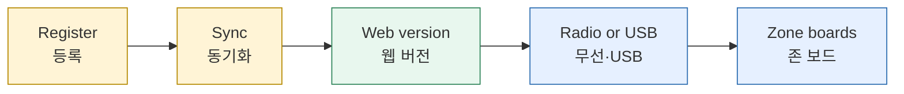
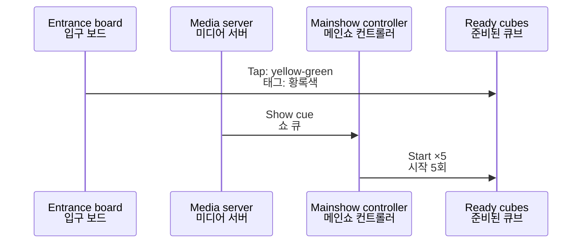

*This document was written by Kimchi and Chips*

This page starts with what the console does by itself. Then come five procedures, A to E; their results are in one table at the end. If a step fails, go to {{page:H5}}.
<kr>이 페이지는 콘솔이 스스로 하는 일로 시작합니다. 이어서 A부터 E까지 다섯 가지 절차가 있으며, 결과는 끝의 표 하나에 모았습니다. 단계가 실패하면 {{page:H5}}로 갑니다.</kr>

## What the console does by itself | 콘솔이 스스로 하는 일

While it is open, the console keeps a lot up to date without a click. It shares the cube list with the web, sends the newest zone database to zone boards, sends the newest main show to cubes, builds firmware, and upgrades boards plugged into this computer by USB.
<kr>콘솔은 열려 있는 동안 클릭 없이 많은 것을 최신으로 유지합니다. 큐브 목록을 웹과 주고받고, 최신 존 데이터베이스를 존 보드에, 최신 메인쇼를 큐브에 보내고, 펌웨어를 빌드하고, 이 컴퓨터에 USB로 꽂은 보드를 업그레이드합니다.</kr>

It never starts a show, and it never presses a button on a suggestion card for you. Everything it does falls into one of four groups, below.
<kr>콘솔은 쇼를 시작하지 않으며, 제안 카드의 버튼을 대신 누르지 않습니다. 콘솔이 스스로 하는 일은 아래 네 가지 묶음 중 하나에 속합니다.</kr>

### 1. Always automatic | 1. 항상 자동

| What happens · 하는 일 | What you see · 화면 | How to stop it · 멈추는 법 |
|---|---|---|
| A board plugged in by USB is identified without a restart. A cube is pinned and its firmware checked · USB로 꽂은 보드를 재시작 없이 식별. 큐브는 고정되고 펌웨어 확인 | The board appears in the rail under its role · 레일에 역할별로 표시 | Nothing to stop: identifying never changes the board · 멈출 필요 없음: 식별은 보드를 바꾸지 않음 |
| A live session opens for each identified board · 식별된 보드마다 실시간 세션 열림 | The board's panel shows live status · 보드 패널에 실시간 상태 | Settings › Behaviour › **Open a live session automatically for every identified board** |
| The selected cube flashes for 1 s through the Workstation, so you can find it · 선택한 큐브가 워크스테이션을 통해 1초 깜빡임 | That cube blinks · 그 큐브가 깜빡임 | Settings › Behaviour › **Preview the selected cube with a 1 s flash (pairing station)** |
| Suggestion cards appear in **Attention** · **Attention**에 제안 카드 표시 | A card with a button · 버튼이 있는 카드 | Nothing on a card runs until you press its button · 버튼을 누르기 전에는 아무것도 실행되지 않음 |
| A connected Mainshow controller or Workstation is told the published show's length and version · 연결된 메인쇼 컨트롤러·워크스테이션에 게시된 쇼 길이와 버전 전달 | A **Log** line: "Show vN … sent to the show controller" · **Log** 줄 | Not needed: it starts nothing · 필요 없음: 아무것도 시작하지 않음 |

### 2. Automatic unless you switch it off | 2. 끄지 않으면 자동

These are on by default. Each has a switch in Settings › **Automatic updates**, and the console remembers your choice on this computer.
<kr>기본으로 켜져 있습니다. 각각 Settings › **Automatic updates**에 스위치가 있으며, 콘솔은 선택을 이 컴퓨터에 저장합니다.</kr>

| What happens · 하는 일 | What you see · 화면 | How to stop it · 멈추는 법 |
|---|---|---|
| **Inventory sync:** a change uploads to the web about 5 s later, and changes from other computers download. A new cube gets its number from the web · **인벤토리 동기화:** 변경은 약 5초 뒤 웹에 올라가고 다른 컴퓨터의 변경은 내려받음. 새 큐브는 웹에서 번호를 받음 | Top-bar Sync chip: **✓ Synced**, **⟳ Sync in 5 s**, **Sync · retry in 2 min**, **Sync · offline**, **⟳ Sync · sign in**. Click it to sync at once · 상단 Sync 칩. 누르면 바로 동기화 | Switch **Sync the inventory with the web by itself…** off. Needs the web password · 스위치 끄기. 웹 비밀번호 필요 |
| **Zone databases over the air:** each Workstation sends the newest zone database to the out-of-date zone boards its radio hears, one radio at a time. It carries on while a show runs · **무선 존 데이터베이스:** 워크스테이션마다 자기 무선이 듣는 뒤처진 존 보드에 최신 존 데이터베이스를 보냄(한 번에 무선 하나). 쇼 재생 중에도 계속함 | Workstation panel › **Zone relay**: "Zone databases vN: X current · Y behind · Z updating" | Switch **Zone databases over the air…** off |
| **Zone databases over USB:** a configured zone board plugged in that is behind gets the database only. Its firmware and identity are untouched · **USB 존 데이터베이스:** 꽂은 설정 완료 존 보드가 뒤처졌으면 데이터베이스만 씀. 펌웨어와 식별 정보는 그대로 | **Log**: "Automatic zone database update over USB on ‹port›: vA → vB" | Switch **Zone databases over USB…** off |
| **Main show over the air:** cubes in range with an older show get the newest one (cubes on v1.5.0 or later). It holds while a show runs · **무선 메인쇼:** 범위 안의 오래된 쇼 큐브가 최신 쇼를 받음(v1.5.0 이상). 쇼 재생 중에는 멈춤 | **Show editor**: "Main show vN: X current · Y behind" | Switch **Main show over the air…** off (**Auto update** in the Show editor) |
| **Web pulls:** a newer zone database (checked every minute) and a newer main show (every 5 min, while a Workstation is connected) are downloaded · **웹에서 받기:** 새 존 데이터베이스(1분마다)와 새 메인쇼(5분마다, 워크스테이션 연결 시) 내려받기 | A **Log** line when something new arrives · 새것이 오면 **Log** 줄 | Switch **Pull a newer zone database and show from the web…** off |
| **Firmware builds:** when firmware source on this computer changes, it is built, one build at a time. Building never writes to a board · **펌웨어 빌드:** 이 컴퓨터의 펌웨어 소스가 바뀌면 한 번에 하나씩 빌드. 빌드는 보드에 쓰지 않음 | **Automatic updates** panel: **queued**, **building**; **no build tools** if this computer cannot build · 패널 상태 | Switch **Build firmware when its source changes…** off; **Pause** |
| **Firmware upgrades over USB:** a board plugged in whose firmware differs from this computer's build is flashed (see the warning below) · **USB 펌웨어 업그레이드:** 꽂은 보드의 펌웨어가 이 컴퓨터의 빌드와 다르면 플래시(아래 경고 참고) | **Automatic updates** panel: **Starts in N s**, then **upgrading** · 패널 상태 | **Skip** on its row before it starts; **Pause**; or switch **Upgrade the firmware of USB boards that are out of date…** off |

Zone databases and shows never go backwards: a board or cube accepts only a higher version, and one that holds a newer version is left alone. A zone board marked **Newer / differs** is never overwritten.
<kr>존 데이터베이스와 쇼는 절대 이전 버전으로 돌아가지 않습니다. 보드와 큐브는 더 높은 버전만 받고, 더 새 버전을 가진 것은 건드리지 않습니다. **Newer / differs**로 표시된 존 보드는 덮어쓰지 않습니다.</kr>

**Pause** in the **Automatic updates** panel stops firmware builds and firmware upgrades for now; zone databases, the show and sync carry on. A restart forgets Pause. To stop anything else, switch it off in Settings › **Automatic updates**.
<kr>**Automatic updates** 패널의 **Pause**는 펌웨어 빌드와 펌웨어 업그레이드를 잠시 멈춥니다. 존 데이터베이스, 쇼, 동기화는 계속됩니다. 재시작하면 Pause는 풀립니다. 그 밖의 것을 멈추려면 Settings › **Automatic updates**에서 끕니다.</kr>

> [!WARNING] **Plugging a board into this computer is enough to flash it.** About 20 s after a board is identified, the console flashes it without a click if its firmware differs from this computer's build. A zone board keeps its zone, point, name and settings. A cube gets the firmware and the published show (only while **Register** and **Flash** are off). A Mainshow controller or an older Workstation gets the current firmware, and a pairing station or General Radio becomes a Workstation (never the installed pairing station). To keep a board as it is, press **Skip** on its row before it starts, or switch the setting off. (Simulation-verified)
> **이 컴퓨터에 보드를 꽂기만 해도 플래시됩니다.** 보드가 식별되고 약 20초 뒤, 펌웨어가 이 컴퓨터의 빌드와 다르면 콘솔이 클릭 없이 플래시합니다. 존 보드는 존, 포인트, 이름, 설정을 유지합니다. 큐브는 펌웨어와 게시된 쇼를 받습니다(**Register**와 **Flash**가 꺼져 있을 때만). 메인쇼 컨트롤러나 이전 워크스테이션은 현재 펌웨어를 받고, 등록 스테이션이나 General Radio는 워크스테이션이 됩니다(설치된 등록 스테이션은 제외). 보드를 그대로 두려면 시작 전에 해당 행의 **Skip**을 누르거나 설정을 끕니다. (Simulation-verified)

The console waits while you use a board: after you send it a command (for 60 s), while it relays or sends the show, and while a show runs (Workstation and Mainshow controller).
<kr>보드를 쓰는 동안에는 기다립니다: 명령을 보낸 뒤(60초), 중계하거나 쇼를 보내는 동안, 쇼 재생 중(워크스테이션과 메인쇼 컨트롤러).</kr>

### 3. Only when you switch it on | 3. 켤 때만

| What happens · 하는 일 | Switch · 스위치 | Remembered? · 저장 |
|---|---|---|
| Each cube plugged in is registered: number, tag scan, sync ({{page:H3}}) · 꽂은 큐브마다 등록 | Register › **Register cubes as they are plugged in** | Yes, once on · 켜면 저장 |
| Each cube plugged in is flashed with the firmware and the show ({{page:H3}}) · 꽂은 큐브마다 펌웨어와 쇼 플래시 | Flash › **Flash cubes as they are plugged in** | No: off at every launch · 아니요: 실행할 때마다 꺼짐 |
| Each zone board plugged in is flashed · 꽂은 존 보드마다 플래시 | This computer › **Auto-flash zones** | No: off at every launch · 아니요: 실행할 때마다 꺼짐 |

### 4. Never automatic | 4. 자동으로 하지 않는 것

- Firmware for pool radios, the pool central controller and the preshow bridge: listed as **by hand**. The pool radios and the pool central controller are a matched set, upgraded together. <kr>풀 라디오, 풀 중앙 컨트롤러, 프리쇼 브리지 펌웨어: **by hand**로 표시만 합니다. 풀 라디오와 풀 중앙 컨트롤러는 한 세트이므로 함께 업그레이드합니다.</kr>
- The installed pairing station (3C:0F:02:AD:83:24), and zone boards that are not configured. <kr>설치된 등록 스테이션(3C:0F:02:AD:83:24)과 설정되지 않은 존 보드.</kr>
- Overwriting a zone database or show with an older one. <kr>존 데이터베이스나 쇼를 이전 버전으로 덮어쓰기.</kr>
- Starting the main show, and retrying a failed registration (press **Retry**). <kr>메인쇼 시작, 실패한 등록 재시도(**Retry**를 누름).</kr>

### The Automatic updates panel | Automatic updates 패널

The panel sits at the top of the right-hand side, above **Attention**. Its header shows **Pause** / **Resume** and a summary (**Working**, **Paused** or **Off**). **✓ Everything up to date** means nothing is waiting. Under it, the panel lists what still needs a person, such as boards heard over the air with older firmware: plug those in by USB to upgrade them.
<kr>패널은 오른쪽 위, **Attention** 위에 있습니다. 머리글에 **Pause** / **Resume**과 요약(**Working**, **Paused**, **Off**)이 있습니다. **✓ Everything up to date**는 기다리는 것이 없다는 뜻입니다. 그 아래에는 사람이 할 일이 나옵니다. 예를 들어 무선으로 들린 오래된 펌웨어 보드는 USB로 꽂아 업그레이드합니다.</kr>

Otherwise each build or board has a row with a pill:
<kr>그 밖에는 빌드나 보드마다 상태 표시가 있는 행이 나옵니다.</kr>

| Pill · 상태 | It means · 뜻 |
|---|---|
| **queued**, **building**, **needs build** | Firmware is waiting to be built or being built · 펌웨어 빌드 대기·진행 |
| **waiting** | It starts when the board and the console are free (**Starts in N s**) · 보드와 콘솔이 비면 시작 |
| **upgrading**, **checking** | Being flashed, then checked · 플래시 중, 이어서 확인 |
| **failed** | Did not finish: press **Retry**, or replug · 끝나지 않음: **Retry** 또는 다시 꽂기 |
| **skipped** | You pressed **Skip**; replug to try again · **Skip**을 누름. 다시 꽂으면 재시도 |
| **by hand**, **paused**, **off**, **no build tools** | Not done automatically; see {{page:H5}} §11 · 자동으로 하지 않음 |

> [!WARNING] Do not unplug a board whose row shows **upgrading**. Wait until the row disappears or turns **failed**.
> 행에 **upgrading**이 표시된 보드는 뽑지 않습니다. 행이 사라지거나 **failed**가 될 때까지 기다립니다.

**Recent (n)** lists the last jobs. Automatic jobs appear in **Jobs** only when they fail.
<kr>**Recent (n)**에 최근 작업이 나옵니다. 자동 작업은 실패했을 때만 **Jobs**에 나옵니다.</kr>

Evidence: USB identification and the show reaching six cubes over the air (v6, 23 September) are Bench-verified. Everything else in this section is Simulation-verified; it has not been run against the installed zone boards. More detail: {{page:X11}}
<kr>근거: USB 식별과 무선으로 큐브 6개에 쇼 전달(v6, 9월 23일)은 Bench-verified입니다. 이 절의 나머지는 Simulation-verified이며, 설치된 존 보드에서는 실행하지 않았습니다. 자세한 내용: {{page:X11}}</kr>

## A. Keep zone databases current | A. 존 데이터베이스 최신 유지

Every zone board keeps its own copy of the **zone database**: which tag belongs to which cube number. A newly registered cube stays "unknown tag" at a board until the console publishes a new version and that board receives it. The web inventory hands out the version numbers, and a board accepts only a higher version than the one it holds.
<kr>모든 존 보드는 어떤 태그가 어떤 큐브 번호인지 적힌 **존 데이터베이스**를 따로 가지고 있습니다. 새로 등록한 큐브는 콘솔이 새 버전을 게시하고 그 보드가 받을 때까지 "unknown tag"로 남습니다. 버전 번호는 웹 인벤토리가 정하며, 보드는 자기가 가진 것보다 높은 버전만 받습니다.</kr>

Most days you click nothing: the console walks the zone database to the boards by itself (see "What the console does by itself" above). A board marked **Newer / differs** is never overwritten: the console first pulls the web's newer version (automatic web pulls usually do this already; its red card's **Sync**, or the Sync chip, does it at once). If the board still differs, the next sync publishes above it. (Simulation-verified; not yet run against the installed zone boards.)
<kr>대부분은 아무것도 누르지 않습니다. 콘솔이 존 데이터베이스를 스스로 보드에 보냅니다(위의 "콘솔이 스스로 하는 일" 참고). **Newer / differs**로 표시된 보드는 덮어쓰지 않습니다. 콘솔이 먼저 웹의 더 새 버전을 받습니다(보통 자동 웹 받기가 이미 처리하며, 빨간 카드의 **Sync**나 Sync 칩을 누르면 바로 처리). 그래도 다르면 다음 동기화가 그보다 높은 버전을 게시합니다. (Simulation-verified. 설치된 존 보드에서는 아직 실행하지 않았습니다.)</kr>

Do it by hand after a big registration session, for a deliberate check, or when the switches are off:
<kr>많은 큐브를 등록한 뒤, 의도적으로 점검할 때, 또는 스위치가 꺼져 있을 때는 직접 합니다.</kr>

1. Finish any registration or flashing. Check the Sync chip in the top bar shows **✓ Synced** (if it says **⟳ Sync · sign in**, click it and enter the shared web password once). If a card says **Local cube mappings differ from the published zone database**, click its **Sync & publish**. <kr>등록이나 플래싱을 끝냅니다. 상단의 Sync 칩이 **✓ Synced**인지 확인합니다(**⟳ Sync · sign in**이면 눌러서 공유 웹 비밀번호를 한 번 입력). **Local cube mappings differ from the published zone database** 카드가 있으면 **Sync & publish**를 누릅니다.</kr>
2. Open the Workstation panel (rail group **Stations**), tab **Zone relay**. Click **Query zones**, or tick **auto-refresh (3 s)**. Tick **Show out of range** to see boards that have not answered: a board you cannot see is not proven current. <kr>워크스테이션 패널(레일의 **Stations**)에서 **Zone relay** 탭을 엽니다. **Query zones**를 누르거나 **auto-refresh (3 s)**를 켭니다. 응답하지 않은 보드는 **Show out of range**로 봅니다. 보이지 않는 보드는 최신으로 확인된 것이 아닙니다.</kr>

{{shot:06-1}}
Zone relay: each zone with its database version and signal / Zone relay: 존별 데이터베이스 버전과 신호

3. Click **Update all out-of-date zones (n)** and stay near the boards. A board is done when its row says **Current**. For one board: click its name, then **Update database over the air**. <kr>**Update all out-of-date zones (n)**을 누르고 보드 가까이에 있습니다. 행이 **Current**가 되면 끝난 것입니다. 보드 하나만: 이름을 누른 뒤 **Update database over the air**.</kr>
4. For boards far from the console computer, carry the computer and the Workstation through the space with **auto-update all (walk the space)** ticked (a failed board is retried after 30 s). Write down any board still out of date. <kr>콘솔 컴퓨터에서 먼 보드는 **auto-update all (walk the space)**를 켠 채 컴퓨터와 워크스테이션을 들고 걷습니다(실패한 보드는 30초 뒤 재시도). 뒤처진 채 남은 보드를 기록합니다.</kr>

> [!WARNING] "delivered" in the **Log** is not success; only **Current** is. If the USB cable drops, the run stops: read the Zone relay table again before you assume anything.
> **Log**의 "delivered"는 성공이 아닙니다. **Current**만 성공입니다. USB 케이블이 빠지면 실행이 멈춥니다. 무엇이든 가정하기 전에 Zone relay 표를 다시 읽습니다.

Evidence: **Query zones** Bench-verified (27 boards heard, 23 September); over-the-air update Simulation-verified only. More detail: {{page:X08}}
<kr>근거: **Query zones**는 Bench-verified(9월 23일, 보드 27개 수신), 무선 업데이트는 Simulation-verified뿐입니다. 자세한 내용: {{page:X08}}</kr>

## B. Test the Preshow zone | B. 프리쇼존 시험

A cube on one of the four preshow points turns red, and the zone board sends a cue over the air. The Preshow bridge writes `PRESHOW,n,ON` to TouchDesigner, which plays the butterfly.
<kr>프리쇼 포인트 네 곳 중 하나에 올린 큐브는 빨간색이 되고, 존 보드가 무선으로 큐를 보냅니다. 프리쇼 브리지가 터치디자이너에 `PRESHOW,n,ON`을 쓰고, 터치디자이너가 나비를 재생합니다.</kr>

> [!WARNING] The cue test raises **real media cues**. Agree it with the media team first, and switch **Cue override** off when you finish.
> 큐 시험은 **실제 미디어 큐**를 발생시킵니다. 먼저 미디어팀과 협의하고, 끝나면 **Cue override**를 끕니다.

1. Plug the preshow zone board in by USB. Open its **Cue test** tab and switch **Cue override** on. <kr>프리쇼 존 보드를 USB로 꽂습니다. **Cue test** 탭을 열고 **Cue override**를 켭니다.</kr>
2. Press **POINT n ON**. The **Cue** line should say *acknowledged yes*. Ask the media team whether the butterfly played. Press **POINT n OFF** to drop the cue. <kr>**POINT n ON**을 누릅니다. **Cue** 줄에 *acknowledged yes*가 나와야 합니다. 미디어팀에 나비가 재생되었는지 묻습니다. **POINT n OFF**로 큐를 내립니다.</kr>

{{shot:08-1}}
Cue test: switch on Cue override, then press a POINT button / Cue test: Cue override를 켠 뒤 POINT 버튼을 누름

3. Switch **Cue override** off. (If the console stops, the board drops the cue by itself within 1.5 seconds.) <kr>**Cue override**를 끕니다. (콘솔이 멈추면 보드가 1.5초 안에 스스로 큐를 내립니다.)</kr>
4. Tap a known-good cube: **Monitor** shows its number, the cube turns red, and the header shows `MEDIA mode=modern` and **bridge sees me: yes**. <kr>정상 큐브를 태그합니다. **Monitor**에 번호가 나오고, 큐브가 빨간색이 되고, 머리글에 `MEDIA mode=modern`과 **bridge sees me: yes**가 표시됩니다.</kr>

Only one program can own the bridge's USB port. TouchDesigner's Serial DAT uses it at **115200** baud. If the bridge is plugged into the console computer, press **Disconnect** on its panel first.
<kr>브리지 USB 포트는 한 프로그램만 쓸 수 있습니다. 터치디자이너의 Serial DAT는 **115200** baud로 씁니다. 브리지가 콘솔 컴퓨터에 꽂혀 있으면 먼저 패널의 **Disconnect**를 누릅니다.</kr>

Evidence: cue test Simulation-verified; through a real board and bridge To confirm. Butterfly cues Field-reported (Elliot, 22 September). More detail: {{page:X04}}
<kr>근거: 큐 시험 Simulation-verified, 실제 보드·브리지로는 To confirm. 나비 큐 Field-reported(Elliot, 9월 22일). 자세한 내용: {{page:X04}}</kr>

## C. Test the Desert zone | C. 사막존 시험

A registered cube on a desert position does two separate things: the board switches on the **local light panel** by wire, and tells the **cube** over the air to turn yellow. They fail for different reasons, so check them separately. Plug the desert zone board in by USB and open its **Monitor** tab: it shows each tap, whether the cube was found, and the radio result.
<kr>등록된 큐브를 사막존 위치에 올리면 두 가지가 따로 일어납니다. 보드가 전선으로 **로컬 조명 패널**을 켜고, 무선으로 **큐브**에 노란색으로 바뀌라고 알립니다. 원인이 서로 다르므로 따로 확인합니다. 사막 존 보드를 USB로 꽂고 **Monitor** 탭을 엽니다. 태그마다 큐브 조회 결과와 무선 결과가 표시됩니다.</kr>

{{shot:07-4}}
Monitor: a tag was read and the cube found / Monitor: 태그를 읽고 큐브를 찾음

1. Place a known-good registered cube on the marked position. <kr>정상 등록된 큐브를 표시된 위치에 올립니다.</kr>
2. Nothing in **Monitor**: the reader did not see the tag. Check its position and power. Tag shown but unknown: the board's zone database is behind (procedure A). <kr>**Monitor**에 아무것도 없음: 리더가 태그를 보지 못했습니다. 위치와 전원을 확인합니다. 태그는 보이나 알 수 없음: 존 데이터베이스가 오래되었습니다(절차 A).</kr>
3. Cube found but the panel stays dark: the light's power, output or wiring. The console cannot see the light. <kr>큐브는 찾았는데 패널이 꺼져 있음: 조명 전원, 출력, 배선 문제입니다. 콘솔은 조명을 볼 수 없습니다.</kr>
4. The cube should turn yellow within about a second. **No radio ACK** means the cube is off or out of range; **Delivered** only means its radio answered. <kr>큐브가 약 1초 안에 노란색이 되어야 합니다. **No radio ACK**는 큐브가 꺼져 있거나 범위 밖이라는 뜻이고, **Delivered**는 큐브 무선이 응답했다는 뜻일 뿐입니다.</kr>
5. Every cube fails at one position: reader or mounting. One cube fails everywhere: plug that cube in by USB and read its Cube panel ({{page:H3}}). <kr>한 위치에서 모든 큐브가 실패: 리더나 장착 문제. 한 큐브가 모든 곳에서 실패: 그 큐브를 USB로 꽂고 Cube 패널을 읽습니다({{page:H3}}).</kr>

Evidence: working zone Field-reported (Hojun); Monitor and its cards Simulation-verified. More detail: {{page:X05}}
<kr>근거: 존 동작 Field-reported(Hojun), Monitor와 카드 Simulation-verified. 자세한 내용: {{page:X05}}</kr>

## D. Pool / forest: calibrate a slider | D. 풀존·숲존: 슬라이더 보정

Each of the six pool radios reads one slider with 23 positions (ticks), one per member. Each tick has a stored distance in mm. The radio stores exactly the values you send; ticks you do not send keep their old values. Changes stay a draft until you save them.
<kr>풀 라디오 여섯 대가 각각 슬라이더 하나를 읽습니다. 슬라이더에는 멤버마다 하나씩 23개 위치(눈금)가 있고, 눈금마다 거리 값(mm)이 저장됩니다. 라디오는 보낸 값만 그대로 저장하며, 보내지 않은 눈금은 이전 값을 유지합니다. 변경은 저장하기 전까지 초안입니다.</kr>

> [!WARNING] While a calibration is sent but not saved, the radio lights **no frame**. Never leave an unsaved draft during opening hours: press **Apply & save to flash** or **Reload saved** before you leave. Write down the current **mm** values before you start.
> 보정을 보냈지만 저장하지 않은 동안 라디오는 **어떤 프레임도 켜지 않습니다**. 운영 시간에 저장하지 않은 초안을 남기지 않습니다. 자리를 뜨기 전에 **Apply & save to flash** 또는 **Reload saved**를 누릅니다. 시작 전에 현재 **mm** 값을 기록합니다.

1. Plug the pool radio in by USB. Open its **Calibration** tab. Leave **Override output without a cube** off. <kr>풀 라디오를 USB로 꽂습니다. **Calibration** 탭을 엽니다. **Override output without a cube**는 끈 채로 둡니다.</kr>
2. Move the slider to tick 1 and press **Capture** on row 1. Do the same at tick 23. Capture or type (**Set to**, 10–1000 mm) every other tick whose value is wrong. <kr>슬라이더를 1번 눈금에 두고 1번 행의 **Capture**를 누릅니다. 23번 눈금도 같게 합니다. 값이 틀린 다른 눈금도 캡처하거나 **Set to**에 입력합니다(10–1000 mm).</kr>

{{shot:10-2}}
Capture control point 12 from the live reading / 실시간 값으로 제어점 12 캡처

3. Press **Send control points**, then **Apply & save to flash**. Wait for **saved=true**. <kr>**Send control points**, 이어서 **Apply & save to flash**를 누릅니다. **saved=true**를 기다립니다.</kr>
4. With a cube on the radio, move the slider through several positions in both directions while a second person watches the frames. If the same position gives a different reading each time, record a mechanical fault; do not re-calibrate again and again. <kr>라디오에 큐브를 대고 슬라이더를 양방향으로 여러 위치에 옮기는 동안 다른 사람이 프레임을 봅니다. 같은 위치에서 값이 매번 다르면 기구 문제로 기록합니다. 보정을 반복하지 않습니다.</kr>

**Guided recording** (optional, **Diagnostics** tab) measures every tick for you and proposes filter settings. Write down the current settings first. More detail: {{page:X06}}
<kr>**가이드 녹화**(선택, **Diagnostics** 탭)는 눈금을 모두 측정하고 필터 설정을 제안합니다. 먼저 현재 설정을 기록합니다. 자세한 내용: {{page:X06}}</kr>

Evidence: calibration in the console Simulation-verified; on a real radio To confirm. Field-reported (Hojun, 23 September): relays replaced, frame map re-measured (poolcentral-4.2.2), every slider position 1–23 lit its own lamp.
<kr>근거: 콘솔 보정 Simulation-verified, 실제 라디오 To confirm. Field-reported(Hojun, 9월 23일): 릴레이 교체, 프레임 매핑 재측정(poolcentral-4.2.2), 위치 1–23이 각각 자기 조명을 켬.</kr>

## E. Main show: one-cube test and trigger | E. 메인쇼: 큐브 한 개 시험과 트리거

Before the finale, each visitor taps the cube at the main show entrance: it turns yellow-green and is **ready**. At show time the media server's signal reaches the Mainshow controller, which starts every ready cube. Each cube plays the show from its own memory (about 4 minutes 58 seconds).
<kr>피날레 전에 관람객이 메인쇼 입구에서 큐브를 태그하면 황록색이 되어 **준비** 상태가 됩니다. 쇼 시간에 미디어 서버 신호가 메인쇼 컨트롤러에 도달하고, 컨트롤러가 준비된 모든 큐브를 시작시킵니다. 각 큐브는 자기 메모리의 쇼를 재생합니다(약 4분 58초).</kr>

> [!WARNING] **Not live today.** The installed controller **#134 still runs mainshow-1.2.0** and sends no show clock, so a cube that misses the start does **not** join late. (Late join is Bench-verified only, on the spare #138 with cube #17.)
> **현재 미적용.** 설치된 컨트롤러 **#134는 아직 mainshow-1.2.0**이며 쇼 타임코드를 보내지 않으므로 시작을 놓친 큐브는 늦게 합류하지 **않습니다**. (늦은 합류는 예비 #138과 큐브 #17로 Bench-verified만 되었습니다.)

1. Plug the Mainshow controller in by USB (without it, the console uses a connected Workstation). Open **Show** in the top bar. Type the **Cube #** from the label and check that the row is the cube in your hand. <kr>메인쇼 컨트롤러를 USB로 꽂습니다(없으면 연결된 워크스테이션을 씀). 상단 바에서 **Show**를 엽니다. 라벨의 **Cube #**를 입력하고 표시된 행이 손에 든 큐브인지 확인합니다.</kr>

{{shot:11-1}}
Show section: the controller, the cube number and the two steps / Show 섹션: 컨트롤러, 큐브 번호와 두 단계

2. Press **① Mainshow ready**. The cube turns yellow-green and the result reaches **Delivered**. <kr>**① Mainshow ready**를 누릅니다. 큐브가 황록색이 되고 결과가 **Delivered**에 도달합니다.</kr>
3. Press **② Trigger mainshow**. The cube starts the show (only a ready cube starts). <kr>**② Trigger mainshow**를 누릅니다. 큐브가 쇼를 시작합니다(준비된 큐브만 시작).</kr>
4. Look at the cube: the **Show clock** only counts the expected time, it is not a report from the cube. Press **Stop → idle** to end the show on this cube. <kr>큐브를 직접 봅니다. **Show clock**은 예상 시간을 셀 뿐 큐브의 보고가 아닙니다. **Stop → idle**로 이 큐브의 쇼를 끝냅니다.</kr>

> [!WARNING] **② Trigger all ready cubes** (hold to confirm) starts **every** ready cube in range, like the real show. Nothing answers and it cannot be undone. Use it only for a whole-show test agreed with the media team.
> **② Trigger all ready cubes**(길게 눌러 확인)는 실제 쇼처럼 범위 안의 **모든** 준비된 큐브를 시작합니다. 응답이 없고 되돌릴 수 없습니다. 미디어팀과 협의한 전체 쇼 시험에만 사용합니다.

In the real show the media server's signal arrives through the installed signal interface. The controller's BOOT button also starts all ready cubes, with no computer attached.
<kr>실제 쇼에서는 미디어 서버 신호가 설치된 신호 변환부를 거쳐 들어옵니다. 컨트롤러의 BOOT 버튼으로도 컴퓨터 없이 준비된 모든 큐브를 시작할 수 있습니다.</kr>

> [!DANGER] Never wire the media system's 5 V signal straight to the controller's trigger input. It must go through the installed interface.
> 미디어 시스템의 5 V 신호를 컨트롤러 트리거 입력에 직접 연결하지 않습니다. 반드시 설치된 변환부를 거쳐야 합니다.

Evidence: ① and ② Simulation-verified. The installed controller start is Field-reported (Elliot): one of ten tested cubes failed. More detail: {{page:X07}}
<kr>근거: ①·② Simulation-verified. 설치된 컨트롤러의 시작은 Field-reported(Elliot)이며 시험한 10개 중 1개가 실패했습니다. 자세한 내용: {{page:X07}}</kr>

The Show editor (change and send the main show) is in {{page:H3}}.
<kr>Show editor(메인쇼 변경·전송)는 {{page:H3}}에 있습니다.</kr>

## What success looks like | 성공 확인

| You see · 화면 | It means · 뜻 | If not · 아니면 |
|---|---|---|
| A: every Zone relay row says **Current** · 모든 행이 **Current** | Those boards know every published cube · 게시된 큐브를 모두 앎 | **Update all**, or walk · 또는 걷기; {{page:H5}} §1 |
| B: **Cue** says *acknowledged yes*, butterfly plays · 나비 재생 | Board, bridge and TouchDesigner work · 보드·브리지·터치디자이너 정상 | {{page:H5}} §5 |
| C: panel lights and cube turns yellow · 패널 점등, 큐브 노란색 | Reader, light and radio work · 리더·조명·무선 정상 | Steps 2–5 · 단계 2–5 |
| D: **saved=true**, right frame for each name · 이름마다 맞는 프레임 | Calibration is stored and correct · 보정 저장·정확 | Re-check the ends · 양 끝 재확인; {{page:H5}} §7 |
| E: test cube turns yellow-green, then plays · 황록색 후 재생 | Ready and start reach the cube · 준비·시작 도달 | {{page:H5}} §6 |

*This document was written by Kimchi and Chips*
